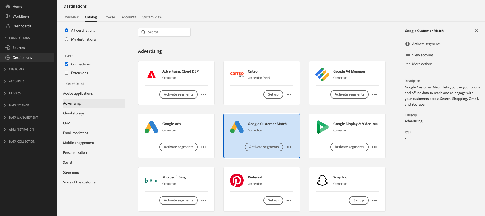
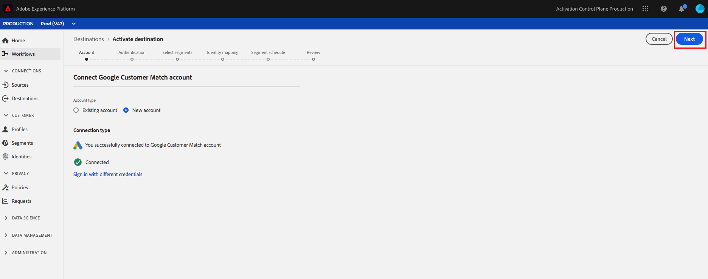

# [!DNL Google Customer Match] conexão

## Visão geral {#overview}

[O Google Customer ](https://support.google.com/google-ads/answer/6379332?hl=en) Matchlets permite que você use seus dados online e offline para acessar e reengajar com seus clientes em propriedades próprias e operadas do Google, como:  [!DNL Search],  [!DNL Shopping],  [!DNL Gmail], e  [!DNL YouTube].

## Casos de uso

Para ajudá-lo a entender melhor como e quando usar o destino [!DNL Google Customer Match], aqui estão exemplos de casos de uso que os clientes do Adobe Experience Platform podem resolver usando esse recurso.

### Caso de uso nº 1

Uma marca de vestuário atlético deseja alcançar clientes existentes por meio de [!DNL Google Search] e [!DNL Google Shopping] para personalizar ofertas e itens com base em suas compras anteriores e histórico de navegação. A marca de vestuário pode assimilar endereços de email de seu próprio CRM para o Experience Platform e criar segmentos a partir de seus próprios dados offline. Em seguida, eles podem enviar esses segmentos para [!DNL Google Customer Match] para serem usados em [!DNL Search] e [!DNL Shopping], otimizando seus gastos com publicidade.

### Caso de uso nº 2

Uma importante empresa de tecnologia lançou um novo telefone. Para promover esse novo modelo de telefone, eles estão buscando conscientizar sobre os novos recursos e funcionalidades do telefone para clientes que possuem modelos anteriores de seus telefones.

Para promover a versão, eles carregam endereços de email do banco de dados do CRM no Experience Platform, usando os endereços de email como identificadores. Os segmentos são criados com base em clientes que possuem modelos de telefone mais antigos. Em seguida, os segmentos são enviados para [!DNL Google Customer Match], para que a empresa possa direcionar os clientes atuais, os clientes que possuem modelos de telefone mais antigos e clientes semelhantes em [!DNL YouTube].

## Governança de dados para destinos [!DNL Google Customer Match] {#data-governance}

Alguns destinos no Experience Platform têm certas regras e obrigações para os dados enviados para a plataforma de destino ou recebidos dela. Você é responsável por entender as limitações e obrigações dos dados e como usá-los no Adobe Experience Platform e na plataforma de destino. O Adobe Experience Platform fornece ferramentas de governança de dados para ajudá-lo a gerenciar algumas dessas obrigações de uso de dados. [Saiba ](../../..//data-governance/labels/overview.md) mais sobre as ferramentas e as políticas de governança de dados.

## Identidades compatíveis {#supported-identities}

[!DNL Google Customer Match] O suporta a ativação de identidades descritas na tabela abaixo. Saiba mais sobre [identidades](/help/identity-service/namespaces.md).

| Identidade do Target | Descrição | Considerações |
|---|---|---|
| GAID | ID de publicidade do Google | Selecione essa identidade de destino quando sua identidade de origem for um namespace GAID. |
| IDFA | Apple ID para anunciantes | Selecione essa identidade de destino quando sua identidade de origem for um namespace IDFA. |
| phone_sha256_e.164 | Números de telefone no formato E164, com hash com o algoritmo SHA256 | O Adobe Experience Platform oferece suporte para texto sem formatação e números de telefone com hash SHA256. Siga as instruções na seção [ID correspondente a requirements](#id-matching-requirements-id-matching-requirements) e use os namespaces apropriados para texto sem formatação e números de telefone com hash, respectivamente. Quando o campo de origem contém atributos sem hash, marque a opção **[!UICONTROL Apply transformation]** para ter [!DNL Platform] hash automaticamente os dados na ativação. |
| email_lc_sha256 | Endereços de email com hash com o algoritmo SHA256 | O Adobe Experience Platform oferece suporte para texto sem formatação e endereços de email com hash SHA256. Siga as instruções na seção [ID correspondente a requirements](#id-matching-requirements-id-matching-requirements) e use os namespaces apropriados para texto sem formatação e endereços de email com hash, respectivamente. Quando o campo de origem contém atributos sem hash, marque a opção **[!UICONTROL Apply transformation]** para ter [!DNL Platform] hash automaticamente os dados na ativação. |
| user_id | IDs de usuário personalizadas | Selecione essa identidade de destino quando sua identidade de origem for um namespace personalizado. |

## Tipo de exportação {#export-type}

**Exportar segmento**  - você está exportando todos os membros de um segmento (público-alvo) com os identificadores (nome, número de telefone e outros) usados no  [!DNL Google Customer Match] destino.

## [!DNL Google Customer Match] pré-requisitos da conta  {#google-account-prerequisites}

Antes de configurar um destino [!DNL Google Customer Match] no Experience Platform, leia e siga a política do Google para usar [!DNL Customer Match], descrita na [documentação de suporte do Google](https://support.google.com/google-ads/answer/6299717).

### Lista de permissões {#allowlist}

Antes de criar o destino [!DNL Google Customer Match] no Experience Platform, verifique se a conta [!DNL Google Ads] está em conformidade com a [Política de correspondência do cliente do Google](https://support.google.com/google-ads/answer/6299717/customer-match-policy).

Clientes com contas compatíveis são autorizados automaticamente pela Google.

## Requisitos de correspondência de ID {#id-matching-requirements}

[!DNL Google] exige que nenhuma informação pessoal identificável (PII) seja enviada de forma clara. Portanto, os públicos-alvo ativados para [!DNL Google Customer Match] podem ser desconectados dos identificadores com hash *como endereços de email ou números de telefone.*

Dependendo do tipo de IDs assimiladas no Adobe Experience Platform, é necessário seguir os requisitos correspondentes.

## Requisitos de hash do número de telefone {#phone-number-hashing-requirements}

Há dois métodos para ativar números de telefone em [!DNL Google Customer Match]:

* **Inserir números** de telefone brutos: você pode assimilar números de telefone brutos no  [!DNL E.164] formato  [!DNL Platform], e eles são automaticamente atribuídos a hash na ativação. Se você escolher essa opção, certifique-se sempre de assimilar seus números de telefone brutos no namespace `Phone_E.164`.
* **Inserir números** de telefone com hash: você pode fazer o hash prévio dos números de telefone antes da ingestão no  [!DNL Platform]. Se você escolher essa opção, certifique-se sempre de assimilar seus números de telefone com hash no namespace `PHONE_SHA256_E.164`.

>[!NOTE]
>
>Os números de telefone assimilados no namespace `Phone` não podem ser ativados em [!DNL Google Customer Match].

## Requisitos de hash de email {#hashing-requirements}

Você pode fazer hash de endereços de email antes de assimilá-los no Adobe Experience Platform ou usar endereços de email limpos no Experience Platform e fazer com que [!DNL Platform] faça hash na ativação.

Para obter mais informações sobre os requisitos de hash do Google e outras restrições à ativação, consulte as seguintes seções na documentação do Google:

* [[!DNL Customer Match] com endereço de email, endereço ou ID do usuário](https://developers.google.com/adwords/api/docs/guides/remarketing#customer_match_with_email_address_address_or_user_id)
* [[!DNL Customer Match] considerações](https://developers.google.com/adwords/api/docs/guides/remarketing#customer_match_considerations)
* [Correspondência de cliente com número de telefone](https://developers.google.com/adwords/api/docs/guides/remarketing#customer_match_with_phone_number)
* [Correspondência do cliente com IDs de dispositivo móvel](https://developers.google.com/adwords/api/docs/guides/remarketing#customer_match_with_mobile_device_ids)

Para saber mais sobre como assimilar endereços de email no Experience Platform, consulte a [visão geral de assimilação de lote](../../../ingestion/batch-ingestion/overview.md) e a [visão geral de assimilação de streaming](../../../ingestion/streaming-ingestion/overview.md).

Se você optar por hash nos endereços de email, certifique-se de estar em conformidade com os requisitos do Google, descritos nos links acima.

## Uso de namespaces personalizados {#custom-namespaces}

Antes de usar o namespace `User_ID` para enviar dados ao Google, sincronize seus próprios identificadores usando [!DNL gTag]. Consulte a [documentação oficial do Google](https://support.google.com/google-ads/answer/9199250) para obter informações detalhadas.

<!-- Data from unhashed namespaces is automatically hashed by [!DNL Platform] upon activation.

Attribute source data is not automatically hashed. When your source field contains unhashed attributes, check the **[!UICONTROL Apply transformation]** option, to have [!DNL Platform] automatically hash the data on activation.
 -->

## Configurar destino - apresentação em vídeo {#video}

O vídeo abaixo demonstra as etapas para configurar um destino [!DNL Google Customer Match] e ativar segmentos. As etapas também são apresentadas sequencialmente nas próximas seções.

>[!VIDEO](https://video.tv.adobe.com/v/332599/?quality=12&learn=on&captions=eng)

## Conecte-se ao destino {#connect-destination}

Em **[!UICONTROL Destinations]** > **[!UICONTROL Catalog]**, role até a categoria **[!UICONTROL Advertising]**. Selecione [!DNL Google Customer Match] e selecione **[!UICONTROL Configurar]**.

>[!NOTE]
>
>Se existir uma conexão com esse destino, você poderá ver um botão **[!UICONTROL Ativar]** no cartão de destino. Para obter mais informações sobre a diferença entre **[!UICONTROL Ativate]** e **[!UICONTROL Configure]**, consulte a seção [Catalog](../../ui/destinations-workspace.md#catalog) da documentação do espaço de trabalho de destino.

Na etapa **Account**, se você tiver configurado anteriormente uma conexão com seu destino [!DNL Google Customer Match], selecione **[!UICONTROL Existing Account]** e selecione sua conexão existente. Ou você pode selecionar **[!UICONTROL Nova Conta]** para configurar uma nova conexão para [!DNL Google Customer Match]. Para fazer logon e conectar o Adobe Experience Cloud à sua conta [!DNL Google Ad], selecione **[!UICONTROL Conectar ao destino]**.

>[!NOTE]
>
>O Experience Platform oferece suporte à validação de credenciais no processo de autenticação. Ele exibe uma mensagem de erro se você inserir credenciais incorretas em sua conta [!DNL Google Ad], para garantir que você não conclua o workflow com credenciais incorretas.

Depois que suas credenciais forem confirmadas e o Adobe Experience Cloud estiver conectado a sua conta Google, você poderá selecionar **[!UICONTROL Next]** para prosseguir para a etapa **[!UICONTROL Authentication]**.

Na etapa **[!UICONTROL Authentication]**, digite um **[!UICONTROL Name]** e um **[!UICONTROL Description]** para o fluxo de ativação e preencha o Google **[!UICONTROL Account ID]**.

Nesta etapa, você também pode selecionar qualquer **[!UICONTROL Marketing actions]** que se aplique a esse destino. As ações de marketing indicam a intenção pela qual os dados são exportados para o destino. Você pode selecionar ações de marketing definidas pelo Adobe ou criar sua própria ação de marketing. Para obter mais informações sobre ações de marketing, consulte a [Visão geral das políticas de uso de dados](../../../data-governance/policies/overview.md).

Selecione **[!UICONTROL Criar destino]** depois de preencher os campos acima.

>[!IMPORTANT]
>
> * A ação de marketing **[!UICONTROL Combinar com PII]** é selecionada por padrão para o destino [!DNL Google Customer Match] e não pode ser removida.
> * Para destinos [!DNL Google Customer Match]. **[!UICONTROL A]** ID da conta é a ID do cliente com o Google. O formato da ID é xxx-xxx-xxxx.

Seu destino foi criado. Você pode selecionar **[!UICONTROL Salvar e sair]** se desejar ativar segmentos posteriormente ou selecionar **[!UICONTROL Próximo]** para continuar o fluxo de trabalho e selecionar segmentos para ativar. Em ambos os casos, consulte a próxima seção, [Ativar segmentos para [!DNL Google Customer Match]](#activate-segments), para o restante do fluxo de trabalho.

## Ativar segmentos para [!DNL Google Customer Match] {#activate-segments}

Para obter instruções sobre como ativar segmentos para [!DNL Google Customer Match], consulte [Ativar dados para destinos](../../ui/activate-destinations.md).

Na etapa **[!UICONTROL Agendamento do segmento]**, você deve fornecer a [!UICONTROL ID do aplicativo] ao enviar [!DNL IDFA] ou [!DNL GAID] segmentos para [!DNL Google Customer Match].

Para obter detalhes sobre como encontrar o [!DNL App ID], consulte a [documentação oficial do Google](https://developers.google.com/adwords/api/docs/reference/v201809/AdwordsUserListService.CrmBasedUserList#appid).

## Verifique se a ativação do segmento foi bem-sucedida {#verify-activation}

Após concluir o fluxo de ativação, alterne para sua conta do **[!UICONTROL Google Ads]**. Os segmentos ativados são mostrados em sua conta do Google como listas de clientes. Observe que, dependendo do tamanho do seu segmento, alguns públicos-alvo não são preenchidos a menos que haja mais de 100 usuários ativos para serem atendidos.

Ao mapear um segmento para [!DNL IDFA] e [!DNL GAID] IDs móveis, [!DNL Google Customer Match] cria um segmento separado para cada mapeamento de ID. Sua conta [!DNL Google Ads] mostra dois segmentos diferentes, um para o [!DNL IDFA] e outro para o mapeamento [!DNL GAID].

## Recursos adicionais {#additional-resources}

* [Integração da correspondência do cliente do Google - Tutorial em vídeo](https://experienceleague.adobe.com/docs/platform-learn/tutorials/rtcdp/integrate-with-google-customer-match.html)
