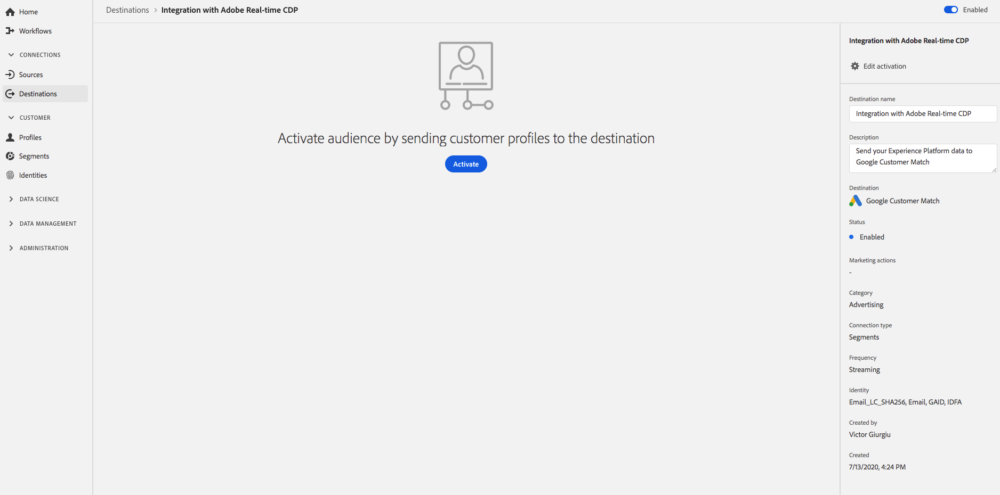

# [!DNL Google Customer Match] conexão

[O Google Customer ](https://support.google.com/google-ads/answer/6379332?hl=en) Matchlets permite que você use seus dados online e offline para acessar e reengajar com seus clientes em propriedades próprias e operadas do Google, como:  [!DNL Search],  [!DNL Shopping],  [!DNL Gmail], e  [!DNL YouTube].

## Casos de uso

Para ajudá-lo a entender melhor como e quando você deve usar o destino [!DNL Google Customer Match], aqui estão exemplos de casos de uso que os clientes da Adobe Experience Platform podem resolver usando esse recurso.

### Caso de uso nº 1

Uma marca de vestuário atlético deseja alcançar clientes existentes por meio de [!DNL Google Search] e [!DNL Google Shopping] para personalizar ofertas e itens com base em suas compras anteriores e histórico de navegação. A marca de vestuário pode assimilar endereços de email de seu próprio CRM para a Experience Platform, criar segmentos a partir de seus próprios dados offline e enviar esses segmentos para [!DNL Google Customer Match] para serem usados em [!DNL Search] e [!DNL Shopping], otimizando seus gastos com publicidade.

### Caso de uso nº 2

Uma importante empresa de tecnologia acabou de lançar um novo telefone. Em um esforço para promover esse novo modelo de telefone, eles buscam conscientizar sobre os novos recursos e funcionalidades do telefone para os clientes que possuem modelos anteriores de seus telefones.

Para promover a versão, eles carregam endereços de email de seu banco de dados de CRM na Experience Platform, usando os endereços de email como identificadores. Os segmentos são criados com base em clientes que possuem modelos de telefone mais antigos e enviados para [!DNL Google Customer Match] para que possam direcionar clientes atuais, clientes que possuem modelos de telefone mais antigos, bem como clientes semelhantes em [!DNL YouTube].

## Especificações de destino {#destination-specs}

### Governança de dados para destinos [!DNL Google Customer Match] {#data-governance}

Os destinos na Experience Platform podem ter certas regras e obrigações para os dados enviados para a plataforma de destino ou recebidos dela. Você é responsável por entender as limitações e obrigações dos dados e como usá-los na Adobe Experience Platform e na plataforma de destino. A Adobe Experience Platform fornece ferramentas de governança de dados para ajudar você a gerenciar algumas dessas obrigações de uso de dados. [Saiba ](../../..//data-governance/labels/overview.md) mais sobre as ferramentas e as políticas de governança de dados.

### Tipo de exportação e identidades {#export-type}

**Exportar segmento**  - você está exportando todos os membros de um segmento (público-alvo) com os identificadores (nome, número de telefone etc.) usado no destino [!DNL Google Customer Match].

**Identidades**  - você pode usar emails brutos ou com hash como IDs do cliente no Google.

### [!DNL Google Customer Match] pré-requisitos da conta  {#google-account-prerequisites}

Antes de configurar um destino [!DNL Google Customer Match] na Experience Platform, leia e siga a política do Google para usar [!DNL Customer Match], descrita na [documentação de suporte do Google](https://support.google.com/google-ads/answer/6299717).

### Permitir lista {#allowlist}

>[!NOTE]
>
>É obrigatório ser adicionado à lista de permissões do Google antes de configurar seu primeiro destino [!DNL Google Customer Match] na Experience Platform. Verifique se o processo da lista de permissões descrito abaixo foi concluído pelo Google antes de criar um destino.

Antes de criar o destino [!DNL Google Customer Match] na Experience Platform, você deve entrar em contato com o Google e seguir as instruções da lista de permissões em [Usar parceiros de Correspondência do Cliente para carregar seus dados](https://support.google.com/google-ads/answer/7361372?hl=en&amp;ref_topic=6296507) na documentação do Google.

Além disso, há uma segunda lista de permissões do Google à qual você deve adicionar sua conta se estiver planejando carregar dados usando o [User_ID](https://developers.google.com/adwords/api/docs/guides/remarketing#customer_match_with_email_address_address_or_user_id) do Google. Entre em contato com o gerente de conta do Google para verificar se você está adicionado às listas de permissões.

### Requisitos de correspondência de ID {#id-matching-requirements}

[!DNL Google] exige que nenhuma informação pessoal identificável (PII) seja enviada de forma clara. Portanto, os públicos-alvo ativados para [!DNL Google Customer Match] podem ser desconectados dos identificadores com hash *como endereços de email ou números de telefone.*

Dependendo do tipo de IDs assimiladas na Adobe Experience Platform, é necessário seguir os requisitos correspondentes.

#### Requisitos de hash do número de telefone {#phone-number-hashing-requirements}

Há dois métodos para ativar números de telefone em [!DNL Google Customer Match]:

* **Inserir números** de telefone brutos: você pode assimilar números de telefone brutos no  [!DNL E.164] formato  [!DNL Platform], que serão automaticamente atribuídos a hash na ativação. Se você escolher essa opção, certifique-se sempre de assimilar seus números de telefone brutos no namespace `Phone_E.164`.
* **Inserir números** de telefone com hash: você pode fazer o hash prévio dos números de telefone antes da ingestão no  [!DNL Platform]. Se você escolher essa opção, certifique-se sempre de assimilar seus números de telefone com hash no namespace `PHONE_SHA256_E.164`.

>[!NOTE]
>
>Os números de telefone assimilados no namespace `Phone` não podem ser ativados em [!DNL Google Customer Match].

#### Requisitos de hash de email {#hashing-requirements}

Você pode optar por hash de endereços de email antes de assimilá-los na Adobe Experience Platform ou pode optar por trabalhar com endereços de email claramente na Experience Platform e fazer com que nosso algoritmo os coloque em hash na ativação.

Para obter mais informações sobre os requisitos de hash do Google e outras restrições à ativação, consulte as seguintes seções na documentação do Google:

* [[!DNL Customer Match] com endereço de email, endereço ou ID do usuário](https://developers.google.com/adwords/api/docs/guides/remarketing#customer_match_with_email_address_address_or_user_id)
* [[!DNL Customer Match] considerações](https://developers.google.com/adwords/api/docs/guides/remarketing#customer_match_considerations)
* [Correspondência de cliente com número de telefone](https://developers.google.com/adwords/api/docs/guides/remarketing#customer_match_with_phone_number)
* [Correspondência do cliente com IDs de dispositivo móvel](https://developers.google.com/adwords/api/docs/guides/remarketing#customer_match_with_mobile_device_ids)

Para saber mais sobre como assimilar endereços de email na Experience Platform, consulte a [visão geral de assimilação de lote](../../../ingestion/batch-ingestion/overview.md) e a [visão geral de assimilação de streaming](../../../ingestion/streaming-ingestion/overview.md).

Se você optar por hash nos endereços de email, certifique-se de estar em conformidade com os requisitos do Google, descritos nos links acima.

#### Uso de namespaces personalizados {#custom-namespaces}

Antes de usar o namespace `User_ID` para enviar dados ao Google, sincronize seus próprios identificadores usando [!DNL gTag]. Consulte a [documentação oficial do Google](https://support.google.com/google-ads/answer/9199250) para obter informações detalhadas.

<!-- Data from unhashed namespaces is automatically hashed by [!DNL Platform] upon activation.

Attribute source data is not automatically hashed. When your source field contains unhashed attributes, check the **[!UICONTROL Apply transformation]** option, to have [!DNL Platform] automatically hash the data on activation.
 -->

## Conecte-se ao destino {#connect-destination}

Em **[!UICONTROL Destinations]** > **[!UICONTROL Catalog]**, role até a categoria **[!UICONTROL Advertising]**. Selecione [!DNL Google Customer Match] e selecione **[!UICONTROL Configurar]**.

>[!NOTE]
>
>Se uma conexão com esse destino já existir, você poderá ver um botão **[!UICONTROL Ativar]** no cartão de destino. Para obter mais informações sobre a diferença entre **[!UICONTROL Ativate]** e **[!UICONTROL Configure]**, consulte a seção [Catalog](../../ui/destinations-workspace.md#catalog) da documentação do espaço de trabalho de destino.

Na etapa **Account**, se você tiver configurado anteriormente uma conexão com seu destino [!DNL Google Customer Match], selecione **[!UICONTROL Existing Account]** e selecione sua conexão existente. Ou você pode selecionar **[!UICONTROL Nova Conta]** para configurar uma nova conexão para [!DNL Google Customer Match]. Selecione **[!UICONTROL Conectar ao destino]** para fazer logon e conectar a Adobe Experience Cloud à sua conta [!DNL Google Ad].

>[!NOTE]
>
>A Experience Platform oferece suporte à validação de credenciais no processo de autenticação e exibe uma mensagem de erro se você inserir credenciais incorretas em sua conta [!DNL Google Ad]. Isso garante que você não conclua o fluxo de trabalho com credenciais incorretas.

Depois que suas credenciais forem confirmadas e a Adobe Experience Cloud estiver conectada à conta do Google, você poderá selecionar **[!UICONTROL Next]** para prosseguir para a etapa **[!UICONTROL Authentication]**.

Na etapa **[!UICONTROL Authentication]**, digite um **[!UICONTROL Name]** e um **[!UICONTROL Description]** para o fluxo de ativação e preencha o Google **[!UICONTROL Account ID]**.

Nesta etapa, você também pode selecionar qualquer **[!UICONTROL Marketing actions]** que deve se aplicar a esse destino. As ações de marketing indicam a intenção para a qual os dados serão exportados para o destino. Você pode selecionar ações de marketing definidas pela Adobe ou criar sua própria ação de marketing. Para obter mais informações sobre ações de marketing, consulte a [Visão geral das políticas de uso de dados](../../../data-governance/policies/overview.md).

Selecione **[!UICONTROL Criar destino]** depois de preencher os campos acima.

>[!IMPORTANT]
>
> * A ação de marketing **[!UICONTROL Combinar com PII]** é selecionada por padrão para o destino [!DNL Google Customer Match] e não pode ser removida.
> * Para destinos [!DNL Google Customer Match]. **[!UICONTROL A]** ID da conta é a ID do cliente com o Google. O formato da ID é xxx-xxx-xxxx.

Seu destino foi criado. Você pode selecionar **[!UICONTROL Salvar e sair]** se desejar ativar segmentos posteriormente ou selecionar **[!UICONTROL Próximo]** para continuar o fluxo de trabalho e selecionar segmentos para ativar. Em ambos os casos, consulte a próxima seção, [Ativar segmentos para [!DNL Google Customer Match]](#activate-segments), para o restante do fluxo de trabalho.

## Ativar segmentos para [!DNL Google Customer Match] {#activate-segments}

Para obter instruções sobre como ativar segmentos para [!DNL Google Customer Match], consulte [Ativar dados para destinos](../../ui/activate-destinations.md).

Na etapa **[!UICONTROL Agendamento do segmento]**, você deve fornecer a [!UICONTROL ID do aplicativo] ao enviar [!DNL IDFA] ou [!DNL GAID] segmentos para [!DNL Google Customer Match].

Para obter detalhes sobre como encontrar o [!DNL App ID], consulte a [documentação oficial do Google](https://developers.google.com/adwords/api/docs/reference/v201809/AdwordsUserListService.CrmBasedUserList#appid).

<!-- 
To activate segments to [!DNL Google Customer Match], follow the steps below: 

In **[!UICONTROL Destinations > Browse]**, select the [!DNL Google Customer Match] destination where you want to activate your segments.

Click the name of the destination. This takes you to the Activate flow.

Note that if an activation flow already exists for a destination, you can see the segments that are currently being sent to the destination. Select **[!UICONTROL Edit activation]** in the right rail and follow the steps below to modify the activation details.

Select **[!UICONTROL Activate]**. In the **[!UICONTROL Activate destination]** workflow, on the **[!UICONTROL Select Segments]** page, select which segments to send to [!DNL Google Customer Match].

In the **[!UICONTROL Identity mapping]** step, select which attributes to be included as an identity in this destination. Select **[!UICONTROL Add new mapping]** and browse your schema, select email and/or hashed email, and map them to the corresponding target identity.

 

**Plain text email address as primary identity**: If you have plain text (unhashed) email addresses as primary identity in your schema, select the email field in your **[!UICONTROL Source Attributes]** and map to the Email field in the right column under **[!UICONTROL Target Identities]**, as shown below:

 

**Hashed email address as primary identity**: If you have hashed email addresses as primary identity in your schema, select the hashed email field in your **[!UICONTROL Source Attributes]** and map to the Email_LC_SHA256 field in the right column under **[!UICONTROL Target Identities]**, as shown below:

On the **[!UICONTROL Segment schedule]** page, you can set the start date for sending data to the destination.

On the **[!UICONTROL Review]** page, you can see a summary of your selection. Select **[!UICONTROL Cancel]** to break up the flow, **[!UICONTROL Back]** to modify your settings, or **[!UICONTROL Finish]** to confirm your selection and start sending data to the destination.

>[!IMPORTANT]
>
>In this step, Real-time CDP checks for data usage policy violations. Shown below is an example where a policy is violated. You cannot complete the segment activation workflow until you have resolved the violation. For information on how to resolve policy violations, see [Policy enforcement](../../../rtcdp/privacy/data-governance-overview.md#enforcement) in the data governance documentation section.
 

If no policy violations have been detected, select **[!UICONTROL Finish]** to confirm your selection and start sending data to the destination.

 -->

## Verifique se a ativação do segmento foi bem-sucedida {#verify-activation}

Após concluir o fluxo de ativação, alterne para sua conta do **[!UICONTROL Google Ads]**. Os segmentos ativados agora serão exibidos em sua conta do Google como listas de clientes. Observe que, dependendo do tamanho do seu segmento, alguns públicos-alvo não serão preenchidos a menos que haja mais de 100 usuários ativos para serem atendidos.

Ao mapear um segmento para [!DNL IDFA] e [!DNL GAID] IDs móveis, [!DNL Google Customer Match] cria um segmento separado para cada mapeamento de ID. Sua conta [!DNL Google Ads] mostrará dois segmentos diferentes, um para o [!DNL IDFA] e outro para o mapeamento [!DNL GAID].

## Recursos adicionais {#additional-resources}

* [Integração da correspondência do cliente do Google - Tutorial em vídeo](https://experienceleague.adobe.com/docs/platform-learn/tutorials/rtcdp/integrate-with-google-customer-match.html)