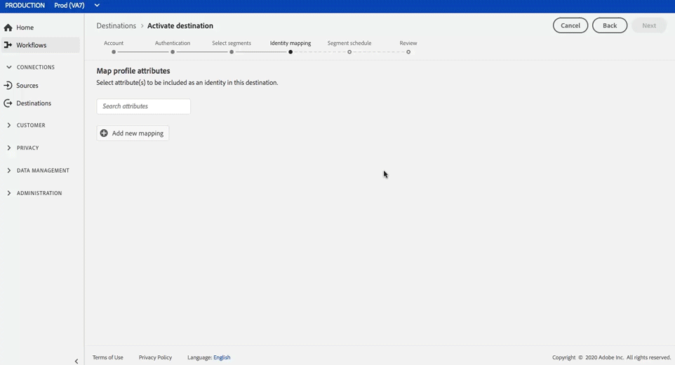

# Destino de correspondência de cliente do Google

## Visão geral {#overview}

[A Correspondência](https://support.google.com/google-ads/answer/6379332?hl=en) de clientes do Google permite que você use seus dados online e offline para alcançar e rerelacionar-se com seus clientes em propriedades próprias e operadas pelo Google, como: [!DNL Search], [!DNL Shopping], [!DNL Gmail]e [!DNL YouTube].

## Casos de uso

Para ajudá-lo a entender melhor como e quando você deve usar o [!DNL Google Customer Match] destino, veja exemplos de casos de uso que os clientes da Plataforma de dados do cliente em tempo real podem resolver usando esse recurso.

### Caso de uso nº 1

Uma marca de vestuário atlética quer atingir os clientes existentes através de [!DNL Google Search] [!DNL Google Shopping] e personalizar as ofertas e os itens com base em suas compras passadas e no histórico de navegação. A marca apparel pode assimilar endereços de e-mail de seu próprio CRM para CDP em tempo real, criar segmentos a partir de seus próprios dados offline e enviar esses segmentos para serem usados em [!DNL Google Customer Match] e [!DNL Search] [!DNL Shopping], otimizando seus gastos com publicidade.

### Caso de uso nº 2

Uma empresa de tecnologia de destaque acabou de lançar um novo telefone. Em um esforço para promover esse novo modelo de telefone, eles estão buscando conscientizar sobre os novos recursos e funcionalidades do telefone para clientes que possuem modelos anteriores de seus telefones.

Para promover a versão, eles carregam endereços de email de seu banco de dados CRM para o CDP em tempo real, usando os endereços de email como identificadores. Os segmentos são criados com base em clientes que possuem modelos de telefone mais antigos e são enviados para [!DNL Google Customer Match] que possam público alvo clientes atuais, clientes que possuem modelos de telefone mais antigos, bem como clientes semelhantes [!DNL YouTube].

## Controle de dados para [!DNL Google Customer Match] destinos {#data-governance}

Os destinos da CDP em tempo real podem ter certas regras e obrigações para os dados enviados para a plataforma de destino ou recebidos dela. Você é responsável por entender as limitações e obrigações dos seus dados e como usa esses dados na Adobe Experience Platform e na plataforma de destino. A Adobe Experience Platform fornece ferramentas de controle de dados para ajudá-lo a gerenciar algumas dessas obrigações de uso de dados. [Saiba mais](../../..//data-governance/labels/overview.md) sobre as ferramentas e políticas de controle de dados.

## Tipo e identidades de exportação {#export-type}

**Exportação** de segmento - você está exportando todos os membros de um segmento (audiência) com os identificadores (nome, número de telefone etc.) usado no [!DNL Google Customer Match] destino.

**Identidades** - você pode usar emails brutos ou com hash como IDs de clientes no Google

## [!DNL Google Customer Match] pré-requisitos de conta {#google-account-prerequisites}

Antes de configurar um [!DNL Google Customer Match] destino no CDP em tempo real, leia e siga a política do Google para usar [!DNL Customer Match], descrita na documentação [de suporte do](https://support.google.com/google-ads/answer/6299717)Google.

### Lista de permissões {#allowlist}

>[!NOTE]
>
>É obrigatório ser adicionado à lista de permissões do Google antes de configurar seu primeiro [!DNL Google Customer Match] destino no CDP em tempo real. Verifique se o processo de lista de permissões descrito abaixo foi concluído pelo Google antes de criar um destino.

Antes de criar o [!DNL Google Customer Match] destino na CDP em tempo real, você deve entrar em contato com o Google e seguir as instruções de lista de permissões em [Usar parceiros de correspondência do cliente para fazer upload dos seus dados](https://support.google.com/google-ads/answer/7361372?hl=en&amp;ref_topic=6296507) na documentação do Google.

### Requisitos de hash de email {#hashing-requirements}

<!--

>[!IMPORTANT]
>
> When using mobile device IDs as identifiers, an AppId must be provided in the activation flow. For more information, see step 6 in the [Activate segments](#activate-segments) section of this page.

-->

O Google exige que nenhuma informação de identificação pessoal (PII) seja enviada de forma clara. Portanto, as audiências ativadas para [!DNL Google Customer Match] devem ser desconectadas de endereços de email *com hash* . Você pode optar por hash de endereços de email antes de ingressá-los no Adobe Experience Platform ou pode optar por trabalhar com endereços de email claramente no Experience Platform e fazer com que nosso algoritmo os coloque em hash na ativação.

Para obter mais informações sobre os requisitos de hash do Google e outras restrições à ativação, consulte as seguintes seções na documentação do Google:

* [[!DNL Customer Match] com endereço de email, endereço ou ID de usuário](https://developers.google.com/adwords/api/docs/guides/remarketing#customer_match_with_email_address_address_or_user_id)
* [[!DNL Customer Match] considerações](https://developers.google.com/adwords/api/docs/guides/remarketing#customer_match_considerations)

<!--

Links to be added when activation based on phone number and device IDs becomes available.

* [Customer Match with phone number](https://developers.google.com/adwords/api/docs/guides/remarketing#customer_match_with_phone_number)
* [Customer Match with mobile device IDs](https://developers.google.com/adwords/api/docs/guides/remarketing#customer_match_with_mobile_device_ids)

-->

Para saber mais sobre como assimilar endereços de email no Experience Platform, consulte a visão geral [da ingestão em](../../../ingestion/batch-ingestion/overview.md) lote e a visão geral [da](../../../ingestion/streaming-ingestion/overview.md)ingestão em vapor.

Se você optar por hash nos endereços de email, certifique-se de seguir os requisitos do Google, descritos nos links acima.

>[!IMPORTANT]
>
>Se você optar por não criar hash de endereços de email, o CDP em tempo real fará isso para você ao ativar segmentos para [!DNL Google Customer Match]. No fluxo de trabalho [da](#activate-segments) ativação (consulte a etapa 5), selecione a `Email` opção como mostrado abaixo para endereços *de email de texto* simples e `Email_LC_SHA256` para endereços *de email* com hash.

## Conectar ao destino {#connect-destination}

Em **[!UICONTROL Destinos]** > **[!UICONTROL Catálogo]**, navegue até a categoria **[!UICONTROL Publicidade]** . Selecione [!DNL Google Customer Match], em seguida, **[!UICONTROL Configurar]**.

>[!NOTE]
>
>Se já existir uma conexão com esse destino, você poderá ver um botão **[!UICONTROL Ativar]** no cartão de destino. Para obter mais informações sobre a diferença entre **[!UICONTROL Ativar]** e **[!UICONTROL Configurar]**, consulte a seção [Catálogo](../../ui/destinations-workspace.md#catalog) da documentação da área de trabalho de destino.

Na etapa **Conta** , se você já tiver configurado uma conexão com seu [!DNL Google Customer Match] destino, selecione Conta **** existente e selecione sua conexão existente. Ou você pode selecionar **[!UICONTROL Nova conta]** para configurar uma nova conexão com [!DNL Google Customer Match]. Selecione **[!UICONTROL Conectar-se ao destino]** para fazer logon e conectar o Adobe Experience Cloud à sua [!DNL Google Ad] conta.

>[!NOTE]
>
>A CDP em tempo real oferece suporte à validação de credenciais no processo de autenticação e exibe uma mensagem de erro se você inserir credenciais incorretas em sua [!DNL Google Ad] conta. Isso garante que você não conclua o fluxo de trabalho com credenciais incorretas.

Depois que suas credenciais forem confirmadas e o Adobe Experience Cloud estiver conectado à sua conta do Google, você poderá selecionar **[!UICONTROL Avançar]** para prosseguir para a etapa **[!UICONTROL de configuração]** .

Na etapa **[!UICONTROL Autenticação]** , digite um [!UICONTROL Nome] e uma [!UICONTROL Descrição] para o fluxo de ativação e preencha o ID [!UICONTROL da]conta no Google.

Também nesta etapa, você pode selecionar qualquer caso **[!UICONTROL de uso de]** Marketing que deve ser aplicado a este destino. Os casos de uso de marketing indicam a intenção para a qual os dados serão exportados para o destino. Você pode selecionar de casos de uso de marketing definidos pelo Adobe ou criar seu próprio caso de uso de marketing. Para obter mais informações sobre casos de uso de marketing, consulte a página [Data Governance em CDP](../../../rtcdp/privacy/data-governance-overview.md#destinations) em tempo real. Para obter informações sobre casos individuais de uso de marketing definidos pelo Adobe, consulte a visão geral [das políticas de uso de](../../../data-governance/policies/overview.md#core-actions)dados.

Selecione **[!UICONTROL Criar destino]** depois de preencher os campos acima.

>[!IMPORTANT]
>
> * O caso de uso de **[!UICONTROL Combinar com PII]** é selecionado por padrão para o [!DNL Google Customer Match] destino e não pode ser removido.
> * Para [!DNL Google Customer Match] destinos. **[!UICONTROL A ID]** da conta é a ID do cliente com o Google. O formato da ID é xxx-xxx-xxxx.

Seu destino agora é criado. Você pode selecionar **[!UICONTROL Salvar e sair]** se quiser ativar segmentos posteriormente ou selecionar **[!UICONTROL Próximo]** para continuar o fluxo de trabalho e selecionar segmentos para ativar. Em ambos os casos, consulte a próxima seção, [Ativar segmentos para [!DNL Google Customer Match]](#activate-segments), para o restante do fluxo de trabalho.

## Ativar segmentos para [!DNL Google Customer Match] {#activate-segments}

Para ativar segmentos para [!DNL Google Customer Match], siga as etapas abaixo:

Em **[!UICONTROL Destinos > Procurar]**, selecione o [!DNL Google Customer Match] destino onde deseja ativar seus segmentos.

Clique no nome do destino. Isso leva você ao fluxo Ativar.

Observe que se já existir um fluxo de ativação para um destino, você poderá ver os segmentos que estão sendo enviados para o destino. Selecione **[!UICONTROL Editar ativação]** no painel direito e siga as etapas abaixo para modificar os detalhes da ativação.

Selecione **[!UICONTROL Ativar]**. No fluxo de trabalho **[!UICONTROL Ativar destino]** , na página **[!UICONTROL Selecionar segmentos]** , selecione para quais segmentos enviar [!DNL Google Customer Match].

Na etapa de mapeamento **[!UICONTROL de]** identidade, selecione quais atributos serão incluídos como uma identidade neste destino. Selecione **[!UICONTROL Adicionar novo mapeamento]** e procure seu schema, selecione email e/ou email com hash e mapeie-os para a identidade do público alvo correspondente.

**Endereço de email de texto simples como identidade** principal: Se você tiver endereços de email de texto simples (sem hash) como identidade primária em seu schema, selecione o campo de email em seus Atributos **[!UICONTROL de]** origem e mapeie para o campo Email na coluna direita em Identidades **[!UICONTROL de]** Público alvo, como mostrado abaixo:

**Endereço de email com hash como identidade** principal: Se você tiver endereços de email com hash como identidade primária em seu schema, selecione o campo de email com hash em seus Atributos **[!UICONTROL de]** origem e mapeie para o campo Email_LC_SHA256 na coluna direita em Identidades **[!UICONTROL de]** Público alvo, como mostrado abaixo:

Na página Agendamento **[!UICONTROL do]** segmento, é possível definir a data do start para enviar dados para o destino.

Na página **[!UICONTROL Revisar]** , você pode ver um resumo de sua seleção. Selecione **[!UICONTROL Cancelar]** para quebrar o fluxo, **[!UICONTROL Voltar]** para modificar suas configurações ou **[!UICONTROL Concluir]** para confirmar sua seleção e start enviando dados para o destino.

>[!IMPORTANT]
>
>Nesta etapa, a CDP em tempo real verifica se há violações da política de uso de dados. Abaixo está um exemplo de violação de uma política. Não é possível concluir o fluxo de trabalho da ativação de segmentos até que você tenha resolvido a violação. Para obter informações sobre como resolver violações de política, consulte Aplicação de [política](../../../rtcdp/privacy/data-governance-overview.md#enforcement) na seção de documentação de controle de dados.

Se nenhuma violação de política tiver sido detectada, selecione **[!UICONTROL Concluir]** para confirmar sua seleção e start enviando dados para o destino.

<!--

Insert in Step 6 when mobile device ID activation is available

    >[!IMPORTANT]
    >
    >If you select mobile device IDs (GAID or IDFA) as primary identity in the Identity mapping step, you must also provide an Application Id in this step. If you selected GAID as identity, see [Set the Application ID](https://developer.android.com/studio/build/application-id) in the Android developer documentation. IF you selected IDFA as identity, see [App ID](https://developer.android.com/studio/build/application-id) in the Apple developer documentation.

     

-->

## Verificar se a ativação de segmentos foi bem-sucedida {#verify-activation}

Após concluir o fluxo de ativação, alterne para sua conta do **[!UICONTROL Google Ads]** . Os segmentos ativados serão exibidos em sua conta do Google como listas do cliente. Observe que, dependendo do tamanho do seu segmento, algumas audiências não serão preenchidas a menos que haja mais de 100 usuários ativos para servir.

## Recursos adicionais {#additional-resources}

* [Integração da correspondência de clientes do Google - tutorial em vídeo](https://experienceleague.adobe.com/docs/platform-learn/tutorials/rtcdp/integrate-with-google-customer-match.html)