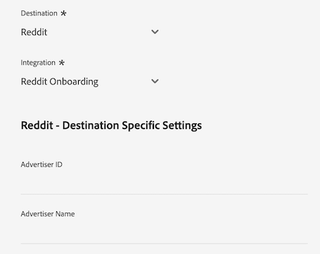
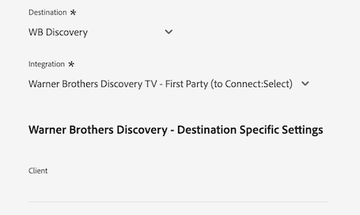

# [!DNL LiveRamp - Distribution] conexão

A conexão [!DNL LiveRamp - Distribution] permite ativar públicos-alvo do Experience Platform para editores premium em mídias de TV móveis, da Web, conectadas e de exibição.

>[!IMPORTANT]
>
>Esse conector de destino e a página de documentação são criados e mantidos pelo LiveRamp. Para quaisquer consultas ou solicitações de atualização, contate o LiveRamp diretamente [aqui](mailto:adobertcdp@liveramp.com).

## Destinos compatíveis {#supported-destinations}

[!DNL LiveRamp - Distribution] atualmente oferece suporte à ativação de público para as seguintes plataformas:

* [[!DNL 4C Insights]](#insights)
* [[!DNL Acast]](#acast)
* [[!DNL Nexxen]](#nexxen)
* [[!DNL Ampersand.tv]](#ampersand-tv)
* [[!DNL Captify]](#captify)
* [[!DNL Cardlytics]](#cardlytics)
* [[!DNL Disney (Hulu/ESPN/ABC)]](#disney)
* [[!DNL iHeartMedia]](#iheartmedia)
* [[!DNL Index Exchange]](#index-exchange)
* [[!DNL Magnite CTV Platform]](#magnite)
* [[!DNL Magnite DV+ (Rubicon Project)]](#magnite-dv)
* [[!DNL One Fox]](#fox)
* [[!DNL Pandora]](#pandora)
* [[!DNL Reddit]](#reddit)
* [[!DNL Roku]](#roku)
* [[!DNL Spotify]](#spotify)
* [[!DNL Taboola]](#taboola)
* [[!DNL TargetSpot]](#targetspot)
* [[!DNL Teads]](#teads)
* [[!DNL WB Discovery]](#wb-discovery)

## Casos de uso {#use-cases}

Para ajudá-lo a entender melhor como e quando você deve usar o destino [!DNL LiveRamp - Distribution], veja um exemplo de caso de uso que os clientes da Adobe Experience Platform podem resolver usando esse destino.

A equipe de marketing de um retailer de vestuário esportivo usou a conexão [LiveRamp - Integração](liveramp-onboarding.md) para enviar públicos-alvo do Experience Platform para sua conta do LiveRamp.

Por meio da conexão [!DNL LiveRamp - Distribution], agora eles podem acionar a ativação dos públicos-alvo integrados para os [destinos com suporte](#supported-destinations). Em seguida, eles podem direcionar os usuários em plataformas móveis, abertas da Web, sociais e [!DNL CTV].

## Integração de públicos ao LiveRamp {#onboarding}

Antes de ativar públicos-alvo por meio da conexão [!DNL LiveRamp - Distribution], use a conexão [LiveRamp - Integração](liveramp-onboarding.md) para exportar os públicos-alvo da Experience Platform para o LiveRamp.

Depois de ter integrado os públicos-alvo ao LiveRamp, continue o fluxo de trabalho de ativação da etapa [conectar ao destino](#connect) para selecionar e configurar as plataformas de destino para ativação de dados.

## Conectar ao destino {#connect}

>[!CONTEXTUALHELP]
>id="platform_destinations_liveramp_distribution_identifier_settings"
>title="Configurações do identificador"
>abstract="Selecione os identificadores compatíveis com seu destino. Consulte a documentação para obter a lista completa dos identificadores compatíveis com cada destino."

>[!IMPORTANT]
> 
>Para se conectar ao destino, você precisa das **[!UICONTROL View Destinations]** e **[!UICONTROL Manage Destinations]** [permissões de controle de acesso](/help/access-control/home.md#permissions). Leia a [visão geral do controle de acesso](/help/access-control/ui/overview.md) ou contate o administrador do produto para obter as permissões necessárias.

Para se conectar a este destino, siga as etapas descritas no [tutorial de configuração de destino](../../ui/connect-destination.md). No workflow de configuração de destino, preencha os campos listados nas duas seções abaixo.

### Autenticar para o LiveRamp {#authenticate}

Para autenticar no destino, preencha os campos obrigatórios e selecione **[!UICONTROL Connect to destination]**.

* **[!UICONTROL LiveRamp Organization ID]**: a ID da organização da sua conta do LiveRamp (listada como _owner_org_ nas credenciais fornecidas pelo LiveRamp).
* **[!UICONTROL Password]**: sua senha de conta do LiveRamp (listada como _secret_key_ nas credenciais fornecidas pelo LiveRamp).
* **[!UICONTROL Token URL]**: sua URL do token do LiveRamp.
* **[!UICONTROL Username]**: seu nome de usuário da conta do LiveRamp (listado como _account_id_ nas credenciais fornecidas pelo LiveRamp).

### Configurar detalhes do destino {#destination-details}

Depois de se conectar com sucesso à sua conta do LiveRamp, insira as informações necessárias para se conectar ao destino no qual deseja ativar os públicos-alvo.

* **[!UICONTROL Name]**: Preencha o nome preferencial para sua conexão de destino.

>[!NOTE]
>
>Ao nomear seu destino, a Adobe recomenda seguir este formato: `LiveRamp - Downstream Destination Name`. Este padrão de nomenclatura ajuda a identificar rapidamente seus destinos na guia [Procurar](../../ui/destinations-workspace.md#browse) do espaço de trabalho de destinos.
> 
>Exemplo: `LiveRamp - Roku`.

* **[!UICONTROL Description]**: insira uma descrição para o seu destino. Use uma descrição que ajude a identificar facilmente a finalidade desse destino.
* **[!UICONTROL Destination]**: use o menu suspenso para selecionar o destino para o qual deseja ativar públicos. O destino selecionado aqui afeta diretamente o que você vê na tela [configurações específicas de destino](#destination-settings).
* **[!UICONTROL Integration]**: selecione a conta de integração que deseja usar para o seu destino.
* **[!UICONTROL Identifier]**: Selecione os identificadores suportados pelo seu destino. Atualmente, todos os destinos têm seus identificadores compatíveis preenchidos previamente no menu suspenso.

## Configurações específicas de destino {#destination-settings}

Cada um dos destinos [com suporte](#supported-destinations) por [!DNL LiveRamp - Distribution] requer que você preencha opções de configuração específicas.

Consulte as seções abaixo para obter orientações detalhadas sobre como configurar cada destino.

### [!DNL 4C Insights] {#insights}

>[!CONTEXTUALHELP]
>id="platform_destinations_liveramp_distribution_4cinsights_profile_id"
>title="ID de perfil de marca 4C"
>abstract="Insira a ID numérica associada ao seu Perfil de marca 4C. Se você não tiver essa ID, entre em contato com o(a) representante de serviços de cliente da 4C."

Para configurar detalhes para o destino, preencha os campos abaixo.

* **[!UICONTROL 4C Brand Profile ID]**: Digite a ID numérica associada ao seu Perfil de Marca 4C. Se você não tiver essa ID, entre em contato com o(a) representante de serviços de cliente da 4C.

### [!DNL Acast] {#acast}

>[!CONTEXTUALHELP]
>id="platform_destinations_liveramp_distribution_acast_client"
>title="Nome do cliente"
>abstract="O nome da sua conta de anunciante, da forma que você deseja que seja exibido para o parceiro de destino. Use o nome da sua empresa. Não use espaços ou caracteres especiais."

Para configurar detalhes para o destino, preencha os campos abaixo.

* **[!UICONTROL Client name]**: O nome da sua conta de anunciante, como você gostaria que fosse mostrado ao parceiro de destino. Use o nome da sua empresa. Não use espaços ou caracteres especiais.

### [!DNL Ampersand.tv] {#ampersand-tv}

>[!CONTEXTUALHELP]
>id="platform_destinations_liveramp_distribution_ampersand_company_name"
>title="O nome da sua empresa"
>abstract="O nome da sua empresa que você deseja exibir ao parceiro de destino. Não use espaços ou caracteres especiais."

Para configurar detalhes para o destino, preencha os campos abaixo.

* **[!UICONTROL Your Company Name]**: O nome da sua empresa, como você gostaria que fosse mostrado ao parceiro de destino. Não use espaços ou caracteres especiais.

### [!DNL Captify] {#captify}

>[!CONTEXTUALHELP]
>id="platform_destinations_liveramp_distribution_captify_client"
>title="Nome do cliente"
>abstract="O nome da sua conta de anunciante, da forma que você deseja que seja exibido para o parceiro de destino. Use o nome da sua empresa. Não use espaços ou caracteres especiais."

Para configurar detalhes para o destino, preencha os campos abaixo.

* **[!UICONTROL Client name]**: O nome da sua conta de anunciante, como você gostaria que fosse mostrado ao parceiro de destino. Use o nome da sua empresa. Não use espaços ou caracteres especiais.

### [!DNL Cardlytics] {#cardlytics}

>[!CONTEXTUALHELP]
>id="platform_destinations_liveramp_distribution_cardlytics_client"
>title="Nome do cliente"
>abstract="O nome da sua conta de anunciante, da forma que você deseja que seja exibido para o parceiro de destino. Use o nome da sua empresa. Não use espaços ou caracteres especiais."

Para configurar detalhes para o destino, preencha os campos abaixo.

* **[!UICONTROL Client name]**: O nome da sua conta de anunciante, como você gostaria que fosse mostrado ao parceiro de destino. Use o nome da sua empresa. Não use espaços ou caracteres especiais.

### [!DNL Disney (Hulu/ESPN/ABC)] {#disney}

>[!CONTEXTUALHELP]
>id="platform_destinations_liveramp_distribution_agreement"
>title="Contrato de termos de destino de dados do anunciante"
>abstract="Digite `I AGREE` para confirmar que reconhece e aceita os termos de dados de anunciante da Disney."

<!-- >additional-url="<https://www.disneyadvertising.com/ADVERTISER-DATA-DESTINATION-TERMS/>" text="Read the agreement" -->

>[!CONTEXTUALHELP]
>id="platform_destinations_liveramp_distribution_disney_client"
>title="Nome do cliente"
>abstract="O nome da sua conta de anunciante, da forma que você deseja que seja exibido para o parceiro de destino. Use o nome da sua empresa. Não use espaços ou caracteres especiais."

>[!CONTEXTUALHELP]
>id="platform_destinations_liveramp_distribution_disney_email"
>title="Seu endereço de email"
>abstract="Insira um endereço de email vinculado a uma pessoa. Esse endereço de email serve como uma assinatura do contrato de termos de dados do anunciante. Esse endereço de email também será usado para entrar em contato com você, se necessário."

Para configurar detalhes para o destino, preencha os campos abaixo.

* **[!UICONTROL Advertiser data destination terms agreement]**: digite `I AGREE` para confirmar a confirmação e o acordo com os termos de dados do anunciante da Disney.
* **[!UICONTROL Client name]**: digite o nome da sua empresa como deseja que seja mostrado ao parceiro de destino.
* **[!UICONTROL Email address]**: Digite um endereço de email vinculado a um indivíduo. Esse endereço de email serve como uma assinatura do contrato dos termos de dados do anunciante.

### [!DNL iHeartMedia] {#iheartmedia}

>[!CONTEXTUALHELP]
>id="platform_destinations_liveramp_distribution_iheartmedia_client"
>title="Nome do cliente"
>abstract="O nome da sua conta de anunciante, da forma que você deseja que seja exibido para o parceiro de destino. Use o nome da sua empresa. Não use espaços ou caracteres especiais."

Para configurar detalhes para o destino, preencha os campos abaixo.

* **[!UICONTROL Client Name]**: O nome da sua conta de anunciante, como você gostaria que fosse mostrado ao parceiro de destino. Use o nome da sua empresa. Não use espaços ou caracteres especiais.

### [!DNL Index Exchange] {#index-exchange}

>[!CONTEXTUALHELP]
>id="platform_destinations_liveramp_distribution_index_advertiseraccountname"
>title="Nome da conta"
>abstract="O nome da conta de cliente do Index Exchange. Não use espaços ou caracteres especiais."

Para configurar detalhes para o destino, preencha os campos abaixo.

* **[!UICONTROL Account Name]**: O nome da conta do cliente Index Exchange. Não use espaços ou caracteres especiais.

### [!DNL Magnite CTV Platform] {#magnite}

>[!CONTEXTUALHELP]
>id="platform_destinations_liveramp_distribution_magnitectv_client"
>title="Cliente"
>abstract="O nome de cliente que você deseja exibir ao parceiro de destino. Use o nome da sua empresa. Não use espaços ou caracteres especiais."

Para configurar detalhes para o destino, preencha os campos abaixo.

* **[!UICONTROL Client]**: Seu nome de cliente, como você gostaria que fosse mostrado ao parceiro de destino. Use o nome da sua empresa. Não use espaços ou caracteres especiais.

### [!DNL Magnite DV+ (Rubicon Project)] {#magnite-dv}

>[!CONTEXTUALHELP]
>id="platform_destinations_liveramp_distribution_magnitedv+_partnerid"
>title="ID de parceiro"
>abstract="A ID de parceiro da Rubicon Project associada ao editor proprietário do segmento/dados. Entre em contato com o(a) representante de conta da Rubicon Project se não tiver certeza do valor que deve usar."

>[!CONTEXTUALHELP]
>id="platform_destinations_liveramp_distribution_magnitedv+_seatid"
>title="ID de licença"
>abstract="Magnite DV + ID de licença fornecida pelo(a) gerente de conta da Magnite"

Para configurar detalhes para o destino, preencha os campos abaixo.

* **[!UICONTROL Partner ID]**: a ID de parceiro do projeto Rubicon associada ao publicador que possui o segmento/dados. Entre em contato com o(a) representante de conta da Rubicon Project se não tiver certeza do valor que deve usar.
* **[!UICONTROL Seat ID]**: Magnite DV+ ID da vaga fornecida pelo seu gerente de conta Magnite

### [!DNL Nexxen (formerly known as [!DNL Amobee])] {#nexxen}

>[!CONTEXTUALHELP]
>id="platform_destinations_liveramp_distribution_nexxen_ratetype"
>title="Tipo de taxa"
>abstract="O tipo de taxa representa a forma como o uso dos dados deve ser faturado. Todas as taxas de US$ 0,00 devem ser fixas. Consulte o(a) representante da Nexxen se não tiver certeza de qual tipo de taxa usar."

>[!CONTEXTUALHELP]
>id="platform_destinations_liveramp_distribution_nexxen_marketid"
>title="ID de mercado"
>abstract="Insira a ID numérica de mercado onde o contrato de dados da Nexxen deve ser criado. Se estiver fazendo a distribuição “AlwaysOn” em todos os mercados na plataforma Nexxen, digite -1."

>[!CONTEXTUALHELP]
>id="platform_destinations_liveramp_distribution_nexxen_advertiserid"
>title="ID de anunciante"
>abstract="Se estiver enviando dados para um único anunciante na plataforma Nexxen, insira a ID numérica de anunciante da Amobee. Se quiser disponibilizar os dados para todos os anunciantes em um mercado ou se esses segmentos estiverem definidos como “AlwaysOn”, digite -1."

>[!CONTEXTUALHELP]
>id="platform_destinations_liveramp_distribution_nexxen_contactemail"
>title="Email de contato"
>abstract="Insira o endereço de email que a Nexxen deve usar para enviar detalhes do contrato de dados. Esse provavelmente deve ser seu próprio endereço de email, mas também pode ser um alias de email. Para vários destinatários, separe-os usando vírgulas (`email1@domain.com`,`email2@domain.com` e assim por diante)."

Para configurar detalhes para o destino, preencha os campos abaixo.

* **[!UICONTROL Rate Type]**: o tipo de taxa representa a forma como o uso de dados deve ser faturado. Todas as taxas de US$ 0,00 devem ser fixas. Consulte o(a) representante da Nexxen se não tiver certeza de qual tipo de taxa usar.
* **[!UICONTROL Market ID]**: insira a ID de mercado numérica onde o contrato de dados Nexxen deve ser criado. Se estiver fazendo a distribuição “AlwaysOn” em todos os mercados na plataforma Nexxen, digite -1.
* **[!UICONTROL Advertiser ID]**: se estiver enviando dados para um único anunciante na plataforma Nexxen, insira a ID numérica do anunciante Nexxen. Se quiser disponibilizar os dados para todos os anunciantes em um mercado ou se esses segmentos forem &quot;AlwaysOn&quot;, digite -1.
* **[!UICONTROL Contact Email]**: insira o endereço de email que o Nexxen deve usar para enviar os detalhes do contrato de dados. Esse provavelmente deve ser seu próprio endereço de email, mas também pode ser um alias de email. Para vários destinatários, separe usando vírgulas ( `email1@domain.com`, `email2@domain.com`).

### [!DNL One Fox] {#fox}

>[!CONTEXTUALHELP]
>id="platform_destinations_liveramp_distribution_fox_client"
>title="Cliente"
>abstract="O nome da sua empresa/conta de distribuição que deseja exibir ao parceiro. Entre em contato com o(a) representante de conta do parceiro se não tiver certeza sobre qual nome usar. Não use espaços ou caracteres especiais."

Para configurar detalhes para o destino, preencha os campos abaixo.

* **[!UICONTROL Client]**: o nome da sua empresa/conta de distribuição como você gostaria que ele aparecesse para o parceiro. Use o nome da sua empresa por padrão. Entre em contato com o(a) representante de conta do parceiro se não tiver certeza sobre qual nome usar. Não use espaços ou caracteres especiais.

### [!DNL Pandora] {#pandora}

>[!CONTEXTUALHELP]
>id="platform_destinations_liveramp_distribution_pandora_account_name"
>title="Nome da conta"
>abstract="O nome da sua conta Pandora. Entre em contato com o(a) representante de conta Pandora, Caso não tenha certeza sobre qual é o nome da sua conta. Não use espaços ou caracteres especiais."

Para configurar detalhes para o destino, preencha os campos abaixo.

* **[!UICONTROL Account name]**: O nome da sua conta Pandora. Entre em contato com o(a) representante de conta Pandora, Caso não tenha certeza sobre qual é o nome da sua conta. Não use espaços ou caracteres especiais.

### [!DNL Reddit] {#reddit}

>[!CONTEXTUALHELP]
>id="platform_destinations_liveramp_distribution_reddit_advertiser_id"
>title="ID de anunciante do Reddit"
>abstract="Sua ID de anunciante do Reddit. Precisa começar com “t2_” ou “a2_”. Entre em contato com o representante do Reddit caso não saiba sua ID de anunciante."

>[!CONTEXTUALHELP]
>id="platform_destinations_liveramp_distribution_reddit_advertiser_name"
>title="Nome de anunciante do Reddit"
>abstract="Seu nome de anunciante do Reddit. Não use espaços ou caracteres especiais."

Para configurar detalhes para o destino, preencha os campos abaixo.

* **[!UICONTROL Reddit advertiser ID]**: Sua ID de anunciante do Reddit. Precisa começar com “t2_” ou “a2_”. Entre em contato com o representante do Reddit caso não saiba sua ID de anunciante.
* **[!UICONTROL Reddit advertiser name]**: Seu nome de anunciante do Reddit. Não use espaços ou caracteres especiais.

### [!DNL Roku] {#roku}

>[!CONTEXTUALHELP]
>id="platform_destinations_liveramp_distribution_roku_email"
>title="Endereço de email da conta Roku"
>abstract="Insira o endereço de email vinculado à sua conta Roku."

>[!CONTEXTUALHELP]
>id="platform_destinations_liveramp_distribution_roku_representative_email"
>title="Endereço de email do(a) representante de conta Roku"
>abstract="Insira o endereço de email do(a) representante de conta Roku. Esse endereço é usado para enviar atualizações de taxonomia. Para inserir vários endereços, separe-os por vírgulas."

Para configurar detalhes para o destino, preencha os campos abaixo.

* **[!UICONTROL Roku account email address]**: Digite o endereço de email vinculado à sua conta do Roku.
* **[!UICONTROL Roku account representative email address]**: insira o endereço de email do representante de sua conta Roku. Para inserir vários endereços, separe-os por vírgulas.

### [!DNL Spotify] {#spotify}

>[!CONTEXTUALHELP]
>id="platform_destinations_liveramp_distribution_spotify_client"
>title="Nome do cliente"
>abstract="O nome da sua conta de anunciante, da forma que você deseja que seja exibido para o parceiro de destino. Use o nome da sua empresa. Não use espaços ou caracteres especiais."

Para configurar detalhes para o destino, preencha os campos abaixo.

* **[!UICONTROL Client name]**: O nome da sua conta de anunciante, como você gostaria que fosse mostrado ao parceiro de destino. Use o nome da sua empresa. Não use espaços ou caracteres especiais.

### [!DNL Taboola] {#taboola}

>[!CONTEXTUALHELP]
>id="platform_destinations_liveramp_distribution_taboola_rep_email"
>title="Endereço de email do(a) gerente de conta"
>abstract="O endereço de email do(a) gerente de conta da Taboola."

>[!CONTEXTUALHELP]
>id="platform_destinations_liveramp_distribution_taboola_seg_type"
>title="Tipo de segmento"
>abstract="O tipo de segmento. No momento, somente os segmentos primários são aceitos."

Para configurar detalhes para o destino, preencha os campos abaixo.

* **[!UICONTROL Account manager email address]**: O endereço de email do seu gerente de conta do Taboola.
* **[!UICONTROL Segment type]**: O tipo de segmento. No momento, somente os segmentos primários são aceitos.

### [!DNL TargetSpot] {#targetspot}

>[!CONTEXTUALHELP]
>id="platform_destinations_liveramp_distribution_targetspot_client"
>title="Nome do cliente"
>abstract="O nome da sua conta de anunciante, da forma que você deseja que seja exibido para o parceiro de destino. Use o nome da sua empresa. Não use espaços ou caracteres especiais."

Para configurar detalhes para o destino, preencha os campos abaixo.

* **[!UICONTROL Client name]**: O nome da sua conta de anunciante, como você gostaria que fosse mostrado ao parceiro de destino. Use o nome da sua empresa. Não use espaços ou caracteres especiais.

### [!DNL Teads] {#teads}

>[!CONTEXTUALHELP]
>id="platform_destinations_liveramp_distribution_teads_teadsid"
>title="ID do Teads"
>abstract="Sua ID do Teads"

Para configurar detalhes para o destino, preencha os campos abaixo.

* **[!UICONTROL Teads ID]**: Sua ID do Teads

### [!DNL WB Discovery] {#wb-discovery}

>[!CONTEXTUALHELP]
>id="platform_destinations_liveramp_distribution_wb_client"
>title="Nome do cliente"
>abstract="O nome da sua conta de anunciante, da forma que você deseja que seja exibido para o parceiro de destino. Use o nome da sua empresa. Não use espaços ou caracteres especiais."

Para configurar detalhes para o destino, preencha os campos abaixo.

* **[!UICONTROL Client name]**: O nome da sua conta de anunciante, como você gostaria que fosse mostrado ao parceiro de destino. Use o nome da sua empresa. Não use espaços ou caracteres especiais.

### Ativar alertas {#enable-alerts}

Você pode ativar os alertas para receber notificações sobre o status do fluxo de dados para o seu destino. Para receber notificações sobre o status do fluxo de dados, selecione um alerta na lista. Para obter mais informações sobre alertas, leia o manual sobre [assinatura de alertas de destinos usando a interface](../../ui/alerts.md).

Quando terminar de fornecer detalhes da conexão de destino, selecione **[!UICONTROL Next]**.

## Ativar públicos-alvo para esse destino {#activate}

>[!IMPORTANT]
> 
>Para ativar dados, você precisa das **[!UICONTROL View Destinations]**, **[!UICONTROL Activate Destinations]**, **[!UICONTROL View Profiles]** e **[!UICONTROL View Segments]** [permissões de controle de acesso](/help/access-control/home.md#permissions). Leia a [visão geral do controle de acesso](/help/access-control/ui/overview.md) ou contate o administrador do produto para obter as permissões necessárias.

A conexão [!DNL LiveRamp - Distribution] ativa públicos que já foram integrados à sua conta do LiveRamp por meio da conexão [LiveRamp - Integração](liveramp-onboarding.md).

Para ativar os públicos com êxito, selecione os **mesmos públicos-alvo** que você [integrou anteriormente](liveramp-onboarding.md) ao LiveRamp.

>[!IMPORTANT]
>
>Selecionar públicos que não tenham sido integrados anteriormente por meio da conexão [LiveRamp - Integração](liveramp-onboarding.md) não aciona a integração dos novos públicos.

## Dados exportados / Validar exportação de dados {#exported-data}

Para verificar e monitorar a ativação de seus públicos, faça logon em sua conta do LiveRamp e verifique as métricas de ativação.

Em caso de dúvidas sobre a ativação do público-alvo, entre em contato com o representante de conta do LiveRamp.

## Uso e governança de dados {#data-usage-governance}

Todos os destinos do [!DNL Adobe Experience Platform] são compatíveis com as políticas de uso de dados ao manipular seus dados. Para obter informações detalhadas sobre como o [!DNL Adobe Experience Platform] fiscaliza a governança de dados, leia a [Visão geral da Governança de Dados](/help/data-governance/home.md).

## Recursos adicionais {#additional-resources}

Para obter mais detalhes sobre como configurar o destino do [!DNL LiveRamp - Onboarding], consulte a [documentação do LiveRamp - Integração](liveramp-onboarding.md).
