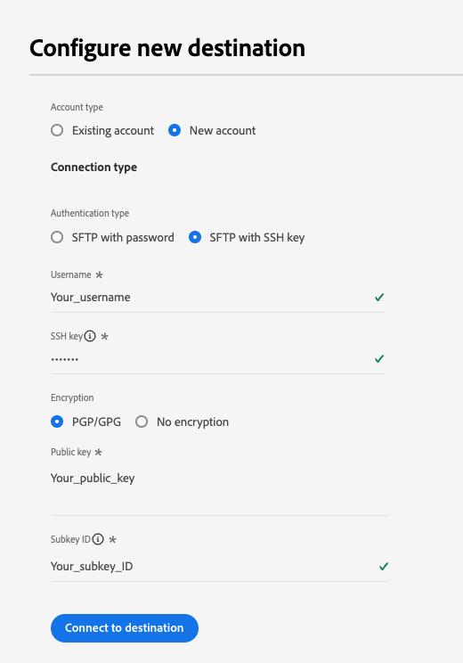
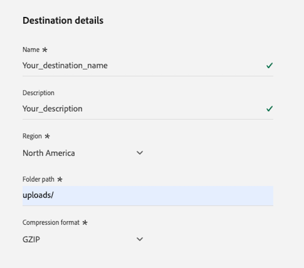

# [!DNL LiveRamp - Onboarding] conexão {#liveramp-onboarding}

Use a conexão [!DNL LiveRamp - Onboarding] para integrar públicos do Adobe Real-Time Customer Data Platform ao [!DNL LiveRamp Connect].

## Casos de uso {#use-cases}

Para ajudá-lo a entender melhor como e quando você deve usar o destino [!DNL LiveRamp - Onboarding], veja um exemplo de caso de uso que os clientes da Adobe Experience Platform podem resolver usando esse destino.

Como profissional de marketing, desejo enviar públicos-alvo do Adobe Experience Platform para identidades integradas no [!DNL LiveRamp Connect] para que eu possa direcionar usuários em plataformas móveis, abertas da Web, sociais e [!DNL CTV], usando o identificador [!DNL Ramp ID].

## Pré-requisitos {#prerequisites}

A conexão [!DNL LiveRamp - Onboarding] exporta arquivos usando o armazenamento SFTP[ do ](https://docs.liveramp.com/connect/en/upload-a-file-via-liveramp-s-sftp.html)LiveRamp.

Antes de enviar dados do Experience Platform para o [!DNL LiveRamp - Onboarding], você precisa de suas credenciais do [!DNL LiveRamp]. Entre em contato com o representante do [!DNL LiveRamp] para obter suas credenciais, caso ainda não as tenha.

## Identidades suportadas {#supported-identities}

O [!DNL LiveRamp - Onboarding] oferece suporte à ativação de identidades, como identificadores baseados em PII, identificadores conhecidos e IDs personalizadas, descritos na [documentação oficial do LiveRamp](https://docs.liveramp.com/connect/en/identity-and-identifier-terms-and-concepts.html#known-identifiers).

Na [etapa de mapeamento](#map) do fluxo de trabalho de ativação, você deve definir os mapeamentos de destino como atributos personalizados.

## Públicos-alvo compatíveis {#supported-audiences}

Esta seção descreve quais tipos de públicos-alvo você pode exportar para esse destino.

| Origem do público | Suportado | Descrição |
|---------|----------|----------|
| [!DNL Segmentation Service] | ✓ | Públicos-alvo gerados pelo [Serviço de Segmentação](../../../segmentation/home.md) da Experience Platform. |
| Uploads personalizados | ✓ | Públicos [importados](../../../segmentation/ui/audience-portal.md#import-audience) para o Experience Platform de arquivos CSV. |

{style="table-layout:auto"}

## Tipo e frequência de exportação {#export-type-frequency}

Consulte a tabela abaixo para obter informações sobre o tipo e a frequência da exportação de destino.

| Item | Tipo | Notas |
|---------|----------|---------|
| Tipo de exportação | **[!UICONTROL Audience export]** | Você está exportando todos os membros de um público com os identificadores (nome, número de telefone ou outros) usados no destino [!DNL LiveRamp - Onboarding]. |
| Frequência de exportação | **[!UICONTROL Daily batch]** | Como os perfis são atualizados no Experience Platform com base na avaliação do público-alvo, os perfis (identidades) são atualizados uma vez por dia downstream para a plataforma de destino. Leia mais sobre [destinos com base em arquivo de lote](/help/destinations/destination-types.md#file-based). |

{style="table-layout:auto"}

## Conectar ao destino {#connect}

>[!IMPORTANT]
> 
>Para se conectar ao destino, você precisa das **[!UICONTROL View Destinations]** e **[!UICONTROL Manage Destinations]** [permissões de controle de acesso](/help/access-control/home.md#permissions). Leia a [visão geral do controle de acesso](/help/access-control/ui/overview.md) ou contate o administrador do produto para obter as permissões necessárias.

Para se conectar a este destino, siga as etapas descritas no [tutorial de configuração de destino](../../ui/connect-destination.md). No workflow de configuração de destino, preencha os campos listados nas duas seções abaixo.

### Autenticar para o destino {#authenticate}

Para autenticar no destino, preencha os campos obrigatórios e selecione **[!UICONTROL Connect to destination]**.

**Autenticação SFTP com senha** {#sftp-password}


* **[!UICONTROL Port]**: a porta usada para seu local de armazenamento [!DNL LiveRamp - Onboarding].  Use a porta que corresponde à sua localização geográfica, conforme descrito abaixo:
   * **[!UICONTROL NA]**: Use a porta `22`
   * **[!UICONTROL AU]**: Use a porta `2222`
* **[!UICONTROL Username]**: O nome de usuário para seu local de armazenamento [!DNL LiveRamp - Onboarding].
* **[!UICONTROL Password]**: A senha do local de armazenamento [!DNL LiveRamp - Onboarding].
* **[!UICONTROL PGP/GPG encryption key]**: Opcionalmente, você pode anexar sua chave pública formatada em RSA para adicionar criptografia aos seus arquivos exportados. Veja um exemplo de uma chave de criptografia formatada corretamente na imagem abaixo.
  
* **[!UICONTROL Subkey ID]**:Ifvocê fornece uma chave de criptografia, você também deve fornecer uma criptografia **[!UICONTROL Subkey ID]**. Consulte a [!DNL LiveRamp] [documentação de criptografia](https://docs.liveramp.com/connect/en/encrypting-files-for-uploading.html#downloading-the-current-encryption-key) para saber como obter a ID da subchave.

**SFTP com autenticação de chave SSH** {#sftp-ssh}



* **[!UICONTROL Port]**: a porta usada para seu local de armazenamento [!DNL LiveRamp - Onboarding].  Use a porta que corresponde à sua localização geográfica, conforme descrito abaixo:
   * **[!UICONTROL EU]**: Use a porta `4222`
* **[!UICONTROL Username]**: O nome de usuário para seu local de armazenamento [!DNL LiveRamp - Onboarding].
* **[!UICONTROL SSH Key]**: a chave privada [!DNL SSH] usada para fazer logon no local de armazenamento [!DNL LiveRamp - Onboarding]. A chave privada deve ser formatada como uma cadeia de caracteres codificada em [!DNL Base64] e não deve ser protegida por senha.

   * Para conectar sua chave [!DNL SSH] ao servidor [!DNL LiveRamp - Onboarding], você deve enviar um tíquete por meio do portal de suporte técnico do [!DNL LiveRamp] e fornecer sua chave pública. Veja mais informações na [documentação do LiveRamp](https://docs.liveramp.com/connect/en/upload-a-file-via-liveramp-s-sftp.html#upload-with-an-sftp-client).

* **[!UICONTROL PGP/GPG encryption key]**: Opcionalmente, você pode anexar sua chave pública formatada em RSA para adicionar criptografia aos seus arquivos exportados. Veja um exemplo de uma chave de criptografia formatada corretamente na imagem abaixo.
  
* **[!UICONTROL Subkey ID]**:Ifvocê fornece uma chave de criptografia, você também deve fornecer uma criptografia **[!UICONTROL Subkey ID]**. Consulte a [!DNL LiveRamp] [documentação de criptografia](https://docs.liveramp.com/connect/en/encrypting-files-for-uploading.html#downloading-the-current-encryption-key) para saber como obter a ID da subchave.

### Preencher detalhes do destino {#destination-details}

>[!CONTEXTUALHELP]
>id="platform_destinations_liveramp_subkey"
>title="ID da subchave de criptografia"
>abstract="A ID da subchave usada para criptografia, com base na chave de criptografia pública do LiveRamp. Esse campo será necessário se você tiver fornecido uma chave de criptografia na etapa de autenticação."
>additional-url="https://docs.liveramp.com/connect/en/encrypting-files-for-uploading.html#downloading-the-current-encryption-key" text="Saiba como obter a ID da subchave"

Para configurar detalhes para o destino, preencha os campos obrigatórios e opcionais abaixo. Um asterisco ao lado de um campo na interface do usuário indica que o campo é obrigatório.



* **[!UICONTROL Name]**: Um nome pelo qual você reconhecerá este destino no futuro.
* **[!UICONTROL Description]**: uma descrição que ajudará você a identificar este destino no futuro.
* **[!UICONTROL Region]**: região geográfica da sua instância do armazenamento SFTP do LiveRamp.
* **[!UICONTROL Folder path]**: O caminho para a subpasta [!DNL LiveRamp] `uploads` que hospedará os arquivos exportados. O prefixo `uploads` é adicionado automaticamente ao caminho da pasta. A [!DNL LiveRamp] recomenda criar uma subpasta dedicada para entregas a partir do Adobe Real-Time CDP para manter os arquivos separados de quaisquer outros feeds existentes e garantir que toda a automação seja executada sem problemas.
   * Por exemplo, se você deseja exportar seus arquivos para `uploads/my_export_folder`, digite `my_export_folder` no campo **[!UICONTROL Folder path]**.
* **[!UICONTROL Compression format]**: Selecione o tipo de compactação que o Experience Platform deve usar para os arquivos exportados. As opções disponíveis são **[!UICONTROL GZIP]** ou **[!UICONTROL None]**.

### Ativar alertas {#enable-alerts}

Você pode ativar os alertas para receber notificações sobre o status do fluxo de dados para o seu destino. Selecione um alerta na lista para assinar e receber notificações sobre o status do seu fluxo de dados. Para obter mais informações sobre alertas, leia o manual sobre [assinatura de alertas de destinos usando a interface](../../ui/alerts.md).

Quando terminar de fornecer detalhes da conexão de destino, selecione **[!UICONTROL Next]**.

## Ativar públicos-alvo para esse destino {#activate}

>[!IMPORTANT]
> 
>Para ativar dados, você precisa das **[!UICONTROL View Destinations]**, **[!UICONTROL Activate Destinations]**, **[!UICONTROL View Profiles]** e **[!UICONTROL View Segments]** [permissões de controle de acesso](/help/access-control/home.md#permissions). Leia a [visão geral do controle de acesso](/help/access-control/ui/overview.md) ou contate o administrador do produto para obter as permissões necessárias.

Leia [Ativar dados de público-alvo para destinos de exportação de perfil em lote](/help/destinations/ui/activate-batch-profile-destinations.md) para obter instruções sobre como ativar públicos-alvo para esse destino.

### Agendamento {#scheduling}

Na etapa [!UICONTROL Scheduling], crie um agendamento de exportação para cada público, com as configurações mostradas abaixo.

* **[!UICONTROL File export options]**: [!UICONTROL Export full files]. [Exportações incrementais de arquivos](../../ui/activate-batch-profile-destinations.md#export-incremental-files) não têm suporte no momento para o destino [!DNL LiveRamp].
* **[!UICONTROL Frequency]**: [!UICONTROL Daily]
* **[!UICONTROL Date]**: selecione as horas de início e término da exportação conforme desejar.


O nome do arquivo exportado não pode ser configurado pelo usuário no momento. Todos os arquivos exportados para o destino [!DNL LiveRamp - Onboarding] são automaticamente nomeados com base no seguinte modelo:

`%ORGANIZATION_NAME%_%DESTINATION%_%DESTINATION_INSTANCE_ID%_%DATETIME%`


Por exemplo, o nome de um arquivo exportado para uma organização chamada [!DNL Luma] pode ser semelhante a:

```json
Luma_LiveRamp_52137231-4a99-442d-804c-39a09ddd005d_20230330_153857.csv
```

### Mapear atributos e identidades {#map}

Na etapa **[!UICONTROL Mapping]**, você pode selecionar quais atributos e identidades deseja exportar para seus perfis.

>[!IMPORTANT]
>
>Este destino dá suporte à ativação de um namespace de identidade de origem por fluxo de ativação. Se precisar exportar vários namespaces de identidade, como `Email` e `Phone`, você deve [criar um fluxo de ativação separado](../../ui/activate-batch-profile-destinations.md) para cada identidade.

Na etapa **[!UICONTROL Mapping]**, o mapeamento **[!UICONTROL Target field]** define o nome do cabeçalho da coluna no arquivo CSV exportado. Você pode alterar os cabeçalhos de coluna CSV no arquivo exportado para qualquer nome amigável que desejar, fornecendo um nome personalizado para o **[!UICONTROL Target field]**.

>[!IMPORTANT]
>
>Para quaisquer alterações feitas nos campos de destino após a entrega inicial do arquivo para [!DNL LiveRamp], notifique a equipe de conta do [!DNL LiveRamp] ou [envie um tíquete para o Suporte do LiveRamp](https://docs.liveramp.com/connect/en/considerations-when-uploading-the-first-file-to-an-audience.html#creating-a-support-case) para garantir que as alterações sejam refletidas no processo de automação.

1. Na etapa **[!UICONTROL Mapping]**, selecione **[!UICONTROL Add new mapping]**. Você verá uma nova linha de mapeamento na tela.

   

2. Na janela **[!UICONTROL Select source field]**, escolha a categoria **[!UICONTROL Select attributes]** e selecione o atributo XDM que você deseja mapear ou escolha a categoria **[!UICONTROL Select identity namespace]** e selecione uma identidade para mapear para seu destino.

   

3. Na janela **[!UICONTROL Select target field]**, digite o nome do atributo para o qual você deseja mapear o campo de origem selecionado. O nome do atributo definido aqui refletirá no arquivo CSV exportado como um cabeçalho de coluna.

   

   Você também pode inserir o nome do atributo digitando-o diretamente no **[!UICONTROL Target field]**.

   

Depois de adicionar todos os mapeamentos desejados, selecione **[!UICONTROL Next]** e conclua o fluxo de trabalho de ativação.

## Dados exportados / Validar exportação de dados {#exported-data}

Seus dados são exportados para o local de armazenamento [!DNL LiveRamp - Onboarding] que você configurou, como arquivos CSV.

Os arquivos exportados têm um tamanho máximo de 10 milhões de linhas. O Experience Platform gera vários arquivos por delivery se os públicos-alvo selecionados excederem 10 milhões de linhas. Se você espera exceder o limite de arquivo único, contate o representante do [!DNL LiveRamp] e peça a ele para configurar a assimilação em lote para você.

Ao exportar arquivos para o destino [!DNL LiveRamp - Onboarding], o Experience Platform gera um arquivo CSV para cada [ID da política de mesclagem](../../../profile/merge-policies/overview.md).

Por exemplo, vamos considerar os seguintes públicos-alvo:

* Público-alvo A (política de mesclagem 1)
* Público-alvo B (política de mesclagem 2)
* Público-alvo C (política de mesclagem 1)
* Audience D (política de mesclagem 1)

O Experience Platform exportará dois arquivos CSV para [!DNL LiveRamp - Onboarding]:

* Um arquivo CSV contendo os públicos-alvo A, C e D;
* Um arquivo CSV contendo o público-alvo B.

Os arquivos CSV exportados contêm perfis com os atributos selecionados e o status de público-alvo correspondente, em colunas separadas, com o nome do atributo e pares de `audience_namespace:audience_ID` como cabeçalhos de coluna, conforme mostrado no exemplo abaixo:

`ATTRIBUTE_NAME, AUDIENCE_NAMESPACE_1_AUDIENCE_ID_1, AUDIENCE_NAMESPACE_2_AUDIENCE_ID_2,..., AUDIENCE_NAMESPACE_X_AUDIENCE_ID_X`

Os perfis incluídos nos arquivos exportados podem corresponder a um dos seguintes status de qualificação de público-alvo:

* `Active`: O perfil está qualificado para a audiência.
* `Expired`: o perfil não está mais qualificado para a audiência, mas foi qualificado no passado.
* `""`(cadeia de caracteres vazia): o perfil nunca se qualificou para a audiência.

Por exemplo, um arquivo CSV exportado com um atributo `email`, dois públicos-alvo originados do [Serviço de Segmentação](../../../segmentation/home.md) da Experience Platform e um público-alvo externo [importado](../../../segmentation/ui/audience-portal.md#import-audience) podem ser assim:

```csv
email,ups_aa2e3d98-974b-4f8b-9507-59f65b6442df,ups_45d4e762-6e57-4f2f-a3e0-2d1893bcdd7f,CustomerAudienceUpload_7729e537-4e42-418e-be3b-dce5e47aaa1e
abc117@testemailabc.com,active,,
abc111@testemailabc.com,,,active
abc102@testemailabc.com,,,active
abc116@testemailabc.com,active,,
abc107@testemailabc.com,active,expired,active
abc101@testemailabc.com,active,active,
```

No exemplo acima, as seções `ups_aa2e3d98-974b-4f8b-9507-59f65b6442df` e `ups_45d4e762-6e57-4f2f-a3e0-2d1893bcdd7f` descrevem públicos-alvo originados do Serviço de Segmentação, enquanto `CustomerAudienceUpload_7729e537-4e42-418e-be3b-dce5e47aaa1e` descreve um público-alvo importado para o Experience Platform como um [carregamento personalizado](../../../segmentation/ui/audience-portal.md#import-audience).

Como o Experience Platform gera um arquivo CSV para cada [ID da política de mesclagem](../../../profile/merge-policies/overview.md), ele também gera uma execução de fluxo de dados separada para cada ID da política de mesclagem.

Isso significa que as métricas **[!UICONTROL Identities activated]** e **[!UICONTROL Profiles received]** na página [execuções do fluxo de dados](../../../dataflows/ui/monitor-destinations.md#dataflow-runs-for-batch-destinations) são agregadas para cada grupo de públicos que usam a mesma política de mesclagem, em vez de serem exibidas para cada público.

Como consequência da geração de execuções de fluxo de dados para um grupo de públicos que usam a mesma política de mesclagem, os nomes de públicos-alvo não são exibidos no [painel de monitoramento](../../../dataflows/ui/monitor-destinations.md#dataflow-runs-for-batch-destinations).


## Carregar dados exportados para o LiveRamp {#upload-to-liveramp}

Depois que seus dados forem exportados com êxito para o armazenamento do [!DNL LiveRamp - Onboarding], você deverá carregá-los na plataforma [!DNL LiveRamp].

Para obter mais informações sobre como carregar seus arquivos do armazenamento do [!DNL LiveRamp - Onboarding] para um público-alvo do [!DNL LiveRamp], consulte a seguinte documentação: [Considerações ao Carregar o Primeiro Arquivo para um Público-alvo](https://docs.liveramp.com/connect/en/considerations-when-uploading-the-first-file-to-an-audience.html#considerations-when-uploading-the-first-file-to-an-audience).

## Uso e governança de dados {#data-usage-governance}

Todos os destinos do [!DNL Adobe Experience Platform] são compatíveis com as políticas de uso de dados ao manipular seus dados. Para obter informações detalhadas sobre como o [!DNL Adobe Experience Platform] fiscaliza a governança de dados, leia a [Visão geral da Governança de Dados](/help/data-governance/home.md).

## Recursos adicionais {#additional-resources}

Para obter mais detalhes sobre como configurar o armazenamento do [!DNL LiveRamp - Onboarding], consulte a [documentação oficial](https://docs.liveramp.com/connect/en/upload-a-file-via-liveramp-s-sftp.html).

## Changelog {#changelog}

Esta seção captura a funcionalidade e as atualizações de documentação significativas feitas neste conector de destino.

+++ Exibir changelog

| Mês de lançamento | Tipo de atualização | Descrição |
|---|---|---|
| Março de 2024 | Atualização de funcionalidade e documentação | <ul><li>Adicionado suporte para entregas em instâncias [!DNL LiveRamp] [!DNL SFTP] da Europa e Austrália.</li><li>Atualização da documentação para descrever configurações específicas para regiões recém-compatíveis.</li><li>O tamanho máximo do arquivo foi aumentado para 10 milhões de linhas (de 5 milhões, anteriormente).</li><li>Atualização da documentação para refletir o aumento do tamanho dos arquivos.</li></ul> |
| Julho de 2023 | Versão inicial | Versão inicial de destino e documentação publicada. |

{style="table-layout:auto"}

+++
