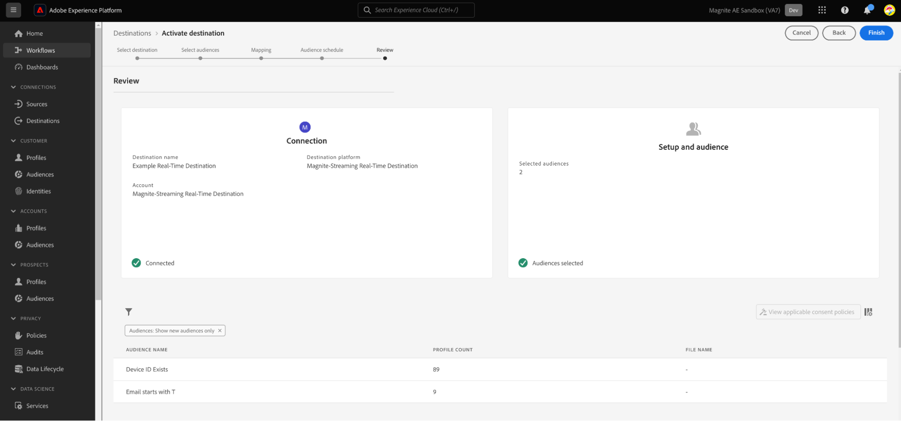

# (Beta) Magnite Streaming: conexão de destino em tempo real

## Visão geral {#overview}

Os destinos [!DNL Magnite Streaming: Real-Time] e Magnite Streaming: Batch no Adobe Experience Platform ajudam a mapear e exportar públicos para direcionamento e ativação na plataforma Magnite Streaming.

A ativação de públicos para a plataforma [!DNL Magnite Streaming] é um processo de duas etapas que requer o uso dos destinos Magnite Streaming: Tempo Real e Magnite Streaming: Lote.

Para ativar os públicos para [!DNL Magnite Streaming], você deve:

* Ative os públicos no destino [!DNL Magnite Streaming: Real-Time], conforme mostrado nesta página.
* Ative o mesmo público no destino Magnite Streaming: Batch. O destino [!DNL Magnite Streaming: Batch] é um componente obrigatório. Falha ao ativar o público no [!DNL Magnite Streaming] Destino do lote resultará em uma falha de integração e seus públicos-alvo não serão ativados.

Observação: ao usar o destino em Tempo real, o [!DNL Magnite: Streaming] receberá públicos em tempo real, mas só poderemos armazenar temporariamente públicos em tempo real em nossa plataforma, e eles serão removidos do nosso sistema em alguns dias. Por isso, se você quiser usar o destino Magnite: Streaming em Tempo Real, *também* precisará usar o destino Magnite Streaming: Batch - cada público-alvo ativado para o destino em Tempo Real, você também precisará ativar para o destino Batch.

>[!IMPORTANT]
>
>Este conector de destino está na versão beta e só está disponível para clientes selecionados. Para solicitar acesso, entre em contato com o representante da Adobe.
>
>O conector de destino e a página de documentação são criados e mantidos pela equipe [!DNL Magnite]. Para qualquer consulta ou solicitação de atualização, contate-os diretamente em `adobe-tech@magnite.com`.

## Casos de uso {#use-cases}

Para ajudá-lo a entender melhor como e quando você deve usar o destino [!DNL Magnite Streaming: Real-Time], veja um exemplo de caso de uso que os clientes da Adobe Experience Platform podem resolver usando esse destino.

### Ativação e direcionamento {#activation-and-targeting}

Essa integração com a Magnite permite que os clientes transmitam seus públicos de CDP do Adobe Experience Platform para a Magnite para direcionamento de publicidade. Os públicos podem ser selecionados no Magnite para direcionamento positivo e negativo (supressão).

## Pré-requisitos {#prerequisites}

Para usar os destinos [!DNL Magnite] no Adobe Experience Platform, primeiro você deve ter uma conta [!DNL Magnite Streaming]. Se você tiver uma conta [!DNL Magnite Streaming], entre em contato com seu gerente de conta [!DNL Magnite] para receber as credenciais para acessar os destinos [!DNL Magnite's].
Se você não tiver uma conta [!DNL Magnite Streaming], entre em contato com adobe-tech@magnite.com

## Identidades suportadas {#supported-identities}

O destino [!DNL Magnite Streaming: Real-Time] dá suporte à ativação das identidades descritas na tabela abaixo. Saiba mais sobre [identidades](/help/identity-service/features/namespaces.md).

| Identidade de destino | Descrição | Considerações |
|-------------------|--------------------------------------------------------------------------------------------------|--------------------------------------------------------------------------------------|
| device_id | Um identificador exclusivo de um dispositivo ou identidade. Aceitamos qualquer ID de dispositivo e ID própria, independentemente do tipo. | Os tipos de identidade compatíveis incluem, entre outros, PPUID, GAID, IDFA e IDs de dispositivo de TV. |

{style="table-layout:auto"}

## Públicos-alvo compatíveis {#supported-audiences}

Esta seção descreve que tipo de público-alvo você pode exportar para esse destino.

| Origem do público | Suportado | Descrição |
|-----------------------------|----------|----------|
| [!DNL Segmentation Service] | ✓ | Públicos gerados por meio do [Serviço de segmentação](../../../segmentation/home.md) do Experience Platform. |
| Uploads personalizados | ✓ | Públicos [importados](../../../segmentation/ui/audience-portal.md#import-audience) para o Experience Platform de arquivos CSV. |

{style="table-layout:auto"}

## Tipo e frequência de exportação {#export-type-frequency}

Consulte a tabela abaixo para obter informações sobre o tipo e a frequência da exportação de destino.

| Item | Tipo | Notas |
|------------------|---------------------------------|------------------------------------------------------------------------------------------------------------------------------------------------------------------------------------------------------------------------------------------------------------------------------------------------------------------------------------|
| Tipo de exportação | **[!UICONTROL Exportação de segmentos]** | Você está exportando todos os membros de um segmento (público) com os identificadores (nome, número de telefone ou outros) usados no destino [!DNL Magnite Streaming: Real-Time]. |
| Frequência de exportação | **[!UICONTROL Streaming]** | Os destinos de transmissão são conexões baseadas em API &quot;sempre ativas&quot;. Assim que um perfil é atualizado em Experience Platform com base na avaliação do segmento, o conector envia a atualização downstream para a plataforma de destino. Leia mais sobre [destinos de streaming](/help/destinations/destination-types.md#streaming-destinations). |

{style="table-layout:auto"}

## Conectar ao destino {#connect}

>[!IMPORTANT]
>
>Para se conectar ao destino, você precisa da **[!UICONTROL Exibir destinos]** e **[!UICONTROL Gerenciar destinos]** [permissão de controle de acesso](/help/access-control/home.md#permissions). Leia a [visão geral do controle de acesso](/help/access-control/ui/overview.md) ou contate o administrador do produto para obter as permissões necessárias.

Para se conectar a este destino, siga as etapas descritas no [tutorial de configuração de destino](../../ui/connect-destination.md). No workflow de configuração de destino, preencha os campos listados nas duas seções abaixo.

### Autenticar para o destino {#authenticate}

Para autenticar no destino, preencha os campos obrigatórios e selecione **[!UICONTROL Conectar ao destino]**.

* **[!UICONTROL Nome de usuário]**: o nome de usuário fornecido a você por [!DNL Magnite].
* **[!UICONTROL Senha]**: a senha fornecida por [!DNL Magnite].

### Preencher detalhes do destino {#destination-details}

Para configurar detalhes para o destino, preencha os campos obrigatórios e opcionais abaixo. Um asterisco ao lado de um campo na interface do usuário indica que o campo é obrigatório.

* **[!UICONTROL Nome]**: um nome pelo qual você reconhecerá este destino no futuro.
* **[!UICONTROL Descrição]**: uma descrição que ajudará você a identificar este destino no futuro.
* **[!UICONTROL Nome do parceiro de origem]**: o nome do cliente/empresa. Somente os clientes [!DNL Magnite Streaming] com suporte estão disponíveis para seleção.

Depois de concluído, selecione o botão **[!UICONTROL Criar]**.

### Ativar alertas {#enable-alerts}

Você pode ativar os alertas para receber notificações sobre o status do fluxo de dados para o seu destino. Selecione um alerta na lista para assinar e receber notificações sobre o status do seu fluxo de dados. Para obter mais informações sobre alertas, consulte o manual sobre [assinatura de alertas de destinos usando a interface](../../ui/alerts.md).

Quando terminar de fornecer detalhes da conexão de destino, selecione **[!UICONTROL Avançar]**.

## Ativar segmentos para este destino {#activate}

>[!IMPORTANT]
>
>* Para ativar dados, você precisa de **[!UICONTROL Exibir destinos]**, **[!UICONTROL Ativar destinos]**, **[!UICONTROL Exibir perfis]** e **[!UICONTROL Exibir segmentos]** [permissões de controle de acesso](/help/access-control/home.md#permissions). Leia a [visão geral do controle de acesso](/help/access-control/ui/overview.md) ou contate o administrador do produto para obter as permissões necessárias.
>* Para exportar *identidades*, você precisa da **[!UICONTROL permissão Exibir Gráfico de Identidade]** [controle de acesso](/help/access-control/home.md#permissions).   {width="100" zoomable="yes"}

Leia [Ativar perfis e segmentos para destinos de exportação de segmento de streaming](/help/destinations/ui/activate-segment-streaming-destinations.md) para obter instruções sobre como ativar segmentos de público para este destino.

Depois de criar a conexão de destino, você pode prosseguir para o fluxo de ativação de público. A seção a seguir mostra como ativar públicos-alvo usando o destino em tempo real.

### Mapear atributos e identidades {#map}

A próxima etapa é mapear identificadores de origem para o identificador device_id Magnite.

* Você pode adicionar quantos mapeamentos forem necessários selecionando **[!UICONTROL Adicionar novo mapeamento]**.

Este exemplo usando o destino em Tempo real mostra uma linha que contém um identificador de origem deviceId genérico mapeado para o campo de destino Magnite device_id. Quando estiver usando os mapeamentos, selecione [!UICONTROL Avançar].

Defina as IDs de mapeamento para todos os públicos ativados ou defina NENHUM se nenhuma ID de mapeamento estiver presente.

Agora você deve configurar uma Data inicial (obrigatória), uma Data final (opcional) e uma ID de mapeamento para cada público-alvo.

**ID de Mapeamento**

* Use o campo **[!UICONTROL ID de Mapeamento]** quando um público tiver uma ID de Segmento pré-existente conhecida anteriormente pela Magnite.

* Para adicionar uma **[!UICONTROL ID de Mapeamento]** a um público-alvo, selecione cada linha de público-alvo individualmente e insira os dados na coluna à direita (veja a imagem acima). Se não quiser adicionar uma ID de mapeamento, digite NONE no campo ID de mapeamento.

Selecione **[!UICONTROL Avançar]** e finalize o fluxo de ativação.

## Dados exportados / Validar exportação de dados {#exported-data}

Depois que os públicos-alvo forem carregados, você poderá validar se os públicos-alvo foram criados e carregados corretamente seguindo estas etapas:

<!--

* In 95% of cases, audiences will be delivered to Magnite Streaming in under 10 minutes. The actual receipt and processing of the events within Magnite Streaming depends on the shared data volume.

-->

* A assimilação de públicos pela Post deve aparecer em [!DNL Magnite Streaming] dentro de alguns minutos e pode ser aplicada a uma oferta. Você pode confirmar isso verificando a ID do segmento que foi compartilhada durante as etapas de ativação no Adobe Experience Platform.

## Ativar os mesmos públicos-alvo por meio do destino [!DNL Magnite Streaming: Batch]

Os públicos-alvo compartilhados com [!DNL Magnite Streaming] usando o destino em tempo real também precisarão ser compartilhados usando o destino Magnite Streaming: Batch. Quando configurados corretamente, os nomes de segmentos na interface do usuário do [!DNL Magnite Streaming] são atualizados para refletir aqueles usados na atualização pós-diária do Adobe Experience Platform.

Por fim, se um destino Batch não tiver sido configurado para sua integração, configure-o agora por meio do documento Magnite Streaming: Batch destination.

## Uso e governança de dados {#data-usage-governance}

Todos os destinos do [!DNL Adobe Experience Platform] são compatíveis com as políticas de uso de dados ao manipular seus dados. Para obter informações detalhadas sobre como o [!DNL Adobe Experience Platform] fiscaliza a governança de dados, leia a [Visão geral da Governança de Dados](/help/data-governance/home.md).

## Recursos adicionais {#additional-resources}

Para obter a documentação de ajuda adicional, visite a [Magnite Help Center](https://help.magnite.com/help).
