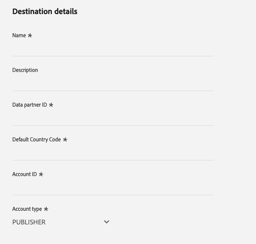
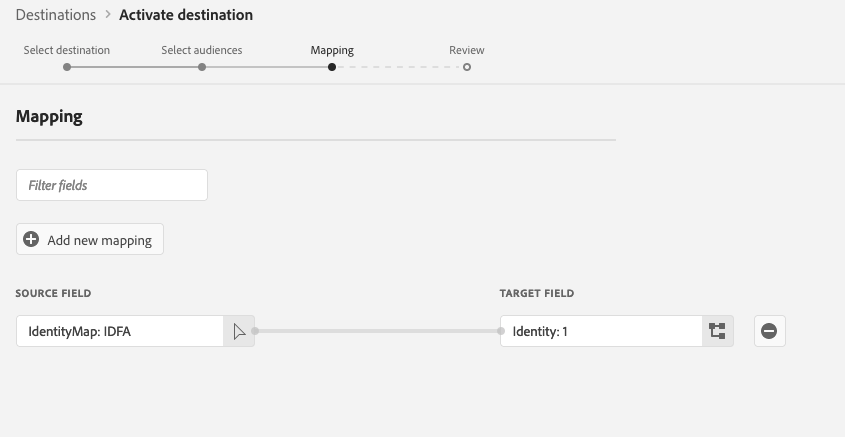

# Destino do PubMatic Connect {#pubmatic-connect}

## Visão geral {#overview}

Uso [!DNL PubMatic Connect] maximizar o valor para o cliente fornecendo a cadeia de suprimento de marketing digital programática do futuro. [!DNL PubMatic Connect] O combina a tecnologia de plataforma e o serviço dedicado para aprimorar o modo como o inventário e os dados são embalados e transacionados.

Use este destino para enviar dados de público-alvo para a [!DNL PubMatic Connect] plataforma.

>[!IMPORTANT]
>
>O conector de destino e a página de documentação são criados e mantidos pelo [!DNL PubMatic] equipe. Para qualquer consulta ou solicitação de atualização, entre em contato diretamente em `support@pubmatic.com`.

## Casos de uso {#use-cases}

Para ajudá-lo a entender melhor como e quando você deve usar o [!DNL PubMatic Connect] destino, este é um exemplo de caso de uso que os clientes do Adobe Experience Platform podem resolver usando esse destino.

### Direcionamento de usuários em plataformas móveis, da Web e de CTV {#targeting}

Os editores ou provedores de dados desejam enviar públicos-alvo do Adobe Experience Platform para o [!DNL PubMatic Connect] para direcionar usuários em plataformas móveis, da Web e de CTV, usando uma grande variedade de identificadores.

## Pré-requisitos {#prerequisites}

Fale com o seu [!DNL PubMatic] Gerente de contas para garantir que sua conta esteja configurada corretamente e seja compatível com a integração de segmentos de público-alvo. Eles também garantirão que você tenha todos os detalhes relevantes para usar esse destino e fornecer suporte durante a configuração.

## Identidades suportadas {#supported-identities}

[!DNL PubMatic Connect] O oferece suporte à ativação das identidades descritas na tabela abaixo. Saiba mais sobre [identidades](/help/identity-service/features/namespaces.md).

| Identidade de destino | Descrição | Considerações |
| --------------- | ------ | --- |
| GAID | GOOGLE ADVERTISING ID | Selecione a identidade de destino GAID quando a identidade de origem for um namespace GAID. |
| IDFA | Apple ID para anunciantes | Selecione a identidade de destino do IDFA quando a identidade de origem for um namespace do IDFA. |
| extern_id | IDs de usuário personalizadas | Selecione esta identidade de destino quando sua identidade de origem for um namespace personalizado. |

{style="table-layout:auto"}

## Públicos-alvo compatíveis {#supported-audiences}

Esta seção descreve que tipo de público-alvo você pode exportar para esse destino.

| Origem do público | Suportado | Descrição |
| --- | --------- | ------ |
| [!DNL Segmentation Service] | ✓ | Públicos-alvo gerados pelo Experience Platform [Serviço de segmentação](../../../segmentation/home.md). |
| Uploads personalizados | ✓ | Públicos-alvo [importado](../../../segmentation/ui/audience-portal.md#import-audience) para o Experience Platform de arquivos CSV. |

{style="table-layout:auto"}

## Tipo e frequência de exportação {#export-type-frequency}

Consulte a tabela abaixo para obter informações sobre o tipo e a frequência da exportação de destino.

| Item | Tipo | Notas |
| --- | --- | --- |
| Tipo de exportação | **[!UICONTROL Exportação de segmentos]** | Você está exportando todos os membros de um segmento (público-alvo) com os identificadores (nome, número de telefone ou outros) usados no destino do PubMatic Connect. |
| Frequência de exportação | **[!UICONTROL Streaming]** | Os destinos de transmissão são conexões baseadas em API &quot;sempre ativas&quot;. Quando um perfil é atualizado em Experience Platform com base na avaliação do segmento, o conector envia a atualização downstream para a plataforma de destino. Leia mais sobre [destinos de transmissão](/help/destinations/destination-types.md#streaming-destinations). |

{style="table-layout:auto"}

## Conectar ao destino {#connect}

>[!IMPORTANT]
>
> Para se conectar ao destino, você precisa da variável **[!UICONTROL Gerenciar destinos]** [permissão de controle de acesso](/help/access-control/home.md#permissions). Leia o [visão geral do controle de acesso](/help/access-control/ui/overview.md) ou entre em contato com o administrador do produto para obter as permissões necessárias.

Para se conectar a esse destino, siga as etapas descritas no [tutorial de configuração de destino](../../ui/connect-destination.md). No workflow da configuração de destino, preencha os campos listados nas duas seções abaixo.

### Autenticar para o destino {#authenticate}

Para autenticar no destino, preencha os campos obrigatórios e selecione **[!UICONTROL Conectar ao destino]**.

- **[!UICONTROL Token de portador]**: Preencha o token do portador para autenticar no destino.

### Preencher detalhes do destino {#destination-details}

Para configurar detalhes para o destino, preencha os campos obrigatórios e opcionais abaixo. Um asterisco ao lado de um campo na interface do usuário indica que o campo é obrigatório.

- **[!UICONTROL Nome]**: um nome pelo qual você reconhecerá esse destino no futuro.
- **[!UICONTROL Descrição]**: uma descrição que ajudará você a identificar esse destino no futuro.
- **[!UICONTROL ID do parceiro de dados]**: a ID do parceiro de dados configurada no [!DNL PubMatic] conta para essa integração.
- **[!UICONTROL Código de país padrão]**: o código de país padrão que deve ser aplicado a todas as identidades, se nenhuma for fornecida no perfil.
- **[!UICONTROL ID da conta]**: Seu [!DNL PubMatic Connect] ID da conta.
- **[!UICONTROL Tipo de conta]**: o tipo da conta do [!DNL PubMatic] conta da plataforma. Fale com o seu [!DNL PubMatic] gerente de conta, se tiver dúvidas sobre a qual escolher. As opções disponíveis são:
   - [!UICONTROL EDITOR]
   - [!UICONTROL DEMAND_PARTNER]
   - [!UICONTROL COMPRADOR]

### Ativar alertas {#enable-alerts}

Você pode ativar os alertas para receber notificações sobre o status do fluxo de dados para o seu destino. Selecione um alerta na lista para assinar e receber notificações sobre o status do seu fluxo de dados. Para obter mais informações sobre alertas, consulte o manual sobre [assinatura de alertas de destinos usando a interface do](../../ui/alerts.md).

Quando terminar de fornecer detalhes da conexão de destino, selecione **[!UICONTROL Próxima]**.

## Ativar segmentos para este destino {#activate}

>[!IMPORTANT]
>
> - Para ativar os dados, é necessário **[!UICONTROL Exibir destinos]**, **[!UICONTROL Ativar destinos]**, **[!UICONTROL Exibir perfis]**, e **[!UICONTROL Exibir segmentos]** [permissões de controle de acesso](/help/access-control/home.md#permissions). Leia o [visão geral do controle de acesso](/help/access-control/ui/overview.md) ou entre em contato com o administrador do produto para obter as permissões necessárias.
>
> - Para exportar _identidades_, você precisará do **[!UICONTROL Exibir gráfico de identidade]** [permissão de controle de acesso](/help/access-control/home.md#permissions).   {width="100" zoomable="yes"}

Ler [Ativar perfis e segmentos para destinos de exportação de segmento de transmissão](/help/destinations/ui/activate-segment-streaming-destinations.md) para obter instruções sobre como ativar segmentos de público-alvo para esse destino.

### Mapear atributos e identidades {#map}

Selecionar campos de origem:

- Selecione um identificador (geralmente namespaces, como IDFA ou um namespace de ID personalizada).

Selecionar campos de destino:

- Fale com o seu [!DNL PubMatic] Gerente de contas para obter as informações sobre qual tipo de UID estará correto durante essa etapa.
- Selecione o [!DNL PubMatic UID] digite um número que corresponda ao identificador selecionado na primeira etapa.

## Dados exportados / Validar exportação de dados {#exported-data}

A variável [!DNL PubMatic] A interface permite verificar se os dados foram enviados corretamente e se os segmentos estão disponíveis. Pode levar até 24 horas após os dados serem enviados para a [!DNL PubMatic] Interface do usuário a ser atualizada.

## Uso e governança de dados {#data-usage-governance}

Todos [!DNL Adobe Experience Platform] os destinos estão em conformidade com as políticas de uso de dados ao manipular seus dados. Para obter informações detalhadas sobre como [!DNL Adobe Experience Platform] fiscaliza a governança de dados, leia o [Visão geral da governança de dados](/help/data-governance/home.md).
