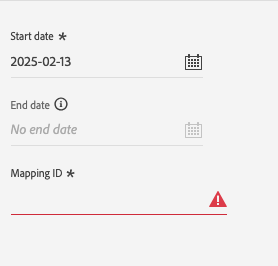

# Destino do PubMatic Connect {#pubmatic-connect}

## Visão geral {#overview}

Use o [!DNL PubMatic Connect] para maximizar o valor para o cliente, fornecendo a supply chain de marketing digital programática do futuro. A [!DNL PubMatic Connect] combina tecnologia de plataforma e serviço dedicado para aprimorar o modo como o inventário e os dados são embalados e transacionados.

Há dois destinos disponíveis que permitem enviar dados de público-alvo para a plataforma PubMatic Connect. Elas diferem levemente em sua funcionalidade:

1. PubMatic Connect

   Durante a ativação inicial, esse destino registrará automaticamente os públicos-alvo na plataforma PubMatic e usará a Adobe Experience Platform ID interna para mapeamento.

2. PubMatic Connect (Mapeamento de ID de público-alvo personalizado)

   Esse destino permitirá optar por adicionar manualmente uma ID de mapeamento durante o workflow de ativação. Use esse destino quando os dados precisarem ser enviados para públicos-alvo existentes na plataforma PubMatic ou se uma &quot;ID de público-alvo do Source&quot; personalizada for necessária.

>[!IMPORTANT]
>
> O conector de destino e a página de documentação são criados e mantidos pela equipe [!DNL PubMatic]. Para qualquer consulta ou solicitação de atualização, contate-os diretamente em `support@pubmatic.com`.

## Casos de uso {#use-cases}

Para ajudá-lo a entender melhor como e quando você deve usar o destino [!DNL PubMatic Connect], veja um exemplo de caso de uso que os clientes da Adobe Experience Platform podem resolver usando esse destino.

### Direcionamento de usuários em plataformas móveis, da Web e de CTV {#targeting}

Os editores ou provedores de dados desejam enviar públicos-alvo do Adobe Experience Platform para o [!DNL PubMatic Connect] para usuários-alvo em plataformas móveis, da Web e de CTV, usando uma grande variedade de identificadores.

## Pré-requisitos {#prerequisites}

Fale com o Gerente de conta do [!DNL PubMatic] para verificar se a sua conta está configurada corretamente e oferece suporte à integração de segmentos de público-alvo. Eles também garantirão que você tenha todos os detalhes relevantes para usar esse destino e fornecer suporte durante a configuração.

## Identidades suportadas {#supported-identities}

[!DNL PubMatic Connect] dá suporte à ativação das identidades descritas na tabela abaixo. Saiba mais sobre [identidades](/help/identity-service/features/namespaces.md).

| Identidade de destino | Descrição | Considerações |
| --------------- | ------------------------ | ------------------------------------------------------------------------------- |
| GAID | GOOGLE ADVERTISING ID | Selecione a identidade de destino GAID quando a identidade de origem for um namespace GAID. |
| IDFA | Apple ID para anunciantes | Selecione a identidade de destino do IDFA quando a identidade de origem for um namespace do IDFA. |
| extern_id | IDs de usuário personalizadas | Selecione esta identidade de destino quando sua identidade de origem for um namespace personalizado. |

{style="table-layout:auto"}

## Públicos-alvo compatíveis {#supported-audiences}

Esta seção descreve que tipo de público-alvo você pode exportar para esse destino.

| Origem do público | Suportado | Descrição |
|---------|----------|----------|
| [!DNL Segmentation Service] | Sim | Públicos-alvo gerados pelo [Serviço de Segmentação](../../../segmentation/home.md) da Experience Platform. |
| Todas as outras origens de público-alvo | Não | Esta categoria inclui todas as origens de público-alvo fora dos públicos-alvo gerados pelo [!DNL Segmentation Service]. Leia sobre as [várias origens do público-alvo](/help/segmentation/ui/audience-portal.md#customize). Alguns exemplos incluem: <ul><li> carregar audiências personalizadas [importadas](../../../segmentation/ui/audience-portal.md#import-audience) para o Experience Platform de arquivos CSV,</li><li> públicos-alvo semelhantes, </li><li> públicos federados, </li><li> públicos-alvo gerados em outros aplicativos da Experience Platform, como o Adobe Journey Optimizer, </li><li> e muito mais. </li></ul> |

{style="table-layout:auto"}

Públicos-alvo compatíveis por tipo de dados de público-alvo:

| Tipo de dados de público | Suportado | Descrição | Casos de uso |
|--------------------|-----------|-------------|-----------|
| [Públicos-alvo](/help/segmentation/types/people-audiences.md) | Sim | Com base nos perfis de clientes, permitindo direcionar grupos específicos de pessoas para campanhas de marketing. | Compradores frequentes, abandonadores de carrinho |
| [Públicos-alvo da conta](/help/segmentation/types/account-audiences.md) | Não | Direcione indivíduos em organizações específicas para estratégias de marketing baseadas em conta. | Marketing B2B |
| [Públicos-alvo potenciais](/help/segmentation/types/prospect-audiences.md) | Não | Direcione indivíduos que ainda não são clientes, mas compartilham características com seu público-alvo. | Prospecção com dados de terceiros |
| [Exportações do conjunto de dados](/help/catalog/datasets/overview.md) | Não | Coleções de dados estruturados armazenados no Data Lake do Adobe Experience Platform. | Relatórios, fluxos de trabalho de ciência de dados |

{style="table-layout:auto"}

## Tipo e frequência de exportação {#export-type-frequency}

Consulte a tabela abaixo para obter informações sobre o tipo e a frequência da exportação de destino.

| Item | Tipo | Notas |
| ---------------- | ------------------------------- | ---------------------------------------------------------------------------------------------------------------------------------------------------------------------------------------------------------------------------------------------------------------------------------------------------------------------------- |
| Tipo de exportação | **[!UICONTROL Segment export]** | Você está exportando todos os membros de um segmento (público-alvo) com os identificadores (nome, número de telefone ou outros) usados no destino do PubMatic Connect. |
| Frequência de exportação | **[!UICONTROL Streaming]** | Os destinos de transmissão são conexões baseadas em API &quot;sempre ativas&quot;. Quando um perfil é atualizado no Experience Platform com base na avaliação do segmento, o conector envia a atualização downstream para a plataforma de destino. Leia mais sobre [destinos de streaming](/help/destinations/destination-types.md#streaming-destinations). |

{style="table-layout:auto"}

## Conectar ao destino {#connect}

>[!IMPORTANT]
>
> Para se conectar ao destino, você precisa da **[!UICONTROL Manage Destinations]** [permissão de controle de acesso](/help/access-control/home.md#permissions). Leia a [visão geral do controle de acesso](/help/access-control/ui/overview.md) ou contate o administrador do produto para obter as permissões necessárias.

Para se conectar a este destino, siga as etapas descritas no [tutorial de configuração de destino](../../ui/connect-destination.md). No workflow da configuração de destino, preencha os campos listados nas duas seções abaixo.

### Autenticar para o destino {#authenticate}

Para autenticar no destino, preencha os campos obrigatórios e selecione **[!UICONTROL Connect to destination]**.

- **[!UICONTROL Bearer token]**: Preencha o token do portador para autenticar no destino.

### Preencher detalhes do destino {#destination-details}

Para configurar detalhes para o destino, preencha os campos obrigatórios e opcionais abaixo. Um asterisco ao lado de um campo na interface do usuário indica que o campo é obrigatório.

- **[!UICONTROL Name]**: Um nome pelo qual você reconhecerá este destino no futuro.
- **[!UICONTROL Description]**: uma descrição que ajudará você a identificar este destino no futuro.
- **[!UICONTROL Data partner ID]**: a ID do parceiro de dados configurada na sua conta do [!DNL PubMatic] para essa integração.
- **[!UICONTROL Default country code]**: o código de país padrão que deve ser aplicado a todas as identidades, se nenhuma for fornecida no perfil.
- **[!UICONTROL Account ID]**: Sua ID de conta do [!DNL PubMatic Connect].
- **[!UICONTROL Account type]**: o tipo da sua conta da plataforma [!DNL PubMatic]. Fale com o gerente de conta do [!DNL PubMatic] se tiver dúvidas sobre a qual escolher. As opções disponíveis são:
   - [!UICONTROL PUBLISHER]
   - [!UICONTROL DEMAND_PARTNER]
   - [!UICONTROL BUYER]

### Ativar alertas {#enable-alerts}

Você pode ativar os alertas para receber notificações sobre o status do fluxo de dados para o seu destino. Selecione um alerta na lista para assinar e receber notificações sobre o status do seu fluxo de dados. Para obter mais informações sobre alertas, consulte o manual sobre [assinatura de alertas de destinos usando a interface](../../ui/alerts.md).

Quando terminar de fornecer detalhes da conexão de destino, selecione **[!UICONTROL Next]**.

## Ativar segmentos para este destino {#activate}

>[!IMPORTANT]
>
> - Para ativar dados, você precisa das **[!UICONTROL View Destinations]**, **[!UICONTROL Activate Destinations]**, **[!UICONTROL View Profiles]** e **[!UICONTROL View Segments]** [permissões de controle de acesso](/help/access-control/home.md#permissions). Leia a [visão geral do controle de acesso](/help/access-control/ui/overview.md) ou contate o administrador do produto para obter as permissões necessárias.
>
> - Para exportar _identidades_, você precisa da **[!UICONTROL View Identity Graph]** [permissão de controle de acesso](/help/access-control/home.md#permissions).   {width="100" zoomable="yes"}

Leia [Ativar perfis e segmentos para destinos de exportação de segmento de streaming](/help/destinations/ui/activate-segment-streaming-destinations.md) para obter instruções sobre como ativar segmentos de público para este destino.

### Mapear atributos e identidades {#map}

Selecionar campos de origem:

- Selecione um identificador (geralmente namespaces, como IDFA ou um namespace de ID personalizada).

Selecionar campos de destino:

- Fale com o Gerente de Conta do [!DNL PubMatic] para obter as informações sobre o tipo de UID que será correto durante esta etapa.
- Selecione o número do tipo [!DNL PubMatic UID] que corresponda ao identificador selecionado na primeira etapa.

### Agendamento de público

Se você estiver usando o destino PubMatic Connect (Mapeamento de ID de público-alvo personalizado), é necessário fornecer uma ID de mapeamento para cada público-alvo que corresponda à &quot;ID de público-alvo do Source&quot; na plataforma PubMatic.

## Dados exportados / Validar exportação de dados {#exported-data}

A interface do usuário do [!DNL PubMatic] permite verificar se os dados foram enviados corretamente e se os segmentos estão disponíveis. Pode levar até 24 horas após os dados terem sido enviados para a interface do usuário do [!DNL PubMatic] ser atualizada.

## Uso e governança de dados {#data-usage-governance}

Todos os destinos do [!DNL Adobe Experience Platform] são compatíveis com as políticas de uso de dados ao manipular seus dados. Para obter informações detalhadas sobre como o [!DNL Adobe Experience Platform] fiscaliza a governança de dados, leia a [Visão geral da Governança de Dados](/help/data-governance/home.md).
