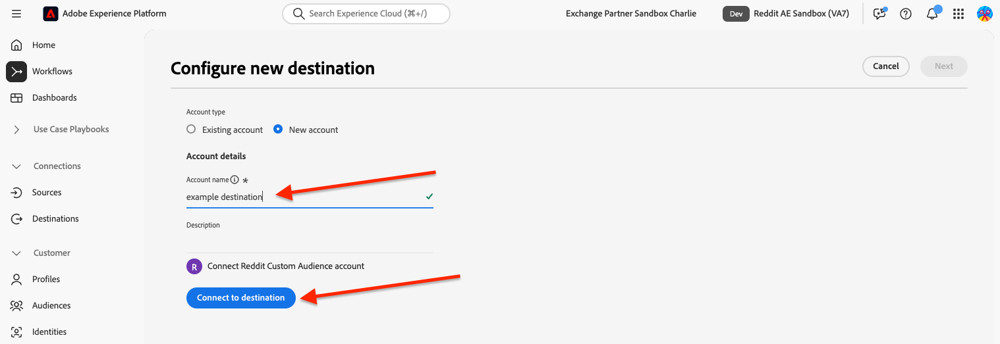
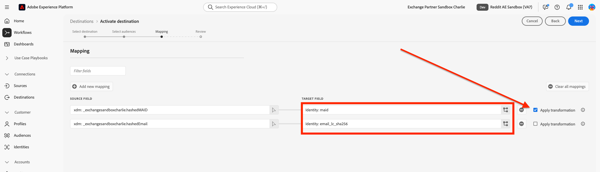
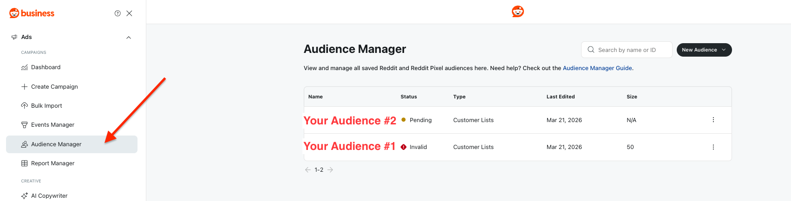

# [!DNL Reddit Custom Audience] conexão {#reddit-custom-audience-connection}

## Visão geral {#overview}

[!DNL Reddit Ads] conecta marcas a pessoas que estão explorando ativamente suas paixões e problemas em tempo real. Ao emparelhar conversas de alta intenção conduzidas pela comunidade com formatos de anúncio flexíveis e direcionamento robusto, o [!DNL Reddit Ads] ajuda os anunciantes a alcançar públicos engajados, impulsionar resultados de desempenho e aprender diretamente das comunidades que moldam a cultura online.

Este guia é para anunciantes e equipes de mídia que usam o [!DNL Adobe Experience Platform] para enviar públicos para o [!DNL Reddit Ads]. Ele aborda o que é necessário para conectar suas contas, mapear identidades e ativar públicos.

>[!IMPORTANT]
>
>Esse conector de destino e a página de documentação são criados e mantidos pela equipe [!DNL Reddit]. Para qualquer consulta ou solicitação de atualização, contate-os diretamente em <adsapi-partner-support@reddit.com>.

## Casos de uso {#use-cases}

Para ajudá-lo a entender melhor como e quando você deve usar o destino [!DNL Reddit Custom Audience], veja a seguir exemplos de casos de uso que os clientes do [!DNL Adobe Experience Platform] podem resolver usando esse destino.

### Redirecionamento de clientes existentes com ofertas personalizadas {#use-case-1}

Uma retailer online deseja alcançar os clientes existentes por meio de plataformas sociais e mostrar ofertas personalizadas com base em seus pedidos anteriores. A retailer online pode assimilar endereços de email e IDs de dispositivo (IDFA e GAID) de seu próprio CRM para [!DNL Adobe Experience Platform], criar públicos a partir de seus próprios dados offline e enviar esses públicos para [!DNL Reddit Ads], otimizando seus gastos com publicidade.

## Pré-requisitos {#prerequisites}

Antes de configurar esse destino, verifique se os seguintes pré-requisitos estão sendo atendidos:

* Uma conta do [!DNL Reddit Ads] que tem permissão para usar públicos-alvo e listas de clientes personalizadas.
* Permissão para autorizar a conexão. Deve ser um usuário que possa entrar no [!DNL Reddit] e aprovar o acesso de [!DNL Experience Platform] para gerenciar públicos-alvo em nome da conta de anúncio.
* Sua ID de conta de anúncio [!DNL Reddit]: o identificador da conta de anúncio em que os públicos-alvo são criados. Você pode encontrar sua ID de conta de anúncio em [Contas](https://ads.reddit.com/accounts). Por exemplo: `a2_1b2c34d`.

## Identidades suportadas {#supported-identities}

[!DNL Reddit Custom Audience] dá suporte à ativação das identidades descritas na tabela abaixo. Saiba mais sobre [identidades](/help/identity-service/features/namespaces.md).

| Identidade de destino | Descrição | Considerações |
| --- | --- | --- |
| email_lc_sha256 | Endereços de email com hash com o algoritmo SHA256 | O [!DNL Adobe Experience Platform] oferece suporte para endereços de email com hash SHA256 e texto sem formatação. Quando o campo de origem contiver atributos sem hash, marque a opção **[!UICONTROL Apply transformation]** para que o [!DNL Platform] coloque os dados em hash automaticamente na ativação. |
| empregada | Google Advertising ID ou Apple ID para anunciantes, ambos com hash com o algoritmo SHA256 | Mapeie GAID ou IDFA para **empregada**. Quando o campo de origem contiver atributos sem hash, marque a opção **[!UICONTROL Apply transformation]** para que o [!DNL Platform] coloque os dados em hash automaticamente na ativação. |

{style="table-layout:auto"}

## Públicos-alvo compatíveis {#supported-audiences}

Esta seção descreve quais tipos de públicos-alvo você pode exportar para esse destino.

| Origem do público | Suportado | Descrição |
| --- | --- | --- |
| [!DNL Segmentation Service] | Sim | Públicos gerados por meio do [!DNL Experience Platform] [Serviço de segmentação](../../../segmentation/home.md). |
| Todas as outras origens de público-alvo | Sim | Esta categoria inclui todas as origens de público-alvo fora dos públicos-alvo gerados pelo serviço de segmentação. Leia sobre as [várias origens do público-alvo](/help/segmentation/ui/audience-portal.md#customize). |

{style="table-layout:auto"}

Públicos-alvo compatíveis por tipo de dados:

| Tipo de dados de público | Suportado | Descrição | Casos de uso |
| --- | --- | --- | --- |
| [Públicos-alvo](/help/segmentation/types/people-audiences.md) | Sim | Com base nos perfis de clientes, permitindo direcionar grupos específicos de pessoas para campanhas de marketing. | Compradores frequentes, abandonadores de carrinho |
| [Públicos-alvo da conta](/help/segmentation/types/account-audiences.md) | Não | Direcione indivíduos em organizações específicas para estratégias de marketing baseadas em conta. | Marketing B2B |
| [Públicos-alvo potenciais](/help/segmentation/types/prospect-audiences.md) | Não | Direcione indivíduos que ainda não são clientes, mas compartilham características com seu público-alvo. | Prospecção com dados de terceiros |
| [Exportações do conjunto de dados](/help/catalog/datasets/overview.md) | Não | Coleções de dados estruturados armazenados no Data Lake [!DNL Adobe Experience Platform]. | Relatórios, fluxos de trabalho de ciência de dados |

{style="table-layout:auto"}

## Tipo e frequência de exportação {#export-type-frequency}

Consulte a tabela abaixo para obter informações sobre o tipo e a frequência da exportação de destino.

| Item | Tipo | Notas |
| --- | --- | --- |
| Tipo de exportação | **[!UICONTROL Audience export]** | Você está exportando todos os membros de um público com os identificadores (nome, número de telefone ou outros) usados no destino [!DNL Reddit Custom Audience]. |
| Frequência de exportação | **[!UICONTROL Streaming]** | Os destinos de transmissão são conexões baseadas em API &quot;sempre ativas&quot;. Assim que um perfil for atualizado no Experience Platform com base na avaliação do público-alvo, o conector enviará a atualização downstream para a plataforma de destino. Leia mais sobre [destinos de streaming](/help/destinations/destination-types.md#streaming-destinations). |

{style="table-layout:auto"}

## Conectar ao destino {#connect}

>[!IMPORTANT]
>
>Para se conectar ao destino, você precisa das **[!UICONTROL View Destinations]** e **[!UICONTROL Manage Destinations]** [permissões de controle de acesso](/help/access-control/home.md#permissions). Leia a [visão geral do controle de acesso](/help/access-control/ui/overview.md) ou contate o administrador do produto para obter as permissões necessárias.

Para se conectar a este destino, siga as etapas descritas no [tutorial de configuração de destino](../../ui/connect-destination.md). No workflow de configuração de destino, preencha os campos listados nas duas seções abaixo.

### Autenticar para o destino {#authenticate}

Para autenticar no destino, preencha os campos obrigatórios e selecione **[!UICONTROL Connect to destination]**.



Você foi redirecionado para entrar com [!DNL Reddit]. Depois de revisar as permissões solicitadas, selecione **[!UICONTROL Allow]** para que [!DNL Experience Platform] possa criar públicos e atualizar a associação em nome de sua conta de anúncio.


### Preencher detalhes do destino {#destination-details}

Para configurar detalhes para o destino, preencha os campos obrigatórios e opcionais abaixo. Um asterisco ao lado de um campo na interface do usuário indica que o campo é obrigatório.


* **[!UICONTROL Name]**: Um nome pelo qual você reconhece este destino.
* **[!UICONTROL Description]**: uma descrição que ajuda a identificar este destino.
* **[!UICONTROL Ad Account ID]**: Sua ID de conta de anúncio [!DNL Reddit].

### Ativar alertas {#enable-alerts}

Você pode ativar os alertas para receber notificações sobre o status do fluxo de dados para o seu destino. Selecione um alerta na lista para assinar e receber notificações sobre o status do seu fluxo de dados. Para obter mais informações sobre alertas, consulte o manual sobre [assinatura de alertas de destinos usando a interface](../../ui/alerts.md).

Quando terminar de fornecer detalhes da conexão de destino, selecione **[!UICONTROL Next]**.

## Ativar públicos-alvo para esse destino {#activate}

>[!IMPORTANT]
>
>* Para ativar dados, você precisa das **[!UICONTROL View Destinations]**, **[!UICONTROL Activate Destinations]**, **[!UICONTROL View Profiles]** e **[!UICONTROL View Segments]** [permissões de controle de acesso](/help/access-control/home.md#permissions). Leia a [visão geral do controle de acesso](/help/access-control/ui/overview.md) ou contate o administrador do produto para obter as permissões necessárias.
>* Para exportar *identidades*, você precisa da **[!UICONTROL View Identity Graph]** [permissão de controle de acesso](/help/access-control/home.md#permissions). <br> {width="100" zoomable="yes"}

Leia [Ativar perfis e públicos-alvo para destinos de exportação de público-alvo de streaming](/help/destinations/ui/activate-segment-streaming-destinations.md) para obter instruções sobre como ativar públicos-alvo para este destino.

### Mapear atributos e identidades {#map}

Os seguintes namespaces de identidade de destino devem ser mapeados dependendo do caso de uso:

| Campo de origem | Campo de público alvo | Notas |
| --- | --- | --- |
| Email (texto sem formatação ou com hash) | email_lc_sha256 | O campo de origem pode ter hash ou unhash. [!DNL Reddit] aceita apenas valores com hash. Habilite **[!UICONTROL Apply transformation]** para que [!DNL Experience Platform] coloque o email em hash antes de enviar. |
| MAID (texto sem formatação ou com hash) | empregada | O campo de origem pode ter hash ou unhash. [!DNL Reddit] aceita apenas valores com hash. Habilite **[!UICONTROL Apply transformation]** para que [!DNL Experience Platform] coloque o valor em hash antes de enviar. |

Você deve mapear pelo menos uma das identidades.



## Dados exportados / Validar exportação de dados {#exported-data}

Depois de ativar os públicos-alvo, você pode vê-los na conta de Gerente de anúncios do [!DNL Reddit].

Os públicos recém-criados em [!DNL Reddit] aparecem em um estado pendente. Depois que o fluxo de dados é executado e os perfis são exportados, [!DNL Reddit] corresponde aos perfis de usuários [!DNL Reddit]. Após o processamento dos dados, o status do público será alterado para **[!UICONTROL Valid]**. O tamanho do público deve atingir [1.000 usuários ou mais](https://ads-api.reddit.com/docs/v3/manage-customer-lists) para ser considerado válido. Os públicos-alvo que não atingirem o tamanho necessário serão exibidos como **[!UICONTROL Invalid]**.



Este é um exemplo da carga enviada para [!DNL Reddit]:

```json
{
  "data": {
    "action_type": "ADD",
    "column_order": [
      "EMAIL_SHA256",
      "MAID_SHA256"
    ],
    "user_data": [
      [
        "d7ef2e7b2a3663c25284a3d6d13b1ca727fc8c659474b81afe0cec997a4737d2",
        "510870d7b3e47a28a2b2f3aef27a4c81aab0b2eefda27dea50bc4c991d9e5435"
      ]
    ]
  }
}
```

Consulte a [Documentação da API Reddit](https://ads-api.reddit.com/docs/v3/operations/Update%20Custom%20Audience%20Users) para obter mais detalhes.

## Uso e governança de dados {#data-usage-governance}

Todos os destinos do [!DNL Adobe Experience Platform] são compatíveis com as políticas de uso de dados ao manipular seus dados. Para obter informações detalhadas sobre como o [!DNL Adobe Experience Platform] fiscaliza a governança de dados, leia a [Visão geral da Governança de Dados](/help/data-governance/home.md).

## Recursos adicionais {#additional-resources}

Consulte a [Documentação da API Reddit](https://ads-api.reddit.com/docs/v3/operations/Update%20Custom%20Audience%20Users) para obter detalhes sobre como funciona o ponto de extremidade dos públicos-alvo personalizados.
