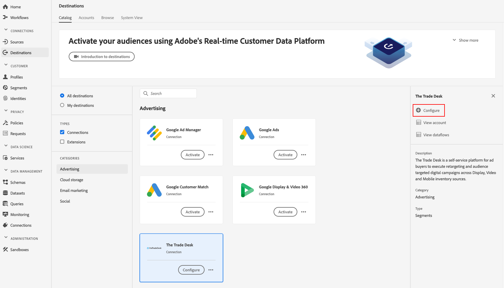

# [!DNL The Trade Desk] conexão

[!DNL The Trade Desk] o Destino ajuda a enviar dados do perfil para  [!DNL The Trade Desk].

[!DNL The Trade Desk] é uma plataforma de autoatendimento para compradores de anúncios executarem redirecionamentos e audiências digitais direcionadas para exibição, vídeo e fontes de inventário móvel.

Para enviar dados de perfil para [!DNL The Trade Desk], primeiro conecte-se ao destino.

## Especificações de destino {#destination-specs}

Observe os seguintes detalhes específicos do destino [!DNL The Trade Desk]:

* Você pode enviar as seguintes [identidades](../../../identity-service/namespaces.md) para [!DNL The Trade Desk] destinos: [!DNL The Trade Desk ID], [!DNL IDFA], [!DNL GAID].

## Casos de uso {#use-cases}

Como profissional de marketing, quero ser capaz de usar segmentos criados a partir de [!DNL Trade Desk IDs] ou IDs de dispositivo para criar redirecionamentos ou campanhas digitais direcionadas à audiência.

## Tipo de exportação {#export-type}

**[!DNL Segment export]** - você está exportando todos os membros de um segmento (audiência) para o destino.

## Conectar ao destino {#connect-destination}

Em **[!UICONTROL Conexões]** > **[!UICONTROL Destinos]**, selecione [!DNL The Trade Desk] e **[!UICONTROL Configurar]**.

>[!NOTE]
>
>Se já existir uma conexão com esse destino, você poderá ver um botão **[!UICONTROL Ativar]** no cartão de destino. Para obter mais informações sobre a diferença entre **[!UICONTROL Ativate]** e **[!UICONTROL Configure]**, consulte a seção [Catalog](../../ui/destinations-workspace.md#catalog) da documentação da área de trabalho de destino.
>
>

Na etapa [!UICONTROL Authentication], é necessário inserir [!DNL The Trade Desk] detalhes da conexão:

* **[!UICONTROL Nome]**: Um nome pelo qual você reconhecerá esse destino no futuro.
* **[!UICONTROL Descrição]**: Uma descrição que ajudará a identificar esse destino no futuro.
* **[!UICONTROL ID]** da conta: ID [!DNL Trade Desk] [!UICONTROL  da sua ]conta.
* **[!UICONTROL Local]** do servidor: Pergunte ao seu  [!DNL The Trade Desk] representante qual servidor regional você deve usar. Estes são os servidores regionais disponíveis que você pode escolher:

   * **[!UICONTROL Europa]**
   * **[!UICONTROL Singapura]**
   * **[!UICONTROL Tóquio]**
   * **[!UICONTROL América do Norte - Leste]**
   * **[!UICONTROL América do Norte - Oeste]**
   * **[!UICONTROL América Latina]**

* **[!UICONTROL Ação]** de marketing: As ações de marketing indicam a intenção para a qual os dados serão exportados para o destino. É possível selecionar ações de marketing definidas pelo Adobe ou criar sua própria ação de marketing. Para obter mais informações sobre ações de marketing, consulte a página [Data Governance no Adobe Experience Platform](../../../data-governance/policies/overview.md). Para obter informações sobre as ações de marketing individuais definidas pelo Adobe, consulte [Visão geral das políticas de uso de dados](../../../data-governance/policies/overview.md).

Clique em **[!UICONTROL Criar destino]**. Seu destino agora é criado. Você pode clicar em [!UICONTROL Salvar e Sair] se quiser ativar segmentos posteriormente, ou selecionar [!UICONTROL Próximo] para continuar o fluxo de trabalho e selecionar segmentos para ativação. Em ambos os casos, consulte a próxima seção, [Ativar segmentos](#activate-segments), para o restante do fluxo de trabalho.

## Ativar segmentos {#activate-segments}

Consulte [Ativar perfis e segmentos em um destino](../../ui/activate-destinations.md#select-attributes) para obter informações sobre o fluxo de trabalho da ativação de segmentos.

Na etapa [Agendamento do segmento](../../ui/activate-destinations.md#segment-schedule), é necessário mapear manualmente seus segmentos para a ID correspondente ou o nome amigável no destino.

Ao mapear segmentos, recomendamos que você use o nome do segmento [!DNL Platform] ou uma forma mais curta dele, para facilitar o uso. No entanto, a ID do segmento ou o nome no destino não precisa corresponder àquela da sua conta [!DNL Platform]. Qualquer valor inserido no campo de mapeamento será refletido pelo destino.

Se você estiver usando vários mapeamentos de dispositivo (IDs de cookie, [!DNL IDFA], [!DNL GAID]), certifique-se de usar o mesmo valor de mapeamento para todos os três mapeamentos. [!DNL The Trade Desk] agregação todos em um único segmento, com um detalhamento no nível do dispositivo.

## Dados exportados {#exported-data}

Para verificar se os dados foram exportados com êxito para [!DNL The Trade Desk] destino, verifique sua conta [!DNL The Trade Desk]. Se a ativação tiver sido bem-sucedida, as audiências serão preenchidas em sua conta.
