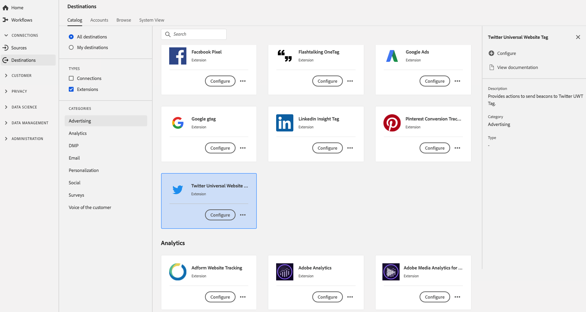

# [!DNL Twitter Universal Website Tag] Extensão {#twitter-uwt-extension}

## Visão geral {#overview}

[!DNL Twitter Universal Website Tag] fornece ações para enviar beacons para a Tag UWT do Twitter.

[!DNL Twitter Universal Website Tag] é uma extensão de anúncio na Plataforma de dados do cliente em tempo real. Para obter mais informações sobre a funcionalidade de extensão, consulte Rastreamento [de conversão](https://business.twitter.com/en/solutions/twitter-ads/website-clicks/advanced-conversion-tracking.html)avançado.

Este destino é uma extensão Adobe Experience Platform Launch. Para obter mais informações sobre como as extensões de lançamento de plataforma funcionam na CDP em tempo real, consulte Visão geral [das extensões do](../launch-extensions/overview.md)Adobe Experience Platform Launch.

## Pré-requisitos {#prerequisites}

Esta extensão está disponível no [!DNL Destinations] catálogo para todos os clientes que compraram CDP em tempo real.

Para usar essa extensão, você precisa acessar o Adobe Experience Platform Launch. O Launch de plataforma é oferecido aos clientes da Adobe Experience Cloud como um recurso incluído, de valor agregado. Entre em contato com o administrador da organização para obter acesso ao Platform Launch e peça que ele conceda a você a permissão **[!UICONTROL manage_properties]** para que você possa instalar extensões.

## Instalar extensão {#install-extension}

Para instalar a [!DNL Twitter Universal Website Tag] extensão:

Na interface [CDP em tempo](http://platform.adobe.com/)real, vá para **[!UICONTROL Destinos]** > **[!UICONTROL Catálogo]**.

Selecione a extensão do catálogo ou use a barra de pesquisa.

Clique no destino para realçá-lo e selecione **[!UICONTROL Configurar]** no painel direito. Se o controle **[!UICONTROL Configurar]** estiver acinzentado, você não terá a permissão **[!UICONTROL manage_properties]** . Consulte [Pré-requisitos](#prerequisites).

Na janela de propriedades **** Selecionar lançamento de plataforma disponível, selecione a propriedade Inicialização de plataforma na qual deseja instalar a extensão. Você também tem a opção de criar uma nova propriedade no Launch da plataforma. Uma propriedade é uma coleção de regras, elementos de dados, extensões configuradas, ambientes e bibliotecas. Saiba mais sobre as propriedades na seção [da página](https://experienceleague.adobe.com/docs/launch/using/reference/admin/companies-and-properties.html#properties-page) Propriedades da documentação do Launch da plataforma.

O fluxo de trabalho leva você ao Platform Launch para concluir a instalação.

Você também pode instalar a extensão diretamente na interface [do](https://launch.adobe.com/)Adobe Experience Platform Launch. Consulte [Adicionar uma nova extensão](https://experienceleague.adobe.com/docs/launch/using/reference/manage-resources/extensions/overview.html?lang=en#add-a-new-extension) na documentação de lançamento da plataforma.

## Como usar a extensão {#how-to-use}

Depois de instalar a extensão, é possível configurar o start das regras para ela diretamente no Platform Launch.

No Platform Launch, você pode configurar regras para suas extensões instaladas para enviar dados de evento para o destino da extensão somente em determinadas situações. Para obter mais informações sobre como configurar regras para suas extensões, consulte a documentação Regras.

## Configurar, atualizar e excluir extensão {#configure-upgrade-delete}

Você pode configurar, atualizar e excluir extensões na interface do Platform Launch.

>[!TIP]
>
>Se a extensão já estiver instalada em uma de suas propriedades, a interface do usuário CDP em tempo real ainda exibirá **[!UICONTROL Instalar]** para a extensão. Exclua o fluxo de trabalho de instalação conforme descrito em [Instalar extensão](#install-extension) para acessar o Launch da plataforma e configurar ou excluir sua extensão.

Para atualizar sua extensão, consulte Atualização [da](https://experienceleague.adobe.com/docs/launch/using/reference/manage-resources/extensions/extension-upgrade.html) extensão na documentação do Launch da plataforma.