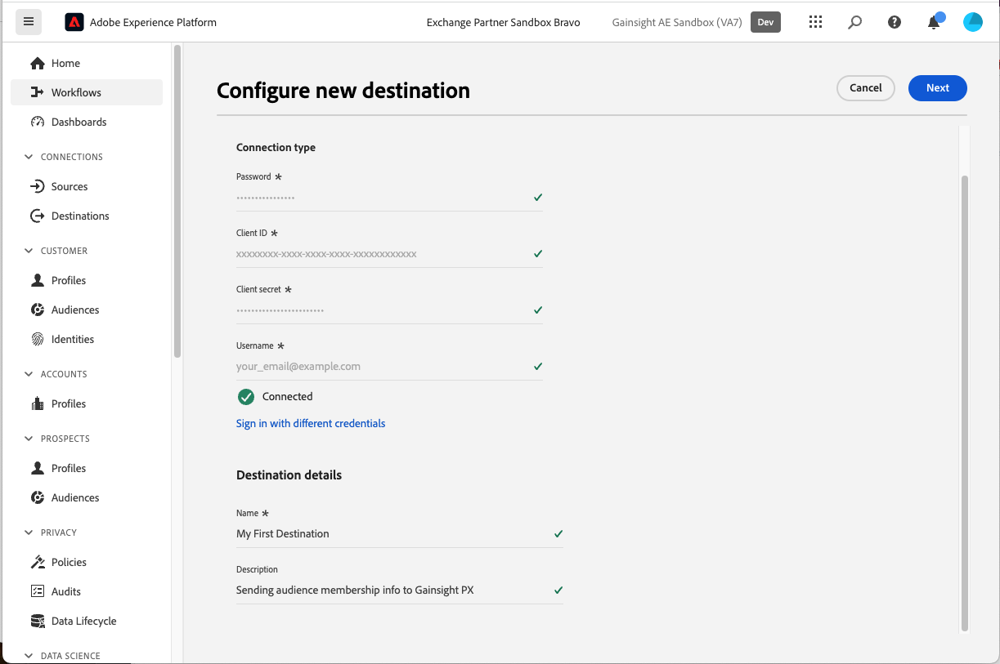
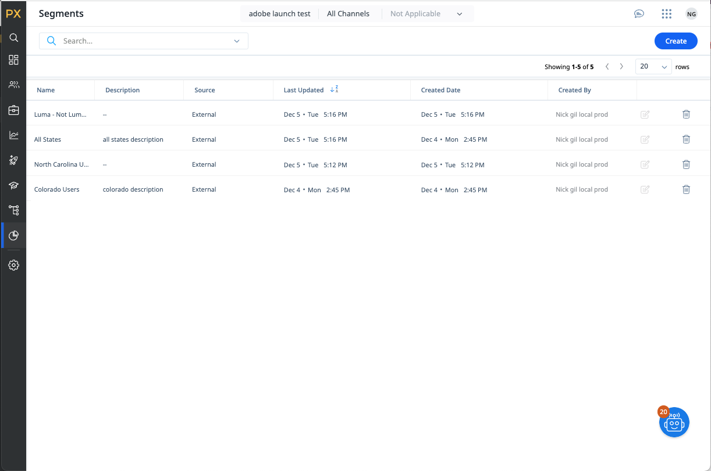

# Conexão Gainsight PX {#gainsight-px}

## Visão geral {#overview}

[[!DNL Gainsight PX]](https://www.gainsight.com/product-experience/) O é uma plataforma de experiência do produto que permite que as equipes de produtos entendam como os usuários usam seus produtos, coletam feedback e criam envolvimentos no aplicativo, como apresentações do produto para impulsionar a integração de usuários e a adoção de produtos.

>[!IMPORTANT]
>
>O conector de destino e a página de documentação são criados e mantidos pelo *Gainsight PX* equipe. Para qualquer consulta ou solicitação de atualização, entre em contato diretamente em *`pxsupport@gainsight.com`*.

## Casos de uso {#use-cases}

Para ajudá-lo a entender melhor como e quando você deve usar o *Gainsight PX* destino, aqui estão exemplos de casos de uso que os clientes do Adobe Experience Platform podem resolver usando esse destino.

### Direcionamento de envolvimentos no aplicativo {#targeting-in-app-engagements}

Uma empresa SaaS deseja envolver seus clientes por meio de um guia no aplicativo construído no Gainsight PX. Um público-alvo para receber este compromisso foi criado no Adobe Experience Platform. O destino PX do Gainsight recebe o público-alvo e o disponibiliza no ambiente PX do Gainsight.

## Pré-requisitos {#prerequisites}

* Entre em contato com [!DNL Gainsight] e solicite a ativação de recursos de segmentos externos para sua assinatura.
* Gere um valor de Segredo OAuth para sua assinatura PX usando o **[!UICONTROL Gerar novo segredo]** na parte inferior do [Página Detalhes da empresa](https://app.aptrinsic.com/settings/subscription)
  

## Identidades suportadas {#supported-identities}

O Gainsight PX é compatível com a ativação de identidades descritas na tabela abaixo. Saiba mais sobre [identidades](../../../identity-service/features/namespaces.md).

| Identidade de destino | Descrição |
|---|----|
| IdentifyID | Identificador de usuário comum que identifica exclusivamente um usuário no Gainsight PX e no Adobe Experience Platform |

{style="table-layout:auto"}

## Públicos-alvo compatíveis {#supported-audiences}

Esta seção descreve que tipo de público-alvo você pode exportar para esse destino.

| Origem do público | Suportado | Descrição |
|---|---|---|
| [!DNL Segmentation Service] | ✓ | Públicos-alvo gerados pelo Experience Platform [Serviço de segmentação](../../../segmentation/home.md). |
| Uploads personalizados | X | Públicos-alvo [importado](../../../segmentation/ui/audience-portal.md#import-audience) para o Experience Platform de arquivos CSV. |

{style="table-layout:auto"}

## Tipo e frequência de exportação {#export-type-frequency}

Consulte a tabela abaixo para obter informações sobre o tipo e a frequência da exportação de destino.

| Item | Tipo | Notas |
|---|---|---|
| Tipo de exportação | **[!UICONTROL Exportação de segmentos]** | Você está exportando todos os membros de um público-alvo com os identificadores (nome, número de telefone ou outros) usados no [!DNL Gainsight PX] destino. |
| Frequência de exportação | **[!UICONTROL Streaming]** | Os destinos de transmissão são conexões baseadas em API &quot;sempre ativas&quot;. Quando um perfil é atualizado em Experience Platform com base na avaliação do público-alvo, o conector envia a atualização downstream para a plataforma de destino. Leia mais sobre [destinos de transmissão](/help/destinations/destination-types.md#streaming-destinations). |

{style="table-layout:auto"}

## Conectar ao destino {#connect}

>[!IMPORTANT]
>
>Para se conectar ao destino, você precisa da variável **[!UICONTROL Gerenciar destinos]** [permissão de controle de acesso](/help/access-control/home.md#permissions). Leia o [visão geral do controle de acesso](/help/access-control/ui/overview.md) ou entre em contato com o administrador do produto para obter as permissões necessárias.

Para se conectar a esse destino, siga as etapas descritas no [tutorial de configuração de destino](../../ui/connect-destination.md). No workflow da configuração de destino, preencha os campos listados nas duas seções abaixo.

### Autenticar para o destino {#authenticate}

Para autenticar no destino, preencha os campos obrigatórios e selecione **[!UICONTROL Conectar ao destino]**.

* **[!UICONTROL Senha]**: A senha usada para fazer logon no [[!DNL Gainsight PX]](https://app.aptrinsic.com)
* **[!UICONTROL ID do cliente]**: a ID de assinatura do Gainsight PX no [Página Detalhes da empresa](https://app.aptrinsic.com/settings/subscription)
* **[!UICONTROL Client secret]**: o segredo OAuth gerado na parte inferior do [Página Detalhes da empresa](https://app.aptrinsic.com/settings/subscription) no [!DNL Gainsight PX] IU.
* **[!UICONTROL Nome de usuário]**: O email usado para fazer logon na [[!DNL Gainsight PX]](https://app.aptrinsic.com) IU

### Preencher detalhes do destino {#destination-details}

Para configurar detalhes para o destino, preencha os campos obrigatórios e opcionais abaixo. Um asterisco ao lado de um campo na interface do usuário indica que o campo é obrigatório.

* **[!UICONTROL Nome]**: um nome pelo qual você reconhecerá esse destino no futuro.
* **[!UICONTROL Descrição]**: uma descrição que ajudará você a identificar esse destino no futuro.

Quando terminar de fornecer detalhes da conexão de destino, selecione **[!UICONTROL Próxima]**.

## Ativar segmentos para este destino {#activate}

>[!IMPORTANT]
>
>* Para ativar os dados, é necessário **[!UICONTROL Gerenciar destinos]**, **[!UICONTROL Ativar destinos]**, **[!UICONTROL Exibir perfis]**, e **[!UICONTROL Exibir segmentos]** [permissões de controle de acesso](/help/access-control/home.md#permissions). Leia o [visão geral do controle de acesso](/help/access-control/ui/overview.md) ou entre em contato com o administrador do produto para obter as permissões necessárias.
>* Para exportar *identidades*, você precisará do **[!UICONTROL Exibir gráfico de identidade]** [permissão de controle de acesso](/help/access-control/home.md#permissions).   {width="100" zoomable="yes"}

Ler [Ativar perfis e segmentos para destinos de exportação de segmento de transmissão](/help/destinations/ui/activate-segment-streaming-destinations.md) para obter instruções sobre como ativar segmentos de público-alvo para esse destino.

### Mapear identidades {#map}

Esse destino oferece suporte ao mapeamento de atributos de perfil e namespaces de identidade. O target mapping deve ser sempre o **[!UICONTROL IDENTIFY_ID]** namespace de identidade.

Consulte os exemplos abaixo para entender melhor como configurar o mapeamento.

#### Mapear um atributo de perfil {#map-profile-attribute}

No exemplo mostrado abaixo, o campo de origem é um atributo de perfil XDM que é mapeado para o namespace de destino IDENTIFY_ID.

#### Mapear um namespace de identidade {#map-identity-namespace}

No exemplo mostrado abaixo, o campo de origem é um namespace de identidade (**[!UICONTROL ECID]**) que é mapeado para o **[!UICONTROL IDENTIFY_ID]** namespace de destino.

## Dados exportados / Validar exportação de dados {#exported-data}

Os dados de segmentação são transmitidos do Experience Platform para o Gainsight PX.

Os metadados de segmento são visíveis na tela Segmentos no [!DNL Gainsight PX] IU.

As informações de associação do segmento estão visíveis na guia Segmentos da tela do Audience Explorer do [!DNL Gainsight PX] IU.

## Uso e governança de dados {#data-usage-governance}

Todos [!DNL Adobe Experience Platform] os destinos estão em conformidade com as políticas de uso de dados ao manipular seus dados. Para obter informações detalhadas sobre como [!DNL Adobe Experience Platform] fiscaliza a governança de dados, leia o [Visão geral da governança de dados](/help/data-governance/home.md).
