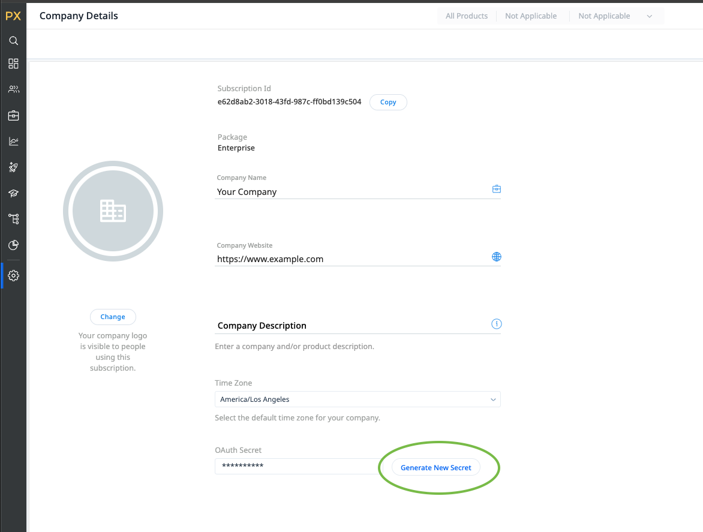
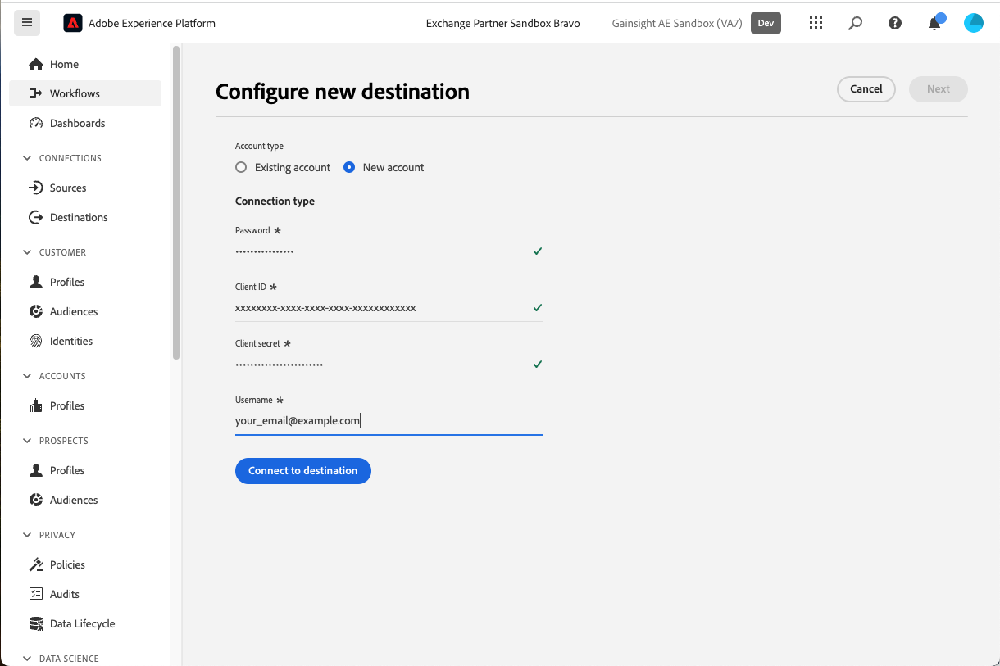
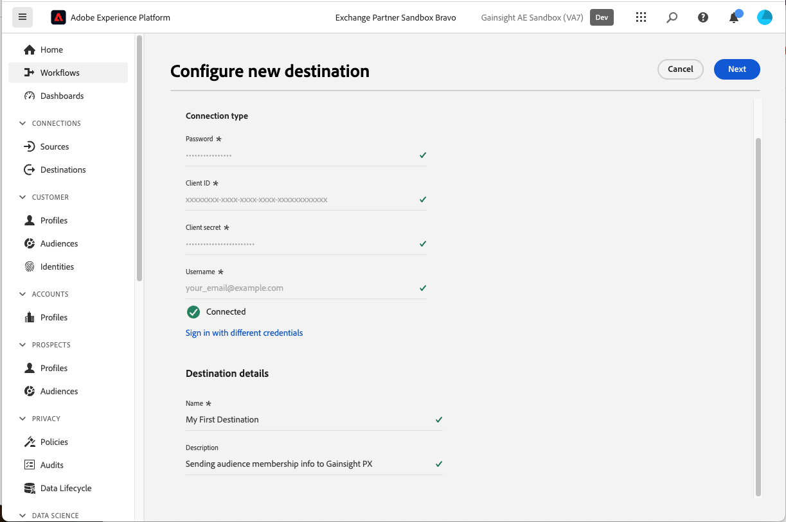
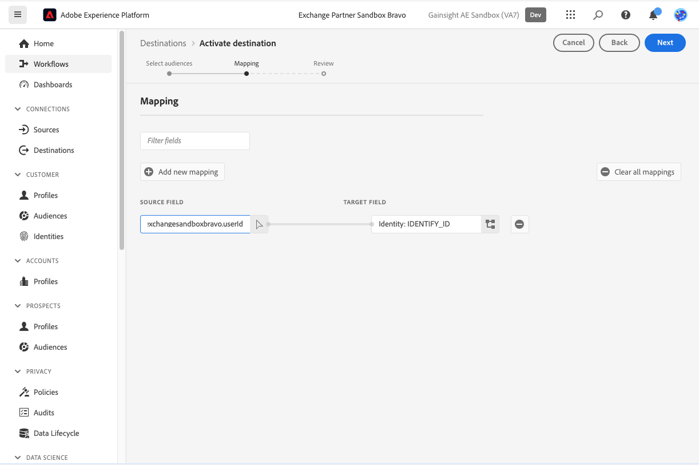

# Conexão Gainsight PX {#gainsight-px}

## Visão geral {#overview}

[[!DNL Gainsight PX]](https://www.gainsight.com/product-experience/) é uma plataforma de experiência de produto que permite que as equipes de produtos entendam como os usuários usam seus produtos, coletam comentários e criam envolvimentos no aplicativo, como apresentações de produtos, para impulsionar a integração de usuários e a adoção de produtos.

>[!IMPORTANT]
>
>O conector de destino e a página de documentação são criados e mantidos pela equipe do *Gainsight PX*. Para qualquer consulta ou solicitação de atualização, contate-os diretamente em *`pxsupport@gainsight.com`*.

## Casos de uso {#use-cases}

Para ajudá-lo a entender melhor como e quando você deve usar o destino *Gainsight PX*, veja a seguir exemplos de casos de uso que os clientes do [!DNL Adobe Experience Platform] podem resolver usando esse destino.

### Direcionamento de envolvimentos no aplicativo {#targeting-in-app-engagements}

Uma empresa SaaS deseja envolver seus clientes por meio de um guia no aplicativo construído no Gainsight PX. Uma audiência para receber este compromisso foi criada em [!DNL Adobe Experience Platform]. O destino PX do Gainsight recebe o público-alvo e o disponibiliza no ambiente PX do Gainsight.

## Pré-requisitos {#prerequisites}

* Contate a equipe de suporte do [!DNL Gainsight] e solicite a ativação de recursos de segmentos externos para sua assinatura.
* Gere um valor de Segredo OAuth para sua assinatura PX usando o botão **[!UICONTROL Generate New Secret]** na parte inferior da [página Detalhes da empresa](https://app.aptrinsic.com/settings/subscription)
  

## Identidades suportadas {#supported-identities}

O Gainsight PX é compatível com a ativação de identidades descritas na tabela abaixo. Saiba mais sobre [identidades](../../../identity-service/features/namespaces.md).

| Identidade de destino | Descrição |
|---|----|
| IdentifyID | Identificador de usuário comum que identifica exclusivamente um usuário no Gainsight PX e [!DNL Adobe Experience Platform] |

{style="table-layout:auto"}

## Públicos-alvo compatíveis {#supported-audiences}

Esta seção descreve que tipo de público-alvo você pode exportar para esse destino.

| Origem do público | Suportado | Descrição |
|---------|----------|----------|
| [!DNL Segmentation Service] | Sim | Públicos-alvo gerados pelo [Serviço de Segmentação](../../../segmentation/home.md) da Experience Platform. |
| Todas as outras origens de público-alvo | Não | Esta categoria inclui todas as origens de público-alvo fora dos públicos-alvo gerados pelo [!DNL Segmentation Service]. Leia sobre as [várias origens do público-alvo](/help/segmentation/ui/audience-portal.md#customize). Alguns exemplos incluem: <ul><li> carregar audiências personalizadas [importadas](../../../segmentation/ui/audience-portal.md#import-audience) para o Experience Platform de arquivos CSV,</li><li> públicos-alvo semelhantes, </li><li> públicos federados, </li><li> públicos-alvo gerados em outros aplicativos Experience Platform, como [!DNL Adobe Journey Optimizer], </li><li> e muito mais. </li></ul> |

{style="table-layout:auto"}

Públicos-alvo compatíveis por tipo de dados de público-alvo:

| Tipo de dados de público | Suportado | Descrição | Casos de uso |
|--------------------|-----------|-------------|-----------|
| [Públicos-alvo](/help/segmentation/types/people-audiences.md) | Sim | Com base nos perfis de clientes, permitindo direcionar grupos específicos de pessoas para campanhas de marketing. | Compradores frequentes, abandonadores de carrinho |
| [Públicos-alvo da conta](/help/segmentation/types/account-audiences.md) | Não | Direcione indivíduos em organizações específicas para estratégias de marketing baseadas em conta. | Marketing B2B |
| [Públicos-alvo potenciais](/help/segmentation/types/prospect-audiences.md) | Não | Direcione indivíduos que ainda não são clientes, mas compartilham características com seu público-alvo. | Prospecção com dados de terceiros |
| [Exportações do conjunto de dados](/help/catalog/datasets/overview.md) | Não | Coleções de dados estruturados armazenados no Data Lake [!DNL Adobe Experience Platform]. | Relatórios, fluxos de trabalho de ciência de dados |

{style="table-layout:auto"}

## Tipo e frequência de exportação {#export-type-frequency}

Consulte a tabela abaixo para obter informações sobre o tipo e a frequência da exportação de destino.

| Item | Tipo | Notas |
|---|---|---|
| Tipo de exportação | **[!UICONTROL Segment export]** | Você está exportando todos os membros de um público com os identificadores (nome, número de telefone ou outros) usados no destino [!DNL Gainsight PX]. |
| Frequência de exportação | **[!UICONTROL Streaming]** | Os destinos de transmissão são conexões baseadas em API &quot;sempre ativas&quot;. Quando um perfil é atualizado no Experience Platform com base na avaliação do público-alvo, o conector envia a atualização downstream para a plataforma de destino. Leia mais sobre [destinos de streaming](/help/destinations/destination-types.md#streaming-destinations). |

{style="table-layout:auto"}

## Conectar ao destino {#connect}

>[!IMPORTANT]
>
>Para se conectar ao destino, você precisa da **[!UICONTROL Manage Destinations]** [permissão de controle de acesso](/help/access-control/home.md#permissions). Leia a [visão geral do controle de acesso](/help/access-control/ui/overview.md) ou contate o administrador do produto para obter as permissões necessárias.

Para se conectar a este destino, siga as etapas descritas no [tutorial de configuração de destino](../../ui/connect-destination.md). No workflow da configuração de destino, preencha os campos listados nas duas seções abaixo.

### Autenticar para o destino {#authenticate}

Para autenticar no destino, preencha os campos obrigatórios e selecione **[!UICONTROL Connect to destination]**.

* **[!UICONTROL Password]**: A senha usada para fazer logon em [[!DNL Gainsight PX]](https://app.aptrinsic.com)
* **[!UICONTROL Client ID]**: a ID de assinatura do Gainsight PX na [página Detalhes da empresa](https://app.aptrinsic.com/settings/subscription)
* **[!UICONTROL Client secret]**: O segredo OAuth gerado na parte inferior da [página Detalhes da Empresa](https://app.aptrinsic.com/settings/subscription) na interface do usuário do [!DNL Gainsight PX].
* **[!UICONTROL Username]**: O email usado para fazer logon na interface de usuário do [[!DNL Gainsight PX]](https://app.aptrinsic.com)

### Preencher detalhes do destino {#destination-details}

Para configurar detalhes para o destino, preencha os campos obrigatórios e opcionais abaixo. Um asterisco ao lado de um campo na interface do usuário indica que o campo é obrigatório.

* **[!UICONTROL Name]**: Um nome pelo qual você reconhecerá este destino no futuro.
* **[!UICONTROL Description]**: uma descrição que ajudará você a identificar este destino no futuro.

Quando terminar de fornecer detalhes da conexão de destino, selecione **[!UICONTROL Next]**.

## Ativar públicos-alvo para esse destino {#activate}

>[!IMPORTANT]
>
>* Para ativar dados, você precisa das **[!UICONTROL Manage Destinations]**, **[!UICONTROL Activate Destinations]**, **[!UICONTROL View Profiles]** e **[!UICONTROL View Segments]** [permissões de controle de acesso](/help/access-control/home.md#permissions). Leia a [visão geral do controle de acesso](/help/access-control/ui/overview.md) ou contate o administrador do produto para obter as permissões necessárias.
>* Para exportar *identidades*, você precisa da **[!UICONTROL View Identity Graph]** [permissão de controle de acesso](/help/access-control/home.md#permissions).   {width="100" zoomable="yes"}

Leia [Ativar públicos-alvo para destinos de streaming](/help/destinations/ui/activate-segment-streaming-destinations.md) para obter instruções sobre como ativar públicos-alvo para este destino.

### Mapear identidades {#map}

Esse destino oferece suporte ao mapeamento de atributos de perfil e namespaces de identidade. O target mapping deve sempre ser o namespace de identidade **[!UICONTROL IDENTIFY_ID]**.

Consulte os exemplos abaixo para entender melhor como configurar o mapeamento.

#### Mapear um atributo de perfil {#map-profile-attribute}

No exemplo mostrado abaixo, o campo de origem é um atributo de perfil XDM que é mapeado para o namespace de destino IDENTIFY_ID.

#### Mapear um namespace de identidade {#map-identity-namespace}

No exemplo mostrado abaixo, o campo de origem é um namespace de identidade (**[!UICONTROL ECID]**) que é mapeado para o namespace de destino **[!UICONTROL IDENTIFY_ID]**.

## Dados exportados / Validar exportação de dados {#exported-data}

Os dados de segmentação são transmitidos do Experience Platform para o Gainsight PX.

Os metadados do segmento estão visíveis na tela Segmentos na interface do usuário do [!DNL Gainsight PX].

As informações de associação de segmento estão visíveis na guia Segmentos da tela do Audience Explorer da interface do usuário do [!DNL Gainsight PX].

## Uso e governança de dados {#data-usage-governance}

Todos os destinos do [!DNL Adobe Experience Platform] são compatíveis com as políticas de uso de dados ao manipular seus dados. Para obter informações detalhadas sobre como o [!DNL Adobe Experience Platform] fiscaliza a governança de dados, leia a [Visão geral da Governança de Dados](/help/data-governance/home.md).
