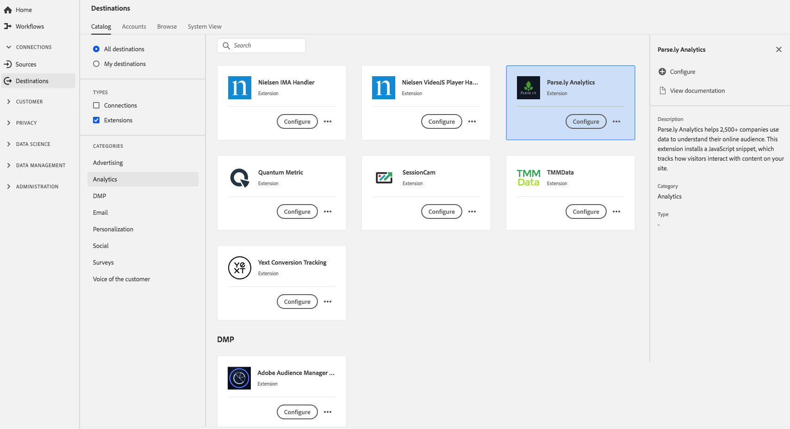

# [!DNL Parse.ly Analytics] extensão {#parsely-analytics-extension}

## Visão geral {#overview}

[!DNL Parse.ly Analytics] O ajuda mais de 2.500 empresas a usar dados para entender o público online. Esta extensão instala um trecho de JavaScript, que rastreia a forma como os visitantes interagem com o conteúdo do site.

O Parse.ly é uma extensão do Analytics no Adobe Experience Platform. Para obter mais informações sobre a funcionalidade de extensão, consulte [Analisar.ly Analytics](https://www.parse.ly/).

Esse destino é uma extensão do Adobe Experience Platform Launch. Para obter mais informações sobre como as extensões do Platform launch funcionam na plataforma, consulte [Visão geral das extensões do Adobe Experience Platform Launch](../launch-extensions/overview.md).

## Pré-requisitos {#prerequisites}

Essa extensão está disponível no catálogo [!DNL Destinations] para todos os clientes que compraram a Platform.

Para usar essa extensão, você precisa acessar o Adobe Experience Platform Launch. O Platform launch é oferecido aos clientes da Adobe Experience Cloud como um recurso incluso com valor agregado. Entre em contato com o administrador da organização para obter acesso ao Platform launch e solicitar que ele conceda a permissão **[!UICONTROL manage_properties]** para que você possa instalar as extensões.

## Instalar extensão {#install-extension}

Para instalar a extensão [!DNL Parse.ly]:

Na [Interface da plataforma](http://platform.adobe.com/), vá para **[!UICONTROL Destinations]** > **[!UICONTROL Catalog]**.

Selecione a extensão do catálogo ou use a barra de pesquisa.

Clique no destino para realçá-lo e selecione **[!UICONTROL Configure]** no painel direito. Se o controle **[!UICONTROL Configure]** estiver esmaecido, a permissão **[!UICONTROL manage_properties]** não será exibida. Consulte [Pré-requisitos](#prerequisites).

Na janela **[!UICONTROL Select available Platform Launch property]**, selecione a propriedade Platform launch na qual deseja instalar a extensão. Você também tem a opção de criar uma nova propriedade no Platform launch. Uma propriedade é uma coleção de regras, elementos de dados, extensões configuradas, ambientes e bibliotecas. Saiba mais sobre as propriedades na seção [Propriedades da página](https://experienceleague.adobe.com/docs/launch/using/reference/admin/companies-and-properties.html#properties-page) da documentação do Platform launch.

O fluxo de trabalho leva você ao Platform launch para concluir a instalação.

Você também pode instalar a extensão diretamente na [interface do Adobe Experience Platform Launch](https://launch.adobe.com/). Consulte [Adicionar uma nova extensão](https://experienceleague.adobe.com/docs/launch/using/reference/manage-resources/extensions/overview.html?lang=en#add-a-new-extension) na documentação do Platform launch.

## Como usar a extensão {#how-to-use}

Depois de instalar a extensão, você pode iniciar a configuração das regras diretamente no Platform launch.

No Platform launch, você pode configurar regras para suas extensões instaladas para enviar dados de evento para o destino da extensão somente em determinadas situações. Para obter mais informações sobre como configurar regras para suas extensões, consulte a [Documentação de regras](https://experienceleague.adobe.com/docs/launch/using/reference/manage-resources/rules.html).

## Configurar, atualizar e excluir a extensão {#configure-upgrade-delete}

Você pode configurar, atualizar e excluir extensões na interface do Platform launch.

>[!TIP]
>
>Se a extensão já estiver instalada em uma de suas propriedades, a interface do usuário da plataforma ainda exibirá **[!UICONTROL Install]** para a extensão. Desative o fluxo de trabalho de instalação conforme descrito em [Instalar extensão](#install-extension) para chegar ao Platform launch e configure ou exclua sua extensão.

Para atualizar sua extensão, consulte [Atualização de extensão](https://experienceleague.adobe.com/docs/launch/using/reference/manage-resources/extensions/extension-upgrade.html) na documentação do Platform launch.