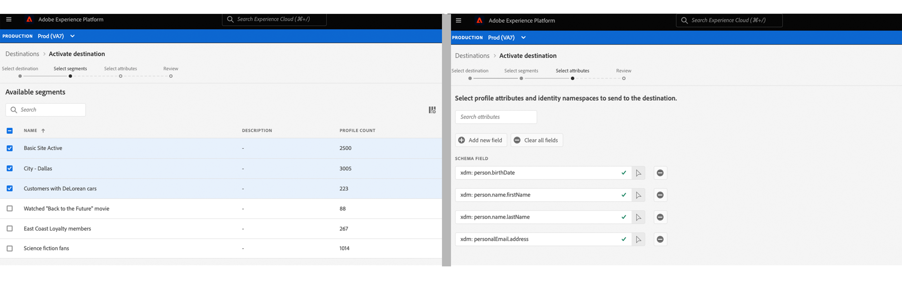

# [!DNL Amazon Kinesis] conexão

## Visão geral {#overview}

>[!IMPORTANT]
>
> Este destino está disponível somente para [Adobe Real-time Customer Data Platform Ultimate](https://helpx.adobe.com/legal/product-descriptions/real-time-customer-data-platform.html) clientes.

A variável [!DNL Kinesis Data Streams] serviço de [!DNL Amazon Web Services] O permite coletar e processar grandes fluxos de registros de dados em tempo real.

Você pode criar uma conexão de saída em tempo real com o [!DNL Amazon Kinesis] armazenamento para transmitir dados do Adobe Experience Platform.

* Para obter mais informações sobre [!DNL Amazon Kinesis], consulte o [Documentação do Amazon](https://docs.aws.amazon.com/streams/latest/dev/introduction.html).
* Para se conectar a [!DNL Amazon Kinesis] programaticamente, consulte [Tutorial da API de destinos de streaming](../../api/streaming-destinations.md).
* Para se conectar a [!DNL Amazon Kinesis] usando a interface do usuário da Platform, consulte as seções abaixo.


## Casos de uso {#use-cases}

Ao usar destinos de transmissão como [!DNL Amazon Kinesis]Além disso, você pode alimentar facilmente eventos de segmentação de alto valor e atributos de perfil associados em seus sistemas de escolha.

Por exemplo, um cliente potencial baixou um white paper que os qualifica em um segmento de &quot;alta propensão para conversão&quot;. Ao mapear o público-alvo no qual o cliente potencial se enquadra [!DNL Amazon Kinesis] destino, você receberia esse evento em [!DNL Amazon Kinesis]. Lá, você pode empregar uma abordagem do tipo &quot;faça você mesmo&quot; e descrever a lógica de negócios sobre o evento, pois acha que funcionaria melhor com os sistemas de TI de sua empresa.

## Públicos-alvo compatíveis {#supported-audiences}

Esta seção descreve todos os públicos-alvo que você pode exportar para esse destino.

Todos os destinos oferecem suporte à ativação de públicos-alvo gerados pelo Experience Platform [Serviço de segmentação](../../../segmentation/home.md).

Além disso, esse destino também suporta a ativação dos públicos-alvo descritos na tabela abaixo.

| Tipo de público | Descrição |
---------|----------|
| Uploads personalizados | Públicos-alvo assimilados em Experience Platform de arquivos CSV. |

{style="table-layout:auto"}

## Tipo e frequência de exportação {#export-type-frequency}

Consulte a tabela abaixo para obter informações sobre o tipo e a frequência da exportação de destino.

| Item | Tipo | Notas |
---------|----------|---------|
| Tipo de exportação | **[!UICONTROL Baseado em perfil]** | Você está exportando todos os membros de um segmento, juntamente com os campos de esquema desejados (por exemplo: endereço de email, número de telefone, sobrenome), conforme escolhido na tela selecionar atributos de perfil da [workflow de ativação de destino](../../ui/activate-batch-profile-destinations.md#select-attributes). |
| Frequência de exportação | **[!UICONTROL Streaming]** | Os destinos de transmissão são conexões baseadas em API &quot;sempre ativas&quot;. Assim que um perfil é atualizado em Experience Platform com base na avaliação do público-alvo, o conector envia a atualização downstream para a plataforma de destino. Leia mais sobre [destinos de transmissão](/help/destinations/destination-types.md#streaming-destinations). |

{style="table-layout:auto"}

## INCLUIR NA LISTA DE PERMISSÕES endereço IP {#ip-address-allowlist}

Para atender aos requisitos de segurança e conformidade dos clientes, o Experience Platform lista de permissões fornece uma lista de IPs estáticos que você pode pesquisar pelo [!DNL Amazon Kinesis] destino. Consulte [LISTA DE PERMISSÕES de endereço IP para destinos de transmissão](/help/destinations/catalog/streaming/ip-address-allow-list.md) para obter a lista completa de IPs a serem incluídos na lista de permissões.

## Obrigatório [!DNL Amazon Kinesis] permissões {#required-kinesis-permission}

Para conectar e exportar dados para o seu [!DNL Amazon Kinesis] fluxos, o Experience Platform precisa de permissões para as seguintes ações:

* `kinesis:ListStreams`
* `kinesis:PutRecord`
* `kinesis:PutRecords`

Essas permissões são organizadas por meio da variável [!DNL Kinesis] e são verificadas pela Platform depois de configurar o destino do Kinesis na interface do usuário da Platform.

O exemplo abaixo exibe os direitos de acesso mínimos necessários para exportar dados com êxito para um [!DNL Kinesis] destino.

```json
{
    "Version": "2012-10-17",
    "Statement": [
        {
            "Effect": "Allow",
            "Action": [
                "kinesis:ListStreams",
                "kinesis:PutRecord",
                "kinesis:PutRecords"
            ],
            "Resource": [
                "arn:aws:kinesis:us-east-2:901341027596:stream/*"
            ]
        }
    ]
}
```

| Propriedade | Descrição |
| -------- | ----------- |
| `kinesis:ListStreams` | Uma ação que lista seus fluxos de dados do Amazon Kinesis. |
| `kinesis:PutRecord` | Uma ação que grava um único registro de dados em um fluxo de dados do Kinesis. |
| `kinesis:PutRecords` | Uma ação que grava vários registros de dados em um fluxo de dados do Kinesis em uma única chamada. |

{style="table-layout:auto"}

Para obter mais informações sobre o controle de acesso para [!DNL Kinesis] fluxos de dados, leia o seguinte [[!DNL Kinesis] documento](https://docs.aws.amazon.com/streams/latest/dev/controlling-access.html).

## Conectar ao destino {#connect}

>[!IMPORTANT]
> 
>Para se conectar ao destino, você precisa da variável **[!UICONTROL Gerenciar destinos]** [permissão de controle de acesso](/help/access-control/home.md#permissions). Leia o [visão geral do controle de acesso](/help/access-control/ui/overview.md) ou entre em contato com o administrador do produto para obter as permissões necessárias.

Para se conectar a esse destino, siga as etapas descritas no [tutorial de configuração de destino](../../ui/connect-destination.md). Ao se conectar a esse destino, você deve fornecer as seguintes informações:

### Informações de autenticação {#authentication-information}

Insira os campos abaixo e selecione **[!UICONTROL Conectar ao destino]**:


* **[!DNL Amazon Web Services]chave de acesso e chave secreta**: Em [!DNL Amazon Web Services], gerar um `access key - secret access key` emparelhe para conceder acesso à Platform ao seu [!DNL Amazon Kinesis] conta. Saiba mais na [Documentação do Amazon Web Services](https://docs.aws.amazon.com/IAM/latest/UserGuide/id_credentials_access-keys.html).
* **[!UICONTROL Região]**: Indique qual [!DNL Amazon Web Services] região para a qual transmitir dados.

### Preencher detalhes do destino {#destination-details}

>[!CONTEXTUALHELP]
>id="platform_destinations_connect_kinesis_includesegmentnames"
>title="Incluir nomes de segmentos"
>abstract="Alterne se quiser que a exportação de dados inclua os nomes dos públicos-alvo que você está exportando. Veja a documentação para ter um exemplo de exportação de dados com esta opção selecionada."

>[!CONTEXTUALHELP]
>id="platform_destinations_connect_kinesis_includesegmenttimestamps"
>title="Incluir carimbos de data e hora do segmento"
>abstract="Ative se desejar que a exportação de dados inclua o carimbo de data e hora UNIX quando os públicos-alvo foram criados e atualizados, bem como o carimbo de data e hora UNIX quando os públicos-alvo foram mapeados para o destino para ativação. Veja a documentação para ter um exemplo de exportação de dados com esta opção selecionada."

Para configurar detalhes para o destino, preencha os campos obrigatórios e opcionais abaixo. Um asterisco ao lado de um campo na interface do usuário indica que o campo é obrigatório.


* **[!UICONTROL Nome]**: forneça um nome para sua conexão com o [!DNL Amazon Kinesis]
* **[!UICONTROL Descrição]**: forneça uma descrição para sua conexão com o [!DNL Amazon Kinesis].
* **[!UICONTROL Fluxo]**: forneça o nome de um fluxo de dados existente no [!DNL Amazon Kinesis] conta. O Platform exportará dados para esse fluxo.
* **[!UICONTROL Incluir nomes de segmentos]**: alterne se quiser que a exportação de dados inclua os nomes dos públicos-alvo que você está exportando. Para obter um exemplo de exportação de dados com essa opção selecionada, consulte [Dados exportados](#exported-data) seção mais abaixo.
* **[!UICONTROL Incluir carimbos de data e hora do segmento]**: ative se desejar que a exportação de dados inclua o carimbo de data e hora UNIX quando os públicos-alvo foram criados e atualizados, bem como o carimbo de data e hora UNIX quando os públicos-alvo foram mapeados para o destino para ativação. Para obter um exemplo de exportação de dados com essa opção selecionada, consulte [Dados exportados](#exported-data) seção mais abaixo.

<!--

>[!IMPORTANT]
>
>Platform needs `write` permissions on the bucket object where the export files will be delivered.

-->

### Ativar alertas {#enable-alerts}

Você pode ativar os alertas para receber notificações sobre o status do fluxo de dados para o seu destino. Selecione um alerta na lista para assinar e receber notificações sobre o status do seu fluxo de dados. Para obter mais informações sobre alertas, consulte o manual sobre [assinatura de alertas de destinos usando a interface do](../../ui/alerts.md).

Quando terminar de fornecer detalhes da conexão de destino, selecione **[!UICONTROL Próxima]**.

## Ativar públicos para este destino {#activate}

>[!IMPORTANT]
> 
>Para ativar os dados, é necessário **[!UICONTROL Gerenciar destinos]**, **[!UICONTROL Ativar destinos]**, **[!UICONTROL Exibir perfis]**, e **[!UICONTROL Exibir segmentos]** [permissões de controle de acesso](/help/access-control/home.md#permissions). Leia o [visão geral do controle de acesso](/help/access-control/ui/overview.md) ou entre em contato com o administrador do produto para obter as permissões necessárias.

Consulte [Ativar dados do público-alvo para destinos de exportação de perfil de transmissão](../../ui/activate-streaming-profile-destinations.md) para obter instruções sobre como ativar públicos-alvo para esse destino.

## Comportamento de exportação de perfil {#profile-export-behavior}

O Experience Platform otimiza o comportamento de exportação do perfil para o [!DNL Amazon Kinesis] destino, para exportar dados somente para seu destino quando atualizações relevantes para um perfil tiverem ocorrido após a qualificação de público-alvo ou outros eventos significativos. Os perfis são exportados para seu destino nas seguintes situações:

* A atualização do perfil foi determinada por uma alteração na associação de público-alvo para pelo menos um dos públicos-alvo mapeados para o destino. Por exemplo, o perfil se qualificou para um dos públicos mapeados para o destino ou saiu de um dos públicos mapeados para o destino.
* A atualização do perfil foi determinada por uma alteração no [mapa de identidade](/help/xdm/field-groups/profile/identitymap.md). Por exemplo, um perfil que já se qualificou para um dos públicos-alvo mapeados para o destino recebeu uma nova identidade no atributo de mapa de identidade.
* A atualização do perfil foi determinada por uma alteração nos atributos de pelo menos um dos atributos mapeados para o destino. Por exemplo, um dos atributos mapeados para o destino na etapa de mapeamento é adicionado a um perfil.

Em todos os casos descritos acima, somente os perfis em que ocorreram atualizações relevantes são exportados para o seu destino. Por exemplo, se um público-alvo mapeado para o fluxo de destino tiver cem membros e cinco novos perfis se qualificarem para o segmento, a exportação para o destino será incremental e incluirá apenas os cinco novos perfis.

Observe que todos os atributos mapeados são exportados para um perfil, independentemente de onde estejam as alterações. Portanto, no exemplo acima, todos os atributos mapeados para esses cinco novos perfis serão exportados mesmo se os atributos em si não tiverem sido alterados.

### O que determina uma exportação de dados e o que está incluído na exportação {#what-determines-export-what-is-included}

Em relação aos dados exportados para um determinado perfil, é importante entender os dois conceitos diferentes de *o que determina uma exportação de dados para o [!DNL Amazon Kinesis] destino* e *quais dados estão incluídos na exportação*.

| O que determina uma exportação de destino | O que está incluído na exportação de destino |
|---------|----------|
| <ul><li>Atributos e públicos mapeados servem como indicação para uma exportação de destino. Isso significa que, se qualquer público mapeado alterar os estados (de `null` para `realized` ou de `realized` para `exiting`) ou qualquer atributo mapeado for atualizado, uma exportação de destino será iniciada.</li><li>Como as identidades não podem ser mapeadas atualmente para [!DNL Amazon Kinesis] destinos, as alterações em qualquer identidade em um determinado perfil também determinam as exportações de destino.</li><li>Uma alteração em um atributo é definida como qualquer atualização no atributo, seja ou não o mesmo valor. Isso significa que uma substituição em um atributo é considerada uma alteração, mesmo que o valor em si não tenha sido alterado.</li></ul> | <ul><li>A variável `segmentMembership` o objeto inclui o público-alvo mapeado no fluxo de dados de ativação, para o qual o status do perfil foi alterado após um evento de qualificação ou de saída de público-alvo. Observe que outros públicos não mapeados para os quais o perfil se qualificou podem fazer parte da exportação de destino, se esses públicos pertencerem à mesma [política de mesclagem](/help/profile/merge-policies/overview.md) como o público mapeado no fluxo de dados de ativação. </li><li>Todas as identidades na `identityMap` objetos também estão incluídos (no momento, o Experience Platform não oferece suporte ao mapeamento de identidade no [!DNL Amazon Kinesis] destino).</li><li>Somente os atributos mapeados são incluídos na exportação de destino.</li></ul> |

{style="table-layout:fixed"}

Por exemplo, considere esse fluxo de dados como um [!DNL Amazon Kinesis] destino em que três públicos-alvo são selecionados no fluxo de dados e quatro atributos são mapeados para o destino.



Uma exportação de perfil para o destino pode ser determinada por um perfil qualificado para ou que sai de um dos *três segmentos mapeados*. No entanto, na exportação de dados, no campo `segmentMembership` objeto (consulte [Dados exportados](#exported-data) abaixo), outros públicos-alvo não mapeados poderão ser exibidos se esse perfil específico for membro deles e se eles compartilharem a mesma política de mesclagem que o público-alvo que acionou a exportação. Se um perfil se qualificar para a variável **Cliente com DeLorean Cars** público-alvo, mas também é membro da **Assistido &quot;De volta ao futuro&quot;** filme e **Fãs de ficção científica** públicos-alvo, esses outros dois públicos-alvo também estarão presentes na `segmentMembership` objeto da exportação de dados, mesmo que não estejam mapeados no fluxo de dados, se compartilharem a mesma política de mesclagem com o **Cliente com DeLorean Cars** segmento.

Do ponto de vista dos atributos de perfil, qualquer alteração nos quatro atributos mapeados acima determinará uma exportação de destino e qualquer um dos quatro atributos mapeados presentes no perfil estará presente na exportação de dados.

## Preenchimento retroativo de dados históricos {#historical-data-backfill}

Quando você adiciona um novo público a um destino existente ou cria um novo destino e mapeia públicos a ele, o Experience Platform exporta dados históricos de qualificação de público para o destino. Perfis qualificados para o público *antes* o público-alvo foi adicionado ao destino e é exportado para o destino em aproximadamente uma hora.

## Dados exportados {#exported-data}

Seu exportado [!DNL Experience Platform] os dados chegam em seu [!DNL Amazon Kinesis] destino no formato JSON. Por exemplo, a exportação abaixo contém um perfil que se qualificou para um determinado segmento, é um membro de outros dois segmentos e saiu de outro segmento. A exportação também inclui o nome, sobrenome, data de nascimento e endereço de email pessoal do atributo de perfil. As identidades para esse perfil são ECID e email.

```json
{
  "person": {
    "birthDate": "YYYY-MM-DD",
    "name": {
      "firstName": "John",
      "lastName": "Doe"
    }
  },
  "personalEmail": {
    "address": "john.doe@acme.com"
  },
  "segmentMembership": {
   "ups":{
      "7841ba61-23c1-4bb3-a495-00d3g5fe1e93":{
         "lastQualificationTime":"2022-01-11T21:24:39Z",
         "status":"exited"
      },
      "59bd2fkd-3c48-4b18-bf56-4f5c5e6967ae":{
         "lastQualificationTime":"2022-01-02T23:37:33Z",
         "status":"realized"
      },
      "947c1c46-008d-40b0-92ec-3af86eaf41c1":{
         "lastQualificationTime":"2021-08-25T23:37:33Z",
         "status":"realized"
      },
      "5114d758-ce71-43ba-b53e-e2a91d67b67f":{
         "lastQualificationTime":"2022-01-11T23:37:33Z",
         "status":"realized"
      }
   }
},
  "identityMap": {
    "ecid": [
      {
        "id": "14575006536349286404619648085736425115"
      },
      {
        "id": "66478888669296734530114754794777368480"
      }
    ],
    "email_lc_sha256": [
      {
        "id": "655332b5fa2aea4498bf7a290cff017cb4"
      },
      {
        "id": "66baf76ef9de8b42df8903f00e0e3dc0b7"
      }
    ]
  }
}
```

Abaixo estão mais exemplos de dados exportados, dependendo das configurações da interface do usuário que você selecionar no fluxo de destino de conexão para o **[!UICONTROL Incluir nomes de segmentos]** e **[!UICONTROL Incluir carimbos de data e hora do segmento]** opções:

+++ A amostra de exportação de dados abaixo inclui nomes de público-alvo na variável `segmentMembership` seção

```json
"segmentMembership": {
        "ups": {
          "5b998cb9-9488-4ec3-8d95-fa8338ced490": {
            "lastQualificationTime": "2019-04-15T02:41:50+0000",
            "status": "realized",
            "createdAt": 1648553325000,
            "updatedAt": 1648553330000,
            "mappingCreatedAt": 1649856570000,
            "mappingUpdatedAt": 1649856570000,
            "name": "First name equals John"
          }
        }
      }
```

+++

+++ A amostra de exportação de dados abaixo inclui carimbos de data e hora de público-alvo na variável `segmentMembership` seção

```json
"segmentMembership": {
        "ups": {
          "5b998cb9-9488-4ec3-8d95-fa8338ced490": {
            "lastQualificationTime": "2019-04-15T02:41:50+0000",
            "status": "realized",
            "createdAt": 1648553325000,
            "updatedAt": 1648553330000,
            "mappingCreatedAt": 1649856570000,
            "mappingUpdatedAt": 1649856570000,
          }
        }
      }
```

+++

## Política de limites e novas tentativas {#limits-retry-policy}

Em 95% das vezes, o Experience Platform tenta oferecer uma latência de taxa de transferência de menos de 10 minutos para mensagens enviadas com êxito, com uma taxa de menos de 10 mil solicitações por segundo para cada fluxo de dados para um destino HTTP.

No caso de solicitações com falha para o destino da API HTTP, o Experience Platform armazena as solicitações com falha e tenta enviar as solicitações duas vezes para o endpoint.

>[!MORELIKETHIS]
>
>* [Conectar-se ao Amazon Kinesis e ativar dados usando a API do Serviço de fluxo](../../api/streaming-destinations.md)
>* [Destino dos Hubs de Eventos do Azure](./azure-event-hubs.md)
>* [Tipos e categorias de destino](../../destination-types.md)
