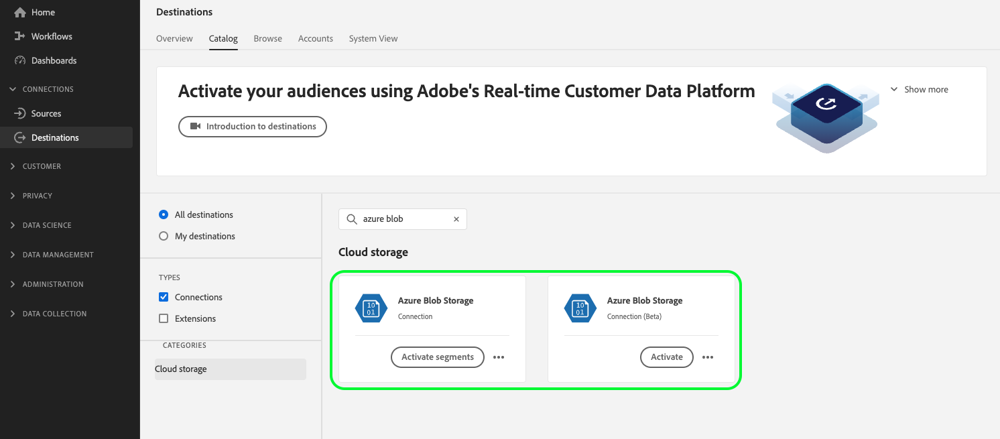

# [!DNL Azure Blob] conexão

## Log de alterações de destino {#changelog}

>[!IMPORTANT]
>
>Com a versão beta da funcionalidade de exportação de conjuntos de dados e a funcionalidade aprimorada de exportação de arquivos, agora você pode estar vendo dois [!DNL Azure Blob] no catálogo de destinos.
>* Se você já estiver exportando arquivos para o **[!UICONTROL Azure Blob]** destino: crie novos fluxos de dados para a nova **[!UICONTROL Azure Blob beta]** destino.
>* Se você ainda não tiver criado nenhum fluxo de dados para a variável **[!UICONTROL Azure Blob]** destino, use o novo **[!UICONTROL Azure Blob beta]** cartão para o qual exportar arquivos **[!UICONTROL Azure Blob]**.

As melhorias no novo [!DNL Azure Blob] cartão de destino incluem:

* [Suporte à exportação de conjuntos de dados](/help/destinations/ui/export-datasets.md).
* Adicional [opções de nomenclatura de arquivo](/help/destinations/ui/activate-batch-profile-destinations.md#scheduling).
* Capacidade de definir cabeçalhos de arquivos personalizados em seus arquivos exportados por meio da [etapa de mapeamento aprimorada](/help/destinations/ui/activate-batch-profile-destinations.md#mapping).
* [Capacidade de personalizar a formatação de arquivos de dados CSV exportados](/help/destinations/ui/batch-destinations-file-formatting-options.md).

## Visão geral {#overview}

[!DNL Azure Blob] (a seguir designado [!DNL Blob]) é a solução de armazenamento de objetos da Microsoft para a nuvem. Este tutorial fornece etapas para a criação de um [!DNL Blob] destino usando o [!DNL Platform] interface do usuário.

## Introdução

Este tutorial requer uma compreensão funcional dos seguintes componentes do Adobe Experience Platform:

* [[!DNL Experience Data Model (XDM)] Sistema](../../../xdm/home.md): a estrutura padronizada pela qual o Experience Platform organiza os dados de experiência do cliente.
   * [Noções básicas da composição do esquema](../../../xdm/schema/composition.md): saiba mais sobre os componentes básicos dos esquemas XDM, incluindo princípios fundamentais e práticas recomendadas na composição do esquema.
   * [Tutorial do Editor de esquemas](../../../xdm/tutorials/create-schema-ui.md): saiba como criar esquemas personalizados usando a interface do Editor de esquemas.
* [[!DNL Real-Time Customer Profile]](../../../profile/home.md): fornece um perfil de consumidor unificado em tempo real com base em dados agregados de várias fontes.

Se você já tiver um [!DNL Blob] destino, você pode ignorar o restante deste documento e prosseguir para o tutorial em [ativar segmentos para o seu destino](../../ui/activate-batch-profile-destinations.md).

## Tipo e frequência de exportação {#export-type-frequency}

Consulte a tabela abaixo para obter informações sobre o tipo e a frequência da exportação de destino.

| Item | Tipo | Notas |
---------|----------|---------|
| Tipo de exportação | **[!UICONTROL Baseado em perfil]** | Você está exportando todos os membros de um segmento, juntamente com os campos de esquema desejados (por exemplo: endereço de email, número de telefone, sobrenome), conforme escolhido na tela selecionar atributos de perfil da [workflow de ativação de destino](../../ui/activate-batch-profile-destinations.md#select-attributes). |
| Frequência de exportação | **[!UICONTROL Lote]** | Os destinos em lote exportam arquivos para plataformas downstream em incrementos de três, seis, oito, doze ou vinte e quatro horas. Leia mais sobre [destinos baseados em arquivo em lote](/help/destinations/destination-types.md#file-based). |

{style="table-layout:auto"}

## Formatos de arquivo não compatíveis {#file-formats}

[!DNL Experience Platform] O suporta o seguinte formato de arquivo a ser exportado para o [!DNL Azure Blob]:

* Valores separados por vírgula (CSV): no momento, o suporte para arquivos de dados exportados está limitado a valores separados por vírgula.

## Conectar ao destino {#connect}

>[!IMPORTANT]
> 
>Para se conectar ao destino, você precisa da variável **[!UICONTROL Gerenciar destinos]** [permissão de controle de acesso](/help/access-control/home.md#permissions). Leia o [visão geral do controle de acesso](/help/access-control/ui/overview.md) ou entre em contato com o administrador do produto para obter as permissões necessárias.

Para se conectar a esse destino, siga as etapas descritas no [tutorial de configuração de destino](../../ui/connect-destination.md). No workflow da configuração de destino, preencha os campos listados nas duas seções abaixo.

### Autenticar para destino {#authenticate}

>[!CONTEXTUALHELP]
>id="platform_destinations_connect_blob_rsa"
>title="Chave pública RSA"
>abstract="Opcionalmente, é possível anexar sua chave pública formatada em RSA para adicionar criptografia aos arquivos exportados. Veja um exemplo de uma chave corretamente formatada no link da documentação abaixo."

Para autenticar no destino, preencha os campos obrigatórios e selecione **[!UICONTROL Conectar ao destino]**.

* **[!UICONTROL String de conexão]**: a cadeia de conexão é necessária para acessar dados no armazenamento de Blob. A variável [!DNL Blob] o padrão da cadeia de conexão começa com: `DefaultEndpointsProtocol=https;AccountName={ACCOUNT_NAME};AccountKey={ACCOUNT_KEY}`.
   * Para obter mais informações sobre como configurar o [!DNL Blob] sequência de conexão, consulte [Configurar uma cadeia de conexão para uma conta de armazenamento do Azure](https://docs.microsoft.com/en-us/azure/storage/common/storage-configure-connection-string#configure-a-connection-string-for-an-azure-storage-account) na documentação do Microsoft.
* **[!UICONTROL Chave de criptografia]**: como opção, você pode anexar sua chave pública formatada em RSA para adicionar criptografia aos arquivos exportados. Veja um exemplo de uma chave de criptografia formatada corretamente na imagem abaixo.

   

### Preencher detalhes do destino {#destination-details}

Para configurar detalhes para o destino, preencha os campos obrigatórios e opcionais abaixo. Um asterisco ao lado de um campo na interface do usuário indica que o campo é obrigatório.

* **[!UICONTROL Nome]**: digite um nome que ajudará a identificar esse destino.
* **[!UICONTROL Descrição]**: digite uma descrição desse destino.
* **[!UICONTROL Caminho da pasta]**: digite o caminho para a pasta de destino que hospedará os arquivos exportados.
* **[!UICONTROL Container]**: digite o nome do [!DNL Azure Blob Storage] contêiner a ser usado por este destino.
* **[!UICONTROL Tipo de arquivo]**: selecione o formato que o Experience Platform deve usar para os arquivos exportados. Essa opção só está disponível para o **[!UICONTROL Azure Blob beta]** destino. Ao selecionar a variável [!UICONTROL CSV] , você também pode [configurar as opções de formatação de arquivo](../../ui/batch-destinations-file-formatting-options.md).
* **[!UICONTROL Formato de compactação]**: selecione o tipo de compactação que o Experience Platform deve usar para os arquivos exportados. Essa opção só está disponível para o **[!UICONTROL Azure Blob beta]** destino.
* 
   * **[!UICONTROL Incluir arquivo de manifesto]**: ative essa opção se desejar que as exportações incluam um arquivo JSON de manifesto que contenha informações sobre o local de exportação, o tamanho da exportação e muito mais. Essa opção só está disponível para o **[!UICONTROL Azure Blob beta]** destino.

### Ativar alertas {#enable-alerts}

Você pode ativar os alertas para receber notificações sobre o status do fluxo de dados para o seu destino. Selecione um alerta na lista para assinar e receber notificações sobre o status do seu fluxo de dados. Para obter mais informações sobre alertas, consulte o manual sobre [assinatura de alertas de destinos usando a interface do](../../ui/alerts.md).

Quando terminar de fornecer detalhes da conexão de destino, selecione **[!UICONTROL Próxima]**.

## Ativar segmentos para este destino {#activate}

>[!IMPORTANT]
> 
>Para ativar os dados, é necessário **[!UICONTROL Gerenciar destinos]**, **[!UICONTROL Ativar destinos]**, **[!UICONTROL Exibir perfis]**, e **[!UICONTROL Exibir segmentos]** [permissões de controle de acesso](/help/access-control/home.md#permissions). Leia o [visão geral do controle de acesso](/help/access-control/ui/overview.md) ou entre em contato com o administrador do produto para obter as permissões necessárias.

Consulte [Ativar dados do público-alvo para destinos de exportação de perfil em lote](../../ui/activate-batch-profile-destinations.md) para obter instruções sobre como ativar segmentos de público-alvo para esse destino.

## (Beta) Exportar conjuntos de dados {#export-datasets}

Esse destino suporta exportações de conjunto de dados. Para obter informações completas sobre como configurar exportações de conjunto de dados, leia o [exportar tutorial de conjuntos de dados](/help/destinations/ui/export-datasets.md).

## Dados exportados {#exported-data}

Para [!DNL Azure Blob Storage] destinos, [!DNL Platform] cria um `.csv` no local de armazenamento fornecido. Para obter mais informações sobre os arquivos, consulte [Ativar dados do público-alvo para destinos de exportação de perfil em lote](../../ui/activate-batch-profile-destinations.md) no tutorial de ativação de segmentos.