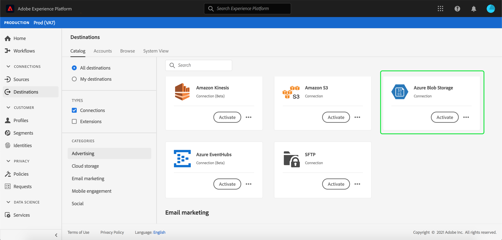
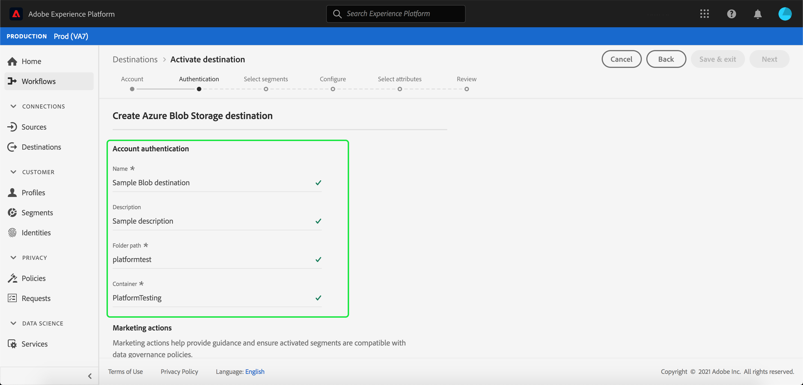

# [!DNL Azure Blob] conexão

## Visão geral {#overview}

[!DNL Azure Blob] (a seguir denominado &quot;[!DNL Blob]&quot;) é a solução de armazenamento de objetos da Microsoft para a nuvem. Este tutorial fornece etapas para criar um destino [!DNL Blob] usando a interface do usuário [!DNL Platform].

## Introdução

Este tutorial requer uma compreensão funcional dos seguintes componentes do Adobe Experience Platform:

- [[!DNL Experience Data Model (XDM)] Sistema](../../../xdm/home.md): A estrutura padronizada pela qual o Experience Platform organiza os dados de experiência do cliente.
   - [Noções básicas da composição](../../../xdm/schema/composition.md) do schema: Saiba mais sobre os elementos básicos dos esquemas XDM, incluindo princípios-chave e práticas recomendadas na composição do schema.
   - [Tutorial](../../../xdm/tutorials/create-schema-ui.md) do Editor de esquema: Saiba como criar esquemas personalizados usando a interface do Editor de esquemas.
- [[!DNL Real-time Customer Profile]](../../../profile/home.md): Fornece um perfil de consumidor unificado e em tempo real com base em dados agregados de várias fontes.

Se você já tiver um destino Blob válido, ignore o restante deste documento e prossiga para o tutorial em [ativando segmentos para seu destino](../../ui/activate-destinations.md).

## Formatos de arquivo não suportados {#file-formats}

[!DNL Experience Platform] O suporta o seguinte formato de arquivo a ser exportado para o  [!DNL Blob]:

- Valores separados por delimitador (DSV): No momento, o suporte para arquivos de dados formatados em DSV está limitado a valores separados por vírgula. O suporte para arquivos DSV gerais será fornecido no futuro. Para obter mais informações sobre arquivos compatíveis, leia a seção armazenamento em nuvem no tutorial em [ativando destinos](../../ui/activate-destinations.md#esp-and-cloud-storage).

## Conecte sua conta Blob {#connect-destination}

Faça logon em [Adobe Experience Platform](https://platform.adobe.com) e selecione **[!UICONTROL Destinations]** na barra de navegação esquerda para acessar o espaço de trabalho **[!UICONTROL Destinations]**. A tela **[!UICONTROL Catalog]** exibe uma variedade de destinos com os quais você pode criar uma conta.

Você pode selecionar a categoria apropriada no catálogo no lado esquerdo da tela. Como alternativa, você pode encontrar o destino específico com o qual deseja trabalhar usando a opção de pesquisa.

Na categoria **[!UICONTROL Cloud Storage]**, selecione **[!UICONTROL Azure Blob Storage]**, seguido por **[!UICONTROL Configure]**.

>[!NOTE]
>
>Se uma conexão com esse destino já existir, você poderá ver um botão **[!UICONTROL Activate]** no cartão de destino. Para obter mais informações sobre a diferença entre **[!UICONTROL Activate]** e **[!UICONTROL Configure]**, consulte a seção [Catálogo](../../ui/destinations-workspace.md#catalog) da documentação do espaço de trabalho de destino.

A página **[!UICONTROL Connect to Azure Blob Storage]** é exibida. Nesta página, você pode usar novas credenciais ou credenciais existentes.

## Nova conta {#new-account}

Se estiver usando novas credenciais, selecione **[!UICONTROL New account]**. No formulário de entrada exibido, forneça a string de conexão. A cadeia de conexão é necessária para acessar dados no armazenamento do Blob. O padrão da string de conexão [!DNL Blob] começa com: `DefaultEndpointsProtocol=https;AccountName={ACCOUNT_NAME};AccountKey={ACCOUNT_KEY}`.

Para obter mais informações sobre como configurar sua cadeia de conexão [!DNL Blob], consulte [Configurar uma cadeia de conexão para uma conta de armazenamento do Azure](https://docs.microsoft.com/en-us/azure/storage/common/storage-configure-connection-string#configure-a-connection-string-for-an-azure-storage-account) na documentação da Microsoft.

Opcionalmente, é possível anexar sua chave pública formatada em RSA para adicionar criptografia aos arquivos exportados. Observe que essa chave pública **must** deve ser gravada como uma string codificada em Base64.

## Conta existente {#existing-account}

Para conectar uma conta existente, selecione a conta [!DNL Blob] com a qual deseja se conectar e selecione **Próximo** para prosseguir.

## Autenticação {#authentication}

A página **Authentication** é exibida. No formulário de entrada exibido, forneça um nome, uma descrição opcional, o caminho da pasta e o container dos arquivos.

Nesta etapa, você também pode selecionar qualquer **[!UICONTROL Marketing actions]** que deve se aplicar a esse destino. As ações de marketing indicam a intenção para a qual os dados serão exportados para o destino. Você pode selecionar ações de marketing definidas pelo Adobe ou criar sua própria ação de marketing. Para obter mais informações sobre ações de marketing, consulte a [Visão geral das políticas de uso de dados](../../../data-governance/policies/overview.md).

Quando terminar, selecione **[!UICONTROL Create destination]**.

## Próximas etapas {#activate-segments}

Ao seguir este tutorial, você estabeleceu uma conexão com sua conta [!DNL Blob]. Agora você pode continuar para o próximo tutorial e [ativar segmentos para seu destino](../../ui/activate-destinations.md).
