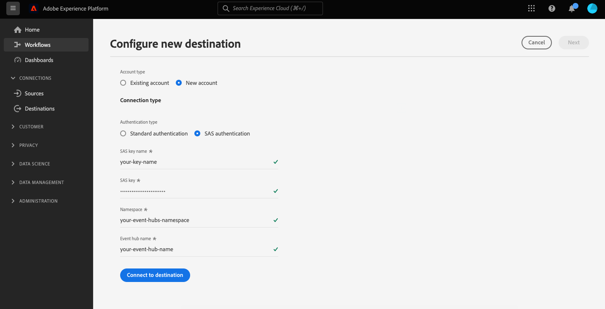

# [!DNL Azure Event Hubs] conexão

## Visão geral {#overview}

>[!IMPORTANT]
>
> Este destino só está disponível para [Real-time Customer Data Platform Ultimate](https://helpx.adobe.com/legal/product-descriptions/real-time-customer-data-platform.html) clientes.

[!DNL Azure Event Hubs] O é uma grande plataforma de transmissão de dados e um serviço de assimilação de eventos. Ele pode receber e processar milhões de eventos por segundo. Os dados enviados para um hub de eventos podem ser transformados e armazenados usando qualquer provedor de análise em tempo real ou adaptadores de armazenamento/agrupamento.

Você pode criar uma conexão de saída em tempo real com o [!DNL Azure Event Hubs] armazenamento para fazer o stream de dados do Adobe Experience Platform.

* Para obter mais informações sobre [!DNL Azure Event Hubs], consulte o [Documentação do Microsoft](https://docs.microsoft.com/en-us/azure/event-hubs/event-hubs-about).
* Para conectar-se a [!DNL Azure Event Hubs] programaticamente, consulte o [Tutorial da API de destinos de transmissão](../../api/streaming-destinations.md).
* Para conectar-se a [!DNL Azure Event Hubs] usando a interface do usuário da Platform, consulte as seções abaixo.


## Casos de uso {#use-cases}

Ao usar destinos de transmissão, como [!DNL Azure Event Hubs], você pode alimentar facilmente eventos de segmentação de alto valor e atributos de perfil associados nos sistemas de sua escolha.

Por exemplo, um prospecto baixou um white-paper que os qualifica em um segmento de &quot;alta propensão à conversão&quot;. Mapeando o segmento em que o prospecto entra na [!DNL Azure Event Hubs] , você receberia esse evento em [!DNL Azure Event Hubs]. Lá, você pode empregar uma abordagem faça você mesmo e descrever a lógica de negócios sobre o evento, pois acha que funcionaria melhor com os sistemas de TI de sua empresa.

## Tipo e frequência de exportação {#export-type-frequency}

Consulte a tabela abaixo para obter informações sobre o tipo e a frequência da exportação de destino.

| Item | Tipo | Notas |
---------|----------|---------|
| Tipo de exportação | **[!UICONTROL Baseado em perfil]** | Você está exportando todos os membros de um segmento, junto com os campos de esquema desejados (por exemplo: endereço de email, número de telefone, sobrenome), conforme escolhido na tela selecionar atributos de perfil do [fluxo de trabalho de ativação de destino](../../ui/activate-batch-profile-destinations.md#select-attributes). |
| Frequência de exportação | **[!UICONTROL Streaming]** | Os destinos de transmissão são conexões &quot;sempre ativas&quot; baseadas em API. Assim que um perfil é atualizado no Experience Platform com base na avaliação do segmento, o conector envia a atualização downstream para a plataforma de destino. Leia mais sobre [destinos de transmissão](/help/destinations/destination-types.md#streaming-destinations). |

{style=&quot;table-layout:auto&quot;}

## Endereço IP lista de permissões {#ip-address-allowlist}

Para atender aos requisitos de segurança e conformidade dos clientes, o Experience Platform fornece uma lista de IPs estáticos que você pode lista de permissões a [!DNL Azure Event Hubs] destino. Consulte [LISTA DE PERMISSÕES de endereço IP para destinos de transmissão](/help/destinations/catalog/streaming/ip-address-allow-list.md) para obter a lista completa de IPs a serem lista de permissões.

## Conecte-se ao destino {#connect}

>[!IMPORTANT]
> 
>Para se conectar ao destino, é necessário **[!UICONTROL Gerenciar destinos]** [permissão de controle de acesso](/help/access-control/home.md#permissions). Leia o [visão geral do controle de acesso](/help/access-control/ui/overview.md) ou entre em contato com o administrador do produto para obter as permissões necessárias.

Para se conectar a esse destino, siga as etapas descritas na [tutorial de configuração de destino](../../ui/connect-destination.md). Ao se conectar a esse destino, você deve fornecer as seguintes informações:

### Informações de autenticação {#authentication-information}

#### Autenticação padrão {#standard-authentication}


Se você selecionar a variável **[!UICONTROL Autenticação padrão]** digite para se conectar ao terminal HTTP, insira os campos abaixo e selecione **[!UICONTROL Ligar ao destino]**:

* **[!UICONTROL Nome da chave SAS]**: O nome da regra de autorização, que também é conhecida como o nome da chave SAS.
* **[!UICONTROL Chave SAS]**: A chave primária do namespace de Hubs de Eventos. O `sasPolicy` que `sasKey` corresponde a deve ter **gerenciar** direitos configurados para que a lista Hubs de eventos seja preenchida. Saiba mais sobre como autenticar para [!DNL Azure Event Hubs] com chaves SAS no [Documentação do Microsoft](https://docs.microsoft.com/en-us/azure/event-hubs/authenticate-shared-access-signature).
* **[!UICONTROL Namespace]**: Preencha o [!DNL Azure Event Hubs] namespace. Saiba mais sobre [!DNL Azure Event Hubs] namespaces no [Documentação do Microsoft](https://docs.microsoft.com/en-us/azure/event-hubs/event-hubs-create#create-an-event-hubs-namespace).

#### Autenticação SAS (Shared Access Signature) {#sas-authentication}



Se você selecionar a variável **[!UICONTROL Autenticação padrão]** digite para se conectar ao terminal HTTP, insira os campos abaixo e selecione **[!UICONTROL Ligar ao destino]**:

* **[!UICONTROL Nome da chave SAS]**: O nome da regra de autorização, que também é conhecida como o nome da chave SAS.
* **[!UICONTROL Chave SAS]**: A chave primária do namespace de Hubs de Eventos. O `sasPolicy` que `sasKey` corresponde a deve ter **gerenciar** direitos configurados para que a lista Hubs de eventos seja preenchida. Saiba mais sobre como autenticar para [!DNL Azure Event Hubs] com chaves SAS no [Documentação do Microsoft](https://docs.microsoft.com/en-us/azure/event-hubs/authenticate-shared-access-signature).
* **[!UICONTROL Namespace]**: Preencha o [!DNL Azure Event Hubs] namespace. Saiba mais sobre [!DNL Azure Event Hubs] namespaces no [Documentação do Microsoft](https://docs.microsoft.com/en-us/azure/event-hubs/event-hubs-create#create-an-event-hubs-namespace).
* **[!UICONTROL Namespace]**: Preencha o [!DNL Azure Event Hubs] namespace. Saiba mais sobre [!DNL Azure Event Hubs] namespaces no [Documentação do Microsoft](https://docs.microsoft.com/en-us/azure/event-hubs/event-hubs-create#create-an-event-hubs-namespace).

### Preencha os detalhes do destino {#destination-details}

>[!CONTEXTUALHELP]
>id="platform_destinations_connect_eventhubs_includesegmentnames"
>title="Incluir nomes de segmentos"
>abstract="Alterne se deseja que a exportação de dados inclua os nomes dos segmentos que você está exportando. Visualize a documentação de um exemplo de exportação de dados com esta opção selecionada."

>[!CONTEXTUALHELP]
>id="platform_destinations_connect_eventhubs_includesegmenttimestamps"
>title="Incluir carimbos de data e hora do segmento"
>abstract="Alterne se deseja que a exportação de dados inclua o carimbo de data e hora UNIX quando os segmentos foram criados e atualizados, bem como o carimbo de data e hora UNIX quando os segmentos foram mapeados para o destino para ativação. Visualize a documentação de um exemplo de exportação de dados com esta opção selecionada."

Para configurar detalhes para o destino, preencha os campos obrigatórios e opcionais abaixo. Um asterisco ao lado de um campo na interface do usuário indica que o campo é obrigatório.


* **[!UICONTROL Nome]**: Preencha um nome para a conexão com o [!DNL Azure Event Hubs].
* **[!UICONTROL Descrição]**: Forneça uma descrição da conexão.  Exemplos: &quot;Clientes Premium&quot;, &quot;Clientes interessados em cozinha&quot;.
* **[!UICONTROL eventHubName]**: Forneça um nome para o fluxo para sua [!DNL Azure Event Hubs] destino.
* **[!UICONTROL Incluir nomes de segmentos]**: Alterne se deseja que a exportação de dados inclua os nomes dos segmentos que você está exportando. Para obter um exemplo de exportação de dados com essa opção selecionada, consulte [Dados exportados](#exported-data) mais abaixo.
* **[!UICONTROL Incluir carimbos de data e hora do segmento]**: Alterne se deseja que a exportação de dados inclua o carimbo de data e hora UNIX quando os segmentos foram criados e atualizados, bem como o carimbo de data e hora UNIX quando os segmentos foram mapeados para o destino para ativação. Para obter um exemplo de exportação de dados com essa opção selecionada, consulte [Dados exportados](#exported-data) mais abaixo.

### Ativar alertas {#enable-alerts}

Você pode habilitar alertas para receber notificações sobre o status do fluxo de dados para seu destino. Selecione um alerta na lista para assinar e receber notificações sobre o status do seu fluxo de dados. Para obter mais informações sobre alertas, consulte o guia sobre [inscrever-se em alertas de destinos usando a interface do usuário](../../ui/alerts.md).

Quando terminar de fornecer detalhes para a conexão de destino, selecione **[!UICONTROL Próximo]**.

## Ativar segmentos para este destino {#activate}

>[!IMPORTANT]
> 
>Para ativar os dados, é necessário **[!UICONTROL Gerenciar destinos]**, **[!UICONTROL Ativar destinos]**, **[!UICONTROL Exibir perfis]** e **[!UICONTROL Exibir segmentos]** [permissões de controle de acesso](/help/access-control/home.md#permissions). Leia o [visão geral do controle de acesso](/help/access-control/ui/overview.md) ou entre em contato com o administrador do produto para obter as permissões necessárias.

Consulte [Ativar dados do público-alvo para destinos de exportação de perfil de fluxo](../../ui/activate-streaming-profile-destinations.md) para obter instruções sobre como ativar segmentos de público-alvo para este destino.

## Comportamento de exportação de perfil {#profile-export-behavior}

O Experience Platform otimiza o comportamento de exportação do perfil para seu [!DNL Azure Event Hubs] , para exportar somente dados para seu destino quando ocorrerem atualizações relevantes de um perfil após a qualificação de segmento ou outros eventos significativos. Os perfis são exportados para o seu destino nas seguintes situações:

* A atualização de perfil foi determinada por uma alteração na associação de segmento para pelo menos um dos segmentos mapeados para o destino. Por exemplo, o perfil se qualificou para um dos segmentos mapeados para o destino ou saiu de um dos segmentos mapeados para o destino.
* A atualização do perfil foi determinada por uma alteração no [mapa de identidade](/help/xdm/field-groups/profile/identitymap.md). Por exemplo, um perfil que já se qualificou para um dos segmentos mapeados para o destino foi adicionado a uma nova identidade no atributo do mapa de identidade.
* A atualização do perfil foi determinada por uma alteração nos atributos para pelo menos um dos atributos mapeados para o destino. Por exemplo, um dos atributos mapeados para o destino na etapa de mapeamento é adicionado a um perfil.

Em todos os casos descritos acima, somente os perfis onde as atualizações relevantes ocorreram são exportados para o seu destino. Por exemplo, se um segmento mapeado para o fluxo de destino tiver cem membros e cinco novos perfis se qualificarem para o segmento, a exportação para o seu destino será incremental e incluirá apenas os cinco novos perfis.

Observe que todos os atributos mapeados são exportados para um perfil, independentemente de onde as alterações se encontrem. Portanto, no exemplo acima, todos os atributos mapeados para esses cinco novos perfis serão exportados mesmo se os atributos em si não tiverem sido alterados.

### O que determina uma exportação de dados e o que está incluído na exportação {#what-determines-export-what-is-included}

Com relação aos dados exportados para um determinado perfil, é importante entender os dois conceitos diferentes de *o que determina a exportação de dados para o [!DNL Azure Event Hubs] destino* e *que dados estão incluídos na exportação*.

| O que determina uma exportação de destino | O que está incluído na exportação de destino |
|---------|----------|
| <ul><li>Atributos e segmentos mapeados servem como a dica para uma exportação de destino. Isso significa que, se qualquer segmento mapeado alterar estados (de nulo para realizado ou de realizado/existente para existente) ou se qualquer atributo mapeado for atualizado, uma exportação de destino será iniciada.</li><li>Como as identidades não podem ser mapeadas para [!DNL Azure Event Hubs] destinos, as alterações em qualquer identidade em um determinado perfil também determinam exportações de destino.</li><li>Uma alteração para um atributo é definida como qualquer atualização no atributo, independentemente de ser ou não o mesmo valor. Isso significa que uma substituição em um atributo é considerada uma alteração mesmo que o valor em si não tenha sido alterado.</li></ul> | <ul><li>Todos os segmentos (com o status de associação mais recente), independentemente de estarem ou não mapeados no fluxo de dados, são incluídos na variável `segmentMembership` objeto.</li><li>Todas as identidades na `identityMap` também são incluídos (no momento, o Experience Platform não suporta mapeamento de identidade na [!DNL Azure Event Hubs] destino).</li><li>Somente os atributos mapeados são incluídos na exportação de destino.</li></ul> |

{style=&quot;table-layout:fixed&quot;}

Por exemplo, considere esse fluxo de dados como um [!DNL Azure Event Hubs] destino onde três segmentos são selecionados no fluxo de dados e quatro atributos são mapeados para o destino.


Uma exportação de perfil para o destino pode ser determinada por um perfil que se qualifica para ou sai de um dos *três segmentos mapeados*. No entanto, na exportação de dados, no `segmentMembership` objeto (consulte [Dados exportados](#exported-data) seção abaixo), outros segmentos não mapeados podem aparecer, se esse perfil específico for membro deles. Se um perfil se qualificar para o segmento Cliente com Carros coreanos, mas também for membro do filme &quot;Voltar ao futuro&quot; assistido e dos segmentos de fãs de ficção científica, esses dois outros segmentos também estarão presentes `segmentMembership` objeto da exportação de dados, mesmo que não estejam mapeados no fluxo de dados.

Do ponto de vista dos atributos do perfil, qualquer alteração nos quatro atributos mapeados acima determinará uma exportação de destino e qualquer um dos quatro atributos mapeados presentes no perfil estará presente na exportação de dados.

## Preenchimento retroativo de dados históricos {#historical-data-backfill}

Ao adicionar um novo segmento a um destino existente ou ao criar um novo destino e mapear segmentos a ele, o Experience Platform exporta os dados de qualificação de segmento históricos para o destino. Perfis que se qualificaram para o segmento *before* o segmento adicionado ao destino é exportado para o destino dentro de aproximadamente uma hora.

## Dados exportados {#exported-data}

Seu exportado [!DNL Experience Platform] os dados chegam ao seu [!DNL Azure Event Hubs] destino no formato JSON. Por exemplo, a exportação abaixo contém um perfil que se qualificou para um determinado segmento, é um membro de outros dois segmentos e saiu de outro segmento. A exportação também inclui o atributo de perfil nome, sobrenome, data de nascimento e endereço de email pessoal. As identidades desse perfil são ECID e email.

```json
{
  "person": {
    "birthDate": "YYYY-MM-DD",
    "name": {
      "firstName": "John",
      "lastName": "Doe"
    }
  },
  "personalEmail": {
    "address": "john.doe@acme.com"
  },
  "segmentMembership": {
   "ups":{
      "7841ba61-23c1-4bb3-a495-00d3g5fe1e93":{
         "lastQualificationTime":"2022-01-11T21:24:39Z",
         "status":"exited"
      },
      "59bd2fkd-3c48-4b18-bf56-4f5c5e6967ae":{
         "lastQualificationTime":"2022-01-02T23:37:33Z",
         "status":"existing"
      },
      "947c1c46-008d-40b0-92ec-3af86eaf41c1":{
         "lastQualificationTime":"2021-08-25T23:37:33Z",
         "status":"existing"
      },
      "5114d758-ce71-43ba-b53e-e2a91d67b67f":{
         "lastQualificationTime":"2022-01-11T23:37:33Z",
         "status":"realized"
      }
   }
},
  "identityMap": {
    "ecid": [
      {
        "id": "14575006536349286404619648085736425115"
      },
      {
        "id": "66478888669296734530114754794777368480"
      }
    ],
    "email_lc_sha256": [
      {
        "id": "655332b5fa2aea4498bf7a290cff017cb4"
      },
      {
        "id": "66baf76ef9de8b42df8903f00e0e3dc0b7"
      }
    ]
  }
}
```

Abaixo estão outros exemplos de dados exportados, dependendo das configurações da interface do usuário selecionadas no fluxo de destino de conexão para a variável **[!UICONTROL Incluir nomes de segmentos]** e **[!UICONTROL Incluir carimbos de data e hora do segmento]** opções:

+++ A amostra de exportação de dados abaixo inclui nomes de segmentos na `segmentMembership` seção

```json
"segmentMembership": {
        "ups": {
          "5b998cb9-9488-4ec3-8d95-fa8338ced490": {
            "lastQualificationTime": "2019-04-15T02:41:50+0000",
            "status": "existing",
            "createdAt": 1648553325000,
            "updatedAt": 1648553330000,
            "mappingCreatedAt": 1649856570000,
            "mappingUpdatedAt": 1649856570000,
            "name": "First name equals John"
          }
        }
      }
```

+++

+++ A amostra de exportação de dados abaixo inclui carimbos de data e hora do segmento na `segmentMembership` seção

```json
"segmentMembership": {
        "ups": {
          "5b998cb9-9488-4ec3-8d95-fa8338ced490": {
            "lastQualificationTime": "2019-04-15T02:41:50+0000",
            "status": "existing",
            "createdAt": 1648553325000,
            "updatedAt": 1648553330000,
            "mappingCreatedAt": 1649856570000,
            "mappingUpdatedAt": 1649856570000,
          }
        }
      }
```

+++

## Limites e política de repetição {#limits-retry-policy}

Em 95% das vezes, o Experience Platform tenta oferecer uma latência de taxa de transferência inferior a 10 minutos para mensagens enviadas com êxito com uma taxa inferior a 10.000 solicitações por segundo para cada fluxo de dados para um destino HTTP.

No caso de solicitações com falha no destino da API HTTP, o Experience Platform armazena as solicitações com falha e tenta novamente duas vezes para enviar as solicitações para o terminal.

>[!MORELIKETHIS]
>
>* [Conecte-se aos Hubs de Eventos do Azure e ative dados usando a API do Serviço de Fluxo](../../api/streaming-destinations.md)
>* [Destino do AWS Kinesis](./amazon-kinesis.md)
>* [Tipos e categorias de destino](../../destination-types.md)

