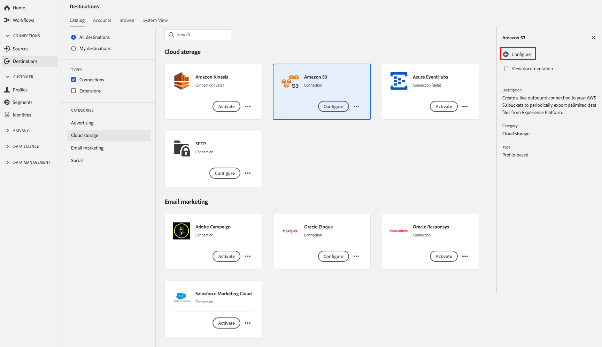

# Fluxo de trabalho para criar destinos de armazenamentos na nuvem

## Visão geral

Esta página explica como você pode se conectar aos locais do armazenamento em nuvem na Plataforma de dados do cliente em tempo real.

Em **[!UICONTROL Conexões]** > **[!UICONTROL Destinos]**, selecione o destino preferencial do armazenamento na nuvem e, em seguida, selecione **[!UICONTROL Configurar]**.

>[!NOTE]
>
>Se já existir uma conexão com esse destino, você poderá ver um botão **[!UICONTROL Ativar]** no cartão de destino. Para obter mais informações sobre a diferença entre **[!UICONTROL Ativar]** e **[!UICONTROL Configurar]**, consulte a seção [Catálogo](../../ui/destinations-workspace.md#catalog) da documentação da área de trabalho de destino.

Na etapa **[!UICONTROL Autenticação]** , se você tiver configurado anteriormente uma conexão com o destino do armazenamento na nuvem, selecione Conta **** existente e selecione a conexão existente. Ou você pode selecionar **[!UICONTROL Nova conta]** para configurar uma nova conexão com o destino do armazenamento na nuvem. Preencha as credenciais de autenticação de sua conta e selecione **[!UICONTROL Conectar ao destino]**. Opcionalmente, você pode anexar sua chave pública formatada pelo RSA para adicionar criptografia aos arquivos exportados. Observe que essa chave pública **deve** ser gravada como uma string codificada em Base64.

Consulte destino [Amazon S3](./amazon-s3.md) , [[!DNL Amazon Kinesis]](./amazon-kinesis.md) destino, [[!DNL Azure Event Hubs]](./azure-event-hubs.md) destino e destino [SFTP](./sftp.md) para obter detalhes específicos sobre as credenciais inseridas na etapa **Autenticação** .

>[!NOTE]
>
>A CDP em tempo real oferece suporte à validação de credenciais no processo de autenticação e exibe uma mensagem de erro se você inserir credenciais incorretas no local do armazenamento na nuvem. Isso garante que você não conclua o fluxo de trabalho com credenciais incorretas.

Na etapa **[!UICONTROL Configuração]** , digite um **[!UICONTROL Nome]** e uma **[!UICONTROL Descrição]** para o fluxo de ativação.

Também nesta etapa, você pode selecionar qualquer caso **[!UICONTROL de uso de]** Marketing que deve ser aplicado a este destino. Os casos de uso de marketing indicam a intenção para a qual os dados serão exportados para o destino. Você pode selecionar de casos de uso de marketing definidos pelo Adobe ou criar seu próprio caso de uso de marketing. Para obter mais informações sobre casos de uso de marketing, consulte a página [Data Governance em CDP](../../../rtcdp/privacy/data-governance-overview.md#destinations) em tempo real. Para obter informações sobre casos individuais de uso de marketing definidos pelo Adobe, consulte a visão geral [das políticas de uso de](../../../data-governance/policies/overview.md#core-actions)dados.

Para destinos do Amazon S3, insira o nome **[!UICONTROL do]** bucket e o caminho **[!UICONTROL da]** pasta no destino do armazenamento na nuvem onde os arquivos serão entregues. Selecione **[!UICONTROL Criar destino]** depois de preencher os campos acima.

Para destinos SFTP, insira o caminho **[!UICONTROL da]** pasta onde os arquivos serão entregues. Selecione **[!UICONTROL Criar destino]** depois de preencher os campos acima.

Para [!DNL Amazon Kinesis] destinos, forneça o nome do seu fluxo de dados existente em sua [!DNL Amazon Kinesis] conta. A CDP em tempo real exportará dados para esse fluxo. Selecione **[!UICONTROL Criar destino]** depois de preencher os campos acima.

Para [!DNL Azure Event Hubs] destinos, forneça o nome do seu fluxo de dados existente em sua [!DNL Amazon Event Hubs] conta. A CDP em tempo real exportará dados para esse fluxo. Selecione **[!UICONTROL Criar destino]** depois de preencher os campos acima.

Seu destino agora é criado. Você pode selecionar **[!UICONTROL Salvar e sair]** se quiser ativar segmentos posteriormente ou selecionar **[!UICONTROL Próximo]** para continuar o fluxo de trabalho e selecionar segmentos para ativar. Em ambos os casos, consulte a próxima seção, [Ativar segmentos](#activate-segments), para que o restante do fluxo de trabalho exporte dados.

## Ativar segmentos {#activate-segments}

Consulte [Ativar perfis e segmentos em um destino](../../ui/activate-destinations.md) para obter informações sobre o fluxo de trabalho da ativação de segmentos.