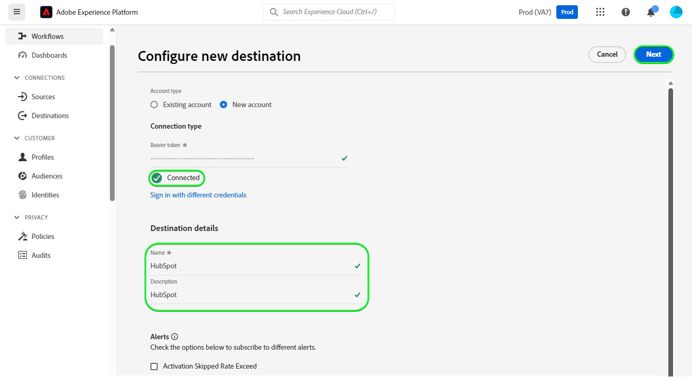

# [!DNL HubSpot] conexão

[[!DNL HubSpot]](https://www.hubspot.com) é uma plataforma de CRM com todos os softwares, integrações e recursos necessários para conectar marketing, vendas, gerenciamento de conteúdo e atendimento ao cliente. Ele permite conectar seus dados, equipes e clientes em uma plataforma de CRM.

Este [!DNL Adobe Experience Platform] [destino](/help/destinations/home.md) aproveita a [[!DNL HubSpot] API de Contatos](https://developers.hubspot.com/docs/api/crm/contacts) para atualizar os contatos em [!DNL HubSpot] de um público-alvo existente da Experience Platform após a ativação.

As instruções para autenticar na sua instância do [!DNL HubSpot] estão mais abaixo, na seção [Autenticar no destino](#authenticate).

## Casos de uso {#use-cases}

Para ajudá-lo a entender melhor como e quando você deve usar o destino [!DNL HubSpot], veja um exemplo de caso de uso que os clientes da Adobe Experience Platform podem resolver usando esse destino.

Os contatos do [!DNL HubSpot] armazenam informações sobre as pessoas físicas que interagem com sua empresa. Sua equipe usa os contatos existentes no [!DNL HubSpot] para criar os públicos-alvo da Experience Platform. Após enviar esses públicos-alvo para [!DNL HubSpot], suas informações são atualizadas e cada contato recebe uma propriedade com seu valor como o nome do público-alvo que indica a qual público-alvo o contato pertence.

## Pré-requisitos {#prerequisites}

Consulte as seções abaixo para quaisquer pré-requisitos que você precise configurar no Experience Platform e [!DNL HubSpot] e para obter informações que você deve coletar antes de trabalhar com o destino [!DNL HubSpot].

### Pré-requisitos do Experience Platform {#prerequisites-in-experience-platform}

Antes de ativar dados para o destino [!DNL HubSpot], você deve ter um [esquema](/help/xdm/schema/composition.md), um [conjunto de dados](https://experienceleague.adobe.com/docs/platform-learn/tutorials/data-ingestion/create-datasets-and-ingest-data.html?lang=pt-BR) e [públicos-alvo](https://experienceleague.adobe.com/docs/platform-learn/tutorials/audiences/create-audiences.html?lang=pt-BR) criados em [!DNL Experience Platform].

Consulte a documentação do Experience Platform para [Grupo de campos do esquema de Detalhes da associação do público-alvo](/help/xdm/field-groups/profile/segmentation.md) se precisar de orientação sobre os status do público-alvo.

### Pré-requisitos para o destino [!DNL HubSpot] {#prerequisites-destination}

Observe os seguintes pré-requisitos para exportar dados do Experience Platform para sua conta do [!DNL HubSpot]:

#### Você deve ter uma conta [!DNL HubSpot] {#prerequisites-account}

Para exportar dados do Experience Platform para sua conta [!DNL Hubspot], você precisa ter uma conta [!DNL HubSpot]. Se você ainda não tiver uma, visite a página [Configurar sua conta HubSpot](https://knowledge.hubspot.com/get-started/set-up-your-account) e siga as orientações para registrar e criar sua conta.

#### Colete o token de acesso do aplicativo privado [!DNL HubSpot] {#gather-credentials}

Você precisa do [!DNL HubSpot] `Access token` para permitir que o destino [!DNL HubSpot] faça chamadas de API por meio do aplicativo privado [!DNL HubSpot] na sua conta [!DNL HubSpot]. O `Access token` serve como `Bearer token` quando você [autentica o destino](#authenticate).

Se você não tiver um aplicativo privado, siga a documentação para [Criar um aplicativo privado [!DNL HubSpot]](https://developers.hubspot.com/docs/api/private-apps).

>[!IMPORTANT]
>
> O aplicativo privado deve ser atribuído aos escopos abaixo:
> &#x200B;> `crm.objects.contacts.write`, `crm.objects.contacts.read`
> &#x200B;> `crm.schemas.contacts.write`, `crm.schemas.contacts.read`

| Credencial | Descrição | Exemplo |
| --- | --- | --- |
| `Bearer token` | O `Access token` do seu aplicativo privado [!DNL HubSpot].  Para obter o [!DNL HubSpot] `Access token`, siga a documentação do [!DNL HubSpot] para [fazer chamadas de API com o token de acesso do seu aplicativo](https://developers.hubspot.com/docs/api/private-apps#make-api-calls-with-your-app-s-access-token). | `pat-na1-11223344-abcde-12345-9876-1234a1b23456` |

## Medidas de proteção {#guardrails}

[!DNL HubSpot] aplicativos privados estão sujeitos a [Limites de Taxa](https://developers.hubspot.com/docs/api/usage-details). O número de chamadas que seu aplicativo privado pode fazer se baseia na sua assinatura de conta do [!DNL HubSpot] e se você adquiriu o complemento API. Consulte também [Outros limites](https://developers.hubspot.com/docs/api/usage-details#other-limits).

## Identidades suportadas {#supported-identities}

[!DNL HubSpot] oferece suporte à atualização de identidades descritas na tabela abaixo. Saiba mais sobre [identidades](/help/identity-service/features/namespaces.md).

| Identidade de destino | Exemplo | Descrição | Considerações |
|---|---|---|---|
| `email` | `test@test.com` | Endereço de email do contato. | Obrigatório |

## Públicos-alvo compatíveis {#supported-audiences}

Esta seção descreve todos os públicos-alvo que você pode exportar para esse destino.

Este destino dá suporte à ativação de todos os públicos-alvo gerados pelo [Serviço de Segmentação](../../../segmentation/home.md) da Experience Platform.

Esse destino também suporta a ativação dos públicos-alvo descritos na tabela abaixo.

| Tipo de público-alvo | Descrição |
|---------|----------|
| Uploads personalizados | Públicos [importados](../../../segmentation/ui/audience-portal.md#import-audience) para o Experience Platform de arquivos CSV. |

{style="table-layout:auto"}

## Tipo e frequência de exportação {#export-type-frequency}

Consulte a tabela abaixo para obter informações sobre o tipo e a frequência da exportação de destino.

| Item | Tipo | Notas |
|---------|----------|---------|
| Tipo de exportação | **[!UICONTROL Profile-based]** | <ul><li>Você está exportando todos os membros de um público-alvo, juntamente com os campos de esquema desejados *(por exemplo: endereço de email, número de telefone, sobrenome)*, de acordo com o mapeamento de campos.</li><li> Além disso, uma nova propriedade é criada em [!DNL HubSpot] usando o nome do público-alvo e seu valor é com o status do público-alvo correspondente do Experience Platform, para cada um dos públicos selecionados.</li></ul> |
| Frequência de exportação | **[!UICONTROL Streaming]** | <ul><li>Os destinos de transmissão são conexões baseadas em API &quot;sempre ativas&quot;. Assim que um perfil for atualizado no Experience Platform com base na avaliação do público-alvo, o conector enviará a atualização downstream para a plataforma de destino. Leia mais sobre [destinos de streaming](/help/destinations/destination-types.md#streaming-destinations).</li></ul> |

{style="table-layout:auto"}

## Conectar ao destino {#connect}

>[!IMPORTANT]
>
>Para se conectar ao destino, você precisa das **[!UICONTROL View Destinations]** e **[!UICONTROL Manage Destinations]** [permissões de controle de acesso](/help/access-control/home.md#permissions). Leia a [visão geral do controle de acesso](/help/access-control/ui/overview.md) ou contate o administrador do produto para obter as permissões necessárias.

Para se conectar a este destino, siga as etapas descritas no [tutorial de configuração de destino](../../ui/connect-destination.md). No workflow de configuração de destino, preencha os campos listados nas duas seções abaixo.

Em **[!UICONTROL Destinations]** > **[!UICONTROL Catalog]** pesquise por [!DNL HubSpot]. Como alternativa, você pode localizá-lo na categoria **[!UICONTROL CRM]**.

### Autenticar para o destino {#authenticate}

Preencha os campos obrigatórios abaixo. Consulte a seção [Coletar o [!DNL HubSpot] token de acesso ao aplicativo privado](#gather-credentials) para obter qualquer orientação.

* **[!UICONTROL Bearer token]**: O token de acesso do seu aplicativo privado [!DNL HubSpot].

Para autenticar no destino, selecione **[!UICONTROL Connect to destination]**.

Se os detalhes fornecidos forem válidos, a interface exibirá um status **[!UICONTROL Connected]** com uma marca de seleção verde. Você pode prosseguir para a próxima etapa.

### Preencher detalhes do destino {#destination-details}

Para configurar detalhes para o destino, preencha os campos obrigatórios e opcionais abaixo. Um asterisco ao lado de um campo na interface do usuário indica que o campo é obrigatório.

* **[!UICONTROL Name]**: Um nome pelo qual você reconhecerá este destino no futuro.
* **[!UICONTROL Description]**: uma descrição que ajudará você a identificar este destino no futuro.

### Ativar alertas {#enable-alerts}

Você pode ativar os alertas para receber notificações sobre o status do fluxo de dados para o seu destino. Selecione um alerta na lista para assinar e receber notificações sobre o status do seu fluxo de dados. Para obter mais informações sobre alertas, consulte o manual sobre [assinatura de alertas de destinos usando a interface](../../ui/alerts.md).

Quando terminar de fornecer detalhes da conexão de destino, selecione **[!UICONTROL Next]**.

## Ativar públicos-alvo para esse destino {#activate}

>[!IMPORTANT]
>
>Para ativar dados, você precisa das **[!UICONTROL View Destinations]**, **[!UICONTROL Activate Destinations]**, **[!UICONTROL View Profiles]** e **[!UICONTROL View Segments]** [permissões de controle de acesso](/help/access-control/home.md#permissions). Leia a [visão geral do controle de acesso](/help/access-control/ui/overview.md) ou contate o administrador do produto para obter as permissões necessárias.

Leia [Ativar perfis e públicos-alvo para destinos de exportação de público-alvo de streaming](/help/destinations/ui/activate-segment-streaming-destinations.md) para obter instruções sobre como ativar públicos-alvo para este destino.

### Mapear atributos e identidades {#map}

Para enviar corretamente seus dados de público-alvo do Adobe Experience Platform para o destino [!DNL HubSpot], passe pela etapa de mapeamento de campos. O mapeamento consiste na criação de um link entre os campos do esquema do Experience Data Model (XDM) na sua conta do Experience Platform e seus equivalentes correspondentes no destino.

Para mapear corretamente os campos XDM para os campos de destino [!DNL HubSpot], siga as etapas abaixo:

#### Mapeando a identidade `Email`

A identidade `Email` é um mapeamento obrigatório para este destino. Siga as etapas abaixo para mapeá-la:

1. Na etapa **[!UICONTROL Mapping]**, selecione **[!UICONTROL Add new mapping]**. Agora você pode ver uma nova linha de mapeamento na tela.
   A captura de tela da 
1. Na janela **[!UICONTROL Select source field]**, escolha a **[!UICONTROL Select identity namespace]** e selecione uma identidade.
   
1. Na janela **[!UICONTROL Select target field]**, escolha a **[!UICONTROL Select attributes]** e selecione `email`.
   

| Campo de origem | Campo de público alvo | Obrigatório |
| --- | --- | --- |
| `IdentityMap: Email` | `Identity: email` | Sim |

Um exemplo com o mapeamento de identidade é mostrado abaixo:

#### Mapeando atributos **opcionais**

Para adicionar outros atributos que você deseja atualizar entre o esquema de perfil XDM e a conta [!DNL HubSpot], repita as etapas abaixo:

1. Na etapa **[!UICONTROL Mapping]**, selecione **[!UICONTROL Add new mapping]**. Agora você pode ver uma nova linha de mapeamento na tela.
   A captura de tela da 
1. Na janela **[!UICONTROL Select source field]**, escolha a categoria **[!UICONTROL Select attributes]** e selecione o atributo XDM.
   
1. Na janela **[!UICONTROL Select target field]**, escolha a categoria **[!UICONTROL Select attributes]** e selecione na lista de atributos que são preenchidos automaticamente na sua conta [!DNL HubSpot]. O destino usa a API [[!DNL HubSpot] Propriedades](https://developers.hubspot.com/docs/api/crm/properties) para recuperar essas informações. As [!DNL HubSpot] [propriedades padrão](https://knowledge.hubspot.com/contacts/hubspots-default-contact-properties) e qualquer propriedade personalizada são recuperadas para seleção como campos de destino.
   

Alguns mapeamentos disponíveis entre seu esquema de perfil XDM e [!DNL Hubspot] são mostrados abaixo:

| Campo de origem | Campo de público alvo |
| --- | --- |
| `xdm: person.name.firstName` | `Attribute: firstname` |
| `xdm: person.name.lastName` | `Attribute: lastname` |
| `xdm: workAddress.street1` | `Attribute: address` |
| `xdm: workAddress.city` | `Attribute: city` |
| `xdm: workAddress.country` | `Attribute: country` |

Um exemplo usando esses mapeamentos de atributos é mostrado abaixo:

Quando terminar de fornecer os mapeamentos para sua conexão de destino, selecione **[!UICONTROL Next]**.

## Validar exportação de dados {#exported-data}

Para validar se você configurou o destino corretamente, siga as etapas abaixo:

1. Faça logon no site [!DNL HubSpot] e navegue até a página **[!UICONTROL Contacts]** para verificar o status do público-alvo. Esta lista pode ser configurada para exibir colunas para as propriedades personalizadas criadas com o nome do público-alvo, cujo valor são os status do público-alvo.
   

1. Como alternativa, você pode detalhar uma página **[!UICONTROL Person]** individual e navegar até as propriedades que exibem o nome do público-alvo e os status do público-alvo.
   

## Uso e governança de dados {#data-usage-governance}

Todos os destinos do [!DNL Adobe Experience Platform] são compatíveis com as políticas de uso de dados ao manipular seus dados. Para obter informações detalhadas sobre como o [!DNL Adobe Experience Platform] impõe a governança de dados, consulte a [visão geral da Governança de Dados](/help/data-governance/home.md).

## Recursos adicionais {#additional-resources}

Informações adicionais úteis da documentação do [!DNL HubSpot] estão abaixo:

* [Métodos de autenticação no HubSpot](https://developers.hubspot.com/docs/api/intro-to-auth)
* Referências de API [!DNL HubSpot] para as APIs [Contatos](https://developers.hubspot.com/docs/api/crm/contacts) e [Propriedades](https://developers.hubspot.com/docs/api/crm/properties).

### Changelog

Esta seção captura a funcionalidade e as atualizações de documentação significativas feitas neste conector de destino.

+++ Exibir changelog

| Mês de lançamento | Tipo de atualização | Descrição |
|---|---|---|
| Setembro de 2023 | Versão inicial | Versão inicial de destino e publicação da documentação. |

{style="table-layout:auto"}

+++
