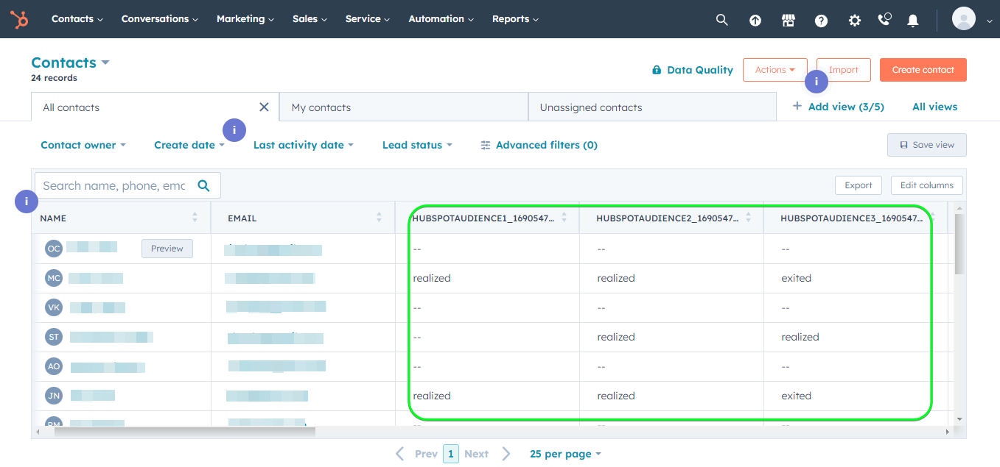

# Conexão com o [!DNL HubSpot]

[[!DNL HubSpot]](https://www.hubspot.com) O é uma plataforma de CRM com todos os softwares, integrações e recursos necessários para conectar marketing, vendas, gerenciamento de conteúdo e atendimento ao cliente. Ele permite conectar seus dados, equipes e clientes em uma plataforma de CRM.

Este [!DNL Adobe Experience Platform] [destino](/help/destinations/home.md) utiliza o [[!DNL HubSpot] API de Contatos](https://developers.hubspot.com/docs/api/crm/contacts), para atualizar contatos em [!DNL HubSpot] de um público-alvo Experience Platform existente após a ativação.

Instruções para autenticar em seu [!DNL HubSpot] exemplo, são apresentados mais abaixo, no [Autenticar para destino](#authenticate) seção.

## Casos de uso {#use-cases}

Para ajudá-lo a entender melhor como e quando você deve usar o [!DNL HubSpot] destino, este é um exemplo de caso de uso que os clientes do Adobe Experience Platform podem resolver usando esse destino.

[!DNL HubSpot] os contatos armazenam informações sobre as pessoas físicas que interagem com sua empresa. Sua equipe usa os contatos existentes no [!DNL HubSpot] para criar os públicos-alvo do Experience Platform. Depois de enviar esses públicos-alvo para o [!DNL HubSpot], suas informações são atualizadas e cada contato recebe uma propriedade com seu valor como o nome do público-alvo que indica a qual público o contato pertence.

## Pré-requisitos {#prerequisites}

Consulte as seções abaixo para obter os pré-requisitos que você precisa configurar no Experience Platform e [!DNL HubSpot] e para informações que você deve coletar antes de trabalhar com a [!DNL HubSpot] destino.

### Pré-requisitos do Experience Platform {#prerequisites-in-experience-platform}

Antes de ativar os dados para o [!DNL HubSpot] destino, você deve ter um [schema](/help/xdm/schema/composition.md), um [conjunto de dados](https://experienceleague.adobe.com/docs/platform-learn/tutorials/data-ingestion/create-datasets-and-ingest-data.html?lang=en), e [públicos](https://experienceleague.adobe.com/docs/platform-learn/tutorials/audiences/create-audiences.html?lang=en) criado em [!DNL Experience Platform].

Consulte a documentação do Experience Platform para [Grupo de campos de esquema Detalhes da associação do público](/help/xdm/field-groups/profile/segmentation.md) se precisar de orientação sobre os status do público-alvo.

### Pré-requisitos para a [!DNL HubSpot] destino {#prerequisites-destination}

Observe os seguintes pré-requisitos para exportar dados da Platform para o seu [!DNL HubSpot] conta:

#### Você deve ter um [!DNL HubSpot] account {#prerequisites-account}

Para exportar dados da Platform para o seu [!DNL Hubspot] conta que você precisa ter [!DNL HubSpot] conta. Se ainda não tiver um, visite o [Configurar sua conta do HubSpot](https://knowledge.hubspot.com/get-started/set-up-your-account) e siga as orientações para registrar e criar sua conta.

#### Obtenha os [!DNL HubSpot] token de acesso do aplicativo privado {#gather-credentials}

Você precisa do seu [!DNL HubSpot] `Access token` para permitir que o [!DNL HubSpot] destino para fazer chamadas de API por meio de seus [!DNL HubSpot] aplicativo privado em seu [!DNL HubSpot] conta. A variável `Access token` serve como `Bearer token` quando você [autenticar o destino](#authenticate).

Se você não tiver um aplicativo privado, siga a documentação para [Criar um aplicativo privado no [!DNL HubSpot]](https://developers.hubspot.com/docs/api/private-apps).

>[!IMPORTANT]
>
> O aplicativo privado deve ser atribuído aos escopos abaixo:
> `crm.objects.contacts.write`, `crm.objects.contacts.read`
> `crm.schemas.contacts.write`, `crm.schemas.contacts.read`

| Credencial | Descrição | Exemplo |
| --- | --- | --- |
| `Bearer token` | A variável `Access token` do seu [!DNL HubSpot] aplicativo privado.  Para obter o seu [!DNL HubSpot] `Access token` siga o [!DNL HubSpot] documentação para [fazer chamadas de API com o token de acesso do aplicativo](https://developers.hubspot.com/docs/api/private-apps#make-api-calls-with-your-app-s-access-token). | `pat-na1-11223344-abcde-12345-9876-1234a1b23456` |

## Medidas de proteção {#guardrails}

[!DNL HubSpot] aplicativos privados estão sujeitos a [Limites de taxa](https://developers.hubspot.com/docs/api/usage-details). O número de chamadas que seu aplicativo privado pode fazer se baseia em seus [!DNL HubSpot] conta e se você adquiriu o complemento de API. Consulte também a seção [Outros limites](https://developers.hubspot.com/docs/api/usage-details#other-limits).

## Identidades suportadas {#supported-identities}

[!DNL HubSpot] O oferece suporte à atualização de identidades descritas na tabela abaixo. Saiba mais sobre [identidades](/help/identity-service/namespaces.md).

| Identidade de destino | Exemplo | Descrição | Considerações |
|---|---|---|---|
| `email` | `test@test.com` | Endereço de email do contato. | Obrigatório |

## Públicos-alvo compatíveis {#supported-audiences}

Esta seção descreve todos os públicos-alvo que você pode exportar para esse destino.

Esse destino suporta a ativação de todos os públicos-alvo gerados pelo Experience Platform [Serviço de segmentação](../../../segmentation/home.md).

Esse destino também suporta a ativação dos públicos-alvo descritos na tabela abaixo.

| Tipo de público | Descrição |
---------|----------|
| Uploads personalizados | Públicos-alvo [importado](../../../segmentation/ui/overview.md#import-audience) para o Experience Platform de arquivos CSV. |

{style="table-layout:auto"}

## Tipo e frequência de exportação {#export-type-frequency}

Consulte a tabela abaixo para obter informações sobre o tipo e a frequência da exportação de destino.

| Item | Tipo | Notas |
---------|----------|---------|
| Tipo de exportação | **[!UICONTROL Baseado em perfil]** | <ul><li>Você está exportando todos os membros de um público-alvo, juntamente com os campos de esquema desejados *(por exemplo: endereço de email, número de telefone, sobrenome)*, de acordo com o mapeamento de campo.</li><li> Além disso, uma nova propriedade é criada no [!DNL HubSpot] usar o nome do público-alvo e seu valor é com o status de público-alvo correspondente da Platform, para cada um dos públicos-alvo selecionados.</li></ul> |
| Frequência de exportação | **[!UICONTROL Streaming]** | <ul><li>Os destinos de transmissão são conexões baseadas em API &quot;sempre ativas&quot;. Assim que um perfil é atualizado em Experience Platform com base na avaliação do público-alvo, o conector envia a atualização downstream para a plataforma de destino. Leia mais sobre [destinos de transmissão](/help/destinations/destination-types.md#streaming-destinations).</li></ul> |

{style="table-layout:auto"}

## Conectar ao destino {#connect}

>[!IMPORTANT]
>
>Para se conectar ao destino, você precisa da variável **[!UICONTROL Gerenciar destinos]** [permissão de controle de acesso](/help/access-control/home.md#permissions). Leia o [visão geral do controle de acesso](/help/access-control/ui/overview.md) ou entre em contato com o administrador do produto para obter as permissões necessárias.

Para se conectar a esse destino, siga as etapas descritas no [tutorial de configuração de destino](../../ui/connect-destination.md). No workflow de configuração de destino, preencha os campos listados nas duas seções abaixo.

Dentro de **[!UICONTROL Destinos]** > **[!UICONTROL Catálogo]** pesquisar [!DNL HubSpot]. Como alternativa, você pode localizá-lo na **[!UICONTROL CRM]** categoria.

### Autenticar para destino {#authenticate}

Preencha os campos obrigatórios abaixo. Consulte a [Obtenha os [!DNL HubSpot] token de acesso do aplicativo privado](#gather-credentials) para obter orientação.
* **[!UICONTROL Token de portador]**: O token de acesso do [!DNL HubSpot] aplicativo privado.

Para autenticar no destino, selecione **[!UICONTROL Conectar ao destino]**.

Se os detalhes fornecidos forem válidos, a interface exibirá uma **[!UICONTROL Conectado]** com uma marca de seleção verde. Você pode prosseguir para a próxima etapa.

### Preencher detalhes do destino {#destination-details}

Para configurar detalhes para o destino, preencha os campos obrigatórios e opcionais abaixo. Um asterisco ao lado de um campo na interface do usuário indica que o campo é obrigatório.

* **[!UICONTROL Nome]**: um nome pelo qual você reconhecerá esse destino no futuro.
* **[!UICONTROL Descrição]**: uma descrição que ajudará você a identificar esse destino no futuro.

### Ativar alertas {#enable-alerts}

Você pode ativar os alertas para receber notificações sobre o status do fluxo de dados para o seu destino. Selecione um alerta na lista para assinar e receber notificações sobre o status do seu fluxo de dados. Para obter mais informações sobre alertas, consulte o manual sobre [assinatura de alertas de destinos usando a interface do](../../ui/alerts.md).

Quando terminar de fornecer detalhes da conexão de destino, selecione **[!UICONTROL Próxima]**.

## Ativar públicos para este destino {#activate}

>[!IMPORTANT]
>
>Para ativar os dados, é necessário **[!UICONTROL Gerenciar destinos]**, **[!UICONTROL Ativar destinos]**, **[!UICONTROL Exibir perfis]**, e **[!UICONTROL Exibir segmentos]** [permissões de controle de acesso](/help/access-control/home.md#permissions). Leia o [visão geral do controle de acesso](/help/access-control/ui/overview.md) ou entre em contato com o administrador do produto para obter as permissões necessárias.

Ler [Ativar perfis e públicos para destinos de exportação de público de transmissão](/help/destinations/ui/activate-segment-streaming-destinations.md) para obter instruções sobre como ativar públicos-alvo para esse destino.

### Mapear atributos e identidades {#map}

Para enviar corretamente os dados do público-alvo do Adobe Experience Platform para a [!DNL HubSpot] destino, você deve passar pela etapa de mapeamento de campos. O mapeamento consiste em criar um link entre os campos do esquema do Experience Data Model (XDM) na sua conta da Platform e seus equivalentes correspondentes no destino.

Para mapear corretamente os campos XDM para o [!DNL HubSpot] campos de destino, siga as etapas abaixo:

#### Mapeamento de `Email` identidade

A variável `Email` a identidade é um mapeamento obrigatório para este destino. Siga as etapas abaixo para mapeá-la:
1. No **[!UICONTROL Mapeamento]** etapa, selecione **[!UICONTROL Adicionar novo mapeamento]**. Agora você pode ver uma nova linha de mapeamento na tela.
   
1. No **[!UICONTROL Selecionar campo de origem]** escolha a **[!UICONTROL Selecionar namespace de identidade]** e selecione uma identidade.
   
1. No **[!UICONTROL Selecionar campo de destino]** escolha a **[!UICONTROL Selecionar atributos]** e selecione `email`.
   

| Campo de origem | Campo de destino | Obrigatório |
| --- | --- | --- |
| `IdentityMap: Email` | `Identity: email` | Sim |

Um exemplo com o mapeamento de identidade é mostrado abaixo:

#### Mapeamento **opcional** atributos

Para adicionar outros atributos que você deseja atualizar entre o esquema de perfil XDM e o [!DNL HubSpot] repita as etapas abaixo:
1. No **[!UICONTROL Mapeamento]** etapa, selecione **[!UICONTROL Adicionar novo mapeamento]**. Agora você pode ver uma nova linha de mapeamento na tela.
   
1. No **[!UICONTROL Selecionar campo de origem]** escolha a **[!UICONTROL Selecionar atributos]** e selecione o atributo XDM.
   
1. No **[!UICONTROL Selecionar campo de destino]** escolha **[!UICONTROL Selecionar atributos]** categoria e selecione na lista de atributos que são automaticamente preenchidos na [!DNL HubSpot] conta. O destino usa o [[!DNL HubSpot] Propriedades](https://developers.hubspot.com/docs/api/crm/properties) API para recuperar essas informações. Ambos [!DNL HubSpot] [propriedades padrão](https://knowledge.hubspot.com/contacts/hubspots-default-contact-properties) e todas as propriedades personalizadas são recuperadas para seleção como campos de destino.
   

Alguns mapeamentos disponíveis entre o esquema de perfil XDM e [!DNL Hubspot] são mostrados abaixo:

| Campo de origem | Campo de destino |
| --- | --- |
| `xdm: person.name.firstName` | `Attribute: firstname` |
| `xdm: person.name.lastName` | `Attribute: lastname` |
| `xdm: workAddress.street1` | `Attribute: address` |
| `xdm: workAddress.city` | `Attribute: city` |
| `xdm: workAddress.country` | `Attribute: country` |

Um exemplo usando esses mapeamentos de atributos é mostrado abaixo:

Quando terminar de fornecer os mapeamentos para sua conexão de destino, selecione **[!UICONTROL Próxima]**.

## Validar exportação de dados {#exported-data}

Para validar se você configurou o destino corretamente, siga as etapas abaixo:

1. Faça logon no [!DNL HubSpot] site e, em seguida, navegue até o **[!UICONTROL Contatos]** página para verificar os status do público-alvo. Esta lista pode ser configurada para exibir colunas para as propriedades personalizadas criadas com o nome do público-alvo, cujo valor são os status do público-alvo.
   

1. Como alternativa, você pode detalhar uma **[!UICONTROL Person]** e navegue até as propriedades que exibem o nome do público-alvo e os status do público.
   

## Uso e governança de dados {#data-usage-governance}

Todos [!DNL Adobe Experience Platform] os destinos estão em conformidade com as políticas de uso de dados ao manipular seus dados. Para obter informações detalhadas sobre como [!DNL Adobe Experience Platform] fiscaliza a governança de dados, consulte o [Visão geral da governança de dados](/help/data-governance/home.md).

## Recursos adicionais {#additional-resources}

Informações adicionais úteis do [!DNL HubSpot] A documentação do está abaixo:
* [Métodos de autenticação no HubSpot](https://developers.hubspot.com/docs/api/intro-to-auth)
* [!DNL HubSpot] Referências de API para o [Contatos](https://developers.hubspot.com/docs/api/crm/contacts) e [Propriedades](https://developers.hubspot.com/docs/api/crm/properties) APIs.

### Changelog

Esta seção captura a funcionalidade e as atualizações de documentação significativas feitas neste conector de destino.

+++ Exibir changelog

| Mês de lançamento | Tipo de atualização | Descrição |
|---|---|---|
| Setembro de 2023 | Versão inicial | Versão inicial de destino e publicação da documentação. |

{style="table-layout:auto"}

+++