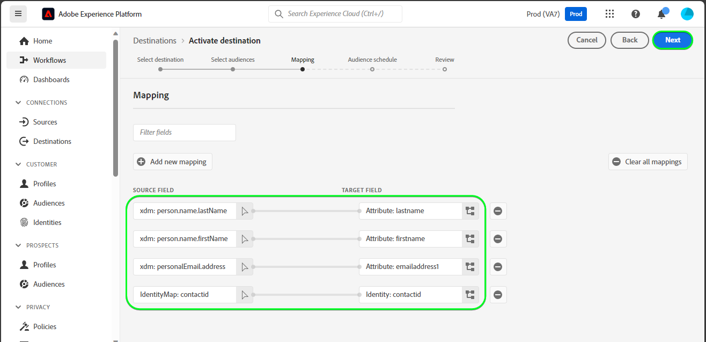

# [!DNL Microsoft Dynamics 365] conexão

## Visão geral {#overview}

[[!DNL Microsoft Dynamics 365]](https://dynamics.microsoft.com/en-us/) é uma plataforma de aplicativo comercial baseada em nuvem que combina ERP (Enterprise Resource Planning, planejamento de recursos corporativos) e CRM (Customer Relationship Management, gerenciamento de relacionamento com o cliente), aplicativos de produtividade e ferramentas de IA, para oferecer operações completas, mais perfeitas e controladas, melhor potencial de crescimento e custos reduzidos.

Este [!DNL Adobe Experience Platform] [destino](/help/destinations/home.md) aproveita o [[!DNL Contact Entity Reference API]](https://docs.microsoft.com/en-us/dynamics365/customerengagement/on-premises/developer/entities/contact?view=op-9-1), que permite que você atualize as identidades dentro de um público-alvo para [!DNL Dynamics 365].

[!DNL Dynamics 365] usa OAuth 2 com Concessão de Autorização como o mecanismo de autenticação para se comunicar com o [!DNL Contact Entity Reference API]. As instruções para autenticar na sua instância do [!DNL Dynamics 365] estão mais abaixo, na seção [Autenticar no destino](#authenticate).

## Casos de uso {#use-cases}

Como profissional de marketing, você pode fornecer experiências personalizadas aos seus usuários com base em atributos de seus perfis do Adobe Experience Platform. Você pode compilar audiências com base em seus dados offline e enviá-las para o [!DNL Dynamics 365], para exibição nos feeds de usuário, assim que as audiências e os perfis forem atualizados no Adobe Experience Platform.

## Pré-requisitos {#prerequisites}

### Pré-requisitos do Experience Platform {#prerequisites-in-experience-platform}

Antes de ativar dados para o destino [!DNL Dynamics 365], você deve ter um [esquema](/help/xdm/schema/composition.md), um [conjunto de dados](https://experienceleague.adobe.com/docs/platform-learn/tutorials/data-ingestion/create-datasets-and-ingest-data.html?lang=pt-BR) e [públicos-alvo](https://experienceleague.adobe.com/docs/platform-learn/tutorials/audiences/create-audiences.html?lang=pt-BR) criados em [!DNL Experience Platform].

Consulte a documentação da Adobe para [Grupo de campos do esquema de Detalhes da associação do público-alvo](/help/xdm/field-groups/profile/segmentation.md) se precisar de orientação sobre os status do público-alvo.

### [!DNL Microsoft Dynamics 365] pré-requisitos {#prerequisites-destination}

Observe os seguintes pré-requisitos em [!DNL Dynamics 365] para exportar dados do Experience Platform para sua conta do [!DNL Dynamics 365]:

#### Você precisa ter uma conta [!DNL Microsoft Dynamics 365] {#prerequisites-account}

Vá para a página de [!DNL Dynamics 365] [avaliação](https://dynamics.microsoft.com/en-us/dynamics-365-free-trial/) para se registrar e criar uma conta, caso ainda não tenha uma.

#### Criar campo dentro de [!DNL Dynamics 365] {#prerequisites-custom-field}

Crie o campo personalizado do tipo `Simple` com dados de campo do tipo `Single Line of Text` que o Experience Platform usará para atualizar o status do público-alvo em [!DNL Dynamics 365].

Consulte a documentação [!DNL Dynamics 365] [Criar ou editar um campo (atributo)](https://docs.microsoft.com/en-us/dynamics365/customerengagement/on-premises/customize/create-edit-fields?view=op-9-1) se precisar de orientação adicional.

Anote o **[!UICONTROL Customization prefix]** do campo personalizado que você criar em [!DNL Dynamics 365]. Você precisará desse prefixo durante a etapa [Preencher detalhes do destino](#destination-details). Consulte a seção [Criar e editar campos](https://learn.microsoft.com/en-us/dynamics365/customerengagement/on-premises/customize/create-edit-fields?view=op-9-1#create-and-edit-fields) da documentação do [!DNL Dynamics 365] para obter mais detalhes.

Um exemplo de configuração dentro de [!DNL Dynamics 365] é mostrado abaixo:

#### Registrar um aplicativo e um usuário de aplicativo no Azure Ative Diretory {#prerequisites-app-user}

Para habilitar o [!DNL Dynamics 365] para acessar os recursos, você precisará fazer logon com o [!DNL Azure Account] para [[!DNL Azure Active Directory]](https://docs.microsoft.com/en-us/azure/active-directory/develop/howto-create-service-principal-portal#register-an-application-with-azure-ad-and-create-a-service-principal) e criar o seguinte:

* Um aplicativo [!DNL Azure Active Directory]
* Uma Entidade de serviço
* Um segredo de aplicativo

Você também precisará [criar um usuário do aplicativo](https://docs.microsoft.com/en-us/power-platform/admin/manage-application-users#create-an-application-user) em [!DNL Azure Active Directory] e associá-lo ao aplicativo recém-criado.

#### Obter credenciais de [!DNL Dynamics 365] {#gather-credentials}

Anote os itens abaixo antes de autenticar no destino do CRM [!DNL Dynamics 365]:

| Credencial | Descrição | Exemplo |
| --- | --- | --- |
| `Client ID` | A ID do Cliente [!DNL Dynamics 365] do aplicativo [!DNL Azure Active Directory]. Consulte a [[!DNL Dynamics 365] documentação](https://docs.microsoft.com/en-us/azure/active-directory/develop/howto-create-service-principal-portal#get-tenant-and-app-id-values-for-signing-in) para obter orientação. | `ababbaba-abab-baba-acac-acacacacacac` |
| `Client Secret` | O Segredo do Cliente [!DNL Dynamics 365] do aplicativo [!DNL Azure Active Directory]. Você usaria a opção #2 na [[!DNL Dynamics 365] documentação](https://docs.microsoft.com/en-us/azure/active-directory/develop/howto-create-service-principal-portal#authentication-two-options). | `abcde~abcdefghijklmnopqrstuvwxyz12345678` para orientação. |
| `Tenant ID` | A ID de Locatário do [!DNL Dynamics 365] para seu aplicativo [!DNL Azure Active Directory]. Consulte a [[!DNL Dynamics 365] documentação](https://docs.microsoft.com/en-us/azure/active-directory/develop/howto-create-service-principal-portal#get-tenant-and-app-id-values-for-signing-in) para obter orientação. | `1234567-aaaa-12ab-ba21-1234567890` |
| `Region` | A região do Microsoft associada ao URL do ambiente.  Consulte a [[!DNL Dynamics 365] documentação](https://learn.microsoft.com/en-us/power-platform/admin/new-datacenter-regions) para obter orientação. | Se o seu domínio for o abaixo, você precisa fornecer o valor destacado para o campo CRM no seletor suspenso ao autenticar no [destino](#authenticate).  *org57771b33.`crm`.dynamics.com*  Como exemplo: se sua empresa estiver provisionada na região da América do Norte (NAM), sua URL será `crm.dynamics.com` e você precisará selecionar `crm`. Se sua empresa for provisionada na região do Canadá (CAN), sua URL será `crm3.dynamics.com` e você precisará selecionar `crm3`. |
| `Environment URL` | Consulte a [[!DNL Dynamics 365] documentação](https://docs.microsoft.com/en-us/dynamics365/customerengagement/on-premises/developer/org-service/discover-url-organization-organization-service?view=op-9-1) para obter orientação. | Se o domínio [!DNL Dynamics 365] for o abaixo, você precisará do valor realçado.  *`org57771b33`.crm.dynamics.com* |

{style="table-layout:auto"}

## Medidas de proteção {#guardrails}

A página [Solicitações de limites e alocações](https://docs.microsoft.com/en-us/power-platform/admin/api-request-limits-allocations) detalha os limites de API [!DNL Dynamics 365] associados à sua licença do [!DNL Dynamics 365]. Você precisa garantir que seus dados e carga estejam dentro dessas restrições.

## Identidades suportadas {#supported-identities}

[!DNL Dynamics 365] oferece suporte à atualização de identidades descritas na tabela abaixo. Saiba mais sobre [identidades](/help/identity-service/features/namespaces.md).

| Identidade de destino | Exemplo | Descrição | Considerações |
|---|---|---|---|
| `contactid` | 7eb682f1-ca75-e511-80d4-00155d2a68d1 | Identificador exclusivo de um contato. | **Obrigatório**. Consulte a [[!DNL Dynamics 365] documentação](https://docs.microsoft.com/en-us/dynamics365/customerengagement/on-premises/developer/entities/contact?view=op-9-1) para obter mais detalhes. |

{style="table-layout:auto"}

## Públicos-alvo compatíveis {#supported-audiences}

Esta seção descreve todos os públicos-alvo que você pode exportar para esse destino.

Este destino dá suporte à ativação de todos os públicos-alvo gerados pelo [Serviço de Segmentação](../../../segmentation/home.md) da Experience Platform.

## Tipo e frequência de exportação {#export-type-frequency}

Consulte a tabela abaixo para obter informações sobre o tipo e a frequência da exportação de destino.

| Item | Tipo | Notas |
|---------|----------|---------|
| Tipo de exportação | **[!UICONTROL Profile-based]** | <ul><li>Você está exportando todos os membros de um público-alvo, juntamente com os campos de esquema desejados *(por exemplo: endereço de email, número de telefone, sobrenome)*, de acordo com o mapeamento de campos.</li><li> Cada status de público-alvo no [!DNL Dynamics 365] é atualizado com o status de público-alvo correspondente do Experience Platform, com base no valor **[!UICONTROL Mapping ID]** fornecido durante a etapa [agendamento de público-alvo](#schedule-audience-export-example).</li></ul> |
| Frequência de exportação | **[!UICONTROL Streaming]** | <ul><li>Os destinos de transmissão são conexões baseadas em API &quot;sempre ativas&quot;. Assim que um perfil for atualizado no Experience Platform com base na avaliação do público-alvo, o conector enviará a atualização downstream para a plataforma de destino. Leia mais sobre [destinos de streaming](/help/destinations/destination-types.md#streaming-destinations).</li></ul> |

{style="table-layout:auto"}

## Conectar ao destino {#connect}

>[!IMPORTANT]
>
>Para se conectar ao destino, você precisa das **[!UICONTROL View Destinations]** e **[!UICONTROL Manage Destinations]** [permissões de controle de acesso](/help/access-control/home.md#permissions). Leia a [visão geral do controle de acesso](/help/access-control/ui/overview.md) ou contate o administrador do produto para obter as permissões necessárias.

Para se conectar a este destino, siga as etapas descritas no [tutorial de configuração de destino](../../ui/connect-destination.md). No workflow de configuração de destino, preencha os campos listados nas duas seções abaixo.

Em **[!UICONTROL Destinations]** > **[!UICONTROL Catalog]** pesquise por [!DNL Dynamics 365]. Como alternativa, você pode localizá-lo na categoria **[!UICONTROL CRM]**.

### Autenticar para o destino {#authenticate}

Para autenticar no destino, selecione **[!UICONTROL Connect to destination]**.

Preencha os campos obrigatórios abaixo. Consulte a seção [Coletar credenciais do Dynamics 365](#gather-credentials) para obter orientação.

* **[!UICONTROL Client ID]**: A ID do Cliente [!DNL Dynamics 365] do aplicativo [!DNL Azure Active Directory].
* **[!UICONTROL Tenant ID]**: A ID de Locatário [!DNL Dynamics 365] do aplicativo [!DNL Azure Active Directory].
* **[!UICONTROL Client Secret]**: O Segredo do Cliente [!DNL Dynamics 365] do aplicativo [!DNL Azure Active Directory].
* **[!UICONTROL Region]**: Sua Região [[!DNL Dynamics 365]](https://learn.microsoft.com/en-us/power-platform/admin/new-datacenter-regions). Como exemplo: se sua empresa for provisionada na região da América do Norte (NAM), sua URL será `crm.dynamics.com` e você precisará selecionar `crm`. Se sua empresa for provisionada na região do Canadá (CAN), sua URL será `crm3.dynamics.com` e você precisará selecionar `crm3`.
* **[!UICONTROL Environment URL]**: Sua URL de Ambiente [!DNL Dynamics 365].

Se os detalhes fornecidos forem válidos, a interface exibirá um status **[!UICONTROL Connected]** com uma marca de seleção verde. Você pode prosseguir para a próxima etapa.

### Preencher detalhes do destino {#destination-details}

Para configurar detalhes para o destino, preencha os campos obrigatórios e opcionais abaixo. Um asterisco ao lado de um campo na interface do usuário indica que o campo é obrigatório.

* **[!UICONTROL Name]**: Um nome pelo qual você reconhecerá este destino no futuro.
* **[!UICONTROL Description]**: uma descrição que ajudará você a identificar este destino no futuro.
* **[!UICONTROL Customization Prefix]**: O `Customization prefix` do campo personalizado que você criou em [!DNL Dynamics 365]. Consulte a seção [Criar e editar campos](https://learn.microsoft.com/en-us/dynamics365/customerengagement/on-premises/customize/create-edit-fields?view=op-9-1#create-and-edit-fields) da documentação do [!DNL Dynamics 365] para obter mais detalhes.

### Ativar alertas {#enable-alerts}

Você pode ativar os alertas para receber notificações sobre o status do fluxo de dados para o seu destino. Selecione um alerta na lista para assinar e receber notificações sobre o status do seu fluxo de dados. Para obter mais informações sobre alertas, consulte o manual sobre [assinatura de alertas de destinos usando a interface](../../ui/alerts.md).

Quando terminar de fornecer detalhes da conexão de destino, selecione **[!UICONTROL Next]**.

## Ativar públicos-alvo para esse destino {#activate}

>[!IMPORTANT]
> 
>* Para ativar dados, você precisa das **[!UICONTROL View Destinations]**, **[!UICONTROL Activate Destinations]**, **[!UICONTROL View Profiles]** e **[!UICONTROL View Segments]** [permissões de controle de acesso](/help/access-control/home.md#permissions). Leia a [visão geral do controle de acesso](/help/access-control/ui/overview.md) ou contate o administrador do produto para obter as permissões necessárias.
>* Para exportar *identidades*, você precisa da **[!UICONTROL View Identity Graph]** [permissão de controle de acesso](/help/access-control/home.md#permissions).   {width="100" zoomable="yes"}

Leia [Ativar perfis e públicos-alvo para destinos de exportação de público-alvo de streaming](/help/destinations/ui/activate-segment-streaming-destinations.md) para obter instruções sobre como ativar públicos-alvo para este destino.

### Considerações e exemplo de mapeamento {#mapping-considerations-example}

Para enviar corretamente seus dados de público-alvo do Adobe Experience Platform para o destino [!DNL Dynamics 365], é necessário passar pela etapa de mapeamento de campos. O mapeamento consiste na criação de um link entre os campos do esquema do Experience Data Model (XDM) na sua conta do Experience Platform e seus equivalentes correspondentes no destino. Para mapear corretamente os campos XDM para os campos de destino [!DNL Dynamics 365], siga estas etapas:

1. Na etapa **[!UICONTROL Mapping]**, selecione **[!UICONTROL Add new mapping]**. Você verá uma nova linha de mapeamento na tela.
   

1. Na janela **[!UICONTROL Select source field]**, escolha a categoria **[!UICONTROL Select identity namespace]** e selecione `contactid`.
   

1. Na janela **[!UICONTROL Select target field]**, selecione o tipo de campo de destino para o qual você deseja mapear seu campo de origem.
   * **[!UICONTROL Select identity namespace]**: selecione esta opção para mapear seu campo de origem para um namespace de identidade da lista.
     

   * Adicione o mapeamento a seguir entre o esquema de perfil XDM e a instância [!DNL Dynamics 365]:

     | Esquema de perfil XDM | [!DNL Dynamics 365] Instância | Obrigatório |
     |---|---|---|
     | `contactid` | `contactid` | Sim |

   * **[!UICONTROL Select custom attributes]**: selecione esta opção para mapear seu campo de origem para um atributo personalizado definido no campo **[!UICONTROL Attribute name]**. Consulte a [[!DNL Dynamics 365] documentação](https://docs.microsoft.com/en-us/dynamics365/customerengagement/on-premises/developer/entities/contact?view=op-9-1#entity-properties) para obter uma lista abrangente dos atributos suportados.
     

     >[!IMPORTANT]
     >
     > * Os nomes dos campos de destino devem estar em `lowercase`.
     > * Além disso, se você tiver um campo de origem de data ou carimbo de data e hora mapeado para um campo de destino [!DNL Dynamics 365] [data ou carimbo de data e hora](https://docs.microsoft.com/en-us/power-apps/developer/data-platform/webapi/reference/timestampdatemapping?view=dataverse-latest), verifique se o valor mapeado não está vazio. Se o valor do campo exportado estiver vazio, você encontrará uma mensagem de erro *`Bad request reported while pushing events to the destination. Please contact the administrator and try again.`* e os dados não serão atualizados. Esta é uma limitação de [!DNL Dynamics 365].

   * Por exemplo, dependendo dos valores que você deseja atualizar, adicione o seguinte mapeamento entre o esquema de perfil XDM e a instância [!DNL Dynamics 365]:

     | Esquema de perfil XDM | [!DNL Dynamics 365] Instância |
     |---|---|
     | `person.name.firstName` | `firstname` |
     | `person.name.lastName` | `lastname` |
     | `personalEmail.address` | `emailaddress1` |

   * Um exemplo usando esses mapeamentos é mostrado abaixo:

   

### Agendar exportação de público e exemplo {#schedule-audience-export-example}

Na etapa [[!UICONTROL Schedule audience export]](/help/destinations/ui/activate-segment-streaming-destinations.md#scheduling) do fluxo de trabalho de ativação, é necessário mapear manualmente os públicos-alvo da Experience Platform para o atributo de campo personalizado em [!DNL Dynamics 365].

Para fazer isso, selecione cada público e insira o atributo de campo personalizado correspondente de [!DNL Dynamics 365] no campo **[!UICONTROL Mapping ID]**.

>[!IMPORTANT]
>
>O valor usado para **[!UICONTROL Mapping ID]** deve corresponder exatamente ao nome do atributo de campo personalizado criado em [!DNL Dynamics 365]. Consulte a [[!DNL Dynamics 365] documentação](https://docs.microsoft.com/en-us/dynamics365/customerengagement/on-premises/customize/create-edit-fields?view=op-9-1) se precisar de orientação sobre como encontrar os atributos do campo personalizado.

Um exemplo é mostrado abaixo:

## Validar exportação de dados {#exported-data}

Para validar se você configurou o destino corretamente, siga as etapas abaixo:

1. Selecione **[!UICONTROL Destinations]** > **[!UICONTROL Browse]** para navegar até a lista de destinos.
   

1. Selecione o destino e valide se o status é **[!UICONTROL enabled]**.
   

1. Alterne para a guia **[!DNL Activation data]** e selecione um nome de público-alvo.
   

1. Monitore o resumo do público-alvo e verifique se a contagem de perfis corresponde à contagem criada no público-alvo.
   

1. Faça logon no site do [!DNL Dynamics 365], navegue até a página [!DNL Customers] > [!DNL Contacts] e verifique se os perfis do público-alvo foram adicionados. Você pode ver que cada status de público-alvo em [!DNL Dynamics 365] foi atualizado com o status de público-alvo correspondente do Experience Platform, com base no valor **[!UICONTROL Mapping ID]** fornecido durante a etapa [agendamento de público-alvo](#schedule-audience-export-example).
   

## Uso e governança de dados {#data-usage-governance}

Todos os destinos do [!DNL Adobe Experience Platform] são compatíveis com as políticas de uso de dados ao manipular seus dados. Para obter informações detalhadas sobre como o [!DNL Adobe Experience Platform] impõe a governança de dados, consulte a [visão geral da Governança de Dados](/help/data-governance/home.md).

## Erros e solução de problemas {#errors-and-troubleshooting}

### Erros desconhecidos encontrados ao enviar eventos para o destino {#unknown-errors}

Ao verificar uma execução de fluxo de dados, se você obter a seguinte mensagem de erro: `Bad request reported while pushing events to the destination. Please contact the administrator and try again.`

Para corrigir este erro, verifique se o **[!UICONTROL Mapping ID]** fornecido em [!DNL Dynamics 365] para o público-alvo da Experience Platform é válido e existe em [!DNL Dynamics 365].

## Recursos adicionais {#additional-resources}

Informações adicionais úteis da [[!DNL Dynamics 365] documentação](https://docs.microsoft.com/en-us/dynamics365/) estão abaixo:

* [Método IOrganizationService.Update(Entity)](https://docs.microsoft.com/en-us/dotnet/api/microsoft.xrm.sdk.iorganizationservice.update?view=dataverse-sdk-latest)
* [Atualizar e excluir linhas da tabela usando a API da Web](https://docs.microsoft.com/en-us/power-apps/developer/data-platform/webapi/update-delete-entities-using-web-api#basic-update)

### Changelog

Esta seção captura a funcionalidade e as atualizações de documentação significativas feitas neste conector de destino.

+++ Exibir changelog

| Mês de lançamento | Tipo de atualização | Descrição |
|---|---|---|
| Outubro de 2023 | Atualização da documentação | Atualização da orientação para indicar que todos os nomes de atributos de destino devem estar em minúsculas, na etapa [Considerações de mapeamento e exemplo](#mapping-considerations-example). |
| Agosto de 2023 | Atualização de funcionalidade e documentação | Adicionado suporte para [!DNL Dynamics 365] prefixos de campos personalizados para campos personalizados que não foram criados na solução padrão em [!DNL Dynamics 365]. Um novo campo de entrada, **[!UICONTROL Customization Prefix]**, foi adicionado na etapa [Preencher detalhes do destino](#destination-details). (PLATIR-31602). |
| Nov. de 2022 | Versão inicial | Versão inicial de destino e publicação da documentação. |

{style="table-layout:auto"}

+++
