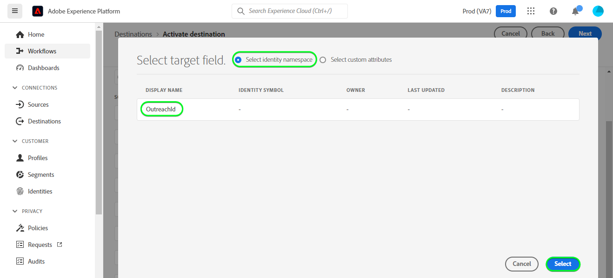

# [!DNL Outreach] conexão

## Visão geral {#overview}

[[!DNL Outreach]](https://www.outreach.io/) é uma Plataforma de Execução de Vendas com a maioria dos dados de interação comprador-vendedor B2B do mundo e investimentos significativos em tecnologias de IA proprietárias para traduzir dados de vendas em inteligência. O [!DNL Outreach] ajuda as organizações a automatizar o envolvimento de vendas e agir com base na inteligência de receita para melhorar sua eficiência, previsibilidade e crescimento.

Este [!DNL Adobe Experience Platform] [destino](/help/destinations/home.md) aproveita a [API de Recurso de Atualização do Outreach](https://api.outreach.io/api/v2/docs#update-an-existing-resource), que permite atualizar as identidades em um público correspondente aos clientes potenciais em [!DNL Outreach].

[!DNL Outreach] usa OAuth 2 com Concessão de Autorização como mecanismo de autenticação para se comunicar com [!DNL Outreach] [!DNL Update Resource API]. As instruções para autenticar na sua instância do [!DNL Outreach] estão mais abaixo, na seção [Autenticar no destino](#authenticate).

## Casos de uso {#use-cases}

Como profissional de marketing, você pode fornecer experiências personalizadas aos seus clientes potenciais, com base em atributos de seus perfis do Adobe Experience Platform. Você pode compilar audiências com base em seus dados offline e enviá-las para o [!DNL Outreach], para exibição nos feeds de clientes potenciais, assim que as audiências e os perfis forem atualizados no Adobe Experience Platform.

## Pré-requisitos {#prerequisites}

### Pré-requisitos do Experience Platform {#prerequisites-in-experience-platform}

Antes de ativar dados para o destino [!DNL Outreach], você deve ter um [esquema](/help/xdm/schema/composition.md), um [conjunto de dados](https://experienceleague.adobe.com/docs/platform-learn/tutorials/data-ingestion/create-datasets-and-ingest-data.html?lang=pt-BR) e [segmentos](https://experienceleague.adobe.com/docs/platform-learn/tutorials/segments/create-segments.html?lang=pt-BR) criados em [!DNL Experience Platform].

Consulte a documentação da Adobe para [Grupo de campos do esquema de Detalhes da associação do público-alvo](/help/xdm/field-groups/profile/segmentation.md) se precisar de orientação sobre os status do público-alvo.

### Pré-requisitos do Outreach {#prerequisites-destination}

Observe os seguintes pré-requisitos em [!DNL Outreach] para exportar dados do Experience Platform para sua conta do [!DNL Outreach]:

#### Você precisa ter uma conta do Outreach {#prerequisites-account}

Vá para a página [!DNL Outreach] [entrar](https://accounts.outreach.io/users/sign_in) para se registrar e criar uma conta, caso ainda não tenha uma. Consulte também a [!DNL Outreach] [página](https://support.outreach.io/hc/en-us/articles/207238607-Claim-Your-Outreach-Account) de suporte para obter mais detalhes.

Anote os itens abaixo antes de autenticar no destino do CRM [!DNL Outreach]:

| Credencial | Descrição |
|---|---|
| Email | Email da sua conta [!DNL Outreach] |
| Senha | A senha da sua conta do [!DNL Outreach] |

#### Configurar rótulos de campo personalizados {#prerequisites-custom-fields}

[!DNL Outreach] oferece suporte a campos personalizados para [prospetos](https://support.outreach.io/hc/en-us/articles/360001557554-Outreach-Prospect-Profile-Overview). Consulte [Como adicionar um campo personalizado no Outreach](https://support.outreach.io/hc/en-us/articles/219124908-How-To-Add-a-Custom-Field-in-Outreach) para obter orientação adicional. Para facilitar a identificação, é recomendável atualizar manualmente os rótulos para os nomes de público correspondentes, em vez de manter os padrões. Por exemplo, como abaixo:

Página de configurações [!DNL Outreach] para clientes potenciais exibindo campos personalizados.

A página de configurações [!DNL Outreach] para clientes potenciais exibe campos personalizados com rótulos *amigáveis* que correspondem aos nomes de público-alvo. Você pode visualizar o status do público-alvo na página de prospecto em relação a esses rótulos.

>[!NOTE]
>
> Os nomes dos rótulos servem apenas para facilitar a identificação. Eles não são usados ao atualizar clientes potenciais.

## Medidas de proteção

A API [!DNL Outreach] tem um limite de taxa de 10.000 solicitações por hora por usuário. Se você atingir esse limite, receberá uma resposta `429` com a seguinte mensagem: `You have exceeded your permitted rate limit of 10,000; please try again at 2017-01-01T00:00:00.`.

Se você recebeu esta mensagem, deve atualizar seu cronograma de exportação de público para estar em conformidade com o limite de taxa.

Consulte a [[!DNL Outreach] documentação](https://api.outreach.io/api/v2/docs#rate-limiting) para obter mais detalhes.

## Identidades suportadas {#supported-identities}

[!DNL Outreach] oferece suporte à atualização de identidades descritas na tabela abaixo. Saiba mais sobre [identidades](/help/identity-service/features/namespaces.md).

| Identidade do público alvo | Descrição | Considerações |
|---|---|---|
| `OutreachId` | <ul><li>Identificador [!DNL Outreach]. É um valor numérico correspondente ao perfil do cliente potencial.</li><li>A ID deve corresponder à ID na URL [!DNL Outreach] do cliente potencial que está sendo atualizado.</li><li>Consulte a [[!DNL Outreach] documentação](https://api.outreach.io/api/v2/docs#update-an-existing-resource) para obter mais detalhes.</li></ul> | Obrigatório |

## Tipo e frequência de exportação {#export-type-frequency}

Consulte a tabela abaixo para obter informações sobre o tipo e a frequência da exportação de destino.

| Item | Tipo | Notas |
|---------|----------|---------|
| Tipo de exportação | **[!UICONTROL Profile-based]** | <ul><li> Você está exportando todos os membros de um segmento, juntamente com os campos de esquema desejados *(por exemplo: endereço de email, número de telefone, sobrenome)*, de acordo com o mapeamento de campos.</li><li> Cada status de segmento em [!DNL Outreach] é atualizado com o status de público correspondente do Experience Platform, com base no valor [!UICONTROL Mapping ID] fornecido durante a etapa [agendamento de público-alvo](#schedule-segment-export-example).</li></ul> |
| Frequência de exportação | **[!UICONTROL Streaming]** | <ul><li> Os destinos de transmissão são conexões baseadas em API &quot;sempre ativas&quot;. Assim que um perfil for atualizado no Experience Platform com base na avaliação do público-alvo, o conector enviará a atualização downstream para a plataforma de destino. Leia mais sobre [destinos de streaming](/help/destinations/destination-types.md#streaming-destinations).</li></ul> |

{style="table-layout:auto"}

## Conectar ao destino {#connect}

>[!IMPORTANT]
> 
> Para se conectar ao destino, você precisa da **[!UICONTROL Manage Destinations]** [permissão de controle de acesso](/help/access-control/home.md#permissions). Leia a [visão geral do controle de acesso](/help/access-control/ui/overview.md) ou contate o administrador do produto para obter as permissões necessárias.

Para se conectar a este destino, siga as etapas descritas no [tutorial de configuração de destino](../../ui/connect-destination.md). No workflow de configuração de destino, preencha os campos listados nas duas seções abaixo.

Em **[!UICONTROL Destinations]** > **[!UICONTROL Catalog]** pesquise por [!DNL Outreach]. Como alternativa, você pode localizá-lo na categoria CRM.

### Autenticar para o destino {#authenticate}

Para autenticar no destino, selecione **[!UICONTROL Connect to destination]**.

Você verá a página de logon [!DNL Outreach]. Forneça o email.

Em seguida, forneça sua senha.

* **[!UICONTROL Username]**: email da sua conta [!DNL Outreach].
* **[!UICONTROL Password]**: A senha da sua conta [!DNL Outreach].

Se os detalhes fornecidos forem válidos, a interface exibirá um status **Conectado** com uma marca de seleção verde. Você pode prosseguir para a próxima etapa.

### Preencher detalhes do destino {#destination-details}

Para configurar detalhes para o destino, preencha os campos obrigatórios e opcionais abaixo. Um asterisco ao lado de um campo na interface do usuário indica que o campo é obrigatório.

* **[!UICONTROL Name]**: Um nome pelo qual você reconhecerá este destino no futuro.
* **[!UICONTROL Description]**: uma descrição que ajudará você a identificar este destino no futuro.

### Ativar alertas {#enable-alerts}

Você pode ativar os alertas para receber notificações sobre o status do fluxo de dados para o seu destino. Selecione um alerta na lista para assinar e receber notificações sobre o status do seu fluxo de dados. Para obter mais informações sobre alertas, consulte o manual sobre [assinatura de alertas de destinos usando a interface](../../ui/alerts.md).

Quando terminar de fornecer detalhes da conexão de destino, selecione **[!UICONTROL Next]**.

## Ativar públicos-alvo para esse destino {#activate}

>[!IMPORTANT]
> 
>* Para ativar dados, você precisa das **[!UICONTROL View Destinations]**, **[!UICONTROL Activate Destinations]**, **[!UICONTROL View Profiles]** e **[!UICONTROL View Segments]** [permissões de controle de acesso](/help/access-control/home.md#permissions). Leia a [visão geral do controle de acesso](/help/access-control/ui/overview.md) ou contate o administrador do produto para obter as permissões necessárias.
>* Para exportar *identidades*, você precisa da **[!UICONTROL View Identity Graph]** [permissão de controle de acesso](/help/access-control/home.md#permissions).   {width="100" zoomable="yes"}

Leia [Ativar perfis e públicos-alvo para destinos de exportação de público-alvo de streaming](../../ui/activate-segment-streaming-destinations.md) para obter instruções sobre como ativar públicos-alvo para este destino.

### Considerações e exemplo de mapeamento {#mapping-considerations-example}

Para enviar corretamente seus dados de público-alvo do Adobe Experience Platform para o destino [!DNL Outreach], é necessário passar pela etapa de mapeamento de campos. O mapeamento consiste na criação de um link entre os campos do esquema do Experience Data Model (XDM) na sua conta do Experience Platform e seus equivalentes correspondentes no destino. Para mapear corretamente os campos XDM para os campos de destino [!DNL Outreach], siga estas etapas:

1. Na etapa [!UICONTROL Mapping], clique em **[!UICONTROL Add new mapping]**. Você verá uma nova linha de mapeamento na tela.
   

1. Na janela [!UICONTROL Select source field], escolha a categoria **[!UICONTROL Select identity namespace]** e adicione os mapeamentos desejados.
   

1. Na janela [!UICONTROL Select target field], selecione o tipo de campo de destino para o qual você deseja mapear seu campo de origem.
   * **[!UICONTROL Select identity namespace]**: selecione esta opção para mapear seu campo de origem para um namespace de identidade da lista.
     

   * Adicione o mapeamento a seguir entre o esquema de perfil XDM e a instância [!DNL Outreach]:

     | Esquema de perfil XDM | [!DNL Outreach] Instância | Obrigatório |
     |---|---|---|
     | `Oid` | `OutreachId` | Sim |

   * **[!UICONTROL Select custom attributes]**: selecione esta opção para mapear seu campo de origem para um atributo personalizado definido no campo [!UICONTROL Attribute name]. Consulte a [[!DNL Outreach] documentação do cliente potencial](https://api.outreach.io/api/v2/docs#prospect) para obter uma lista abrangente dos atributos suportados.
     

   * Por exemplo, dependendo dos valores que você deseja atualizar, adicione o seguinte mapeamento entre o esquema de perfil XDM e a instância [!DNL Outreach]:

     | Esquema de perfil XDM | [!DNL Outreach] Instância |
     |---|---|
     | `person.name.firstName` | `firstName` |
     | `person.name.lastName` | `lastName` |

   * Um exemplo usando esses mapeamentos é mostrado abaixo:
     

### Agendar exportação de público e exemplo {#schedule-segment-export-example}

* Ao executar a etapa [Agendar exportação de público-alvo](../../ui/activate-segment-streaming-destinations.md), mapeie manualmente os públicos-alvo da Experience Platform para o atributo de campo personalizado em [!DNL Outreach].

* Para fazer isso, selecione cada segmento e insira o valor numérico correspondente que corresponde ao campo *Rótulo`N` do* do [!DNL Outreach] no campo **[!UICONTROL Mapping ID]**.

  >[!IMPORTANT]
  >
  > * O valor numérico *(`N`)* usado em [!UICONTROL Mapping ID] deve corresponder à chave de atributo personalizado com o valor numérico em [!DNL Outreach]. Exemplo: *Rótulo `N` Do Campo Personalizado*.
  > * Você só precisa especificar o valor numérico, não todo o rótulo do campo personalizado.
  > * [!DNL Outreach] dá suporte a no máximo 150 campos de rótulo personalizados.
  > * Consulte a [[!DNL Outreach] documentação do cliente potencial](https://api.outreach.io/api/v2/docs#prospect) para obter detalhes.

   * Por exemplo:

     | Campo [!DNL Outreach] | ID de mapeamento do Experience Platform |
     |---|---|
     | Rótulo de Campo Personalizado `4` | `4` |

     

## Validar exportação de dados {#exported-data}

Para validar se você configurou o destino corretamente, siga as etapas abaixo:

1. Selecione **[!UICONTROL Destinations]** > **[!UICONTROL Browse]** para navegar até a lista de destinos.
   

1. Selecione o destino e valide se o status é **[!UICONTROL enabled]**.
   

1. Alterne para a guia **[!DNL Activation data]** e selecione um nome de público-alvo.
   

1. Monitore o resumo do público-alvo e verifique se a contagem de perfis corresponde à contagem criada no segmento.
   

1. Faça logon no site do [!DNL Outreach], navegue até a página [!DNL Apps] > [!DNL Contacts] e verifique se os perfis do público-alvo foram adicionados. Você pode ver que cada status de público-alvo em [!DNL Outreach] foi atualizado com o status de público-alvo correspondente do Experience Platform, com base no valor [!UICONTROL Mapping ID] fornecido durante a etapa [agendamento de público-alvo](#schedule-segment-export-example).

## Uso e governança de dados {#data-usage-governance}

Todos os destinos do [!DNL Adobe Experience Platform] são compatíveis com as políticas de uso de dados ao manipular seus dados. Para obter informações detalhadas sobre como o [!DNL Adobe Experience Platform] impõe a governança de dados, consulte a [visão geral da Governança de Dados](/help/data-governance/home.md).

## Erros e solução de problemas {#errors-and-troubleshooting}

Ao verificar a execução de um fluxo de dados, você poderá ver a seguinte mensagem de erro: `Bad request reported while pushing events to the destination. Please contact the administrator and try again.`

Para corrigir esse erro, verifique se o [!UICONTROL Mapping ID] fornecido no Experience Platform para o público-alvo [!DNL Outreach] é válido e existe no [!DNL Outreach].

## Recursos adicionais {#additional-resources}

A [[!DNL Outreach] documentação](https://api.outreach.io/api/v2/docs/) tem detalhes sobre [Respostas de Erro](https://api.outreach.io/api/v2/docs#error-responses) que você pode usar para depurar quaisquer problemas.
