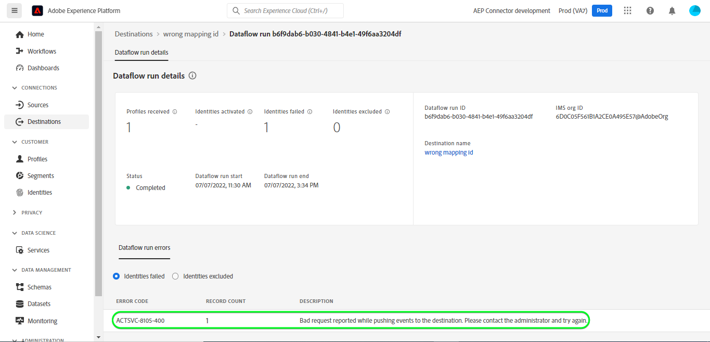

# Conexão com o [!DNL Outreach]

## Visão geral {#overview}

[[!DNL Outreach]](https://www.outreach.io/) O é uma Plataforma de execução de vendas com a maioria dos dados de interação comprador-vendedor B2B no mundo e investimentos significativos em tecnologias de IA proprietárias para traduzir dados de vendas em inteligência. [!DNL Outreach] O ajuda as organizações a automatizar o envolvimento de vendas e agir com base na inteligência de receita para melhorar a eficiência, a previsibilidade e o crescimento.

Este [!DNL Adobe Experience Platform] [destino](/help/destinations/home.md) utiliza o [API de recurso de atualização do Outreach](https://api.outreach.io/api/v2/docs#update-an-existing-resource), que permite atualizar identidades em um público-alvo correspondente a clientes potenciais no [!DNL Outreach].

[!DNL Outreach] O usa o OAuth 2 com concessão de autorização como mecanismo de autenticação para se comunicar com o [!DNL Outreach] [!DNL Update Resource API]. Instruções para autenticar em seu [!DNL Outreach] instância estão mais abaixo, dentro de [Autenticar para destino](#authenticate) seção.

## Casos de uso {#use-cases}

Como profissional de marketing, você pode fornecer experiências personalizadas aos seus clientes potenciais, com base em atributos de seus perfis do Adobe Experience Platform. Você pode criar públicos-alvo com base nos dados offline e enviá-los para [!DNL Outreach], para ser exibido nos feeds de clientes potenciais assim que os públicos-alvo e perfis forem atualizados no Adobe Experience Platform.

## Pré-requisitos {#prerequisites}

### Pré-requisitos do Experience Platform {#prerequisites-in-experience-platform}

Antes de ativar os dados para o [!DNL Outreach] destino, você deve ter um [schema](/help/xdm/schema/composition.md), um [conjunto de dados](https://experienceleague.adobe.com/docs/platform-learn/tutorials/data-ingestion/create-datasets-and-ingest-data.html?lang=pt-BR), e [segmentos](https://experienceleague.adobe.com/docs/platform-learn/tutorials/segments/create-segments.html) criado em [!DNL Experience Platform].

Consulte a documentação do Adobe para [Grupo de campos de esquema Detalhes da associação do público](/help/xdm/field-groups/profile/segmentation.md) se precisar de orientação sobre os status do público-alvo.

### Pré-requisitos do Outreach {#prerequisites-destination}

Observe os seguintes pré-requisitos em [!DNL Outreach], para exportar dados da Platform para o seu [!DNL Outreach] conta:

#### Você precisa ter uma conta do Outreach {#prerequisites-account}

Vá para a [!DNL Outreach] [fazer logon](https://accounts.outreach.io/users/sign_in) para registrar e criar uma conta, se ainda não tiver uma. Consulte também a [!DNL Outreach] suporte [página](https://support.outreach.io/hc/en-us/articles/207238607-Claim-Your-Outreach-Account) para obter mais detalhes.

Anote os itens abaixo antes de autenticar na [!DNL Outreach] Destino do CRM:

| Credencial | Descrição |
|---|---|
| Email | Seu [!DNL Outreach] email da conta |
| Senha | Seu [!DNL Outreach] senha da conta |

#### Configurar rótulos de campo personalizados {#prerequisites-custom-fields}

[!DNL Outreach] suporta campos personalizados para [clientes potenciais](https://support.outreach.io/hc/en-us/articles/360001557554-Outreach-Prospect-Profile-Overview). Consulte [Como adicionar um campo personalizado no Outreach](https://support.outreach.io/hc/en-us/articles/219124908-How-To-Add-a-Custom-Field-in-Outreach) para obter orientação adicional. Para facilitar a identificação, é recomendável atualizar manualmente os rótulos para os nomes de público correspondentes, em vez de manter os padrões. Por exemplo, como abaixo:

[!DNL Outreach] página de configurações para clientes potenciais que exibem campos personalizados.

[!DNL Outreach] página de configurações para clientes potenciais que exibem campos personalizados com *fácil de usar* rótulos que correspondem aos nomes de público-alvo. Você pode visualizar o status do público-alvo na página de prospecto em relação a esses rótulos.

>[!NOTE]
>
> Os nomes dos rótulos servem apenas para facilitar a identificação. Eles não são usados ao atualizar clientes potenciais.

## Medidas de proteção

A variável [!DNL Outreach] A API tem um limite de taxa de 10.000 solicitações por hora por usuário. Se atingir esse limite, você receberá uma `429` resposta com a seguinte mensagem: `You have exceeded your permitted rate limit of 10,000; please try again at 2017-01-01T00:00:00.`.

Se você recebeu esta mensagem, deve atualizar seu cronograma de exportação de público para estar em conformidade com o limite de taxa.

Consulte a [[!DNL Outreach] documentação](https://api.outreach.io/api/v2/docs#rate-limiting) para obter detalhes adicionais.

## Identidades suportadas {#supported-identities}

[!DNL Outreach] O oferece suporte à atualização de identidades descritas na tabela abaixo. Saiba mais sobre [identidades](/help/identity-service/namespaces.md).

| Identidade do público alvo | Descrição | Considerações |
|---|---|---|
| `OutreachId` | <ul><li>[!DNL Outreach] identificador. É um valor numérico correspondente ao perfil do cliente potencial.</li><li>A ID deve corresponder à ID dentro do [!DNL Outreach] URL do cliente potencial que está sendo atualizado.</li><li>Consulte a [[!DNL Outreach] documentação](https://api.outreach.io/api/v2/docs#update-an-existing-resource) para obter mais detalhes.</li></ul> | Obrigatório |

## Tipo e frequência de exportação {#export-type-frequency}

Consulte a tabela abaixo para obter informações sobre o tipo e a frequência da exportação de destino.

| Item | Tipo | Notas |
---------|----------|---------|
| Tipo de exportação | **[!UICONTROL Baseado em perfil]** | <ul><li> Você está exportando todos os membros de um segmento, juntamente com os campos de esquema desejados *(por exemplo: endereço de email, número de telefone, sobrenome)*, de acordo com o mapeamento de campo.</li><li> Cada status de segmento em [!DNL Outreach] é atualizado com o status de público-alvo correspondente na Platform, com base no [!UICONTROL ID do mapeamento] valor fornecido durante o [agendamento de público](#schedule-segment-export-example) etapa.</li></ul> |
| Frequência de exportação | **[!UICONTROL Streaming]** | <ul><li> Os destinos de transmissão são conexões baseadas em API &quot;sempre ativas&quot;. Assim que um perfil é atualizado em Experience Platform com base na avaliação do público-alvo, o conector envia a atualização downstream para a plataforma de destino. Leia mais sobre [destinos de transmissão](/help/destinations/destination-types.md#streaming-destinations).</li></ul> |

{style="table-layout:auto"}

## Conectar ao destino {#connect}

>[!IMPORTANT]
> 
> Para se conectar ao destino, você precisa da variável **[!UICONTROL Gerenciar destinos]** [permissão de controle de acesso](/help/access-control/home.md#permissions). Leia o [visão geral do controle de acesso](/help/access-control/ui/overview.md) ou entre em contato com o administrador do produto para obter as permissões necessárias.

Para se conectar a esse destino, siga as etapas descritas no [tutorial de configuração de destino](../../ui/connect-destination.md). No workflow de configuração de destino, preencha os campos listados nas duas seções abaixo.

Dentro de **[!UICONTROL Destinos]** > **[!UICONTROL Catálogo]** pesquisar [!DNL Outreach]. Como alternativa, você pode localizá-lo na categoria CRM.

### Autenticar para o destino {#authenticate}

Para autenticar no destino, selecione **[!UICONTROL Conectar ao destino]**.

Você receberá a [!DNL Outreach] página de logon. Forneça o email.

Em seguida, forneça sua senha.

* **[!UICONTROL Nome de usuário]**: Seu [!DNL Outreach] email da conta.
* **[!UICONTROL Senha]**: Seu [!DNL Outreach] senha da conta.

Se os detalhes fornecidos forem válidos, a interface exibirá uma **Conectado** com uma marca de seleção verde. Você pode prosseguir para a próxima etapa.

### Preencher detalhes do destino {#destination-details}

Para configurar detalhes para o destino, preencha os campos obrigatórios e opcionais abaixo. Um asterisco ao lado de um campo na interface do usuário indica que o campo é obrigatório.

* **[!UICONTROL Nome]**: um nome pelo qual você reconhecerá esse destino no futuro.
* **[!UICONTROL Descrição]**: uma descrição que ajudará você a identificar esse destino no futuro.

### Ativar alertas {#enable-alerts}

Você pode ativar os alertas para receber notificações sobre o status do fluxo de dados para o seu destino. Selecione um alerta na lista para assinar e receber notificações sobre o status do seu fluxo de dados. Para obter mais informações sobre alertas, consulte o manual sobre [assinatura de alertas de destinos usando a interface do](../../ui/alerts.md).

Quando terminar de fornecer detalhes da conexão de destino, selecione **[!UICONTROL Próxima]**.

## Ativar públicos-alvo para esse destino {#activate}

>[!IMPORTANT]
> 
>* Para ativar os dados, é necessário **[!UICONTROL Gerenciar destinos]**, **[!UICONTROL Ativar destinos]**, **[!UICONTROL Exibir perfis]**, e **[!UICONTROL Exibir segmentos]** [permissões de controle de acesso](/help/access-control/home.md#permissions). Leia o [visão geral do controle de acesso](/help/access-control/ui/overview.md) ou entre em contato com o administrador do produto para obter as permissões necessárias.
>* Para exportar *identidades*, você precisará do **[!UICONTROL Exibir gráfico de identidade]** [permissão de controle de acesso](/help/access-control/home.md#permissions).   {width="100" zoomable="yes"}

Ler [Ativar perfis e públicos para destinos de exportação de público de transmissão](../../ui/activate-segment-streaming-destinations.md) para obter instruções sobre como ativar públicos-alvo para esse destino.

### Considerações e exemplo de mapeamento {#mapping-considerations-example}

Para enviar corretamente os dados do público-alvo do Adobe Experience Platform para a [!DNL Outreach] destino, é necessário passar pela etapa de mapeamento de campos. O mapeamento consiste em criar um link entre os campos do esquema do Experience Data Model (XDM) na sua conta da Platform e seus equivalentes correspondentes no destino. Para mapear corretamente os campos XDM para o [!DNL Outreach] campos de destino, siga estas etapas:

1. No [!UICONTROL Mapeamento] clique em **[!UICONTROL Adicionar novo mapeamento]**. Você verá uma nova linha de mapeamento na tela.
   

1. No [!UICONTROL Selecionar campo de origem] escolha a **[!UICONTROL Selecionar namespace de identidade]** e adicione os mapeamentos desejados.
   

1. No [!UICONTROL Selecionar campo de destino] selecione o tipo de campo de destino para o qual deseja mapear seu campo de origem.
   * **[!UICONTROL Selecionar namespace de identidade]**: selecione esta opção para mapear o campo de origem para um namespace de identidade da lista.
     

   * Adicione o mapeamento a seguir entre o esquema de perfil XDM e o [!DNL Outreach] instância: |Esquema do perfil XDM|[!DNL Outreach] Instância| Obrigatório| |—|—|—| |`Oid`|`OutreachId`| Sim |

   * **[!UICONTROL Selecionar atributos personalizados]**: selecione esta opção para mapear o campo de origem para um atributo personalizado definido na variável [!UICONTROL Nome do atributo] campo. Consulte [[!DNL Outreach] documentação de prospecto](https://api.outreach.io/api/v2/docs#prospect) para obter uma lista abrangente dos atributos suportados.
     

   * Por exemplo, dependendo dos valores que você deseja atualizar, adicione o seguinte mapeamento entre o esquema de perfil XDM e o [!DNL Outreach] instância: |Esquema do perfil XDM|[!DNL Outreach] Instância| |—|—| |`person.name.firstName`|`firstName`| |`person.name.lastName`|`lastName`|

   * Um exemplo usando esses mapeamentos é mostrado abaixo:
     

### Agendar exportação de público e exemplo {#schedule-segment-export-example}

* Ao executar a [Agendar exportação de público](../../ui/activate-segment-streaming-destinations.md) etapa você deve mapear manualmente os públicos-alvo da Platform para o atributo de campo personalizado em [!DNL Outreach].

* Para fazer isso, selecione cada segmento e insira o valor numérico correspondente que corresponde à variável *Campo personalizado `N` Rótulo* campo de [!DNL Outreach] no **[!UICONTROL ID do mapeamento]** campo.

  >[!IMPORTANT]
  >
  > * O valor numérico *(`N`)* usado dentro do [!UICONTROL ID do mapeamento] deve corresponder à chave de atributo personalizado com o sufixo do valor numérico em [!DNL Outreach]. Exemplo: *Campo personalizado `N` Rótulo*.
  > * Você só precisa especificar o valor numérico, não todo o rótulo do campo personalizado.
  > * [!DNL Outreach] O suporta um máximo de 150 campos de rótulo personalizados.
  > * Consulte [[!DNL Outreach] documentação de prospecto](https://api.outreach.io/api/v2/docs#prospect) para obter detalhes.

   * Por exemplo:

     | [!DNL Outreach] Campo | ID de mapeamento da plataforma |
     |---|---|
     | Campo personalizado `4` Rótulo | `4` |

     

## Validar exportação de dados {#exported-data}

Para validar se você configurou o destino corretamente, siga as etapas abaixo:

1. Selecionar **[!UICONTROL Destinos]** > **[!UICONTROL Procurar]** para navegar até a lista de destinos.
   

1. Selecionar o destino e validar se o status é **[!UICONTROL habilitado]**.
   

1. Alterne para a **[!DNL Activation data]** e selecione um nome de público-alvo.
   

1. Monitore o resumo do público-alvo e verifique se a contagem de perfis corresponde à contagem criada no segmento.
   

1. Faça logon no [!DNL Outreach] site e, em seguida, navegue até o [!DNL Apps] > [!DNL Contacts] e verifique se os perfis do público-alvo foram adicionados. Você pode ver que cada status de público-alvo em [!DNL Outreach] foi atualizado com o status de público-alvo correspondente na Platform, com base na [!UICONTROL ID do mapeamento] valor fornecido durante o [agendamento de público](#schedule-segment-export-example) etapa.

## Uso e governança de dados {#data-usage-governance}

Todos [!DNL Adobe Experience Platform] os destinos estão em conformidade com as políticas de uso de dados ao manipular seus dados. Para obter informações detalhadas sobre como [!DNL Adobe Experience Platform] fiscaliza a governança de dados, consulte o [Visão geral da governança de dados](/help/data-governance/home.md).

## Erros e solução de problemas {#errors-and-troubleshooting}

Ao verificar uma execução de fluxo de dados, você pode ver a seguinte mensagem de erro: `Bad request reported while pushing events to the destination. Please contact the administrator and try again.`

Para corrigir esse erro, verifique se [!UICONTROL ID do mapeamento] você forneceu na Platform para a sua [!DNL Outreach] o público-alvo é válido e existe em [!DNL Outreach].

## Recursos adicionais {#additional-resources}

A variável [[!DNL Outreach] documentação](https://api.outreach.io/api/v2/docs/) tem detalhes sobre [Respostas de erro](https://api.outreach.io/api/v2/docs#error-responses) que você pode usar para depurar qualquer problema.
