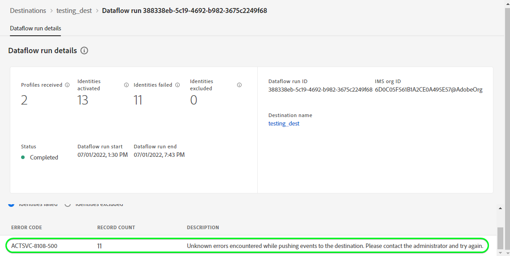

# [!DNL Salesforce CRM] conexão

## Visão geral {#overview}

[[!DNL Salesforce CRM]](https://www.salesforce.com/crm/) é uma plataforma popular de CRM (relacionamento com o cliente) e oferece suporte aos tipos de perfis descritos abaixo:

* [Clientes potenciais](https://developer.salesforce.com/docs/atlas.en-us.object_reference.meta/object_reference/sforce_api_objects_lead.htm) - Um cliente potencial é o nome de uma pessoa ou empresa que pode (ou não) estar interessada nos produtos ou serviços que você vende.
* [Contatos](https://developer.salesforce.com/docs/atlas.en-us.object_reference.meta/object_reference/sforce_api_objects_contact.htm) - Um contato é um indivíduo com quem um de seus representantes estabeleceu uma relação e foi qualificado como um cliente potencial.

Este [!DNL Adobe Experience Platform] [destino](/help/destinations/home.md) aproveita o [[!DNL Salesforce composite API]](https://developer.salesforce.com/docs/atlas.en-us.api_rest.meta/api_rest/resources_composite_sobjects_collections_update.htm), que oferece suporte aos dois tipos de perfis descritos acima.

Ao [ativar segmentos](#activate), você pode selecionar entre clientes em potencial ou contatos e atualizar atributos e dados de público-alvo para [!DNL Salesforce CRM].

[!DNL Salesforce CRM] usa OAuth 2 com Concessão de Senha como um mecanismo de autenticação para se comunicar com a API REST do Salesforce. As instruções para autenticar na sua instância do [!DNL Salesforce CRM] estão mais abaixo, na seção [Autenticar no destino](#authenticate).

## Casos de uso {#use-cases}

Como profissional de marketing, você pode fornecer experiências personalizadas aos seus usuários com base em atributos de seus perfis do Adobe Experience Platform. Você pode criar públicos-alvo com base em seus dados offline e enviá-los para o Salesforce CRM, para atualizar a associação ao CRM assim que os públicos-alvo e perfis forem atualizados no Adobe Experience Platform.

## Pré-requisitos {#prerequisites}

### Pré-requisitos no Experience Platform {#prerequisites-in-experience-platform}

Antes de ativar dados para o destino do Salesforce CRM, você deve ter um [esquema](/help/xdm/schema/composition.md), um [conjunto de dados](https://experienceleague.adobe.com/docs/platform-learn/tutorials/data-ingestion/create-datasets-and-ingest-data.html) e [segmentos](https://experienceleague.adobe.com/docs/platform-learn/tutorials/segments/create-segments.html) criados em [!DNL Experience Platform].

### Pré-requisitos em [!DNL Salesforce CRM] {#prerequisites-destination}

Observe os seguintes pré-requisitos em [!DNL Salesforce CRM] para exportar dados do Experience Platform para sua conta do Salesforce:

#### Você precisa ter uma conta [!DNL Salesforce] {#prerequisites-account}

Vá para a página de [!DNL Salesforce] [avaliação](https://www.salesforce.com/in/form/signup/freetrial-sales/) para se registrar e criar uma conta [!DNL Salesforce], caso ainda não tenha uma.

#### Configurar um aplicativo conectado no [!DNL Salesforce] {#prerequisites-connected-app}

Primeiro, você precisa configurar um [[!DNL Salesforce] aplicativo conectado](https://help.salesforce.com/s/articleView?id=sf.connected_app_create.htm&language=en_US&r=https%3A%2F%2Fhelp.salesforce.com%2F&type=5) na sua conta do [!DNL Salesforce], se ainda não tiver um. [!DNL Salesforce CRM] aproveitará o aplicativo conectado para se conectar a [!DNL Salesforce].

Em seguida, habilite [!DNL OAuth Settings for API Integration] para o [!DNL Salesforce connected app]. Consulte a documentação de [[!DNL Salesforce]](https://help.salesforce.com/s/articleView?id=connected_app_create_api_integration.htm&type=5&language=en_US) para obter orientação.

Além disso, verifique se os [escopos](https://help.salesforce.com/s/articleView?id=connected_app_create_api_integration.htm&type=5&language=en_US) mencionados abaixo estão selecionados para o [!DNL Salesforce connected app].

* ``chatter_api``
* ``lightning``
* ``visualforce``
* ``content``
* ``openid``
* ``full``
* ``api``
* ``web``
* ``refresh_token``
* ``offline_access``

Finalmente, certifique-se de que a concessão `password` esteja habilitada em sua conta [!DNL Salesforce]. Consulte a documentação do [!DNL Salesforce] [Fluxo de Nome de Usuário-Senha do OAuth 2.0 para Cenários Especiais](https://help.salesforce.com/s/articleView?id=sf.remoteaccess_oauth_username_password_flow.htm&type=5) se precisar de orientação.

>[!IMPORTANT]
>
>Se o administrador da sua conta do [!DNL Salesforce] tiver restringido o acesso a intervalos IP confiáveis, você precisará contatá-los para obter [IPs do Experience Platform incluir na lista de permissões](/help/destinations/catalog/streaming/ip-address-allow-list.md). Consulte a documentação [!DNL Salesforce] [Restringir Acesso a Intervalos IP Confiáveis para um Aplicativo Conectado](https://help.salesforce.com/s/articleView?id=sf.connected_app_edit_ip_ranges.htm&type=5) se precisar de orientação adicional.

#### Criar campos personalizados em [!DNL Salesforce] {#prerequisites-custom-field}

Ao ativar públicos para o destino [!DNL Salesforce CRM], você deve inserir um valor no campo **[!UICONTROL Mapping ID]** para cada público ativado, na etapa **[Agenda de público](#schedule-segment-export-example)**.

[!DNL Salesforce CRM] exige esse valor para ler e interpretar corretamente os públicos-alvo provenientes da Experience Platform e atualizar o status dos públicos-alvo em [!DNL Salesforce]. Consulte a documentação do Experience Platform para [Grupo de campos do esquema de Detalhes da associação do público-alvo](/help/xdm/field-groups/profile/segmentation.md) se precisar de orientação sobre os status do público-alvo.

Para cada público-alvo ativado do Experience Platform para [!DNL Salesforce CRM], é necessário criar um campo personalizado do tipo `Text Area (Long)` em [!DNL Salesforce]. Você pode definir o comprimento de caracteres de qualquer tamanho entre 256 e 131.072 caracteres de acordo com suas necessidades comerciais. Consulte a página de documentação [!DNL Salesforce] [Tipos de campo personalizado](https://help.salesforce.com/s/articleView?id=sf.custom_field_types.htm&type=5) para obter informações adicionais sobre tipos de campo personalizado. Consulte também a documentação do [!DNL Salesforce] para [criar campos personalizados](https://help.salesforce.com/s/articleView?id=mc_cab_create_an_attribute.htm&type=5&language=en_US), se precisar de assistência para a criação de campos.

>[!IMPORTANT]
>
>Não inclua caracteres de espaço em branco no nome do campo. Em vez disso, use o caractere de sublinhado `(_)` como separador.
>&#x200B;>Em [!DNL Salesforce] você deve criar campos personalizados com um **[!UICONTROL Field Name]** que corresponda exatamente ao valor especificado em **[!UICONTROL Mapping ID]** para cada segmento ativado do Experience Platform. Por exemplo, a captura de tela abaixo mostra um campo personalizado chamado `crm_2_seg`. Ao ativar um público-alvo para esse destino, adicione `crm_2_seg` como **[!UICONTROL Mapping ID]** para preencher públicos-alvo do Experience Platform nesse campo personalizado.

Um exemplo de criação de campo personalizado em [!DNL Salesforce], *Etapa 1 - Selecionar o tipo de dados*, é mostrado abaixo:

Um exemplo de criação de campo personalizado em [!DNL Salesforce], *Etapa 2 - Inserir os detalhes do campo personalizado*, é mostrado abaixo:

>[!TIP]
>
>* Para distinguir entre campos personalizados usados para públicos-alvo da Experience Platform e outros campos personalizados no [!DNL Salesforce], você pode incluir um prefixo ou sufixo reconhecível ao criar o campo personalizado. Por exemplo, em vez de `test_segment`, use `Adobe_test_segment` ou `test_segment_Adobe`
>* Se você já tiver outros campos personalizados criados no [!DNL Salesforce], poderá usar o mesmo nome do segmento do Experience Platform para identificar facilmente o público-alvo no [!DNL Salesforce].

>[!NOTE]
>
>* Os objetos no Salesforce são restritos a 25 campos externos, consulte [Atributos de campo personalizado](https://help.salesforce.com/s/articleView?id=sf.custom_field_attributes.htm&type=5).
>* Essa restrição implica que você só pode ter um máximo de 25 associações de público-alvo do Experience Platform ativas a qualquer momento.
>* Se você atingiu esse limite no Salesforce, é necessário remover os atributos personalizados do Salesforce que foram usados para armazenar o status do público-alvo em relação a públicos-alvo mais antigos no Experience Platform, antes que um novo **[!UICONTROL Mapping ID]** possa ser usado.

#### Obter credenciais de [!DNL Salesforce CRM] {#gather-credentials}

Anote os itens abaixo antes de autenticar no destino [!DNL Salesforce CRM]:

| Credencial | Descrição | Exemplo |
| --- | --- | --- |
| `Username` | Seu nome de usuário da conta [!DNL Salesforce]. | |
| `Password` | A senha da sua conta [!DNL Salesforce]. | |
| `Security Token` | O token de segurança [!DNL Salesforce] que você anexará posteriormente ao final da Senha [!DNL Salesforce] para criar uma cadeia de caracteres concatenada a ser usada como **[!UICONTROL Password]** ao [autenticar no destino](#authenticate).  Consulte a documentação do [!DNL Salesforce] para [redefinir seu token de segurança](https://help.salesforce.com/s/articleView?id=sf.user_security_token.htm&type=5) e saber como gerá-lo novamente a partir da interface do [!DNL Salesforce] se você não tiver o Token de Segurança. |  |
| `Custom Domain` | O prefixo de domínio [!DNL Salesforce].   Consulte a [[!DNL Salesforce] documentação](https://help.salesforce.com/s/articleView?id=sf.domain_name_setting_login_policy.htm&type=5) para saber como obter este valor da interface [!DNL Salesforce]. | Se o domínio [!DNL Salesforce] for   *`d5i000000isb4eak-dev-ed`.my.salesforce.com*,  você precisará de `d5i000000isb4eak-dev-ed` como valor. |
| `Client ID` | Seu Salesforce `Consumer Key`.   Consulte a [[!DNL Salesforce] documentação](https://help.salesforce.com/s/articleView?id=sf.connected_app_rotate_consumer_details.htm&type=5) para saber como obter este valor na interface [!DNL Salesforce]. | |
| `Client Secret` | Seu Salesforce `Consumer Secret`.   Consulte a [[!DNL Salesforce] documentação](https://help.salesforce.com/s/articleView?id=sf.connected_app_rotate_consumer_details.htm&type=5) para saber como obter este valor na interface [!DNL Salesforce]. | |

### Medidas de proteção {#guardrails}

[!DNL Salesforce] equilibra cargas de transação impondo limites de solicitação, taxa e tempo limite. Consulte [Limites e alocações de solicitação de API](https://developer.salesforce.com/docs/atlas.en-us.salesforce_app_limits_cheatsheet.meta/salesforce_app_limits_cheatsheet/salesforce_app_limits_platform_api.htm) para obter detalhes.

Se o administrador da conta do [!DNL Salesforce] impôs restrições de IP, será necessário adicionar [endereços IP Experience Platform](/help/destinations/catalog/streaming/ip-address-allow-list.md) aos intervalos IP confiáveis das contas do [!DNL Salesforce]. Consulte a documentação [!DNL Salesforce] [Restringir Acesso a Intervalos IP Confiáveis para um Aplicativo Conectado](https://help.salesforce.com/s/articleView?id=sf.connected_app_edit_ip_ranges.htm&type=5) se precisar de orientação adicional.

>[!IMPORTANT]
>
>Ao [ativar segmentos](#activate), você deve selecionar entre os tipos *Contato* ou *Cliente Potencial*. É necessário garantir que seus públicos-alvo tenham o mapeamento de dados apropriado de acordo com o tipo selecionado.

## Identidades suportadas {#supported-identities}

[!DNL Salesforce CRM] oferece suporte à atualização de identidades descritas na tabela abaixo. Saiba mais sobre [identidades](/help/identity-service/features/namespaces.md).

| Identidade de destino | Descrição | Considerações |
|---|---|---|
| `SalesforceId` | O identificador [!DNL Salesforce CRM] das identidades de contato ou cliente potencial que você exporta ou atualiza por meio do seu segmento. | Obrigatório |

## Tipo e frequência de exportação {#export-type-frequency}

Consulte a tabela abaixo para obter informações sobre o tipo e a frequência da exportação de destino.

| Item | Tipo | Notas |
|---------|----------|---------|
| Tipo de exportação | **[!UICONTROL Profile-based]** | <ul><li>Você está exportando todos os membros de um segmento, juntamente com os campos de esquema desejados *(por exemplo: endereço de email, número de telefone, sobrenome)*, de acordo com o mapeamento de campos.</li><li> Cada status de público-alvo no [!DNL Salesforce CRM] é atualizado com o status de público-alvo correspondente do Experience Platform, com base no valor **[!UICONTROL Mapping ID]** fornecido durante a etapa [agendamento de público-alvo](#schedule-segment-export-example).</li></ul> |
| Frequência de exportação | **[!UICONTROL Streaming]** | <ul><li>Os destinos de transmissão são conexões baseadas em API &quot;sempre ativas&quot;. Assim que um perfil for atualizado no Experience Platform com base na avaliação do público-alvo, o conector enviará a atualização downstream para a plataforma de destino. Leia mais sobre [destinos de streaming](/help/destinations/destination-types.md#streaming-destinations).</li></ul> |

{style="table-layout:auto"}

## Conectar ao destino {#connect}

>[!IMPORTANT]
>
>Para se conectar ao destino, você precisa das **[!UICONTROL View Destinations]** e **[!UICONTROL Manage Destinations]** [permissões de controle de acesso](/help/access-control/home.md#permissions). Leia a [visão geral do controle de acesso](/help/access-control/ui/overview.md) ou contate o administrador do produto para obter as permissões necessárias.

Para se conectar a este destino, siga as etapas descritas no [tutorial de configuração de destino](../../ui/connect-destination.md). No workflow de configuração de destino, preencha os campos listados nas duas seções abaixo.

Em **[!UICONTROL Destinations]** > **[!UICONTROL Catalog]** pesquise por [!DNL Salesforce CRM]. Como alternativa, você pode localizá-lo na categoria **[!UICONTROL CRM]**.

### Autenticar para o destino {#authenticate}

Para autenticar no destino, preencha os campos obrigatórios abaixo e selecione **[!UICONTROL Connect to destination]**. Consulte a seção [Coletar [!DNL Salesforce CRM] credenciais](#gather-credentials) para obter qualquer orientação.

| Credencial | Descrição |
| --- | --- |
| **[!UICONTROL Username]** | Seu nome de usuário da conta [!DNL Salesforce]. |
| **[!UICONTROL Password]** | Uma cadeia de caracteres concatenada composta por sua senha de conta do [!DNL Salesforce] anexada com seu Token de Segurança do [!DNL Salesforce]. O valor concatenado assume a forma de `{PASSWORD}{TOKEN}`.  Observação: não use chaves ou espaços. Por exemplo, se a sua Senha do [!DNL Salesforce] for `MyPa$$w0rd123` e o Token de Segurança do [!DNL Salesforce] for `TOKEN12345....0000`, o valor concatenado que você usará no campo **[!UICONTROL Password]** será `MyPa$$w0rd123TOKEN12345....0000`. |
| **[!UICONTROL Custom Domain]** | O prefixo de domínio [!DNL Salesforce].  Por exemplo, se o seu domínio for *`d5i000000isb4eak-dev-ed`.my.salesforce.com*, você precisará fornecer `d5i000000isb4eak-dev-ed` como valor. |
| **[!UICONTROL Client ID]** | Seu [!DNL Salesforce] conectou o aplicativo `Consumer Key`. |
| **[!UICONTROL Client Secret]** | Seu [!DNL Salesforce] conectou o aplicativo `Consumer Secret`. |

Se os detalhes fornecidos forem válidos, a interface exibirá um status **[!UICONTROL Connected]** com uma marca de seleção verde e você poderá prosseguir para a próxima etapa.

### Preencher detalhes do destino {#destination-details}

Para configurar detalhes para o destino, preencha os campos obrigatórios e opcionais abaixo. Um asterisco ao lado de um campo na interface do usuário indica que o campo é obrigatório.

* **[!UICONTROL Name]**: Um nome pelo qual você reconhecerá este destino no futuro.
* **[!UICONTROL Description]**: uma descrição que ajudará você a identificar este destino no futuro.
* **[!UICONTROL Salesforce ID Type]**

   * Selecione **[!UICONTROL Contact]** se as identidades que você deseja exportar ou atualizar são do tipo *Contato*.
   * Selecione **[!UICONTROL Lead]** se as identidades que você deseja exportar ou atualizar forem do tipo *Lead*.

### Ativar alertas {#enable-alerts}

Você pode ativar os alertas para receber notificações sobre o status do fluxo de dados para o seu destino. Selecione um alerta na lista para assinar e receber notificações sobre o status do seu fluxo de dados. Para obter mais informações sobre alertas, consulte o manual sobre [assinatura de alertas de destinos usando a interface](../../ui/alerts.md).

Quando terminar de fornecer detalhes da conexão de destino, selecione **[!UICONTROL Next]**.

## Ativar públicos-alvo para esse destino {#activate}

>[!IMPORTANT]
> 
>* Para ativar dados, você precisa das **[!UICONTROL View Destinations]**, **[!UICONTROL Activate Destinations]**, **[!UICONTROL View Profiles]** e **[!UICONTROL View Segments]** [permissões de controle de acesso](/help/access-control/home.md#permissions). Leia a [visão geral do controle de acesso](/help/access-control/ui/overview.md) ou contate o administrador do produto para obter as permissões necessárias.
>* Para exportar *identidades*, você precisa da **[!UICONTROL View Identity Graph]** [permissão de controle de acesso](/help/access-control/home.md#permissions).   {width="100" zoomable="yes"}

Leia [Ativar perfis e públicos-alvo para destinos de exportação de público-alvo de streaming](/help/destinations/ui/activate-segment-streaming-destinations.md) para obter instruções sobre como ativar públicos-alvo para este destino.

### Considerações e exemplo de mapeamento {#mapping-considerations-example}

Para enviar corretamente seus dados de público-alvo do Adobe Experience Platform para o destino [!DNL Salesforce CRM], é necessário passar pela etapa de mapeamento de campos. O mapeamento consiste na criação de um link entre os campos do esquema do Experience Data Model (XDM) na sua conta do Experience Platform e seus equivalentes correspondentes no destino.

Os atributos especificados em **[!UICONTROL Target field]** devem ser nomeados exatamente como descrito na tabela de mapeamentos de atributos, pois esses atributos formarão o corpo da solicitação.

Os atributos especificados em **[!UICONTROL Source field]** não seguem nenhuma restrição desse tipo. Você pode mapeá-los com base na sua necessidade. No entanto, verifique se o formato dos dados de entrada é válido de acordo com a [[!DNL Salesforce] documentação](https://help.salesforce.com/s/articleView?id=sf.custom_field_attributes.htm&type=5). Se os dados de entrada não forem válidos, a chamada de atualização para [!DNL Salesforce] falhará e seus contatos/clientes potenciais não serão atualizados.

Para mapear corretamente os campos XDM para os campos de destino [!DNL (API) Salesforce CRM], siga estas etapas:

1. Na etapa **[!UICONTROL Mapping]**, selecione **[!UICONTROL Add new mapping]**, você verá uma nova linha de mapeamento na tela.
   
1. Na janela **[!UICONTROL Select source field]**, escolha a categoria **[!UICONTROL Select attributes]** e selecione o atributo XDM ou escolha a **[!UICONTROL Select identity namespace]** e selecione uma identidade.
1. Na janela **[!UICONTROL Select target field]**, escolha a **[!UICONTROL Select identity namespace]** e selecione uma identidade ou escolha a categoria **[!UICONTROL Select custom attributes]** e selecione um atributo ou defina um usando o campo **[!UICONTROL Attribute name]**, conforme necessário. Consulte a [[!DNL Salesforce CRM] documentação](https://help.salesforce.com/s/articleView?id=sf.custom_field_attributes.htm&type=5) para obter orientação sobre os atributos suportados.
   * Repita essas etapas para adicionar os seguintes mapeamentos entre o esquema de perfil XDM e o [!DNL (API) Salesforce CRM]:

   **Trabalhando com Contatos**

   * Se você estiver trabalhando com *Contatos* no seu segmento, consulte a Referência de Objeto no Salesforce para [Contato](https://developer.salesforce.com/docs/atlas.en-us.object_reference.meta/object_reference/sforce_api_objects_contact.htm) para definir mapeamentos para os campos que serão atualizados.
   * Você pode identificar campos obrigatórios procurando a palavra *Obrigatório*, que é mencionada nas descrições dos campos no link acima.
   * Dependendo dos campos que deseja exportar ou atualizar, adicione mapeamentos entre o esquema de perfil XDM e [!DNL (API) Salesforce CRM]:

     | Campo de origem | Campo de público alvo | Notas |
     | --- | --- | --- |
     | `IdentityMap: crmID` | `Identity: SalesforceId` | `Mandatory` |
     | `xdm: person.name.lastName` | `Attribute: LastName` | `Mandatory`. Sobrenome do contato com até 80 caracteres. |
     | `xdm: person.name.firstName` | `Attribute: FirstName` | O nome do contato tem até 40 caracteres. |
     | `xdm: personalEmail.address` | `Attribute: Email` | O endereço de email do contato. |

   * Um exemplo usando esses mapeamentos é mostrado abaixo:
     

   **Trabalhando com clientes em potencial**

   * Se você estiver trabalhando com *clientes em potencial* no seu segmento, consulte a Referência de Objeto no Salesforce para [cliente em potencial](https://developer.salesforce.com/docs/atlas.en-us.object_reference.meta/object_reference/sforce_api_objects_lead.htm) para definir mapeamentos para os campos que serão atualizados.
   * Você pode identificar campos obrigatórios procurando a palavra *Obrigatório*, que é mencionada nas descrições dos campos no link acima.
   * Dependendo dos campos que deseja exportar ou atualizar, adicione mapeamentos entre o esquema de perfil XDM e [!DNL (API) Salesforce CRM]:

     | Campo de origem | Campo de público alvo | Notas |
     | --- | --- | --- |
     | `IdentityMap: crmID` | `Identity: SalesforceId` | `Mandatory` |
     | `xdm: person.name.lastName` | `Attribute: LastName` | `Mandatory`. Sobrenome do lead com até 80 caracteres. |
     | `xdm: b2b.companyName` | `Attribute: Company` | `Mandatory`. A empresa do lead. |
     | `xdm: personalEmail.address` | `Attribute: Email` | O endereço de email do lead. |

   * Um exemplo usando esses mapeamentos é mostrado abaixo:
     

Quando terminar de fornecer os mapeamentos para sua conexão de destino, selecione **[!UICONTROL Next]**.

### Agendar exportação de público e exemplo {#schedule-segment-export-example}

Ao executar a etapa [Agendar exportação de público-alvo](/help/destinations/ui/activate-segment-streaming-destinations.md#scheduling), mapeie manualmente os públicos-alvo ativados do Experience Platform para o campo personalizado correspondente em [!DNL Salesforce].

Para fazer isso, selecione cada segmento e insira o nome do campo personalizado de [!DNL Salesforce] no campo [!DNL Salesforce CRM] **[!UICONTROL Mapping ID]**. Consulte a seção [Criar campos personalizados em [!DNL Salesforce]](#prerequisites-custom-field) para obter orientação e práticas recomendadas sobre como criar campos personalizados em [!DNL Salesforce].

Por exemplo, se o campo personalizado [!DNL Salesforce] for `crm_2_seg`, especifique esse valor no [!DNL Salesforce CRM] **[!UICONTROL Mapping ID]** para preencher os públicos-alvo do Experience Platform nesse campo personalizado.

Um exemplo de campo personalizado de [!DNL Salesforce] é mostrado abaixo:
Captura de tela da interface do usuário ![[!DNL Salesforce] mostrando o campo personalizado.](../../assets/catalog/crm/salesforce/salesforce-custom-field.png)

Um exemplo indicando o local de [!DNL Salesforce CRM] **[!UICONTROL Mapping ID]** é mostrado abaixo:

Como mostrado acima, [!DNL Salesforce] **[!UICONTROL Field Name]** corresponde exatamente ao valor especificado em [!DNL Salesforce CRM] **[!UICONTROL Mapping ID]**.

Dependendo do seu caso de uso, todos os públicos ativados podem ser mapeados para o mesmo campo personalizado [!DNL Salesforce] ou para **[!UICONTROL Field Name]** diferente em [!DNL Salesforce CRM]. Um exemplo típico com base na imagem mostrada acima pode ser.

| Nome do segmento [!DNL Salesforce CRM] | [!DNL Salesforce] **[!UICONTROL Field Name]** | [!DNL Salesforce CRM] **[!UICONTROL Mapping ID]** |
| --- | --- | --- |
| crm_1_seg | `crm_1_seg` | `crm_1_seg` |
| crm_2_seg | `crm_2_seg` | `crm_2_seg` |

Repita esta seção para cada segmento do Experience Platform ativado.

## Validar exportação de dados {#exported-data}

Para validar se você configurou o destino corretamente, siga as etapas abaixo:

1. Selecione **[!UICONTROL Destinations]** > **[!UICONTROL Browse]** para navegar até a lista de destinos.
   

1. Selecione o destino e valide se o status é **[!UICONTROL enabled]**.
   

1. Alterne para a guia **[!UICONTROL Activation data]** e selecione um nome de público-alvo.
   

1. Monitore o resumo do público-alvo e verifique se a contagem de perfis corresponde à contagem criada no segmento.
   

1. Por fim, faça logon no site da Salesforce e valide se os perfis do público-alvo foram adicionados ou atualizados.

   **Trabalhando com Contatos**

   * Se você selecionou *Contatos* no seu segmento do Experience Platform, navegue até a página **[!DNL Apps]** > **[!DNL Contacts]**.
     

   * Selecione um *Contato* e verifique se os campos estão atualizados. Você pode ver que cada status de público-alvo em [!DNL Salesforce CRM] foi atualizado com o status de público-alvo correspondente do Experience Platform, com base no valor **[!UICONTROL Mapping ID]** fornecido durante o [agendamento de público-alvo](#schedule-segment-export-example).
     

   **Trabalhando com clientes em potencial**

   * Se você selecionou *Clientes potenciais* no seu segmento do Experience Platform, navegue até a página **[!DNL Apps]** > **[!DNL Leads]**.
     

   * Selecione um *cliente em potencial* e verifique se os campos estão atualizados. Você pode ver que cada status de público-alvo em [!DNL Salesforce CRM] foi atualizado com o status de público-alvo correspondente do Experience Platform, com base no valor **[!UICONTROL Mapping ID]** fornecido durante o [agendamento de público-alvo](#schedule-segment-export-example).
     

## Uso e governança de dados {#data-usage-governance}

Todos os destinos do [!DNL Adobe Experience Platform] são compatíveis com as políticas de uso de dados ao manipular seus dados. Para obter informações detalhadas sobre como o [!DNL Adobe Experience Platform] impõe a governança de dados, consulte a [visão geral da Governança de Dados](/help/data-governance/home.md).

## Erros e solução de problemas {#errors-and-troubleshooting}

### Erros desconhecidos encontrados ao enviar eventos para o destino {#unknown-errors}

* Ao verificar uma execução de fluxo de dados, você pode encontrar a seguinte mensagem de erro: `Unknown errors encountered while pushing events to the destination. Please contact the administrator and try again.`
  

   * Para corrigir esse erro, verifique se o **[!UICONTROL Mapping ID]** fornecido no fluxo de trabalho de ativação para o destino [!DNL Salesforce CRM] corresponde exatamente ao valor do tipo de campo personalizado criado em [!DNL Salesforce]. Consulte a seção [Criar campos personalizados em [!DNL Salesforce]](#prerequisites-custom-field) para obter orientação.

* Ao ativar um segmento, você pode obter uma mensagem de erro: `The client's IP address is unauthorized for this account. Allowlist the client's IP address...`
   * Para corrigir esse erro, contate o administrador da conta [!DNL Salesforce] para adicionar [endereços IP Experience Platform](/help/destinations/catalog/streaming/ip-address-allow-list.md) aos intervalos IP confiáveis das contas do [!DNL Salesforce]. Consulte a documentação [!DNL Salesforce] [Restringir Acesso a Intervalos IP Confiáveis para um Aplicativo Conectado](https://help.salesforce.com/s/articleView?id=sf.connected_app_edit_ip_ranges.htm&type=5) se precisar de orientação adicional.

## Recursos adicionais {#additional-resources}

Informações adicionais úteis do [portal do desenvolvedor do Salesforce](https://developer.salesforce.com/) estão abaixo:

* [Início rápido](https://developer.salesforce.com/docs/atlas.en-us.api_rest.meta/api_rest/quickstart.htm)
* [Criar um Registro](https://developer.salesforce.com/docs/atlas.en-us.api_rest.meta/api_rest/dome_sobject_create.htm)
* [Públicos-alvo de recomendação personalizados](https://developer.salesforce.com/docs/atlas.en-us.236.0.chatterapi.meta/chatterapi/connect_resources_recommendation_audiences_list.htm)
* [Usando Recursos Compostos](https://developer.salesforce.com/docs/atlas.en-us.api_rest.meta/api_rest/using_composite_resources.htm?q=composite)
* Este destino usa a API [Inserir vários registros](https://developer.salesforce.com/docs/atlas.en-us.api_rest.meta/api_rest/resources_composite_sobjects_collections_update.htm) em vez da chamada à API [Inserir registro único](https://developer.salesforce.com/docs/atlas.en-us.api_rest.meta/api_rest/dome_composite_upsert_example.htm?q=contacts).
