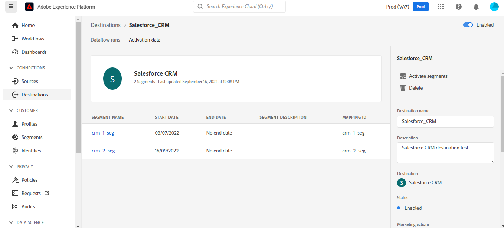
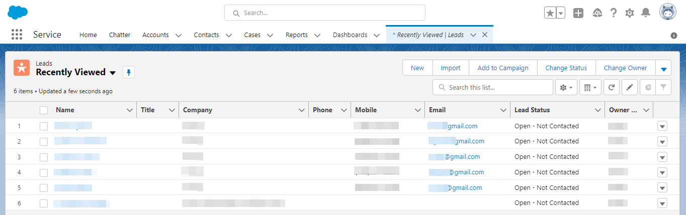

# Conexão com o [!DNL Salesforce CRM]

## Visão geral {#overview}

[[!DNL Salesforce CRM]](https://www.salesforce.com/crm/) O é uma plataforma popular de CRM (relacionamento com o cliente) e oferece suporte ao seguinte:

* [Clientes potenciais](https://developer.salesforce.com/docs/atlas.en-us.object_reference.meta/object_reference/sforce_api_objects_lead.htm) - Um cliente potencial é o nome de uma pessoa ou empresa que pode (ou não) estar interessada nos produtos ou serviços que você vende.
* [Contatos](https://developer.salesforce.com/docs/atlas.en-us.object_reference.meta/object_reference/sforce_api_objects_contact.htm) - Um contato é um indivíduo com quem um dos seus representantes estabeleceu um relacionamento e foi qualificado como um cliente em potencial.

Este [!DNL Adobe Experience Platform] [destino](/help/destinations/home.md) utiliza o [[!DNL Salesforce composite API]](https://developer.salesforce.com/docs/atlas.en-us.api_rest.meta/api_rest/resources_composite_sobjects_collections_update.htm), que aceita os dois tipos de perfis descritos acima.

Quando [ativação de segmentos](#activate), você pode selecionar entre clientes potenciais ou contatos e atualizar atributos e dados de público-alvo no [!DNL Salesforce CRM].

[!DNL Salesforce CRM] O usa o OAuth 2 com Concessão de senha como um mecanismo de autenticação para se comunicar com a API REST do Salesforce. Instruções para autenticar em seu [!DNL Salesforce CRM] exemplo, são apresentados mais abaixo, no [Autenticar para destino](#authenticate) seção.

## Casos de uso {#use-cases}

Como profissional de marketing, você pode fornecer experiências personalizadas aos seus usuários com base em atributos de seus perfis do Adobe Experience Platform. Você pode criar públicos-alvo a partir de seus dados offline e enviá-los para o Salesforce CRM, para exibição nos feeds dos usuários, assim que os públicos-alvo e os perfis forem atualizados no Adobe Experience Platform.

## Pré-requisitos {#prerequisites}

### Pré-requisitos no Experience Platform {#prerequisites-in-experience-platform}

Antes de ativar dados para o destino do Salesforce CRM, você deve ter um [schema](/help/xdm/schema/composition.md), um [conjunto de dados](https://experienceleague.adobe.com/docs/platform-learn/tutorials/data-ingestion/create-datasets-and-ingest-data.html?lang=en), e [segmentos](https://experienceleague.adobe.com/docs/platform-learn/tutorials/segments/create-segments.html?lang=en) criado em [!DNL Experience Platform].

### Pré-requisitos no [!DNL Salesforce CRM] {#prerequisites-destination}

Observe os seguintes pré-requisitos em [!DNL Salesforce CRM], para exportar dados da Platform para sua conta do Salesforce:

#### Você precisa ter um [!DNL Salesforce] account {#prerequisites-account}

Vá para a [!DNL Salesforce] [avaliação](https://www.salesforce.com/in/form/signup/freetrial-sales/) página para registrar e criar um [!DNL Salesforce] conta, se você ainda não tiver uma.

#### Configurar um aplicativo conectado no [!DNL Salesforce] {#prerequisites-connected-app}

Primeiro, é necessário configurar um [[!DNL Salesforce] aplicativo conectado](https://help.salesforce.com/s/articleView?id=sf.connected_app_create.htm&amp;language=en_US&amp;r=https%3A%2F%2Fhelp.salesforce.com%2F&amp;type=5) no seu [!DNL Salesforce] conta, se você ainda não tiver uma. [!DNL Salesforce CRM] aproveitará o aplicativo conectado para se conectar [!DNL Salesforce].

Em seguida, habilite [!DNL OAuth Settings for API Integration] para o [!DNL Salesforce connected app]. Consulte a [[!DNL Salesforce]](https://help.salesforce.com/s/articleView?id=connected_app_create_api_integration.htm&amp;type=5&amp;language=en_US) para obter orientação.

Além disso, assegure que a [escopos](https://help.salesforce.com/s/articleView?id=connected_app_create_api_integration.htm&amp;type=5&amp;language=en_US) mencionadas abaixo são selecionadas para o [!DNL Salesforce connected app].

* ``chatter_api``
* ``lightning``
* ``visualforce``
* ``content``
* ``openid``
* ``full``
* ``api``
* ``web``
* ``refresh_token``
* ``offline_access``

Por último, devem assegurar que o `password` a concessão está ativada em seu [!DNL Salesforce] conta. Consulte a [!DNL Salesforce] [Fluxo de nome de usuário-senha do OAuth 2.0 para cenários especiais](https://help.salesforce.com/s/articleView?id=sf.remoteaccess_oauth_username_password_flow.htm&amp;type=5) se precisar de orientação.

>[!IMPORTANT]
>
>Se o seu [!DNL Salesforce] administrador da conta restringiu o acesso a intervalos IP confiáveis, você precisa contatá-los para obter [IPs Experience Platform](/help/destinations/catalog/streaming/ip-address-allow-list.md) incluído na lista de permissões. Consulte a [!DNL Salesforce] [Restringir o acesso a intervalos IP confiáveis para um aplicativo conectado](https://help.salesforce.com/s/articleView?id=sf.connected_app_edit_ip_ranges.htm&amp;type=5) se precisar de orientação adicional.

#### Criar campos personalizados em [!DNL Salesforce] {#prerequisites-custom-field}

Ao ativar públicos-alvo para a variável [!DNL Salesforce CRM] destino, você deve inserir um valor no campo **[!UICONTROL ID do mapeamento]** para cada público-alvo ativado, no campo **[Programação de público](#schedule-segment-export-example)** etapa.

[!DNL Salesforce CRM] exige que esse valor leia e interprete corretamente os públicos-alvo provenientes do Experience Platform e atualize o status dos públicos-alvo dentro de [!DNL Salesforce]. Consulte a documentação do Experience Platform para [Grupo de campos de esquema Detalhes da associação do público](/help/xdm/field-groups/profile/segmentation.md) se precisar de orientação sobre os status do público-alvo.

Para cada público-alvo que você ativar da Platform para o [!DNL Salesforce CRM], é necessário criar um campo personalizado do tipo `Text Area (Long)` no prazo de [!DNL Salesforce]. Você pode definir o comprimento de caracteres de qualquer tamanho entre 256 e 131.072 caracteres de acordo com suas necessidades comerciais. Consulte a [!DNL Salesforce] [Tipos de campo personalizado](https://help.salesforce.com/s/articleView?id=sf.custom_field_types.htm&amp;type=5) página de documentação para obter informações adicionais sobre tipos de campos personalizados. Consulte também a [!DNL Salesforce] documentação para [criar campos personalizados](https://help.salesforce.com/s/articleView?id=mc_cab_create_an_attribute.htm&amp;type=5&amp;language=en_US) se precisar de assistência na criação do campo.

>[!IMPORTANT]
>
>Não inclua caracteres de espaço em branco no nome do campo. Em vez disso, use sublinhado `(_)` como separador.
>Dentro de [!DNL Salesforce] você deve criar campos personalizados com um **[!UICONTROL Nome do campo]** que corresponde exatamente ao valor especificado em **[!UICONTROL ID do mapeamento]** para cada segmento ativado da Platform. Por exemplo, a captura de tela abaixo mostra um campo personalizado chamado `crm_2_seg`. Ao ativar um público-alvo para esse destino, adicione `crm_2_seg` as **[!UICONTROL ID do mapeamento]** para preencher públicos-alvo do Experience Platform nesse campo personalizado.

Um exemplo de criação de campo personalizado em [!DNL Salesforce], *Etapa 1 - Selecionar o tipo de dados*, é mostrado abaixo:

Um exemplo de criação de campo personalizado em [!DNL Salesforce], *Etapa 2 - Inserir os detalhes do campo personalizado*, é mostrado abaixo:

>[!TIP]
>
>* Para distinguir entre campos personalizados usados para públicos da Platform e outros campos personalizados dentro do [!DNL Salesforce] você pode incluir um prefixo ou sufixo reconhecível ao criar o campo personalizado. Por exemplo, em vez de `test_segment`, use `Adobe_test_segment` ou `test_segment_Adobe`
>* Se você já tiver outros campos personalizados criados no [!DNL Salesforce], você pode usar o mesmo nome do segmento da Platform para identificar facilmente o público-alvo no [!DNL Salesforce].

>[!NOTE]
>
>* Os objetos no Salesforce estão restritos a 25 campos externos, consulte [Atributos de campo personalizado](https://help.salesforce.com/s/articleView?id=sf.custom_field_attributes.htm&amp;type=5).
>* Essa restrição implica que você só pode ter um máximo de 25 associações de público-alvo de Experience Platform ativas a qualquer momento.
>* Se você atingiu esse limite no Salesforce, deve remover os atributos personalizados do Salesforce que foram usados para armazenar o status do público-alvo em relação a públicos-alvo mais antigos no Experience Platform antes de um novo **[!UICONTROL ID do mapeamento]** pode ser usado.

#### Coletar [!DNL Salesforce CRM] credenciais {#gather-credentials}

Anote os itens abaixo antes de autenticar na [!DNL Salesforce CRM] destino:

| Credencial | Descrição | Exemplo |
| --- | --- | --- |
| `Username` | Seu [!DNL Salesforce] usuário da conta. | |
| `Password` | Seu [!DNL Salesforce] senha da conta. | |
| `Security Token` | Seu [!DNL Salesforce] token de segurança que você anexará posteriormente ao final da [!DNL Salesforce] Senha para criar uma cadeia concatenada a ser usada como **[!UICONTROL Senha]** quando [autenticando no destino](#authenticate).  Consulte a [!DNL Salesforce] documentação para [redefinir seu token de segurança](https://help.salesforce.com/s/articleView?id=sf.user_security_token.htm&amp;type=5) para saber como gerá-la novamente a partir do [!DNL Salesforce] se você não tiver o token de segurança. |  |
| `Custom Domain` | Seu [!DNL Salesforce] prefixo do domínio.   Consulte a [[!DNL Salesforce] documentação](https://help.salesforce.com/s/articleView?id=sf.domain_name_setting_login_policy.htm&amp;type=5) para saber como obter esse valor do [!DNL Salesforce] interface. | Se o seu [!DNL Salesforce] o domínio é  *`d5i000000isb4eak-dev-ed`.my.salesforce.com*,  você precisará `d5i000000isb4eak-dev-ed` como o valor. |
| `Client ID` | Seu Salesforce `Consumer Key`.   Consulte a [[!DNL Salesforce] documentação](https://help.salesforce.com/s/articleView?id=sf.connected_app_rotate_consumer_details.htm&amp;type=5) para saber como obter esse valor do [!DNL Salesforce] interface. | |
| `Client Secret` | Seu Salesforce `Consumer Secret`.   Consulte a [[!DNL Salesforce] documentação](https://help.salesforce.com/s/articleView?id=sf.connected_app_rotate_consumer_details.htm&amp;type=5) para saber como obter esse valor do [!DNL Salesforce] interface. | |

### Medidas de proteção {#guardrails}

[!DNL Salesforce] balanceia cargas de transação impondo limites de solicitação, taxa e timeout. Consulte a [Limites e alocações de solicitação de API](https://developer.salesforce.com/docs/atlas.en-us.salesforce_app_limits_cheatsheet.meta/salesforce_app_limits_cheatsheet/salesforce_app_limits_platform_api.htm) para obter detalhes.

Se o seu [!DNL Salesforce] administrador da conta impôs restrições de IP, será necessário adicionar [Endereços IP do Experience Platform](/help/destinations/catalog/streaming/ip-address-allow-list.md) ao seu [!DNL Salesforce] intervalos de IP confiáveis das contas. Consulte a [!DNL Salesforce] [Restringir o acesso a intervalos IP confiáveis para um aplicativo conectado](https://help.salesforce.com/s/articleView?id=sf.connected_app_edit_ip_ranges.htm&amp;type=5) se precisar de orientação adicional.

>[!IMPORTANT]
>
>Quando [ativação de segmentos](#activate) você deve selecionar entre *Contato* ou *Lead* tipos. É necessário garantir que seus públicos-alvo tenham o mapeamento de dados apropriado de acordo com o tipo selecionado.

## Identidades suportadas {#supported-identities}

[!DNL Salesforce CRM] O oferece suporte à atualização de identidades descritas na tabela abaixo. Saiba mais sobre [identidades](/help/identity-service/namespaces.md).

| Identidade de destino | Descrição | Considerações |
|---|---|---|
| `SalesforceId` | A variável [!DNL Salesforce CRM] identificador para as identidades de contato ou cliente potencial que você exporta ou atualiza por meio do seu segmento. | Obrigatório |

## Tipo e frequência de exportação {#export-type-frequency}

Consulte a tabela abaixo para obter informações sobre o tipo e a frequência da exportação de destino.

| Item | Tipo | Notas |
---------|----------|---------|
| Tipo de exportação | **[!UICONTROL Baseado em perfil]** | <ul><li>Você está exportando todos os membros de um segmento, juntamente com os campos de esquema desejados *(por exemplo: endereço de email, número de telefone, sobrenome)*, de acordo com o mapeamento de campo.</li><li> Cada status de público-alvo no [!DNL Salesforce CRM] é atualizado com o status de público-alvo correspondente na Platform, com base no **[!UICONTROL ID do mapeamento]** valor fornecido durante o [agendamento de público](#schedule-segment-export-example) etapa.</li></ul> |
| Frequência de exportação | **[!UICONTROL Streaming]** | <ul><li>Os destinos de transmissão são conexões baseadas em API &quot;sempre ativas&quot;. Assim que um perfil é atualizado em Experience Platform com base na avaliação do público-alvo, o conector envia a atualização downstream para a plataforma de destino. Leia mais sobre [destinos de transmissão](/help/destinations/destination-types.md#streaming-destinations).</li></ul> |

{style="table-layout:auto"}

## Conectar ao destino {#connect}

>[!IMPORTANT]
>
>Para se conectar ao destino, você precisa da variável **[!UICONTROL Gerenciar destinos]** [permissão de controle de acesso](/help/access-control/home.md#permissions). Leia o [visão geral do controle de acesso](/help/access-control/ui/overview.md) ou entre em contato com o administrador do produto para obter as permissões necessárias.

Para se conectar a esse destino, siga as etapas descritas no [tutorial de configuração de destino](../../ui/connect-destination.md). No workflow de configuração de destino, preencha os campos listados nas duas seções abaixo.

Dentro de **[!UICONTROL Destinos]** > **[!UICONTROL Catálogo]** pesquisar [!DNL Salesforce CRM]. Como alternativa, você pode localizá-lo na **[!UICONTROL CRM]** categoria.

### Autenticar para destino {#authenticate}

Para autenticar no destino, preencha os campos obrigatórios abaixo e selecione **[!UICONTROL Conectar ao destino]**. Consulte a [Coletar [!DNL Salesforce CRM] credenciais](#gather-credentials) para obter orientação.
| Credencial | Descrição | | — | — | | **[!UICONTROL Nome de usuário]** | Seu [!DNL Salesforce] usuário da conta. | | **[!UICONTROL Senha]** | Uma string concatenada composta por [!DNL Salesforce] senha da conta anexada com seu [!DNL Salesforce] Token de segurança. O valor concatenado assume a forma de `{PASSWORD}{TOKEN}`.  Observe que não use chaves ou espaços. Por exemplo, se seu [!DNL Salesforce] A senha é `MyPa$$w0rd123` e [!DNL Salesforce] O token de segurança é `TOKEN12345....0000`, o valor concatenado que será usado no **[!UICONTROL Senha]** o campo é `MyPa$$w0rd123TOKEN12345....0000`. | | **[!UICONTROL Domínio personalizado]** | Seu [!DNL Salesforce] prefixo do domínio.  Por exemplo, se o domínio for *`d5i000000isb4eak-dev-ed`.my.salesforce.com*, é necessário fornecer `d5i000000isb4eak-dev-ed` como o valor. | | **[!UICONTROL ID do cliente]** | Seu [!DNL Salesforce] aplicativo conectado `Consumer Key`. | | **[!UICONTROL Segredo do cliente]** | Seu [!DNL Salesforce] aplicativo conectado `Consumer Secret`. |

Se os detalhes fornecidos forem válidos, a interface exibirá uma **[!UICONTROL Conectado]** com uma marca de seleção verde, você pode prosseguir para a próxima etapa.

### Preencher detalhes do destino {#destination-details}

Para configurar detalhes para o destino, preencha os campos obrigatórios e opcionais abaixo. Um asterisco ao lado de um campo na interface do usuário indica que o campo é obrigatório.
* **[!UICONTROL Nome]**: um nome pelo qual você reconhecerá esse destino no futuro.
* **[!UICONTROL Descrição]**: uma descrição que ajudará você a identificar esse destino no futuro.
* **[!UICONTROL Tipo de ID do Salesforce]**:
   * Selecionar **[!UICONTROL Contato]** se as identidades que você deseja exportar ou atualizar forem do tipo *Contato*.
   * Selecionar **[!UICONTROL Lead]** se as identidades que você deseja exportar ou atualizar forem do tipo *Lead*.

### Ativar alertas {#enable-alerts}

Você pode ativar os alertas para receber notificações sobre o status do fluxo de dados para o seu destino. Selecione um alerta na lista para assinar e receber notificações sobre o status do seu fluxo de dados. Para obter mais informações sobre alertas, consulte o manual sobre [assinatura de alertas de destinos usando a interface do](../../ui/alerts.md).

Quando terminar de fornecer detalhes da conexão de destino, selecione **[!UICONTROL Próxima]**.

## Ativar públicos para este destino {#activate}

>[!IMPORTANT]
> 
>* Para ativar os dados, é necessário **[!UICONTROL Gerenciar destinos]**, **[!UICONTROL Ativar destinos]**, **[!UICONTROL Exibir perfis]**, e **[!UICONTROL Exibir segmentos]** [permissões de controle de acesso](/help/access-control/home.md#permissions). Leia o [visão geral do controle de acesso](/help/access-control/ui/overview.md) ou entre em contato com o administrador do produto para obter as permissões necessárias.
>* Para exportar *identidades*, você precisará do **[!UICONTROL Exibir gráfico de identidade]** [permissão de controle de acesso](/help/access-control/home.md#permissions).   {width="100" zoomable="yes"}

Ler [Ativar perfis e públicos para destinos de exportação de público de transmissão](/help/destinations/ui/activate-segment-streaming-destinations.md) para obter instruções sobre como ativar públicos-alvo para esse destino.

### Considerações e exemplo de mapeamento {#mapping-considerations-example}

Para enviar corretamente os dados do público-alvo do Adobe Experience Platform para a [!DNL Salesforce CRM] destino, é necessário passar pela etapa de mapeamento de campos. O mapeamento consiste em criar um link entre os campos do esquema do Experience Data Model (XDM) na sua conta da Platform e seus equivalentes correspondentes no destino.

Atributos especificados na variável **[!UICONTROL Campo de destino]** deve ser nomeado exatamente como descrito na tabela mapeamentos de atributos, pois esses atributos formarão o corpo da solicitação.

Atributos especificados na variável **[!UICONTROL Campo de origem]** não seguem nenhuma restrição desse tipo. Você pode mapeá-los com base na sua necessidade, no entanto, verifique se o formato dos dados de entrada é válido de acordo com o [[!DNL Salesforce] documentação](https://help.salesforce.com/s/articleView?id=sf.custom_field_attributes.htm&amp;type=5). Se os dados de entrada não forem válidos, a chamada de atualização para [!DNL Salesforce] falhará e seus contatos/leads não serão atualizados.

Para mapear corretamente os campos XDM para o [!DNL (API) Salesforce CRM] campos de destino, siga estas etapas:

1. No **[!UICONTROL Mapeamento]** etapa, selecione **[!UICONTROL Adicionar novo mapeamento]**, você verá uma nova linha de mapeamento na tela.
   
1. No **[!UICONTROL Selecionar campo de origem]** escolha a **[!UICONTROL Selecionar atributos]** e selecione o atributo XDM ou escolha o atributo **[!UICONTROL Selecionar namespace de identidade]** e selecione uma identidade.
1. No **[!UICONTROL Selecionar campo de destino]** escolha a **[!UICONTROL Selecionar namespace de identidade]** e selecione uma identidade ou escolha **[!UICONTROL Selecionar atributos personalizados]** categoria e selecione um atributo ou defina-o usando a variável **[!UICONTROL Nome do atributo]** conforme necessário. Consulte a [[!DNL Salesforce CRM] documentação](https://help.salesforce.com/s/articleView?id=sf.custom_field_attributes.htm&amp;type=5) para obter orientação sobre atributos compatíveis.
   * Repita essas etapas para adicionar os seguintes mapeamentos entre o esquema de perfil XDM e [!DNL (API) Salesforce CRM]:

   **Trabalhar com contatos**

   * Se você estiver trabalhando com *Contatos* no seu segmento, consulte a Referência a objetos no Salesforce para [Contato](https://developer.salesforce.com/docs/atlas.en-us.object_reference.meta/object_reference/sforce_api_objects_contact.htm) para definir mapeamentos para os campos que serão atualizados.
   * Você pode identificar campos obrigatórios pesquisando a palavra *Obrigatório*, que é mencionado nas descrições dos campos no link acima.
   * Dependendo dos campos que deseja exportar ou atualizar, adicione mapeamentos entre o esquema de perfil XDM e [!DNL (API) Salesforce CRM]: Notas do Campo de origem/Campo de destino | | — | — | — | |`IdentityMap: crmID`|`Identity: SalesforceId`|`Mandatory`| |`xdm: person.name.lastName`|`Attribute: LastName`| `Mandatory`. Sobrenome do contato com até 80 caracteres. |\
     |`xdm: person.name.firstName`|`Attribute: FirstName`| O nome do contato tem até 40 caracteres. | |`xdm: personalEmail.address`|`Attribute: Email`| O endereço de email do contato. |

   * Um exemplo usando esses mapeamentos é mostrado abaixo:
     

   **Trabalhar com clientes em potencial**

   * Se você estiver trabalhando com *Clientes potenciais* no seu segmento, consulte a Referência a objetos no Salesforce para [Lead](https://developer.salesforce.com/docs/atlas.en-us.object_reference.meta/object_reference/sforce_api_objects_lead.htm) para definir mapeamentos para os campos que serão atualizados.
   * Você pode identificar campos obrigatórios pesquisando a palavra *Obrigatório*, que é mencionado nas descrições dos campos no link acima.
   * Dependendo dos campos que deseja exportar ou atualizar, adicione mapeamentos entre o esquema de perfil XDM e [!DNL (API) Salesforce CRM]: Notas do Campo de origem/Campo de destino | | — | — | — | |`IdentityMap: crmID`|`Identity: SalesforceId`|`Mandatory`| |`xdm: person.name.lastName`|`Attribute: LastName`| `Mandatory`. Sobrenome do lead com até 80 caracteres. |\
     |`xdm: b2b.companyName`|`Attribute: Company`| `Mandatory`. A empresa do lead. | |`xdm: personalEmail.address`|`Attribute: Email`| O endereço de email do lead. |

   * Um exemplo usando esses mapeamentos é mostrado abaixo:
     

Quando terminar de fornecer os mapeamentos para sua conexão de destino, selecione **[!UICONTROL Próxima]**.

### Agendar exportação de público e exemplo {#schedule-segment-export-example}

Ao executar a [Agendar exportação de público](/help/destinations/ui/activate-segment-streaming-destinations.md#scheduling) etapa você deve mapear manualmente os públicos-alvo ativados da Platform para o campo personalizado correspondente em [!DNL Salesforce].

Para fazer isso, selecione cada segmento e insira o nome do campo personalizado em [!DNL Salesforce] no [!DNL Salesforce CRM] **[!UICONTROL ID do mapeamento]** campo. Consulte a [Criar campos personalizados em [!DNL Salesforce]](#prerequisites-custom-field) seção para obter orientação e práticas recomendadas sobre a criação de campos personalizados no [!DNL Salesforce].

Por exemplo, se o [!DNL Salesforce] o campo personalizado é `crm_2_seg`, especifique esse valor no campo [!DNL Salesforce CRM] **[!UICONTROL ID do mapeamento]** para preencher públicos-alvo do Experience Platform nesse campo personalizado.

Um exemplo de campo personalizado de [!DNL Salesforce] é mostrado abaixo:
![[!DNL Salesforce] Captura de tela da interface do usuário mostrando o campo personalizado.](../../assets/catalog/crm/salesforce/salesforce-custom-field.png)

Um exemplo indicando a localização do [!DNL Salesforce CRM] **[!UICONTROL ID do mapeamento]** é mostrado abaixo:

Como mostrado acima, o [!DNL Salesforce] **[!UICONTROL Nome do campo]** corresponde exatamente ao valor especificado em [!DNL Salesforce CRM] **[!UICONTROL ID do mapeamento]**.

Dependendo do caso de uso, todos os públicos ativados podem ser mapeados para o mesmo [!DNL Salesforce] campo personalizado ou para diferente **[!UICONTROL Nome do campo]** in [!DNL Salesforce CRM]. Um exemplo típico com base na imagem mostrada acima pode ser.
| [!DNL Salesforce CRM] nome do segmento | [!DNL Salesforce] **[!UICONTROL Nome do campo]** | [!DNL Salesforce CRM] **[!UICONTROL ID do mapeamento]** | | — | — | — | | crm_1_seg | `crm_1_seg` | `crm_1_seg` | | crm_2_seg | `crm_2_seg` | `crm_2_seg` |

Repita esta seção para cada segmento da Platform ativado.

## Validar exportação de dados {#exported-data}

Para validar se você configurou o destino corretamente, siga as etapas abaixo:

1. Selecionar **[!UICONTROL Destinos]** > **[!UICONTROL Procurar]** para navegar até a lista de destinos.
   

1. Selecionar o destino e validar se o status é **[!UICONTROL habilitado]**.
   

1. Alterne para a **[!UICONTROL Dados de ativação]** e selecione um nome de público-alvo.
   

1. Monitore o resumo do público-alvo e verifique se a contagem de perfis corresponde à contagem criada no segmento.
   

1. Por fim, faça logon no site do Salesforce e valide se os perfis do público-alvo foram adicionados ou atualizados.

   **Trabalhar com contatos**

   * Se você selecionou *Contatos* no segmento da Platform, navegue até a **[!DNL Apps]** > **[!DNL Contacts]** página.
     

   * Selecione um *Contato* e verifique se os campos foram atualizados. Você pode ver que cada status de público-alvo em [!DNL Salesforce CRM] foi atualizado com o status de público-alvo correspondente na Platform, com base na **[!UICONTROL ID do mapeamento]** valor fornecido durante o [agendamento de público](#schedule-segment-export-example).
     

   **Trabalhar com clientes em potencial**

   * Se você selecionou *Clientes potenciais* no seu segmento da Platform, em seguida, navegue até a **[!DNL Apps]** > **[!DNL Leads]** página.
     

   * Selecione um *Lead* e verifique se os campos foram atualizados. Você pode ver que cada status de público-alvo em [!DNL Salesforce CRM] foi atualizado com o status de público-alvo correspondente na Platform, com base na **[!UICONTROL ID do mapeamento]** valor fornecido durante o [agendamento de público](#schedule-segment-export-example).
     

## Uso e governança de dados {#data-usage-governance}

Todos [!DNL Adobe Experience Platform] os destinos estão em conformidade com as políticas de uso de dados ao manipular seus dados. Para obter informações detalhadas sobre como [!DNL Adobe Experience Platform] fiscaliza a governança de dados, consulte o [Visão geral da governança de dados](/help/data-governance/home.md).

## Erros e solução de problemas {#errors-and-troubleshooting}

### Erros desconhecidos encontrados ao enviar eventos para o destino {#unknown-errors}

* Ao verificar uma execução de fluxo de dados, você pode encontrar a seguinte mensagem de erro: `Unknown errors encountered while pushing events to the destination. Please contact the administrator and try again.`
  

   * Para corrigir esse erro, verifique se **[!UICONTROL ID do mapeamento]** que você forneceu no fluxo de trabalho de ativação para a [!DNL Salesforce CRM] destino corresponde exatamente ao valor do tipo de campo personalizado que você criou no [!DNL Salesforce]. Consulte a [Criar campos personalizados em [!DNL Salesforce]](#prerequisites-custom-field) para obter orientação.

* Ao ativar um segmento, você pode obter uma mensagem de erro: `The client's IP address is unauthorized for this account. Allowlist the client's IP address...`
   * Para corrigir esse erro, entre em contato com o [!DNL Salesforce] administrador da conta a adicionar [Endereços IP do Experience Platform](/help/destinations/catalog/streaming/ip-address-allow-list.md) ao seu [!DNL Salesforce] intervalos de IP confiáveis das contas. Consulte a [!DNL Salesforce] [Restringir o acesso a intervalos IP confiáveis para um aplicativo conectado](https://help.salesforce.com/s/articleView?id=sf.connected_app_edit_ip_ranges.htm&amp;type=5) se precisar de orientação adicional.

## Recursos adicionais {#additional-resources}

Informações adicionais úteis do [Portal do desenvolvedor do Salesforce](https://developer.salesforce.com/) está abaixo:
* [Início rápido](https://developer.salesforce.com/docs/atlas.en-us.api_rest.meta/api_rest/quickstart.htm)
* [Criar um registro](https://developer.salesforce.com/docs/atlas.en-us.api_rest.meta/api_rest/dome_sobject_create.htm)
* [Públicos-alvo de recomendação personalizados](https://developer.salesforce.com/docs/atlas.en-us.236.0.chatterapi.meta/chatterapi/connect_resources_recommendation_audiences_list.htm)
* [Uso de recursos compostos](https://developer.salesforce.com/docs/atlas.en-us.api_rest.meta/api_rest/using_composite_resources.htm?q=composite)
* Esse destino aproveita o [Substituir Vários Registros](https://developer.salesforce.com/docs/atlas.en-us.api_rest.meta/api_rest/resources_composite_sobjects_collections_update.htm) API em vez de [Substituir registro único](https://developer.salesforce.com/docs/atlas.en-us.api_rest.meta/api_rest/dome_composite_upsert_example.htm?q=contacts) chamada à API.