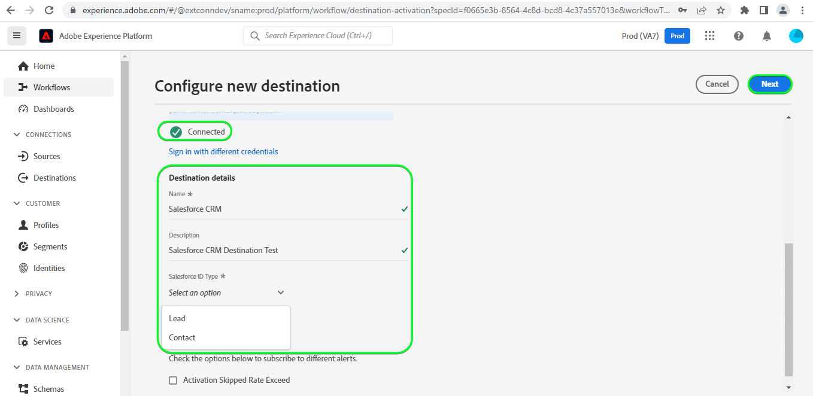

# [!DNL Salesforce CRM] conexão

## Visão geral {#overview}

[Salesforce CRM](https://www.salesforce.com/) O é uma plataforma popular de CRM (relacionamento com o cliente).

Essa [!DNL Adobe Experience Platform] [destino](/help/destinations/home.md) utiliza o [API REST do Salesforce](https://developer.salesforce.com/docs/atlas.en-us.api_rest.meta/api_rest/dome_composite_upsert_example.htm?q=contacts), que permite atualizar identidades em um segmento para o Salesforce CRM.

O Salesforce CRM usa o OAuth 2 com a concessão de senha como um mecanismo de autenticação para se comunicar com a API REST do Salesforce. As instruções para autenticar na instância do Salesforce CRM estão mais abaixo, na [Autenticar para destino](#authenticate) seção.

## Casos de uso {#use-cases}

Como profissional de marketing, você pode fornecer experiências personalizadas para seus usuários, com base em atributos de seus perfis do Adobe Experience Platform. Você pode criar segmentos a partir de seus dados offline e enviar esses segmentos para o Salesforce CRM, para exibir nos feeds dos usuários assim que os segmentos e os perfis forem atualizados no Adobe Experience Platform.

## Pré-requisitos {#prerequisites}

### Pré-requisitos no Experience Platform {#prerequisites-in-experience-platform}

Antes de ativar os dados no destino do Salesforce CRM, você deve ter uma [schema](/help/xdm/schema/composition.md), a [conjunto de dados](https://experienceleague.adobe.com/docs/platform-learn/tutorials/data-ingestion/create-datasets-and-ingest-data.html?lang=en)e [segmentos](https://experienceleague.adobe.com/docs/platform-learn/tutorials/segments/create-segments.html?lang=en) criado em [!DNL Experience Platform].

### Pré-requisitos no Salesforce CRM {#prerequisites-destination}

Observe os seguintes pré-requisitos no Salesforce para exportar dados do Platform para sua conta do Salesforce:

#### Você precisa ter uma conta do Salesforce {#prerequisites-account}

Ir para o Salesforce [avaliação](https://www.salesforce.com/in/form/signup/freetrial-sales/) para registrar e criar uma conta do Salesforce, se você ainda não tiver uma.

#### Configurar um aplicativo conectado {#prerequisites-connected-app}

Em seguida, é necessário configurar um [aplicativo conectado](https://help.salesforce.com/s/articleView?id=sf.connected_app_create.htm&amp;language=en_US&amp;r=https%3A%2F%2Fhelp.salesforce.com%2F&amp;type=5) na conta do Salesforce, se você ainda não tiver uma.

No aplicativo conectado, verifique se [Configurações de OAuth](https://help.salesforce.com/s/articleView?id=connected_app_create_api_integration.htm&amp;type=5&amp;language=en_US) estiver ativado.

Certifique-se também de que [escopos](https://help.salesforce.com/s/articleView?id=connected_app_create_api_integration.htm&amp;type=5&amp;language=en_US) são selecionados os mencionados abaixo.

* ``chatter_api``
* ``lightning``
* ``visualforce``
* ``content``
* ``openid``
* ``full``
* ``api``
* ``web``
* ``refresh_token``
* ``offline_access``

#### Criar campo personalizado no Salesforce {#prerequisites-custom-field}

Criar o campo personalizado do tipo `Text Area Long` qual Experience Platform será usada para atualizar o status do segmento no Salesforce CRM.
Consulte a documentação do Salesforce para [criar campos personalizados](https://help.salesforce.com/s/articleView?id=sf.adding_fields.htm&amp;type=5) se precisar de orientação adicional.

>[!IMPORTANT]
>
> Verifique se não há caracteres de espaço em branco no nome do campo. Em vez disso, use o sublinhado `(_)` como separador.

>[!NOTE]
>
> * Objetos no Salesforce estão restritos a 25 campos externos, consulte [Atributos de campo personalizados](https://help.salesforce.com/s/articleView?id=sf.custom_field_attributes.htm&amp;type=5).
> * Essa restrição implica que você só poderá ter no máximo 25 associações de Experience Platform a qualquer momento.
> * Se você atingiu esse limite no Salesforce, será necessário remover o atributo personalizado do Salesforce que foi usado para armazenar o status do segmento em relação aos segmentos mais antigos no Experience Platform, antes que um novo mappingId possa ser usado.

Consulte a documentação da Adobe Experience Platform para [Grupo de campos Detalhes da associação ao segmento](/help/xdm/field-groups/profile/segmentation.md) se você precisar de orientação sobre os status do segmento.

#### Obter credenciais do Salesforce {#gather-credentials}

Anote os itens abaixo antes de autenticar para o destino do Salesforce CRM:

| Credencial | Descrição | Exemplo |
| --- | --- | --- |
| <ul><li>Prefixo de domínio do Salesforce</li></ul> | Consulte [Prefixo de domínio do Salesforce](https://help.salesforce.com/s/articleView?id=sf.domain_name_setting_login_policy.htm&amp;type=5) para obter orientações adicionais. | <ul><li>Se o seu domínio for como abaixo, você precisará do valor destacado.  <i>`d5i000000isb4eak-dev-ed`.my.salesforce.com</i></li></ul> |
| <ul><li>Chave do consumidor</li><li>Segredo do consumidor</li></ul> | Consulte a [Documentação do Salesforce](https://help.salesforce.com/s/articleView?id=sf.connected_app_rotate_consumer_details.htm&amp;type=5) se precisar de orientação adicional. | <ul><li>r23kxxxxxxxx0z05xxxxxx</li><li>ipxxxxxxxxxxxT4xxxxxxxxxxx</li></ul> |

## Identidades suportadas {#supported-identities}

O Salesforce CRM oferece suporte à atualização de identidades descritas na tabela abaixo. Saiba mais sobre [identidades](/help/identity-service/namespaces.md).

| Identidade do Target | Descrição | Considerações |
|---|---|---|
| SalesforceId | Identificador personalizado do Salesforce CRM que oferece suporte ao mapeamento de qualquer identidade. | Obrigatório. Você pode enviar qualquer [identidade](../../../identity-service/namespaces.md) para [!DNL Salesforce CRM] destino, desde que você o mapeie para a variável `SalesforceId`. |

## Tipo e frequência de exportação {#export-type-frequency}

Consulte a tabela abaixo para obter informações sobre o tipo e a frequência da exportação de destino.

| Item | Tipo | Notas |
---------|----------|---------|
| Tipo de exportação | **[!UICONTROL Baseado em perfil]** | <ul><li>Você está exportando todos os membros de um segmento, junto com os campos de esquema desejados *(por exemplo: endereço de email, número de telefone, sobrenome)*, de acordo com o mapeamento de campo.</li><li> Os status do segmento da plataforma são exportados para [!DNL Salesforce CRM] ao especificar o atributo de campo personalizado correspondente em [!DNL Salesforce CRM] no **[!UICONTROL Ativar destino]** > **[!UICONTROL Agendar exportação de segmentos]** > **[!UICONTROL ID de mapeamento]** campo.</li></ul> |
| Frequência de exportação | **[!UICONTROL Streaming]** | <ul><li>Os destinos de transmissão são conexões &quot;sempre ativas&quot; baseadas em API. Assim que um perfil é atualizado no Experience Platform com base na avaliação do segmento, o conector envia a atualização downstream para a plataforma de destino. Leia mais sobre [destinos de transmissão](/help/destinations/destination-types.md#streaming-destinations).</li></ul> |

{style=&quot;table-layout:auto&quot;}

## Conecte-se ao destino {#connect}

>[!IMPORTANT]
> 
>Para se conectar ao destino, é necessário **[!UICONTROL Gerenciar destinos]** [permissão de controle de acesso](/help/access-control/home.md#permissions). Leia o [visão geral do controle de acesso](/help/access-control/ui/overview.md) ou entre em contato com o administrador do produto para obter as permissões necessárias.

Para se conectar a esse destino, siga as etapas descritas na [tutorial de configuração de destino](../../ui/connect-destination.md). No workflow para configurar destino , preencha os campos listados nas duas seções abaixo.

### Autenticar para destino {#authenticate}

Para autenticar para o destino, preencha os campos obrigatórios e selecione **[!UICONTROL Ligar ao destino]**.

* **[!UICONTROL Senha]**: Sua senha da conta do Salesforce.
* **[!UICONTROL ID do cliente]**: Sua Chave de consumidor do aplicativo conectado do Salesforce.
* **[!UICONTROL Segredo do cliente]**: Seu Segredo do Consumidor do aplicativo conectado do Salesforce.
* **[!UICONTROL Nome do usuário]**: Seu nome de usuário da conta do Salesforce.

Se os detalhes fornecidos forem válidos, a interface do usuário exibirá uma **Conectado** com uma marca de seleção verde, você pode prosseguir para a próxima etapa.

### Preencha os detalhes do destino {#destination-details}

Para configurar detalhes para o destino, preencha os campos obrigatórios e opcionais abaixo. Um asterisco ao lado de um campo na interface do usuário indica que o campo é obrigatório.

* **[!UICONTROL Nome]**: Um nome pelo qual você reconhecerá esse destino no futuro.
* **[!UICONTROL Descrição]**: Uma descrição que ajudará a identificar esse destino no futuro.
* **[!UICONTROL Domínio personalizado]**: Seu domínio do Salesforce.

### Ativar alertas {#enable-alerts}

Você pode habilitar alertas para receber notificações sobre o status do fluxo de dados para seu destino. Selecione um alerta na lista para assinar e receber notificações sobre o status do seu fluxo de dados. Para obter mais informações sobre alertas, consulte o guia sobre [inscrever-se em alertas de destinos usando a interface do usuário](../../ui/alerts.md).

Quando terminar de fornecer detalhes para a conexão de destino, selecione **[!UICONTROL Próximo]**.

## Ativar segmentos para este destino {#activate}

>[!IMPORTANT]
> 
>Para ativar os dados, é necessário **[!UICONTROL Gerenciar destinos]**, **[!UICONTROL Ativar destinos]**, **[!UICONTROL Exibir perfis]** e **[!UICONTROL Exibir segmentos]** [permissões de controle de acesso](/help/access-control/home.md#permissions). Leia o [visão geral do controle de acesso](/help/access-control/ui/overview.md) ou entre em contato com o administrador do produto para obter as permissões necessárias.

Ler [Ativar perfis e segmentos para destinos de exportação de segmentos de fluxo](/help/destinations/ui/activate-segment-streaming-destinations.md) para obter instruções sobre como ativar segmentos de público-alvo para este destino.

### Considerações e exemplo de mapeamento {#mapping-considerations-example}

Para enviar corretamente os dados do público-alvo do Adobe Experience Platform para o destino do Salesforce CRM, é necessário percorrer a etapa de mapeamento de campo . O mapeamento consiste em criar um link entre os campos do esquema do Modelo de dados de experiência (XDM) na conta da plataforma e os equivalentes correspondentes do destino. Para mapear corretamente os campos XDM para os campos de destino do Salesforce CRM, siga estas etapas:

1. Na etapa Mapeamento , clique em **[!UICONTROL Adicionar novo mapeamento]**, você verá uma nova linha de mapeamento na tela.

   

1. Na janela selecionar campo de origem, ao selecionar o campo de origem, escolha a variável **[!UICONTROL Selecionar atributos]** e adicione os mapeamentos desejados.

   

1. Na janela selecionar campo de destino, selecione o campo de destino e escolha o **[!UICONTROL Selecionar namespace de identidade]** e adicione os mapeamentos desejados.

   

1. Para atributos personalizados, na janela selecionar campo de destino, selecione o campo de destino e escolha o **[!UICONTROL Selecionar atributos personalizados]** categoria , Próximo fornece o nome do atributo de direcionamento desejado e adiciona os mapeamentos desejados.

   

1. Por exemplo, você pode adicionar o seguinte mapeamento entre o esquema de perfil XDM e o [!DNL Salesforce CRM] instância:

   |  | Esquema de perfil do XDM | [!DNL Salesforce CRM] Instância | Obrigatório |
   |---|---|---|---|
   | Atributos | <ul><li>person.name.firstName</code></li><li>person.name.lastName</code></li><li>personalEmail.address</code></li></ul> | <ul><li>FirstName</code></li><li>LastName</code></li><li>Email</code></li></ul> |
   | Identidades | <ul><li>crmID</code></li></ul> | <ul><li>SalesforceId</code></li></ul> | Sim |

1. Um exemplo de uso desses mapeamentos é mostrado abaixo:

   

### Programar exportação de segmento e exemplo {#schedule-segment-export-example}

Ao executar o [Agendar exportação de segmentos](/help/destinations/ui/activate-segment-streaming-destinations.md#scheduling) etapa você deve mapear manualmente os segmentos da Platform para o atributo de campo personalizado no Salesforce.

Para fazer isso, selecione cada segmento e insira o atributo de campo personalizado correspondente do Salesforce no **[!UICONTROL ID de mapeamento]** campo.

>[!IMPORTANT]
>
>* O valor usado para a variável **[!UICONTROL ID de mapeamento]** deve corresponder exatamente ao nome do atributo de campo personalizado criado no Salesforce.
>* Certifique-se de que o nome do atributo de campo personalizado que você criou no Salesforce não use o caractere de espaço em branco.

Um exemplo é mostrado abaixo:

## Validar exportação de dados {#exported-data}

Para validar se você configurou o destino corretamente, siga as etapas abaixo:

1. Selecionar **[!UICONTROL Destinos]** > **[!UICONTROL Procurar]** para navegar até a lista de destinos.
   

1. Selecione o destino e valide se o status é **[!UICONTROL ativado]**.
   

1. Alterne para **[!DNL Activation data]** e selecione um nome de segmento.
   

1. Monitore o resumo do segmento e garanta que a contagem de perfis corresponda à contagem criada no segmento.
   

1. Faça logon no site do Salesforce e navegue até o **[!DNL Apps]** > **[!DNL Contacts]** e verificar se os perfis do segmento foram adicionados.
   

1. Clique em um contato e verifique se os campos foram atualizados. Você notará que o status do segmento do Experience Platform foi atualizado em relação ao atributo de campo personalizado correspondente que foi fornecido no **ID de mapeamento** durante a **[!UICONTROL Ativar destino]** > **[!UICONTROL Agendar exportação de segmentos]** etapa.
   

## Uso e governança de dados {#data-usage-governance}

Todos [!DNL Adobe Experience Platform] Os destinos são compatíveis com as políticas de uso de dados ao manipular os dados. Para obter informações detalhadas sobre como [!DNL Adobe Experience Platform] aplica o controle de dados, consulte [Visão geral da governança de dados](/help/data-governance/home.md).

## Erros e solução de problemas {#errors-and-troubleshooting}

### Erros desconhecidos encontrados ao enviar eventos para o destino {#unknown-errors}

Ao verificar uma execução de fluxo de dados, se você vir a mensagem de erro abaixo, verifique se a ID de mapeamento fornecida em [!DNL Salesforce CRM] para seu segmento da Platform é válido e existe em [!DNL Salesforce CRM].

## Recursos adicionais {#additional-resources}

Informações úteis adicionais da [Portal do desenvolvedor do Salesforce](https://developer.salesforce.com/) está abaixo:
* [Criar um registro](https://developer.salesforce.com/docs/atlas.en-us.api_rest.meta/api_rest/dome_sobject_create.htm)
* [Públicos-alvo de recomendação personalizados](https://developer.salesforce.com/docs/atlas.en-us.236.0.chatterapi.meta/chatterapi/connect_resources_recommendation_audiences_list.htm)
* [Uso de recursos compostos](https://developer.salesforce.com/docs/atlas.en-us.api_rest.meta/api_rest/using_composite_resources.htm?q=composite)
* [Início rápido](https://developer.salesforce.com/docs/atlas.en-us.api_rest.meta/api_rest/quickstart.htm)

### Limites {#limits}

O Salesforce equilibra as cargas de transação impondo limites de solicitação, taxa e tempo limite. Consulte a [Limites e alocações de solicitação de API](https://developer.salesforce.com/docs/atlas.en-us.salesforce_app_limits_cheatsheet.meta/salesforce_app_limits_cheatsheet/salesforce_app_limits_platform_api.htm) para obter detalhes.