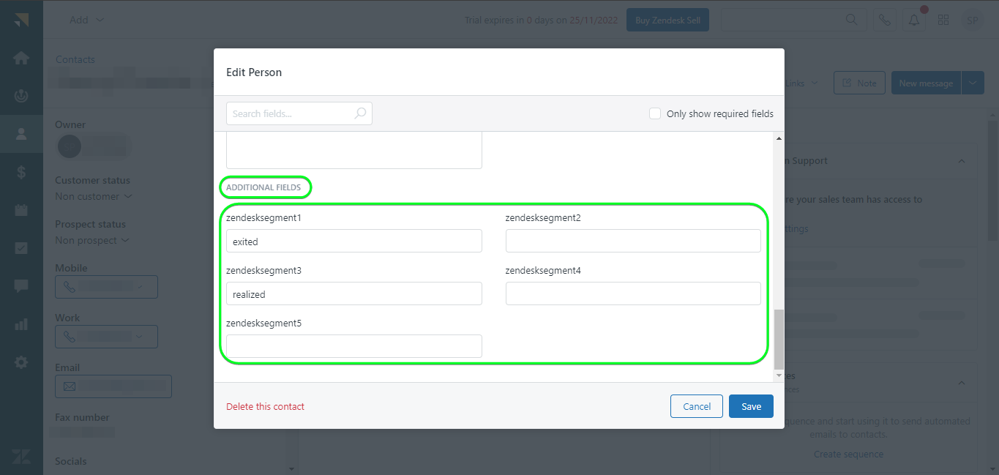

# [!DNL Zendesk] conexão

[[!DNL Zendesk]](https://www.zendesk.com) é uma solução de atendimento ao cliente e uma ferramenta de vendas.

Este [!DNL Adobe Experience Platform] [destino](/help/destinations/home.md) aproveita a [[!DNL Zendesk] API de Contatos](https://developer.zendesk.com/api-reference/sales-crm/resources/contacts/) para **criar e atualizar identidades** dentro de um público-alvo como contatos dentro de [!DNL Zendesk].

[!DNL Zendesk] usa tokens de portador como um mecanismo de autenticação para se comunicar com a API de Contatos do [!DNL Zendesk]. As instruções para autenticar na sua instância do [!DNL Zendesk] estão mais abaixo, na seção [Autenticar no destino](#authenticate).

## Casos de uso {#use-cases}

O departamento de atendimento ao cliente de uma plataforma B2C multicanal deseja garantir uma experiência personalizada contínua para seus clientes. O departamento pode criar públicos a partir de seus próprios dados offline para criar novos perfis de usuário ou atualizar informações de perfil existentes de diferentes interações (por exemplo, compras, retornos, etc.) e enviar esses públicos do Adobe Experience Platform para [!DNL Zendesk]. Ter as informações atualizadas no [!DNL Zendesk] garante que o agente de atendimento ao cliente tenha as informações recentes do cliente imediatamente disponíveis, permitindo respostas e soluções mais rápidas.

## Pré-requisitos {#prerequisites}

### Pré-requisitos do Experience Platform {#prerequisites-in-experience-platform}

Antes de ativar dados para o destino [!DNL Zendesk], você deve ter um [esquema](/help/xdm/schema/composition.md), um [conjunto de dados](https://experienceleague.adobe.com/docs/platform-learn/tutorials/data-ingestion/create-datasets-and-ingest-data.html?lang=pt-BR) e [segmentos](https://experienceleague.adobe.com/docs/platform-learn/tutorials/segments/create-segments.html?lang=pt-BR) criados em [!DNL Experience Platform].

Consulte a documentação do Experience Platform para [Grupo de campos do esquema de Detalhes da associação do público-alvo](/help/xdm/field-groups/profile/segmentation.md) se precisar de orientação sobre os status do público-alvo.

### [!DNL Zendesk] pré-requisitos {#prerequisites-destination}

Para exportar dados do Experience Platform para sua conta [!DNL Zendesk], você precisa ter uma conta [!DNL Zendesk].

#### Obter credenciais de [!DNL Zendesk] {#gather-credentials}

Anote os itens abaixo antes de autenticar no destino [!DNL Zendesk]:

| Credencial | Descrição | Exemplo |
| --- | --- | --- |
| `Bearer token` | O token de acesso gerado na sua conta [!DNL Zendesk].   Siga a documentação para [gerar um [!DNL Zendesk] token de acesso](https://developer.zendesk.com/documentation/sales-crm/first-call/#1-generate-an-access-token) se você não tiver um. | `a0b1c2d3e4...v20w21x22y23z` |

## Medidas de proteção {#guardrails}

A página [Limites de Preço e Taxa](https://developer.zendesk.com/api-reference/sales-crm/rate-limits/#pricing) detalha os limites de API [!DNL Zendesk] associados à sua conta. Você precisa garantir que seus dados e carga estejam dentro dessas restrições.

## Identidades suportadas {#supported-identities}

[!DNL Zendesk] oferece suporte à atualização de identidades descritas na tabela abaixo. Saiba mais sobre [identidades](/help/identity-service/features/namespaces.md).

| Identidade de destino | Exemplo | Descrição | Obrigatório |
|---|---|---|---|
| `email` | `test@test.com` | Endereço de email do contato. | Sim |

## Tipo e frequência de exportação {#export-type-frequency}

Consulte a tabela abaixo para obter informações sobre o tipo e a frequência da exportação de destino.

| Item | Tipo | Notas |
|---------|----------|---------|
| Tipo de exportação | **[!UICONTROL Profile-based]** | <ul><li>Você está exportando todos os membros de um segmento, juntamente com os campos de esquema desejados *(por exemplo: endereço de email, número de telefone, sobrenome)*, de acordo com o mapeamento de campos.</li><li> Cada status de segmento em [!DNL Zendesk] é atualizado com o status de público correspondente do Experience Platform, com base no valor **[!UICONTROL Mapping ID]** fornecido durante a etapa [agendamento de público-alvo](#schedule-segment-export-example).</li></ul> |
| Frequência de exportação | **[!UICONTROL Streaming]** | <ul><li>Os destinos de transmissão são conexões baseadas em API &quot;sempre ativas&quot;. Assim que um perfil for atualizado no Experience Platform com base na avaliação do público-alvo, o conector enviará a atualização downstream para a plataforma de destino. Leia mais sobre [destinos de streaming](/help/destinations/destination-types.md#streaming-destinations).</li></ul> |

{style="table-layout:auto"}

## Conectar ao destino {#connect}

>[!IMPORTANT]
>
>Para se conectar ao destino, você precisa das **[!UICONTROL View Destinations]** e **[!UICONTROL Manage Destinations]** [permissões de controle de acesso](/help/access-control/home.md#permissions). Leia a [visão geral do controle de acesso](/help/access-control/ui/overview.md) ou contate o administrador do produto para obter as permissões necessárias.

Para se conectar a este destino, siga as etapas descritas no [tutorial de configuração de destino](../../ui/connect-destination.md). No workflow de configuração de destino, preencha os campos listados nas duas seções abaixo.

Em **[!UICONTROL Destinations]** > **[!UICONTROL Catalog]** pesquise por [!DNL Zendesk]. Como alternativa, você pode localizá-lo na categoria **[!UICONTROL CRM]**.

### Autenticar para o destino {#authenticate}

Preencha os campos obrigatórios abaixo. Consulte a seção [Coletar [!DNL Zendesk] credenciais](#gather-credentials) para obter qualquer orientação.

* **[!UICONTROL Bearer Token]**: o token de acesso gerado na sua conta [!DNL Zendesk].

Para autenticar no destino, selecione **[!UICONTROL Connect to destination]**.

Se os detalhes fornecidos forem válidos, a interface exibirá um status **[!UICONTROL Connected]** com uma marca de seleção verde. Você pode prosseguir para a próxima etapa.

### Preencher detalhes do destino {#destination-details}

Para configurar detalhes para o destino, preencha os campos obrigatórios e opcionais abaixo. Um asterisco ao lado de um campo na interface do usuário indica que o campo é obrigatório.

* **[!UICONTROL Name]**: Um nome pelo qual você reconhecerá este destino no futuro.
* **[!UICONTROL Description]**: uma descrição que ajudará você a identificar este destino no futuro.

### Ativar alertas {#enable-alerts}

Você pode ativar os alertas para receber notificações sobre o status do fluxo de dados para o seu destino. Selecione um alerta na lista para assinar e receber notificações sobre o status do seu fluxo de dados. Para obter mais informações sobre alertas, consulte o manual sobre [assinatura de alertas de destinos usando a interface](../../ui/alerts.md).

Quando terminar de fornecer detalhes da conexão de destino, selecione **[!UICONTROL Next]**.

## Ativar públicos-alvo para esse destino {#activate}

>[!IMPORTANT]
> 
>* Para ativar dados, você precisa das **[!UICONTROL View Destinations]**, **[!UICONTROL Activate Destinations]**, **[!UICONTROL View Profiles]** e **[!UICONTROL View Segments]** [permissões de controle de acesso](/help/access-control/home.md#permissions). Leia a [visão geral do controle de acesso](/help/access-control/ui/overview.md) ou contate o administrador do produto para obter as permissões necessárias.
>* Para exportar *identidades*, você precisa da **[!UICONTROL View Identity Graph]** [permissão de controle de acesso](/help/access-control/home.md#permissions).   {width="100" zoomable="yes"}

Leia [Ativar perfis e públicos-alvo para destinos de exportação de público-alvo de streaming](/help/destinations/ui/activate-segment-streaming-destinations.md) para obter instruções sobre como ativar públicos-alvo para este destino.

### Considerações e exemplo de mapeamento {#mapping-considerations-example}

Para enviar corretamente seus dados de público-alvo do Adobe Experience Platform para o destino [!DNL Zendesk], é necessário passar pela etapa de mapeamento de campos. O mapeamento consiste na criação de um link entre os campos do esquema do Experience Data Model (XDM) na sua conta do Experience Platform e seus equivalentes correspondentes no destino.

Os atributos especificados em **[!UICONTROL Target field]** devem ser nomeados exatamente como descrito na tabela de mapeamentos de atributos, pois esses atributos formarão o corpo da solicitação.

Os atributos especificados em **[!UICONTROL Source field]** não seguem nenhuma restrição desse tipo. Você pode mapeá-lo com base na sua necessidade. No entanto, se o formato dos dados não estiver correto quando enviado para o [!DNL Zendesk], ocorrerá um erro.

Para mapear corretamente os campos XDM para os campos de destino [!DNL Zendesk], siga estas etapas:

1. Na etapa **[!UICONTROL Mapping]**, selecione **[!UICONTROL Add new mapping]**. Você verá uma nova linha de mapeamento na tela.
1. Na janela **[!UICONTROL Select source field]**, escolha a categoria **[!UICONTROL Select attributes]** e selecione o atributo XDM ou escolha a **[!UICONTROL Select identity namespace]** e selecione uma identidade.
1. Na janela **[!UICONTROL Select target field]**, escolha a categoria **[!UICONTROL Select identity namespace]** e selecione uma identidade de destino, ou escolha a categoria **[!UICONTROL Select attributes]** e selecione um dos atributos de esquema compatíveis.

   * Repita essas etapas para adicionar os seguintes mapeamentos obrigatórios: você também pode adicionar outros atributos que deseja atualizar entre o esquema de perfil XDM e a instância [!DNL Zendesk]:

     | Campo de origem | Campo de público alvo | Obrigatório |
     |---|---|---|
     | `xdm: person.name.lastName` | `xdm: last_name` | Sim |
     | `IdentityMap: Email` | `Identity: email` | Sim |
     | `xdm: person.name.firstName` | `xdm: first_name` | |

   * Um exemplo usando esses mapeamentos é mostrado abaixo:
     

>[!IMPORTANT]
>
>Os mapeamentos de destino `Attribute: last_name` e `Identity: email` são obrigatórios para este destino. Se esses mapeamentos estiverem ausentes, qualquer outro mapeamento será ignorado e não será enviado para [!DNL Zendesk].

Quando terminar de fornecer os mapeamentos para sua conexão de destino, selecione **[!UICONTROL Next]**.

### Agendar exportação de público e exemplo {#schedule-segment-export-example}

Na etapa [[!UICONTROL Schedule audience export]](/help/destinations/ui/activate-segment-streaming-destinations.md#scheduling) do fluxo de trabalho de ativação, é necessário mapear manualmente os públicos-alvo da Experience Platform para o atributo de campo personalizado em [!DNL Zendesk].

Para fazer isso, selecione cada segmento e insira o atributo de campo personalizado correspondente de [!DNL Zendesk] no campo **[!UICONTROL Mapping ID]**.

Um exemplo é mostrado abaixo:

## Validar exportação de dados {#exported-data}

Para validar se você configurou o destino corretamente, siga as etapas abaixo:

1. Selecione **[!UICONTROL Destinations]** > **[!UICONTROL Browse]** e navegue até a lista de destinos.
1. Em seguida, selecione o destino e alterne para a guia **[!UICONTROL Activation data]** e selecione um nome de público-alvo.
   

1. Monitore o resumo do público-alvo e verifique se a contagem de perfis corresponde à contagem no segmento.
   

1. Faça logon no site do [!DNL Zendesk] e navegue até a página **[!UICONTROL Contacts]** para verificar se os perfis do público-alvo foram adicionados. Esta lista pode ser configurada para exibir colunas para os campos adicionais criados com o público-alvo&#x200B;**[!UICONTROL Mapping ID]** e os status do público-alvo.
   

1. Como alternativa, você pode detalhar uma página individual de **[!UICONTROL Person]** e verificar a seção **[!UICONTROL Additional fields]**, que exibe o nome do público-alvo e os status do público-alvo.
   

## Uso e governança de dados {#data-usage-governance}

Todos os destinos do [!DNL Adobe Experience Platform] são compatíveis com as políticas de uso de dados ao manipular seus dados. Para obter informações detalhadas sobre como o [!DNL Adobe Experience Platform] impõe a governança de dados, consulte a [visão geral da Governança de Dados](/help/data-governance/home.md).

## Recursos adicionais {#additional-resources}

Informações adicionais úteis da documentação do [!DNL Zendesk] estão abaixo:

* [Fazendo sua primeira chamada](https://developer.zendesk.com/documentation/sales-crm/first-call/)
* [Campos Personalizados](https://developer.zendesk.com/api-reference/sales-crm/requests/#custom-fields)

### Changelog

Esta seção captura a funcionalidade e as atualizações de documentação significativas feitas neste conector de destino.

+++ Exibir changelog

| Mês de lançamento | Tipo de atualização | Descrição |
|---|---|---|
| Abril de 2023 | Atualização da documentação | <ul><li>Atualizamos a seção [casos de uso](#use-cases) com um exemplo mais claro de quando os clientes se beneficiariam com o uso desse destino.</li> <li>Atualizamos a seção [mapeamento](#mapping-considerations-example) para refletir os mapeamentos necessários corretos. Os mapeamentos de destino `Attribute: last_name` e `Identity: email` são obrigatórios para este destino. Se esses mapeamentos estiverem ausentes, qualquer outro mapeamento será ignorado e não será enviado para [!DNL Zendesk].</li> <li>Atualizamos a seção [mapping](#mapping-considerations-example) com exemplos claros de mapeamentos obrigatórios e opcionais.</li></ul> |
| Março de 2023 | Versão inicial | Versão inicial de destino e publicação da documentação. |

{style="table-layout:auto"}

+++
