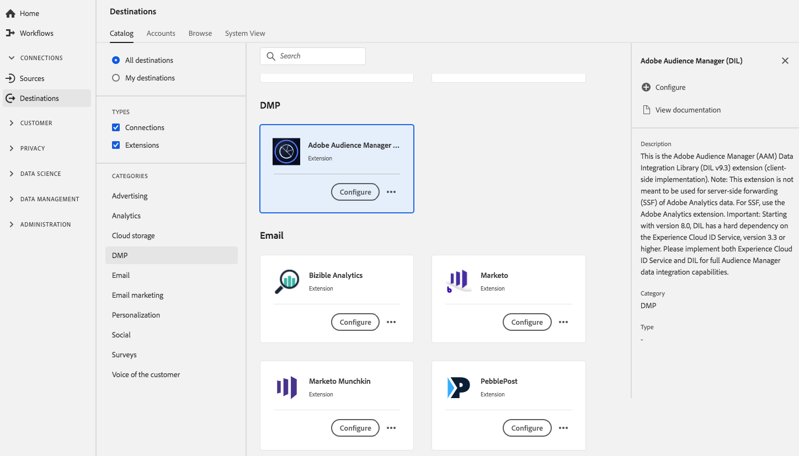

# Extensão Audience Manager DIL {#aam-dil-extension}

## Visão geral {#overview}

Esta é a extensão do Adobe Audience Manager Data Integration Library (implementação do lado do cliente). Observação: Essa extensão não deve ser usada para o encaminhamento pelo lado do servidor (SSF) dos dados do Adobe Analytics. Para SSF, use a extensão do Adobe Analytics. Importante: A partir da versão 8.0, o DIL tem uma grande dependência no [!DNL Experience Cloud] Serviço de ID, versão 3.3 ou superior. Implemente o [!DNL Experience Cloud] Serviço de ID e o DIL para obter recursos completos de integração de dados [!DNL Audience Manager].

[!DNL Audience Manager] O DIL é uma extensão da Plataforma de gerenciamento de dados (DMP) no Adobe Experience Platform. Para obter mais informações sobre a funcionalidade de extensão, consulte a [página de extensão do Audience Manager](../../../tags/extensions/web/audience-manager/overview.md) na documentação de tags.

Esse destino é uma extensão de tag. Para obter mais informações sobre como as extensões funcionam na Platform, consulte a [visão geral das extensões de tag](../launch-extensions/overview.md).

## Pré-requisitos {#prerequisites}

Essa extensão está disponível no catálogo [!DNL Destinations] para todos os clientes que compraram a Platform.

Para usar essa extensão, você precisa acessar tags no Adobe Experience Platform. Tags são oferecidas aos clientes da Adobe Experience Cloud como um recurso incluso com valor agregado. Entre em contato com o administrador da organização para obter acesso às tags e solicitar que ele conceda a permissão **[!UICONTROL manage_properties]** para que você possa instalar extensões.

## Instalar extensão {#install-extension}

Para instalar a extensão do DIL [!DNL Audience Manager]:

Na [Interface da plataforma](https://platform.adobe.com/), vá para **[!UICONTROL Destinos]** > **[!UICONTROL Catálogo]**.

Selecione a extensão do catálogo ou use a barra de pesquisa.

Clique no destino para realçá-lo e selecione **[!UICONTROL Configurar]** no painel direito. Se o controle **[!UICONTROL Configurar]** estiver esmaecido, você não terá a permissão **[!UICONTROL manage_properties]**. Consulte [Pré-requisitos](#prerequisites).

Selecione a propriedade na qual deseja instalar a extensão. Você também tem a opção de criar uma nova propriedade. Uma propriedade é uma coleção de regras, elementos de dados, extensões configuradas, ambientes e bibliotecas. Saiba mais sobre as propriedades na [documentação de tags](../../../tags/ui/administration/companies-and-properties.md#properties-page).

O fluxo de trabalho o orienta pelas etapas para concluir a instalação.

Para obter informações sobre as opções de configuração de extensão, consulte a [página de extensão do Audience Manager](../../../tags/extensions/web/audience-manager/overview.md) na documentação das tags.

Você também pode instalar a extensão diretamente na [Interface do usuário da coleta de dados](https://experience.adobe.com/#/data-collection/). Consulte o guia sobre [adicionar uma nova extensão](../../../tags/ui/managing-resources/extensions/overview.md#add-a-new-extension) para obter mais informações.

## Como usar a extensão {#how-to-use}

Depois de instalar a extensão, você pode iniciar a configuração das regras. Na interface do usuário da Coleta de dados, você pode configurar regras para as extensões instaladas para enviar dados do evento para o destino da extensão somente em determinadas situações. Para obter mais informações sobre como configurar regras para suas extensões, consulte a visão geral em [rules](../../../tags/ui/managing-resources/rules.md) na documentação de tags.

## Configurar, atualizar e excluir extensão {#configure-upgrade-delete}

É possível configurar, atualizar e excluir extensões na interface do usuário da Coleta de dados.

>[!TIP]
>
>Se a extensão já estiver instalada em uma de suas propriedades, a interface do usuário ainda exibirá **[!UICONTROL Instalar]** para a extensão. Desative o fluxo de trabalho de instalação conforme descrito em [Instalar extensão](#install-extension) para configurar ou excluir sua extensão.

Para atualizar sua extensão, consulte o guia no [processo de atualização da extensão](../../../tags/ui/managing-resources/extensions/extension-upgrade.md) na documentação das tags.
