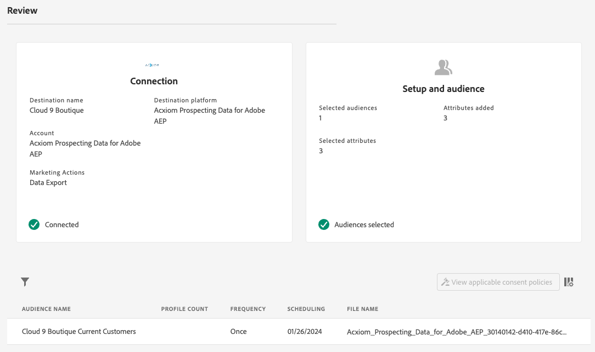

# [!DNL Acxiom Prospect-Suppression] conexão de destino

>[!NOTE]
>
>O destino [!DNL Acxiom Prospect-Suppression] está na versão beta. Esse conector de destino e a página de documentação são criados e mantidos pela equipe da Acxiom. Para qualquer consulta ou solicitação de atualização, entre em contato diretamente em acxiom-adobe-help@acxiom.com.

## Visão geral {#overview}

Use o [!DNL Acxiom Prospect-Suppression] para fornecer os públicos-alvo mais produtivos possíveis. Esse conector exporta com segurança os dados primários do Real-Time Customer Data Platform e os executa por meio de uma resolução premiada de higiene e identidade que produz um arquivo de dados para ser usado como uma lista de supressão. Isso será comparado com o banco de dados [!DNL Acxiom Global], que permite que as listas de clientes potenciais sejam personalizadas para importação. Em seguida, use o conector de origem [[!DNL Acxiom Prospecting Data Import]](/help/sources/connectors/data-partners/acxiom-prospecting-data-import.md) para obter listas de clientes potenciais da Acxiom de volta para a Real-Time CDP, com seus clientes conhecidos ou convertidos removidos.

A Acxiom oferece os públicos-alvo de melhor desempenho do setor, com o maior catálogo de mais de 12.000 atributos de dados globais, concentrados especificamente no fornecimento de experiências personalizadas. Aproveite combinações ilimitadas de dados de alta qualidade para criar e distribuir públicos para atender às necessidades específicas da campanha.

Este tutorial fornece etapas para criar uma conexão de destino e um fluxo de dados do [!DNL Acxiom Prospect-Suppression] usando a interface do usuário do Adobe Experience Platform. Esse conector é usado para fornecer dados ao serviço de prospecto da Acxiom usando o Amazon S3 como um ponto de partida. Entre em contato com o representante de conta da Acxiom depois de começar a exportar arquivos para o ponto de depósito do Amazon S3.

## Casos de uso {#use-cases}

Para ajudá-lo a entender melhor como e quando você deve usar o destino [!DNL Acxiom Prospect-Suppression], veja a seguir exemplos de casos de uso que os clientes da Adobe Experience Platform podem resolver usando esse destino.

### Criar uma lista de supressão para conjuntos de dados de prospecção {#create-suppression-list}

Profissionais de marketing que visam melhorar a eficácia de suas estratégias de alcance geralmente empregam a criação de uma lista de supressão. Essa lista inclui clientes existentes e segmentos específicos, garantindo sua exclusão das atividades de prospecção durante campanhas direcionadas. Essa abordagem estratégica ajuda a refinar o público-alvo, evita comunicação redundante e contribui para um esforço de marketing mais focado e eficiente.

Por exemplo, como profissional de marketing, talvez você queira ampliar o alcance da campanha adicionando perfis de prospecto direcionados às suas campanhas com base nos critérios de segmentação e supressão fornecidos.

O caso de uso é executado por meio de uma combinação de conectores de destino e de origem.

Inicialmente, você começaria exportando seus perfis de clientes existentes usando esse conector de destino para ser usado como um arquivo de supressão. Isso garante que nenhum registro de cliente existente seja incluído.

O serviço da Acxiom pesquisaria o arquivo, recuperaria-o e o usaria junto com outros critérios de seleção e geraria um arquivo de prospecto. Em seguida, você usaria o conector de origem [[!DNL Acxiom Prospecting Data Import]](/help/sources/connectors/data-partners/acxiom-prospecting-data-import.md) correspondente para assimilar os perfis de cliente potencial na Adobe Real-Time CDP.

## Pré-requisitos {#prerequisites}

>[!IMPORTANT]
>
>* Para se conectar ao destino, você precisa das **[!UICONTROL View Destinations]** e **[!UICONTROL Manage Destinations]**, **[!UICONTROL Activate Destinations]**, **[!UICONTROL View Profiles]** e **[!UICONTROL View Segments]** [permissões de controle de acesso](/help/access-control/home.md#permissions). Leia a [visão geral do controle de acesso](/help/access-control/ui/overview.md) ou contate o administrador do produto para obter as permissões necessárias.
>* Para exportar *identidades*, você precisa da **[!UICONTROL View Identity Graph]** [permissão de controle de acesso](/help/access-control/home.md#permissions).   {width="100" zoomable="yes"}

## Públicos-alvo compatíveis {#supported-audiences}

Esta seção descreve que tipo de público-alvo você pode exportar para esse destino.

| Origem do público | Suportado | Descrição |
|---------|----------|----------|
| [!DNL Segmentation Service] | Sim | Públicos-alvo gerados pelo [Serviço de Segmentação](../../../segmentation/home.md) da Experience Platform. |
| Todas as outras origens de público-alvo | Não | Esta categoria inclui todas as origens de público-alvo fora dos públicos-alvo gerados pelo [!DNL Segmentation Service]. Leia sobre as [várias origens do público-alvo](/help/segmentation/ui/audience-portal.md#customize). Alguns exemplos incluem: <ul><li> carregar audiências personalizadas [importadas](../../../segmentation/ui/audience-portal.md#import-audience) para o Experience Platform de arquivos CSV,</li><li> públicos-alvo semelhantes, </li><li> públicos federados, </li><li> públicos-alvo gerados em outros aplicativos da Experience Platform, como o Adobe Journey Optimizer, </li><li> e muito mais. </li></ul> |

{style="table-layout:auto"}

Públicos-alvo compatíveis por tipo de dados de público-alvo:

| Tipo de dados de público | Suportado | Descrição | Casos de uso |
|--------------------|-----------|-------------|-----------|
| [Públicos-alvo](/help/segmentation/types/people-audiences.md) | Sim | Com base nos perfis de clientes, permitindo direcionar grupos específicos de pessoas para campanhas de marketing. | Compradores frequentes, abandonadores de carrinho |
| [Públicos-alvo da conta](/help/segmentation/types/account-audiences.md) | Não | Direcione indivíduos em organizações específicas para estratégias de marketing baseadas em conta. | Marketing B2B |
| [Públicos-alvo potenciais](/help/segmentation/types/prospect-audiences.md) | Não | Direcione indivíduos que ainda não são clientes, mas compartilham características com seu público-alvo. | Prospecção com dados de terceiros |
| [Exportações do conjunto de dados](/help/catalog/datasets/overview.md) | Não | Coleções de dados estruturados armazenados no Data Lake do Adobe Experience Platform. | Relatórios, fluxos de trabalho de ciência de dados |

{style="table-layout:auto"}

## Tipo e frequência de exportação {#export-type-frequency}

Consulte a tabela abaixo para obter informações sobre o tipo e a frequência da exportação de destino.

| Item | Tipo | Notas |
|------------------|--------------------------------|------------------------------------------------------------------------------------------------------------------------------------------------------------------------------------------------------------------------------------------------------------------------------------------------------------------------|
| Tipo de exportação | **[!UICONTROL Profile-based]** | Você está exportando todos os membros de um segmento, juntamente com os campos de esquema desejados (por exemplo: endereço de email, número de telefone, sobrenome), conforme escolhido na tela selecionar atributos de perfil do [fluxo de trabalho de ativação de destino](/help/destinations/ui/activate-batch-profile-destinations.md#select-attributes). |
| Frequência de exportação | **[!UICONTROL Batch]** | Os destinos em lote exportam arquivos para plataformas downstream em incrementos de três, seis, oito, doze ou vinte e quatro horas. Leia mais sobre [destinos com base em arquivo de lote](/help/destinations/destination-types.md#file-based). |

{style="table-layout:auto"}

## Conectar ao destino {#connect}

>[!IMPORTANT]
>
>Para se conectar ao destino, você precisa das **[!UICONTROL View Destinations]** e **[!UICONTROL Manage Destinations]** [permissões de controle de acesso](/help/access-control/home.md#permissions). Leia a [visão geral do controle de acesso](/help/access-control/ui/overview.md) ou contate o administrador do produto para obter as permissões necessárias.

Para se conectar a este destino, siga as etapas descritas no [tutorial de configuração de destino](../../ui/connect-destination.md). No workflow da configuração de destino, preencha os campos listados nas duas seções abaixo.

### Autenticar para o destino {#authenticate}

Para autenticar no destino, preencha os campos obrigatórios e selecione **[!UICONTROL Connect to destination]**.

Para acessar seu bucket no Experience Platform, você precisa fornecer valores válidos para as seguintes credenciais:

| Credencial | Descrição |
|---------------|----------------------------------------------------------------------------------------------------------|
| Chave de acesso S3 | A ID da chave de acesso do seu bucket. Você pode recuperar esse valor da equipe [!DNL Acxiom]. |
| Chave secreta S3 | A ID da chave secreta para o seu bucket. Você pode recuperar esse valor da equipe [!DNL Acxiom]. |
| Nome do bucket | Esse é o seu bucket onde os arquivos serão compartilhados. Você pode recuperar esse valor da equipe [!DNL Acxiom]. |

### Nova conta {#new-account}

Para definir um novo local do Acxiom Managed S3:

### Conta existente {#existing-account}

As contas já definidas usando o destino [!DNL Acxiom Prospect Suppression] aparecem em um pop-up de lista. Quando selecionada, você poderá ver os detalhes da conta no painel direito. Veja o exemplo na interface do usuário ao navegar até **[!UICONTROL Destinations]** > **[!UICONTROL Accounts]**:

### Preencher detalhes do destino {#destination-details}

Para configurar detalhes para o destino, preencha os campos obrigatórios e opcionais abaixo. Um asterisco ao lado de um campo na interface do usuário indica que o campo é obrigatório.

* **Nome (Obrigatório)** - O nome com o qual o destino será salvo
* **Descrição** - Breve explicação da finalidade do destino
* **Nome do bucket (obrigatório)** - Nome do bucket do Amazon S3 configurado no S3
* **Caminho da Pasta (Obrigatório)** - Se os subdiretórios em um compartimento forem usados, um caminho deverá ser definido ou &#39;/&#39; para fazer referência ao caminho raiz.
* **Tipo de arquivo** - Selecione o formato que o Experience Platform deve usar para os arquivos exportados. Atualmente, o único tipo de arquivo que o processamento da Acxiom espera é o CSV

>[!IMPORTANT]
>
>Ao selecionar a opção CSV *Delimitador*, *Aspas*, *Caracteres de Escape*, *Valor Vazio*, *Valor Nulo*, *Formato de compactação* e *Incluir arquivo de manifesto*, as opções serão apresentadas. O documento a seguir explica essas configurações com mais detalhes [configure as opções de formatação](../../ui/batch-destinations-file-formatting-options.md).

### Ativar alertas {#enable-alerts}

Você pode ativar os alertas para receber notificações sobre o status do fluxo de dados para o seu destino. Selecione um alerta na lista para assinar e receber notificações sobre o status do seu fluxo de dados. Para obter mais informações sobre alertas, consulte o manual sobre [assinatura de alertas de destinos usando a interface](../../ui/alerts.md).

Quando terminar de fornecer detalhes da conexão de destino, selecione **[!UICONTROL Next]**.

## Ativar públicos-alvo para esse destino {#activate}

>[!IMPORTANT]
>
>* Para ativar dados, você precisa das **[!UICONTROL View Destinations]**, **[!UICONTROL Activate Destinations]**, **[!UICONTROL View Profiles]** e **[!UICONTROL View Segments]** [permissões de controle de acesso](/help/access-control/home.md#permissions). Leia a [visão geral do controle de acesso](/help/access-control/ui/overview.md) ou contate o administrador do produto para obter as permissões necessárias.
>* Para exportar *identidades*, você precisa da **[!UICONTROL View Identity Graph]** [permissão de controle de acesso](/help/access-control/home.md#permissions).   {width="100" zoomable="yes"}

Leia [Ativar dados de público-alvo para destinos de exportação de perfil em lote](/help/destinations/ui/activate-batch-profile-destinations.md) para obter instruções sobre como ativar públicos-alvo para esse destino.

### Sugestões de mapeamento {#mapping-suggestions}

O processamento requer elementos de nome e endereço, enquanto nem todos os elementos são necessários, fornecendo o máximo possível para ajudar na correspondência bem-sucedida.  As sugestões de mapeamento são fornecidas na tabela abaixo, listando os atributos no seu lado de destino que são usados pelo processamento da Acxiom para os quais os clientes podem mapear atributos de perfil.  Isso deve ser tratado como sugestões, pois nem todos os elementos são necessários e os valores de origem dependerão das necessidades da conta.

| Campo de público alvo | Descrição do Source |
|--------------|-------------------------------------------------------------|
| name | O valor `person.name.fullName` no Experience Platform. |
| firstName | O valor `person.name.firstName` no Experience Platform. |
| lastName | O valor `person.name.lastName` no Experience Platform. |
| address1 | O valor `mailingAddress.street1` no Experience Platform. |
| address2 | O valor `mailingAddress.street2` no Experience Platform. |
| city | O valor `mailingAddress.city` no Experience Platform. |
| estado | O valor `mailingAddress.state` no Experience Platform. |
| zip | O valor `mailingAddress.postalCode` no Experience Platform. |

{style="table-layout:auto"}

>[!NOTE]
>
>Campos adicionais não listados acima serão incluídos na exportação, mas serão ignorados pelo processamento da Acxiom.

## Revisar seu fluxo de dados {#review-dataflow}

Use a página de revisão para obter um resumo do seu fluxo de dados antes do envio

## Validar exportação de dados {#exported-data}

Para verificar se os dados foram exportados com êxito, verifique o bucket [!DNL Amazon S3 Storage] e se os arquivos exportados contêm as populações de perfis esperadas.

## Próximas etapas {#next-steps}

Seguindo este tutorial, você criou com êxito um fluxo de dados para exportar dados em lote do Experience Platform para o local do S3 gerenciado pelo [!DNL Acxiom]. Você precisaria entrar em contato com o representante da Acxiom com o nome da conta, nome do arquivo e caminho do bucket para que o processamento possa ser configurado.

## Uso e governança de dados {#data-usage-governance}

Todos os destinos do [!DNL Adobe Experience Platform] são compatíveis com as políticas de uso de dados ao manipular seus dados. Para obter informações detalhadas sobre como o [!DNL Adobe Experience Platform] fiscaliza a governança de dados, leia a [Visão geral da Governança de Dados](/help/data-governance/home.md).

## Recursos adicionais {#additional-resources}

*Distribuição e dados de público-alvo da Acxiom:* https://www.acxiom.com/customer-data/audience-data-distribution/
