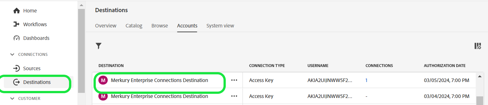

# Destino das conexões corporativas do Merkury

>[!NOTE]
>
>O conector de destino e a página de documentação são criados e mantidos pela equipe do Merkury. Para quaisquer consultas ou pedidos de atualização, entre em contato com o seu representante de conta Merkury.

## Visão geral

Use o destino das Conexões corporativas do Merkury para entregar com segurança os públicos-alvo ao Merkury. A Merkury fornece aos profissionais de marketing correspondência e entrega fáceis de públicos-alvo com base em pessoas para as conexões de TV/CTV, editor e tecnologia de anúncios endereçáveis premium da Merkury em mais de 80 anos. Merkury é alimentado por um gráfico abrangente de identidade do consumidor adulto dos EUA de 268+ milhões de pessoas.

Siga as etapas nesta página de documentação para criar uma conexão de destino das Conexões do Merkury e ativar públicos-alvo usando a interface do usuário do Adobe Experience Platform.

>[!NOTE]
>
>Se você deseja ativar públicos para destinos de mídia com sua conta do Merkury Connect, use nosso destino de Conexões do Merkury.

## Casos de uso

* **Ativação de mídia digital**: fácil correspondência e entrega dos perfis de público-alvo para mais de 50 editores premium endereçáveis e conexões de tecnologia de anúncios do Merkury.
* **Aumente a eficiência**: melhore o alcance de mídia endereçável e sem cookies, melhore a eficiência da definição de metas e o ROAS (Return on Advertising Spend, retorno sobre o investimento em publicidade).

## Pré-requisitos

>[!IMPORTANT]
>
>* Para se conectar ao destino, você precisa da variável **Exibir destinos** e **Gerenciar destinos**, **Ativar destinos**, **Exibir perfis**, e **Exibir segmentos** [[permissões de controle de acesso]](https://experienceleague.adobe.com/en/docs/experience-platform/access-control/home#permissions). Leia o [[visão geral do controle de acesso]](https://experienceleague.adobe.com/en/docs/experience-platform/access-control/ui/overview) ou entre em contato com o administrador do produto para obter as permissões necessárias.
>* Para exportar *identidades*, você precisará do **Exibir gráfico de identidade** [[permissão de controle de acesso]](https://experienceleague.adobe.com/en/docs/experience-platform/access-control/home#permissions).\

## Identidades suportadas {#supported-identities}

| Identidade de destino | Descrição | Considerações |
|---|---|---|
| GAID | ID de publicidade do Google | Selecione a identidade de destino GAID quando a identidade de origem for um namespace GAID. |
| IDFA | Apple ID para anunciantes | Selecione a identidade de destino do IDFA quando a identidade de origem for um namespace do IDFA. |
| ECID | Experience Cloud ID | Um namespace que representa a ECID. Esse namespace também pode ser referenciado pelos seguintes aliases: &quot;Adobe Marketing Cloud ID&quot;, &quot;Adobe Experience Cloud ID&quot;, &quot;Adobe Experience Platform ID&quot;. Consulte o seguinte documento em [ECID](/help/identity-service/features/ecid.md) para obter mais informações. |
| phone_sha256 | Números de telefone com hash com o algoritmo SHA256 | Os números de telefone com hash SHA256 e texto sem formatação são compatíveis com o Adobe Experience Platform. Quando o campo de origem contiver atributos sem hash, verifique a **[!UICONTROL Aplicar transformação]** opção, para ter [!DNL Platform] coloque automaticamente os dados em hash na ativação. |
| email_lc_sha256 | Endereços de email com hash com o algoritmo SHA256 | O Adobe Experience Platform oferece suporte tanto para texto simples quanto para endereços de email com hash SHA256. Quando o campo de origem contiver atributos sem hash, verifique a **[!UICONTROL Aplicar transformação]** opção, para ter [!DNL Platform] coloque automaticamente os dados em hash na ativação. |
| extern_id | IDs de usuário personalizadas | Selecione esta identidade de destino quando sua identidade de origem for um namespace personalizado. |

{style="table-layout:auto"}

## Públicos-alvo compatíveis

Esta seção descreve que tipo de público-alvo você pode exportar para esse destino.

| **Público-alvo** | **Compatível** | **Origem da descrição** |
|---|---|---|      
| Serviço de segmentação | ✓ | Públicos-alvo gerados pelo Experience Platform [[Serviço de segmentação]](https://experienceleague.adobe.com/en/docs/experience-platform/segmentation/home). |
| Uploads personalizados | X | Públicos-alvo [[importado]](https://experienceleague.adobe.com/en/docs/experience-platform/segmentation/ui/overview#import-audience) para o Experience Platform de arquivos CSV. |

{style="table-layout:auto"}

## Tipo e frequência de exportação

Consulte a tabela abaixo para obter informações sobre o tipo e a frequência da exportação de destino.

| **Item** | **Tipo** | **Notas** |
|---|---|---|  
| Tipo de exportação | **Baseado em perfil** | Você está exportando todos os membros de um segmento, juntamente com os campos de esquema desejados (por exemplo: endereço de email, número de telefone, sobrenome), conforme escolhido na tela selecionar atributos de perfil da [[fluxo de trabalho de ativação de destino]](https://experienceleague.adobe.com/en/docs/experience-platform/destinations/ui/activate/activate-batch-profile-destinations#select-attributes). |
| Frequência | **Lote** | Os destinos em lote exportam arquivos para plataformas downstream em incrementos de três, seis, oito, doze ou vinte e quatro horas. Leia mais sobre [[destinos de frequência baseados em arquivo em lote]](https://experienceleague.adobe.com/en/docs/experience-platform/destinations/destination-types#file-based). |

{style="table-layout:auto"}

## Conectar ao destino

>[!IMPORTANT]
>
>Para se conectar ao destino, você precisa da variável **Exibir destinos** e **Gerenciar e ativar destinos do conjunto de dados** [[permissões de controle de acesso]](https://experienceleague.adobe.com/en/docs/experience-platform/access-control/home#permissions). Leia o [[visão geral do controle de acesso]](https://experienceleague.adobe.com/en/docs/experience-platform/access-control/ui/overview) ou entre em contato com o administrador do produto para obter as permissões necessárias.

Para se conectar a esse destino, siga as etapas descritas no [[tutorial de configuração de destino]](https://experienceleague.adobe.com/en/docs/experience-platform/destinations/ui/connect-destination). No workflow da configuração de destino, preencha os campos listados nas duas seções abaixo.

### Autenticar para o destino

Para autenticar no destino, preencha os campos obrigatórios e selecione **Conectar ao destino**.

Para acessar seu bucket no Experience Platform, você precisa fornecer valores válidos para as seguintes credenciais:

| **Credencial** | **Descrição** |
|---|---|
| Chave de acesso | A ID da chave de acesso do seu bucket. Você pode recuperar esse valor da equipe do Merkury. |
| Chave secreta | A ID da chave secreta para o seu bucket. Você pode recuperar esse valor da equipe do Merkury. |
| Nome do bucket | Esse é o seu bucket onde os arquivos serão compartilhados. Você pode recuperar esse valor da equipe do Merkury. |

{style="table-layout:auto"}

### Preencher detalhes do destino

Para configurar detalhes para o destino, preencha os campos obrigatórios e opcionais abaixo. Um asterisco ao lado de um campo na interface do usuário indica que o campo é obrigatório.

* **Nome (obrigatório)** - O nome em que o destino será salvo
* **Descrição** - Breve explicação da finalidade do destino
* **Nome do Período (Obrigatório)** - Nome do bucket do Amazon S3 configurado no S3
* **Caminho da pasta (obrigatório)** - Se os subdiretórios em um bucket forem usados, um caminho deverá ser definido, ou &#39;/&#39; para fazer referência ao caminho raiz.
* **Tipo de arquivo** - Selecione o formato que o Experience Platform deve usar para os arquivos exportados. Consulte sua equipe do Merkury para obter o tipo de arquivo esperado para sua conta.

>[!NOTE]
>
>Ao selecionar as opções CSV, Delimitador, Caractere de citação, Caractere de escape, Valor vazio, Valor nulo, Formato de compactação e Incluir arquivo de manifesto serão apresentadas, consulte sua equipe do Merkury para obter as configurações apropriadas para sua conta.

### Conta existente

As contas já definidas usando o destino Merkury Enterprise Connections aparecem em um pop-up de lista. Quando selecionada, você poderá ver os detalhes da conta no painel direito. Veja o exemplo da interface do usuário ao navegar para **Destinos** > **Contas**;

## Ativar alertas

Você pode ativar os alertas para receber notificações sobre o status do fluxo de dados para o seu destino. Selecione um alerta na lista para assinar e receber notificações sobre o status do seu fluxo de dados. Para obter mais informações sobre alertas, consulte o manual sobre [assinatura de alertas de destinos usando a interface do](https://experienceleague.adobe.com/en/docs/experience-platform/destinations/ui/alerts).

Quando terminar de fornecer detalhes da conexão de destino, selecione **Próxima**.

## Ativar públicos-alvo para esse destino

>[!IMPORTANT]
>
>* Para ativar dados, você precisa das permissões de controle de acesso Exibir destinos, Ativar destinos, Exibir perfis e Exibir segmentos. Leia a visão geral do controle de acesso ou entre em contato com o administrador do produto para obter as permissões necessárias.
>* Para exportar identidades, você precisa da permissão de controle de acesso Exibir gráfico de identidade.

Ler [Ativar dados do público-alvo para destinos de exportação de perfil em lote](https://experienceleague.adobe.com/en/docs/experience-platform/destinations/ui/activate/activate-batch-profile-destinations) para obter instruções sobre como ativar públicos-alvo para esse destino.

## Sugestões de mapeamento

O processamento correto de arquivos no lado do Merkury requer elementos de nome e endereço. Embora nem todos os elementos sejam necessários, fornecer o máximo possível ajudará na correspondência bem-sucedida.

As sugestões de mapeamento são fornecidas na tabela abaixo, listando os atributos no seu lado de destino que são usados pelo processamento do Merkury para os quais os clientes podem mapear atributos de perfil. Trate esses elementos como sugestões, pois nem todos os elementos são obrigatórios. Os valores de origem dependerão das necessidades da conta.

| Campo de público alvo | Descrição da origem |
|---|---|
| ID | Campo de identidade a ser usado para mapear dados de merkury para o Experience Platform por meio do conector de origem de resolução de identidade corporativa do Merkury |
| Input_First_Name | A variável `person.name.firstName` valor em Experience Platform. |
| Input_Last_Name | A variável `person.name.lastName` valor em Experience Platform. |
| Input_Address_Line_1 | A variável `mailingAddress.street` valor em Experience Platform. |
| Cidade_Entrada | A variável `mailingAddress.city` valor em Experience Platform. |
| Input_State_Province_Code | A variável `mailingAddress.state` valor em Experience Platform. Use se o estado estiver no formato de código de dois caracteres. |
| Input_State_Province_Name | A variável `mailingAddress.state` valor em Experience Platform. Usar se o estado for o nome completo do estado |
| Input_Postal_Code | A variável `mailingAddress.postalCode` valor em Experience Platform. |
| Input_Email_Address | O valor que você deseja mapear como o endereço de email dos perfis. |
| Input_Phone | O valor que você deseja mapear como o número de telefone dos perfis. |

{style="table-layout:auto"}

## Validar exportação de dados

Para verificar se os dados foram exportados com êxito, verifique o bucket do Amazon S3 Storage e se os arquivos exportados contêm as populações de perfis esperadas.

## Uso e governança de dados

Todos os destinos do Adobe Experience Platform estão em conformidade com as políticas de uso de dados ao manipular seus dados. Para obter informações detalhadas sobre como o Adobe Experience Platform fiscaliza a governança de dados, leia o [Visão geral da governança de dados](https://experienceleague.adobe.com/en/docs/experience-platform/data-governance/home).

## Próximas etapas

Seguindo este tutorial, você criou com sucesso um fluxo de dados para exportar dados do perfil do Experience Platform para sua localização do S3 gerenciado pelo Merkury. Em seguida, entre em contato com o representante do Merkury com o nome da conta, os nomes dos arquivos e o caminho do bucket, para que o processamento possa ser configurado.