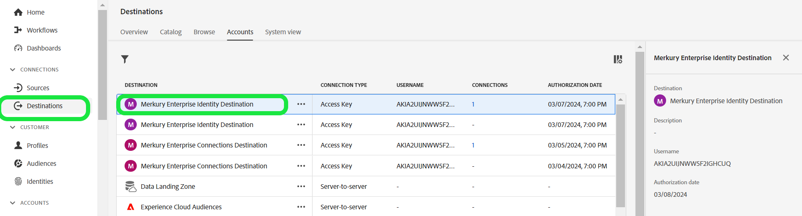

# Destino de identidade da Merkury Enterprise

>[!NOTE]
>
>O conector de destino e a página de documentação são criados e mantidos pela equipe [!DNL Merkury]. Para obter consultas ou atualizar solicitações, entre em contato com o representante de conta do [!DNL Merkury].

## Visão geral

Use o destino [!DNL Merkury Enterprise Identity] para criar perfis de consumidor mais precisos, abrangentes e perspicazes. Com dados de perfil aprimorados, os profissionais de marketing podem utilizar melhores insights, segmentos e modelos, resultando em direcionamento e modelagem preditiva mais precisos.

Siga as etapas desta página de documentação para criar uma conexão de destino [!DNL Merkury Identity] e ativar públicos-alvo para identificação e enriquecimento usando a interface do usuário do Adobe Experience Platform.

>[!NOTE]
>
>Se você deseja ativar públicos para destinos de mídia com a conta do [!DNL Merkury Connect], use o destino [!DNL Merkury Connections].

## Casos de uso

O destino [!DNL Merkury Enterprise Identity] fornece a capacidade de transferir com segurança a PII do consumidor para os seguintes recursos [!DNL Merkury]:

* **Qualidade dos dados**: melhore a qualidade dos dados do perfil do consumidor com higiene e padronização dos dados. O [!DNL Merkury] inclui higiene postal nos EUA e identificação de movimentação para dar suporte aos casos de uso de marketing de correspondência direta mais avançados.
* **Resolução de identidade**: crie uma visão única precisa e abrangente do cliente, informada por [!DNL Merkury] IDs individuais e familiares. As IDs do Merkury fornecem um nível profundo de vinculação de perfis graças ao abrangente gráfico de identidade de consumidor adulto dos EUA de [!DNL Merkury], de 268+ milhões de pessoas.
* **Enriquecimento**: promova melhores insights e personalização com [!DNL Merkury Data]. O [!DNL Merkury Data] inclui mais de 10.000 atributos de dados disponíveis, que variam de dados demográficos, de estilo de vida, financeiros, de eventos de vida e de compra do [!DNL Merkury Data Suite].

>[!NOTE]
>
>Esses casos de uso são executados por meio de uma combinação de conectores de destino e de origem. O cliente começará exportando seus registros de clientes existentes para enriquecimento usando esse conector de destino. O serviço de [!DNL Merkury] pesquisaria o arquivo, recuperaria, enriqueceria com os dados de [!DNL Merkury] e geraria um arquivo. O cliente usaria o cartão-fonte do conector do Source [!DNL Merkury] correspondente para assimilar os perfis hidratados do cliente de volta na Adobe Real-Time CDP.

## Pré-requisitos

>[!IMPORTANT]
>
>* Para se conectar ao destino, você precisa de **Exibir Destinos** e **Gerenciar Destinos**, **Ativar Destinos**, **Exibir Perfis** e **Exibir Segmentos** [[permissões de controle de acesso]](https://experienceleague.adobe.com/pt-br/docs/experience-platform/access-control/home#permissions). Leia a [[visão geral do controle de acesso]](https://experienceleague.adobe.com/pt-br/docs/experience-platform/access-control/ui/overview) ou contate o administrador do produto para obter as permissões necessárias.
>* Para exportar *identidades*, você precisa do **Exibir Gráfico de Identidade** [[permissão de controle de acesso]](https://experienceleague.adobe.com/pt-br/docs/experience-platform/access-control/home#permissions).\

## Identidades suportadas {#supported-identities}

| Identidade de destino | Descrição | Considerações |
|---|---|---|
| GAID | GOOGLE ADVERTISING ID | Selecione a identidade de destino GAID quando a identidade de origem for um namespace GAID. |
| IDFA | Apple ID para anunciantes | Selecione a identidade de destino do IDFA quando a identidade de origem for um namespace do IDFA. |
| ECID | Experience Cloud ID | Um namespace que representa a ECID. Esse namespace também pode ser referenciado pelos seguintes aliases: &quot;Adobe Marketing Cloud ID&quot;, &quot;Adobe Experience Cloud ID&quot;, &quot;Adobe Experience Platform ID&quot;. Consulte o seguinte documento no [ECID](/help/identity-service/features/ecid.md) para obter mais informações. |
| phone_sha256 | Números de telefone com hash com o algoritmo SHA256 | Os números de telefone com hash SHA256 e texto sem formatação são compatíveis com o Adobe Experience Platform. Quando o campo de origem contiver atributos sem hash, marque a opção **[!UICONTROL Apply transformation]** para que o [!DNL Experience Platform] coloque os dados em hash automaticamente durante a ativação. |
| email_lc_sha256 | Endereços de email com hash com o algoritmo SHA256 | O Adobe Experience Platform oferece suporte tanto para texto simples quanto para endereços de email com hash SHA256. Quando o campo de origem contiver atributos sem hash, marque a opção **[!UICONTROL Apply transformation]** para que o [!DNL Experience Platform] coloque os dados em hash automaticamente durante a ativação. |
| extern_id | IDs de usuário personalizadas | Selecione esta identidade de destino quando sua identidade de origem for um namespace personalizado. |

{style="table-layout:auto"}

## Públicos-alvo compatíveis

Esta seção descreve que tipo de público-alvo você pode exportar para esse destino.

| **Público-alvo** | **Com suporte** | **Descrição** |
|---|---|---|
| Serviço de segmentação | ✓ | Públicos gerados por meio do Experience Platform [[Serviço de segmentação]](https://experienceleague.adobe.com/pt-br/docs/experience-platform/segmentation/home). |
| Uploads personalizados | x | Públicos [[importados]](https://experienceleague.adobe.com/pt-br/docs/experience-platform/segmentation/ui/overview#import-audience) para o Experience Platform de arquivos CSV. |

{style="table-layout:auto"}

## Tipo e frequência de exportação

Consulte a tabela abaixo para obter informações sobre o tipo e a frequência da exportação de destino.

| **Público-alvo** | **Com suporte** | **Origem da descrição** |
|---|---|---|      
| Serviço de segmentação | ✓ | Públicos gerados por meio do Experience Platform [[Serviço de segmentação]](https://experienceleague.adobe.com/pt-br/docs/experience-platform/segmentation/home). |
| Uploads personalizados | X | Públicos [[importados]](https://experienceleague.adobe.com/pt-br/docs/experience-platform/segmentation/ui/overview#import-audience) para o Experience Platform de arquivos CSV. |

{style="table-layout:auto"}

## Conectar ao destino

>[!IMPORTANT]
>
>Para se conectar ao destino, você precisa do **Exibir Destinos** e do **Gerenciar e Ativar Destinos de Conjuntos de Dados** [[permissões de controle de acesso]](https://experienceleague.adobe.com/pt-br/docs/experience-platform/access-control/home#permissions). Leia a [[visão geral do controle de acesso]](https://experienceleague.adobe.com/pt-br/docs/experience-platform/access-control/ui/overview) ou contate o administrador do produto para obter as permissões necessárias.

Para se conectar a este destino, siga as etapas descritas no [[tutorial de configuração de destino]](https://experienceleague.adobe.com/pt-br/docs/experience-platform/destinations/ui/connect-destination). No workflow da configuração de destino, preencha os campos listados nas duas seções abaixo.

### Autenticar para o destino

Para autenticar no destino, preencha os campos obrigatórios e selecione **Conectar ao destino**.

Para acessar seu bucket no Experience Platform, você precisa fornecer valores válidos para as seguintes credenciais:

| **Credencial** | **Descrição** |
|---|---|
| Chave de acesso | A ID da chave de acesso do seu bucket. Você pode recuperar esse valor da equipe do Merkury. |
| Chave secreta | A ID da chave secreta para o seu bucket. Você pode recuperar esse valor da equipe do Merkury. |
| Nome do bucket | Esse é o seu bucket onde os arquivos serão compartilhados. Você pode recuperar esse valor da equipe do Merkury. |

{style="table-layout:auto"}

### Preencher detalhes do destino

Para configurar detalhes para o destino, preencha os campos obrigatórios e opcionais abaixo. Um asterisco ao lado de um campo na interface do usuário indica que o campo é obrigatório.

* **Nome (Obrigatório)** - O nome com o qual o destino será salvo
* **Descrição** - Breve explicação da finalidade do destino
* **Nome do bucket (obrigatório)** - Nome do bucket do Amazon S3 configurado no S3
* **Caminho da Pasta (Obrigatório)** - Se os subdiretórios em um compartimento forem usados, um caminho deverá ser definido ou &#39;/&#39; para fazer referência ao caminho raiz.
* **Tipo de arquivo** - Selecione o formato que o Experience Platform deve usar para os arquivos exportados. Consulte sua equipe do Merkury para obter o tipo de arquivo esperado para sua conta.

>[!NOTE]
>
>Ao selecionar a opção CSV, as opções Delimitador, Citação, Caractere de escape, Valor vazio, Valor nulo, Formato de compactação e Incluir arquivo de manifesto serão apresentadas. Consulte sua equipe do Merkury para obter as configurações apropriadas para sua conta.

### Conta existente

As contas já definidas usando o destino Merkury Enterprise Identity são exibidas em um pop-up de lista. Quando selecionada, você poderá ver os detalhes da conta no painel direito. Veja o exemplo da interface do usuário ao navegar até **Destinos** > **Contas**;

### Ativar alertas

Você pode ativar os alertas para receber notificações sobre o status do fluxo de dados para o seu destino. Selecione um alerta na lista para assinar e receber notificações sobre o status do seu fluxo de dados. Para obter mais informações sobre alertas, consulte o manual sobre [assinatura de alertas de destinos usando a interface](https://experienceleague.adobe.com/pt-br/docs/experience-platform/destinations/ui/alerts).

Quando terminar de fornecer detalhes da conexão de destino, selecione **Avançar**.

## Ativar públicos-alvo para esse destino

>[!IMPORTANT]
>
>* Para ativar dados, você precisa de **Exibir Destinos**, **Ativar Destinos**, **Exibir Perfis** e **Exibir Segmentos** permissões de controle de acesso. Leia a visão geral do controle de acesso ou entre em contato com o administrador do produto para obter as permissões necessárias.
>* Para exportar identidades, você precisa da permissão de controle de acesso **Exibir Gráfico de Identidade**.

Leia [Ativar dados de público-alvo para destinos de exportação de perfil em lote](https://experienceleague.adobe.com/pt-br/docs/experience-platform/destinations/ui/activate/activate-batch-profile-destinations) para obter instruções sobre como ativar públicos-alvo para esse destino.

## Sugestões de mapeamento

O processamento correto de arquivos no lado [!DNL Merkury] requer elementos de nome e endereço. Embora nem todos os elementos sejam necessários, fornecer o máximo possível ajudará na correspondência bem-sucedida.

São fornecidas sugestões de mapeamento na tabela abaixo, listando os atributos no seu lado de destino que são usados pelo processamento do [!DNL Merkury] para os quais os clientes podem mapear atributos de perfil. Trate esses elementos como sugestões, pois nem todos os elementos são obrigatórios. Os valores de origem dependerão das necessidades da conta.

| Campo de público alvo | Descrição do Source |
|---|---|
| ID | Campo de identidade a ser usado para mapear dados do [!DNL Merkury] para o Experience Platform por meio do conector do Source [!DNL Merkury Enterprise Identity] |
| Input_First_Name | O valor `person.name.firstName` no Experience Platform. |
| Input_Last_Name | O valor `person.name.lastName` no Experience Platform. |
| Input_Address_Line_1 | O valor `mailingAddress.street` no Experience Platform. |
| Cidade_Entrada | O valor `mailingAddress.city` no Experience Platform. |
| Input_State_Province_Code | O valor `mailingAddress.state` no Experience Platform. Use se o estado estiver no formato de código de dois caracteres. |
| Input_State_Province_Name | O valor `mailingAddress.state` no Experience Platform. Usar se o estado for o nome completo do estado |
| Input_Postal_Code | O valor `mailingAddress.postalCode` no Experience Platform. |
| Input_Email_Address | O valor que você deseja mapear como o endereço de email dos perfis. |
| Input_Phone | O valor que você deseja mapear como o número de telefone dos perfis. |

{style="table-layout:auto"}

## Validar exportação de dados

Para verificar se os dados foram exportados com êxito, verifique o bucket do Amazon S3 Storage e se os arquivos exportados contêm as populações de perfis esperadas.

## Uso e governança de dados

Todos os destinos do Adobe Experience Platform estão em conformidade com as políticas de uso de dados ao manipular seus dados. Para obter informações detalhadas sobre como a Adobe Experience Platform fiscaliza a governança de dados, leia a [visão geral da Governança de dados](https://experienceleague.adobe.com/pt-br/docs/experience-platform/data-governance/home).

## Próximas etapas

Ao seguir este tutorial, você criou com êxito um fluxo de dados para exportar dados de perfil do Experience Platform para o seu local do S3 gerenciado pelo [!DNL Merkury]. Em seguida, contate o representante do [!DNL Merkury] com o nome da conta, os nomes de arquivo e o caminho do bucket para que o processamento possa ser configurado.
