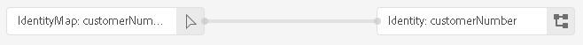
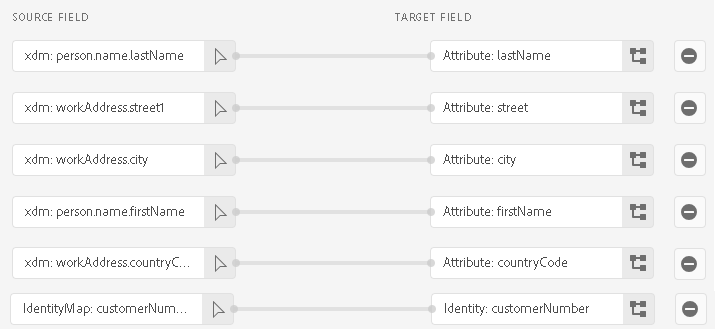

# [!DNL SAP Commerce] conexão

[!DNL SAP Commerce], anteriormente conhecido como [[!DNL Hybris]](https://www.sap.com/india/products/acquired-brands/what-is-hybris.html), é uma solução de plataforma de comércio eletrônico baseada em nuvem para empresas B2B e B2C e está disponível como parte do portfólio SAP Customer Experience. O [[!DNL SAP] Cobrança de assinatura](https://www.sap.com/products/financial-management/subscription-billing.html) é um produto do portfólio e permite o gerenciamento completo do ciclo de vida da assinatura com vendas simplificadas e experiências de pagamento por meio de integrações padronizadas.

Este [!DNL Adobe Experience Platform] [destino](/help/destinations/home.md) usa a [[!DNL SAP Subscription Billing] API de gerenciamento de clientes](https://api.sap.com/api/BusinessPartner_APIs/path/PUT_customers-customerNumber) para atualizar os detalhes do cliente no [!DNL SAP Commerce] de um público-alvo existente da Experience Platform após a ativação.

As instruções para autenticar na sua instância do [!DNL SAP Commerce] estão mais abaixo, na seção [Autenticar no destino](#authenticate).

## Casos de uso {#use-cases}

Para ajudá-lo a entender melhor como e quando você deve usar o destino [!DNL SAP Commerce], veja um exemplo de caso de uso que os clientes da Adobe Experience Platform podem resolver usando esse destino.

[!DNL SAP Commerce] clientes armazenam informações sobre indivíduos ou entidades organizacionais que interagem com sua empresa. Sua equipe usa os clientes existentes no [!DNL SAP Commerce] para criar os públicos-alvo da Experience Platform. Depois de enviar esses públicos-alvo para [!DNL SAP Commerce], suas informações são atualizadas e cada cliente recebe uma propriedade com seu valor como o nome do público-alvo que indica a qual público-alvo o cliente pertence.

## Pré-requisitos {#prerequisites}

Consulte as seções abaixo para quaisquer pré-requisitos que você deve configurar no Experience Platform e [!DNL SAP Commerce] e para obter informações que você deve coletar antes de trabalhar com o destino [!DNL SAP Commerce].

### Pré-requisitos do Experience Platform {#prerequisites-in-experience-platform}

Antes de ativar dados para o destino [!DNL SAP Commerce], você deve ter um [esquema](/help/xdm/schema/composition.md), um [conjunto de dados](https://experienceleague.adobe.com/docs/platform-learn/tutorials/data-ingestion/create-datasets-and-ingest-data.html) e [públicos-alvo](https://experienceleague.adobe.com/docs/platform-learn/tutorials/audiences/create-audiences.html) criados em [!DNL Experience Platform].

Consulte a documentação do Experience Platform para [Grupo de campos do esquema de Detalhes da associação do público-alvo](/help/xdm/field-groups/profile/segmentation.md) se precisar de orientação sobre os status do público-alvo.

### Pré-requisitos para o destino [!DNL SAP Commerce] {#prerequisites-destination}

Observe os seguintes pré-requisitos para exportar dados do Experience Platform para sua conta do [!DNL SAP Commerce]:

#### Você deve ter uma conta [!DNL SAP Subscription Billing] {#prerequisites-account}

Para exportar dados do Experience Platform para sua conta [!DNL SAP Commerce], você precisa ter uma conta [!DNL SAP Subscription Billing]. Se você não tiver uma conta de cobrança válida, contate o gerente de conta do [!DNL SAP]. Consulte o documento [[!DNL SAP] Configuração da plataforma](https://help.sap.com/doc/5fd179965d5145fbbe7f2a7aa1272338/latest/en-US/PlatformConfiguration.pdf) para obter detalhes adicionais.

#### Gerar uma chave de serviço {#prerequisites-service-key}

* A chave de serviço [!DNL SAP Commerce] permite acessar a API [!DNL SAP Subscription Billing] por meio do Experience Platform. Consulte [!DNL SAP Commerce] [criar uma Chave de Serviço com ID do Cliente e Segredo do Cliente](https://help.sap.com/docs/CLOUD_TO_CASH_OD/1216e7b79c984675b0a6f0005e351c74/87c11a0f5dc3494eaf3baa355925c030.html#create-a-service-key-with-client-id-and-client-secret) para criar uma chave de serviço. O [!DNL SAP Commerce] exige o seguinte:
   * ID de cliente
   * Segredo do cliente
   * URL. O padrão de URL é: `https://subscriptionbilling.authentication.eu10.hana.ondemand.com`. Este valor será usado posteriormente para obter valores para `Region` e `Endpoint`.

+++Selecione para ver um exemplo da chave de serviço

```json
{ 
    "url": "https://eu10.revenue.cloud.sap/api",
    "uaa": {
        "clientid": "XXX",
        "clientsecret": "XXX",
        "url": "https://subscriptionbilling.authentication.eu10.hana.ondemand.com",
        "identityzone": "subscriptionbilling",
        "identityzoneid": "XXX",
        "tenantid": "XXX",
        "tenantmode": "dedicated",
        "sburl": "https://internal-xsuaa.authentication.eu10.hana.ondemand.com",
        "apiurl": "https://api.authentication.eu10.hana.ondemand.com",
        "verificationkey": "XXX",
        "xsappname": "XXX",
        "subaccountid": "XXX",
        "uaadomain": "authentication.eu10.hana.ondemand.com",
        "zoneid": "XXX",
        "credential-type": "binding-secret"
    },
    "vendor": "SAP"
}
```

+++

#### Criar referências personalizadas em [!DNL SAP Subscription Billing] {#prerequisites-custom-reference}

Para atualizar o status do público-alvo do Experience Platform em [!DNL SAP Subscription Billing], você precisa de um campo de referência personalizado para cada público-alvo selecionado no Experience Platform.

Para criar as referências personalizadas, faça logon na sua conta do [!DNL SAP Subscription Billing] e navegue até a página **[Dados e Configuração Principais]** > **[Referências Personalizadas]**. Em seguida, selecione **[!UICONTROL Create]** para adicionar uma nova referência para cada público selecionado no Experience Platform. Você precisará desses nomes de campos de referência na próxima etapa [Agendar exportação de público-alvo e exemplo](#schedule-segment-export-example).

Um exemplo de como criar um **[!UICONTROL Reference Type]** personalizado em [!DNL SAP Subscription Billing] é mostrado abaixo:


Para obter orientação adicional, consulte a documentação de [!DNL SAP Subscription Billing] [referências personalizadas](https://help.sap.com/docs/CLOUD_TO_CASH_OD/80d121f216af43648e79664efe5595f7/85696a63c8d8453a934e86c9413a25cf.html?version=2023-11-27).

### Coletar credenciais necessárias {#gather-credentials}

Para conectar [!DNL SAP Commerce] ao Experience Platform, você deve fornecer valores para as seguintes propriedades de conexão:

| Credencial | Descrição |
| --- | --- |
| ID de cliente | O valor de `clientId` da chave de serviço. |
| Segredo do cliente | O valor de `clientSecret` da chave de serviço. |
| Endpoint | O valor de `url` da chave de serviço é semelhante a `https://subscriptionbilling.authentication.eu10.hana.ondemand.com`. |
| Região | O local do data center. A região está presente no `url` e tem um valor semelhante a `eu10` ou `us10`. Por exemplo, se o `url` for `https://eu10.revenue.cloud.sap/api`, você precisará de `eu10`. |

## Medidas de proteção {#guardrails}

As solicitações de API para [!DNL SAP Cloud Management service] estão sujeitas a [Limites de Taxa](https://help.sap.com/docs/btp/sap-business-technology-platform/account-administration-rate-limiting). Quando o limite de taxa for excedido, você encontrará um código de status de resposta `HTTP 429 Too Many Requests`.

## Identidades suportadas {#supported-identities}

[!DNL SAP Commerce] oferece suporte à atualização de identidades descritas na tabela abaixo. Saiba mais sobre [identidades](/help/identity-service/features/namespaces.md).

| Identidade de destino | Descrição | Considerações |
| --- | --- | --- |
| `customerNumberSAP` | Um identificador de cliente individual ou corporativo já presente em sua conta [!DNL SAP Commerce]. | Obrigatório |

## Públicos-alvo compatíveis {#supported-audiences}

Esta seção descreve todos os públicos-alvo que você pode exportar para esse destino.

Este destino dá suporte à ativação de todos os públicos-alvo gerados pelo [Serviço de Segmentação](../../../segmentation/home.md) da Experience Platform.

Esse destino também suporta a ativação dos públicos-alvo descritos na tabela abaixo.

| Tipo de público-alvo | Suportado | Descrição |
| ------------- | --------- | ----------- |
| [!DNL Segmentation Service] | ✓ | Públicos-alvo gerados pelo [Serviço de Segmentação](../../../segmentation/home.md) da Experience Platform. |
| Uploads personalizados | ✓ | Públicos [importados](../../../segmentation/ui/audience-portal.md#import-audience) para o Experience Platform de arquivos CSV. |

{style="table-layout:auto"}

## Tipo e frequência de exportação {#export-type-frequency}

Consulte a tabela abaixo para obter informações sobre o tipo e a frequência da exportação de destino.

| Item | Tipo | Notas |
|---------|----------|---------|
| Tipo de exportação | **[!UICONTROL Profile-based]** | <ul><li>Você está exportando todos os membros de um público-alvo, juntamente com os campos de esquema desejados *(por exemplo: endereço de email, número de telefone, sobrenome)*, de acordo com o mapeamento de campos.</li><li> Para cada público selecionado no Experience Platform, o atributo adicional [!DNL SAP Commerce] correspondente é atualizado com seu status de público do Experience Platform.</li></ul> |
| Frequência de exportação | **[!UICONTROL Streaming]** | <ul><li>Os destinos de transmissão são conexões baseadas em API &quot;sempre ativas&quot;. Quando um perfil é atualizado no Experience Platform com base na avaliação do público-alvo, o conector envia a atualização downstream para a plataforma de destino. Leia mais sobre [destinos de streaming](/help/destinations/destination-types.md#streaming-destinations).</li></ul> |

{style="table-layout:auto"}

## Conectar ao destino {#connect}

>[!IMPORTANT]
>
>Para se conectar ao destino, você precisa da **[!UICONTROL Manage Destinations]** [permissão de controle de acesso](/help/access-control/home.md#permissions). Leia a [visão geral do controle de acesso](/help/access-control/ui/overview.md) ou contate o administrador do produto para obter as permissões necessárias.

Para se conectar a este destino, siga as etapas descritas no [tutorial de configuração de destino](../../ui/connect-destination.md). No workflow de configuração de destino, preencha os campos listados nas duas seções abaixo.

Em **[!UICONTROL Destinations]** > **[!UICONTROL Catalog]**, procure por [!DNL SAP Commerce]. Como alternativa, você pode localizá-lo na categoria **[!UICONTROL eCommerce]**.

### Autenticar para o destino {#authenticate}

Preencha os campos obrigatórios abaixo. Consulte a seção [Gerar uma chave de serviço](#prerequisites-service-key) para obter qualquer orientação.

| Campo | Descrição |
| --- | --- |
| **[!UICONTROL Client ID]** | O valor de `clientId` da chave de serviço. |
| **[!UICONTROL Client secret]** | O valor de `clientSecret` da chave de serviço. |
| **[!UICONTROL Endpoint]** | O valor de `url` da chave de serviço é semelhante a `https://subscriptionbilling.authentication.eu10.hana.ondemand.com`. |
| **[!UICONTROL Region]** | O local do data center. A região está presente no `url` e tem um valor semelhante a `eu10` ou `us10`. Por exemplo, se o `url` for `https://eu10.revenue.cloud.sap/api`, você precisará de `eu10`. |

Para autenticar no destino, selecione **[!UICONTROL Connect to destination]**.


Se os detalhes fornecidos forem válidos, a interface exibirá um status **[!UICONTROL Connected]** com uma marca de seleção verde. Você pode prosseguir para a próxima etapa.

### Preencher detalhes do destino {#destination-details}

Para configurar detalhes para o destino, preencha os campos obrigatórios e opcionais abaixo. Um asterisco ao lado de um campo na interface do usuário indica que o campo é obrigatório.


* **[!UICONTROL Name]**: Um nome pelo qual você reconhecerá este destino no futuro.
* **[!UICONTROL Description]**: uma descrição que ajudará você a identificar este destino no futuro.
* **[!UICONTROL Type of Customer]**: Selecione ***Individual*** ou ***Corporativo***, dependendo das entidades do seu público-alvo. O [!DNL SAP Subscription Billing] [esquema](https://api.sap.com/api/BusinessPartner_APIs/schema) alterna os campos obrigatórios, dependendo desta seleção que está mapeada para o atributo `customerType`. Se a seleção for ***Corporativa***, os mapeamentos obrigatórios como `firstName` e `lastName` necessários para um cliente individual serão ignorados e `company` se tornará obrigatório e vice-versa.

### Ativar alertas {#enable-alerts}

Você pode ativar os alertas para receber notificações sobre o status do fluxo de dados para o seu destino. Selecione um alerta na lista para assinar e receber notificações sobre o status do seu fluxo de dados. Para obter mais informações sobre alertas, consulte o manual sobre [assinatura de alertas de destinos usando a interface](../../ui/alerts.md).

Quando terminar de fornecer detalhes da conexão de destino, selecione **[!UICONTROL Next]**.

## Ativar públicos-alvo para esse destino {#activate}

>[!IMPORTANT]
> 
>* Para ativar dados, você precisa das **[!UICONTROL View Destinations]**, **[!UICONTROL Activate Destinations]**, **[!UICONTROL View Profiles]** e **[!UICONTROL View Segments]** [permissões de controle de acesso](/help/access-control/home.md#permissions). Leia a [visão geral do controle de acesso](/help/access-control/ui/overview.md) ou contate o administrador do produto para obter as permissões necessárias.
>* Para exportar *identidades*, você precisa da **[!UICONTROL View Identity Graph]** [permissão de controle de acesso](/help/access-control/home.md#permissions). <br> {width="100" zoomable="yes"}

Leia [Ativar perfis e públicos-alvo para destinos de exportação de público-alvo de streaming](/help/destinations/ui/activate-segment-streaming-destinations.md) para obter instruções sobre como ativar públicos-alvo para este destino.

### Mapear atributos e identidades {#map}

Para enviar corretamente seus dados de público-alvo do Adobe Experience Platform para o destino [!DNL SAP Commerce], passe pela etapa de mapeamento de campos. O mapeamento consiste na criação de um link entre os campos do esquema do Experience Data Model (XDM) na sua conta do Experience Platform e seus equivalentes correspondentes no destino. Para mapear corretamente os campos XDM para os campos de destino [!DNL SAP Commerce], siga as etapas abaixo:

#### Mapear a identidade `customerNumberSAP`

A identidade `customerNumberSAP` é um mapeamento obrigatório para este destino. Siga as etapas abaixo para mapeá-la:

1. Na etapa **[!UICONTROL Mapping]**, selecione **[!UICONTROL Add new mapping]**. Agora você pode ver uma nova linha de mapeamento na tela.
   A captura de tela da 
1. Na janela **[!UICONTROL Select source field]**, escolha a **[!UICONTROL Select identity namespace]** e selecione `customerNumberSAP`.
   
1. Na janela **[!UICONTROL Select target field]**, escolha a **[!UICONTROL Select identity namespace]** e selecione a identidade `customerNumber`.
   

| Campo de origem | Campo de público alvo | Obrigatório |
| --- | --- | --- |
| `IdentityMap: customerNumberSAP` | `Identity: customerNumber` | Sim |

Um exemplo com o mapeamento de identidade é mostrado abaixo:


#### Mapeamento de atributos

Para adicionar outros atributos que você deseja atualizar entre o esquema de perfil XDM e a conta [!DNL SAP Subscription Billing], repita as etapas abaixo:

1. Na etapa **[!UICONTROL Mapping]**, selecione **[!UICONTROL Add new mapping]**. Agora você pode ver uma nova linha de mapeamento na tela.
   A captura de tela da 
1. Na janela **[!UICONTROL Select source field]**, escolha a categoria **[!UICONTROL Select attributes]** e selecione o atributo XDM.
   
1. Na janela **[!UICONTROL Select target field]**, escolha a categoria **[!UICONTROL Select custom attributes]** e digite o nome do atributo [!DNL SAP Subscription Billing] da lista de atributos do [esquema](https://api.sap.com/api/BusinessPartner_APIs/schema) do cliente.
   

>[!IMPORTANT]
>
> Os nomes de campo de destino diferenciam maiúsculas de minúsculas e devem corresponder aos nomes de atributo [!DNL SAP Subscription Billing]. A única exceção para isso é `country`, onde você deve usar `countryCode`. [!DNL SAP Subscription Billing] oferece suporte a códigos de país alfa-2 (ISO 3166). O valor diferencia maiúsculas de minúsculas e deve ter entre 0 e 3 caracteres, portanto, certifique-se de fornecer exatamente como definido caso encontre erros: `The country code {} does not exist` ou `size must be between 0 and 3`.

#### Mapear `mandatory` atributos para o tipo de cliente selecionado

Os mapeamentos de atributos obrigatórios dependem do **[!UICONTROL Type of Customer]** que você selecionou. Para mapear os atributos obrigatórios, selecione uma das opções abaixo:

>[!BEGINTABS]

>[!TAB Cliente individual]

| Campo de origem | Campo de público alvo | Obrigatório |
| --- | --- | --- |
| `xdm: person.lastName` | `Attribute: lastName` | Sim |
| `xdm: workAddress.countryCode` | `Attribute: countryCode` | Sim |

>[!TAB Cliente corporativo]

| Campo de origem | Campo de público alvo | Obrigatório |
| --- | --- | --- |
| `xdm: b2b.companyName` | `Attribute: company` | Sim |
| `xdm: workAddress.countryCode` | `Attribute: countryCode` | Sim |

>[!ENDTABS]

#### Mapeamento de atributos adicionais

Em seguida, você pode adicionar mapeamentos adicionais entre o esquema de perfil XDM e os atributos de [!DNL SAP Subscription Billing] [esquema](https://api.sap.com/api/BusinessPartner_APIs/schema) para um cliente, conforme mostrado abaixo:

>[!BEGINTABS]

>[!TAB Cliente individual]

| Campo de origem | Campo de público alvo | Obrigatório |
| --- | --- | --- |
| `xdm: person.name.firstName` | `Attribute: firstName` | Não |
| `xdm: workAddress.street1` | `Attribute: street` | Não |
| `xdm: workAddress.city` | `Attribute: city` | Não |

Um exemplo com mapeamentos de atributos obrigatórios e opcionais, em que o cliente é um indivíduo, é mostrado abaixo:


>[!TAB Cliente corporativo]

| Campo de origem | Campo de público alvo | Obrigatório |
| --- | --- | --- |
| `xdm: workAddress.street1` | `Attribute: street` | Não |
| `xdm: workAddress.city` | `Attribute: city` | Não |

Um exemplo com mapeamentos de atributos obrigatórios e opcionais em que o cliente é uma empresa é mostrado abaixo:


>[!ENDTABS]

Quando terminar de fornecer os mapeamentos para sua conexão de destino, selecione **[!UICONTROL Next]**.

### Agendar exportação de público e exemplo {#schedule-segment-export-example}

Ao executar a etapa [Agendar exportação de público-alvo](/help/destinations/ui/activate-segment-streaming-destinations.md#scheduling), mapeie manualmente os públicos-alvo do Experience Platform para os [atributos](#prerequisites-attribute) em [!DNL SAP Subscription Billing].

Um exemplo da etapa Agendar exportação de público, com o local de [!DNL SAP Commerce] **[!UICONTROL Mapping ID]** destacado, é mostrado abaixo:


Para fazer isso, selecione cada segmento e digite o nome da referência personalizada de [!DNL SAP Subscription Billing] no campo do conector de destino [!DNL SAP Commerce] **[!UICONTROL Mapping ID]**. Para obter orientação sobre como criar referências personalizadas, consulte a seção [Criar referências personalizadas em [!DNL SAP Subscription Billing]](#prerequisites-custom-reference).

>[!IMPORTANT]
>
> Não use o rótulo de referência personalizado como o valor.
> &#x200B;>

Por exemplo, se a audiência selecionada do Experience Platform for `sap_audience1` e você quiser que seu status seja atualizado para a [!DNL SAP Subscription Billing] referência personalizada `SAP_1`, especifique esse valor no campo [!DNL SAP_Commerce] **[!UICONTROL Mapping ID]**.

Um exemplo **[!UICONTROL Reference Type]** de [!DNL SAP Subscription Billing] é mostrado abaixo:


Um exemplo da etapa Agendar exportação de público, com um público selecionado e seu [!DNL SAP Commerce] **[!UICONTROL Mapping ID]** correspondente destacado, é mostrado abaixo:


Conforme mostrado, o valor no campo **[!UICONTROL Mapping ID]** deve corresponder exatamente ao valor [!DNL SAP Subscription Billing] **[!UICONTROL Reference Type]**.

Repita esta seção para cada público-alvo ativado do Experience Platform.

Com base na imagem mostrada acima em que você selecionou dois públicos-alvo, o mapeamento seria o seguinte:

| [!DNL SAP Commerce] nome do público-alvo | [!DNL SAP Subscription Billing] **[!UICONTROL Reference Type]** | Valor de [!DNL SAP Commerce] **[!UICONTROL Mapping ID]** |
| --- | --- | --- |
| sap_audience1 | `SAP_1` | `SAP_1` |
| Público-alvo SAP2 | `SAP_2` | `SAP_2` |

## Validar exportação de dados {#exported-data}

Para validar se você configurou o destino corretamente, siga as etapas abaixo:

Faça logon na conta [!DNL SAP Subscription Billing] e navegue até a página **[!UICONTROL Contacts]** para verificar o status do público-alvo. A lista pode ser configurada para exibir colunas para as referências personalizadas e exibir os status de público correspondentes.


## Uso e governança de dados {#data-usage-governance}

Todos os destinos do [!DNL Adobe Experience Platform] são compatíveis com as políticas de uso de dados ao manipular seus dados. Para obter informações detalhadas sobre como o [!DNL Adobe Experience Platform] impõe a governança de dados, consulte a [visão geral da Governança de Dados](/help/data-governance/home.md).

## Erros e solução de problemas {#errors-and-troubleshooting}

Consulte a página de documentação [[!DNL SAP Subscription Billing] Tipos de erro](https://help.sap.com/docs/CLOUD_TO_CASH_OD/987aec876092428f88162e438acf80d6/1a6a0dd6129c48e8b235190a1b5409fa.html) para obter uma lista de tipos de erro possíveis e seus códigos de resposta.

## Recursos adicionais {#additional-resources}

Informações adicionais úteis da documentação do [!DNL SAP] estão abaixo:

* [Cobrança de Assinatura SAP Integrada](https://help.sap.com/docs/CLOUD_TO_CASH_OD/1216e7b79c984675b0a6f0005e351c74/e4b8badf7d124026991e4ab6b57d2a33.html)

### Changelog

Esta seção captura a funcionalidade e as atualizações de documentação significativas feitas neste conector de destino.

+++ Exibir changelog

| Mês de lançamento | Tipo de atualização | Descrição |
|---|---|---|
| Janeiro de 2024 | Versão inicial | Versão inicial de destino e publicação da documentação. |

{style="table-layout:auto"}

+++
