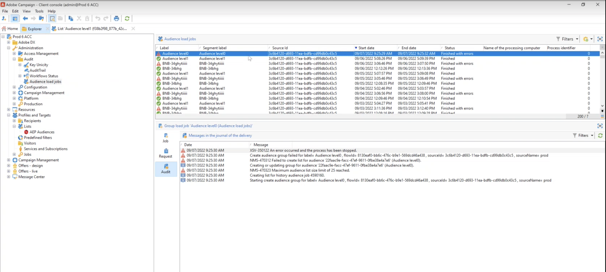

# Conexão com o Adobe Campaign Managed Cloud Services {#adobe-campaign-managed-services}

>[!IMPORTANT]
>
>Esta integração funciona com o [Adobe Campaign versão 8.4 ou superior](https://experienceleague.adobe.com/docs/campaign/campaign-v8/new/release-notes.html?lang=pt-BR#release-8-4-1).

## Visão geral {#overview}

O Adobe Campaign Managed Cloud Services fornece uma plataforma para projetar experiências de clientes entre canais, além de um ambiente para a orquestração visual de campanhas, o gerenciamento de interação em tempo real e a execução entre canais. [Introdução ao Campaign](https://experienceleague.adobe.com/docs/campaign/campaign-v8/start/get-started.html?lang=pt-BR)

Use o Campaign para:

* Impulsionar a personalização e o envolvimento por meio de uma única visualização acessível do cliente,
* Integrar canais de email, móveis, online e offline à jornada do cliente,
* Automatize a entrega de mensagens e ofertas relevantes e oportunas.

## Medidas de proteção {#guardrails}

Lembre-se das seguintes medidas de proteção ao usar a conexão com o Adobe Campaign Managed Cloud Services:

* Você pode [ativar](#activate) no máximo 25 públicos-alvo para este destino.

  Você pode alterar esse limite atualizando o valor da opção **NmsCdp_Aep_Audience_List_Limit** na pasta **[!UICONTROL Administration]** > **[!UICONTROL Platform]** > **[!UICONTROL Options]** do explorador do Campaign.

* Para cada público, você pode adicionar até 20 campos a [mapear](#map) para o Adobe Campaign.

  Você pode alterar esse limite atualizando o valor da opção **NmsCdp_Aep_Destinations_Max_Columns** na pasta **[!UICONTROL Administration]** > **[!UICONTROL Platform]** > **[!UICONTROL Options]** do explorador do Campaign.

* Retenção de dados na Zona de aterrissagem de dados (DLZ) do armazenamento de blobs do Azure: 7 dias.
* A frequência de ativação é de no mínimo 3 horas.
* O tamanho máximo de nome de arquivo permitido por essa conexão é de 255 caracteres. Quando você [configurar o nome de arquivo exportado](../../ui/activate-batch-profile-destinations.md#configure-file-names), verifique se o nome de arquivo não excede 255 caracteres. Exceder o tamanho máximo de nome de arquivo resulta em erros de ativação.

## Casos de uso {#use-cases}

Para ajudá-lo a entender melhor como e quando você deve usar o destino do Adobe Campaign Manage Service, este é um exemplo de caso de uso que os clientes da Adobe Experience Platform podem resolver usando esse destino.

* O Adobe Experience Platform cria um perfil do cliente que incorpora informações como o gráfico de identidade, dados comportamentais do analytics, mescla dados offline e online etc. Com essa integração, é possível aumentar os recursos de segmentação já existentes no Adobe Campaign com esses públicos-alvo habilitados pela Adobe Experience Platform e, portanto, ativar esses dados no Campaign.

  Por exemplo, uma empresa de roupas esportivas quer aproveitar os públicos alimentados pela Adobe Experience Platform e ativá-los usando o Adobe Campaign para alcançar sua base de clientes nos diferentes canais compatíveis com o Adobe Campaign. Depois que as mensagens forem enviadas, eles desejam aprimorar o perfil do cliente na Adobe Experience Platform com dados de experiência da Adobe Campaign, como envios, aberturas e cliques.

  O resultado são campanhas entre canais mais consistentes em todo o ecossistema da Adobe Experience Cloud e um perfil do cliente avançado que está se adaptando e aprendendo rapidamente.

* Além da ativação de público no Campaign, você pode aproveitar o destino do Adobe Campaign Managed Services para trazer atributos de perfil adicionais, que estão vinculados a um perfil no Adobe Experience Platform e têm um processo de sincronização em vigor para que sejam atualizados no banco de dados do Adobe Campaign.

  Por exemplo, digamos que você esteja capturando valores de aceitação e recusa no Adobe Experience Platform. Com essa conexão, você pode trazer esses valores para o Adobe Campaign e ter um processo de sincronização em vigor para que eles sejam atualizados regularmente.

  >[!NOTE]
  >
  >A sincronização de atributos de perfil está disponível para perfis que já estão presentes no banco de dados do Adobe Campaign.

[Saiba mais sobre a integração do Adobe Campaign com o Adobe Experience Platform](https://experienceleague.adobe.com/docs/campaign/campaign-v8/connect/ac-aep.html?lang=pt-BR)

## Identidades suportadas {#supported-identities}

O *Adobe Campaign Managed Cloud Services* oferece suporte à ativação das identidades descritas na tabela abaixo. Saiba mais sobre [identidades](/help/identity-service/features/namespaces.md).

| Identidade de destino | Descrição | Considerações |
|---|---|---|
| external_id | IDs de usuário personalizadas | Selecione esta identidade de destino quando sua identidade de origem for um namespace personalizado. Recomendamos usar essa identidade e mapeá-la para a ID na instância do Campaign que representa o cliente (fidelid_ID, account_ID, customer_ID...) |
| ECID | Experience Cloud ID | Um namespace que representa a ECID. Esse namespace também pode ser referenciado pelos seguintes aliases: &quot;Adobe Marketing Cloud ID&quot;, &quot;Adobe Experience Cloud ID&quot;, &quot;Adobe Experience Platform ID&quot;. Consulte o seguinte documento no [ECID](/help/identity-service/features/ecid.md) para obter mais informações. |
| email_lc_sha256 | Endereços de email com hash com o algoritmo SHA256 | O Adobe Experience Platform oferece suporte tanto para texto simples quanto para endereços de email com hash SHA256. Quando o campo de origem contiver atributos sem hash, marque a opção **[!UICONTROL Apply transformation]** para que o [!DNL Experience Platform] coloque os dados em hash automaticamente durante a ativação. |
| phone_sha256 | Números de telefone com hash com o algoritmo SHA256 | Os números de telefone com hash SHA256 e texto sem formatação são compatíveis com o Adobe Experience Platform. Quando o campo de origem contiver atributos sem hash, marque a opção **[!UICONTROL Apply transformation]** para que o [!DNL Experience Platform] coloque os dados em hash automaticamente durante a ativação. |
| GAID | GOOGLE ADVERTISING ID | Selecione a identidade de destino GAID quando a identidade de origem for um namespace GAID. |
| IDFA | Apple ID para anunciantes | Selecione a identidade de destino do IDFA quando a identidade de origem for um namespace do IDFA. |

{style="table-layout:auto"}

## Tipo e frequência de exportação {#export-type-frequency}

Consulte a tabela abaixo para obter informações sobre o tipo e a frequência da exportação de destino.

| Item | Tipo | Notas |
|---------|----------|---------|
| Tipo de exportação | **[!UICONTROL Profile-based]** | Você está exportando todos os membros de um público-alvo, juntamente com os campos de esquema desejados (por exemplo: endereço de email, número de telefone, sobrenome), conforme escolhido na tela selecionar atributos de perfil do [fluxo de trabalho de ativação de destino](/help/destinations/ui/activate-batch-profile-destinations.md#select-attributes). |
| Frequência de exportação | **[!UICONTROL Batch]** | Os destinos em lote exportam arquivos para plataformas downstream em incrementos de três, seis, oito, doze ou vinte e quatro horas. Leia mais sobre [destinos com base em arquivo de lote](/help/destinations/destination-types.md#file-based). |

{style="table-layout:auto"}

## Conectar ao destino {#connect}

>[!IMPORTANT]
> 
>Para se conectar ao destino, você precisa das **[!UICONTROL View Destinations]** e **[!UICONTROL Manage Destinations]** [permissões de controle de acesso](/help/access-control/home.md#permissions). Leia a [visão geral do controle de acesso](/help/access-control/ui/overview.md) ou contate o administrador do produto para obter as permissões necessárias.

Para se conectar a este destino, siga as etapas descritas no [tutorial de configuração de destino](../../ui/connect-destination.md). No workflow de configuração de destino, preencha os campos listados nas duas seções abaixo.

### Preencher detalhes do destino {#destination-details}

Para configurar detalhes para o destino, preencha os campos obrigatórios e opcionais abaixo. Um asterisco ao lado de um campo na interface do usuário indica que o campo é obrigatório.

* **[!UICONTROL Name]**: Um nome pelo qual você reconhecerá este destino no futuro.
* **[!UICONTROL Description]**: uma descrição que ajudará você a identificar este destino no futuro.
* **[!UICONTROL Select instance]**: sua instância de marketing **[!DNL Campaign]**.
* **[!UICONTROL Target mapping]**: Selecione o target mapping que você está usando em **[!DNL Adobe Campaign]** para enviar entregas. [Saiba mais](https://experienceleague.adobe.com/docs/campaign/campaign-v8/profiles-and-audiences/add-profiles/target-mappings.html?lang=pt-BR).
* **[!UICONTROL Select sync type]**

   * **[!UICONTROL Audience sync]**: use esta opção para enviar os públicos-alvo da Adobe Experience Platform para a Adobe Campaign.
   * **[!UICONTROL Profile sync (Update only)]**: use esta opção para trazer os atributos de perfil do Adobe Experience Platform para o Adobe Campaign e ter um processo de sincronização em vigor para que eles possam ser atualizados regularmente.

### Ativar alertas {#enable-alerts}

Você pode ativar os alertas para receber notificações sobre o status do fluxo de dados para o seu destino. Selecione um alerta na lista para assinar e receber notificações sobre o status do seu fluxo de dados. Para obter mais informações sobre alertas, consulte o manual sobre [assinatura de alertas de destinos com a interface](../../ui/alerts.md).

Quando terminar de fornecer detalhes da conexão de destino, selecione **[!UICONTROL Next]**.

### Política de governação e medidas de aplicação {#governance}

Selecione as ações de marketing aplicáveis aos dados que você deseja exportar para o destino. Para o Adobe Campaign, recomendamos que você selecione a ação de marketing **[!UICONTROL Email Targeting]**.

Para obter mais informações sobre ações de marketing, consulte a página [visão geral das políticas de uso de dados](/help/data-governance/policies/overview.md).

## Ativar públicos-alvo para esse destino {#activate}

>[!IMPORTANT]
> 
>* Para ativar dados, você precisa das **[!UICONTROL View Destinations]**, **[!UICONTROL Activate Destinations]**, **[!UICONTROL View Profiles]** e **[!UICONTROL View Segments]** [permissões de controle de acesso](/help/access-control/home.md#permissions). Leia a [visão geral do controle de acesso](/help/access-control/ui/overview.md) ou contate o administrador do produto para obter as permissões necessárias.
>* Para exportar *identidades*, você precisa da **[!UICONTROL View Identity Graph]** [permissão de controle de acesso](/help/access-control/home.md#permissions).   {width="100" zoomable="yes"}

Leia [Ativar dados de público-alvo para destinos de exportação de perfil em lote](https://experienceleague.adobe.com/docs/experience-platform/destinations/ui/activate/activate-batch-profile-destinations.html?lang=pt-BR) para obter instruções sobre como ativar dados de público-alvo para esse destino.

### Mapear atributos e identidades {#map}

Selecione campos XDM para exportar com os perfis e mapeá-los para os campos correspondentes do Adobe Campaign.[Saiba mais sobre a seleção de identidade e atributos para destinos de marketing por email](overview.md)

1. Selecionar campos de origem:

   * Selecione um **identificador** (por exemplo: o campo de email) como identidade de origem que identifica exclusivamente um perfil no Adobe Experience Platform e no Adobe Campaign.

   * Selecione todos os outros **atributos do perfil de origem XDM** que precisam ser exportados para o Adobe Campaign.

   >[!NOTE]
   >
   >O campo &quot;segmentMembershipStatus&quot; é um mapeamento necessário para refletir o status segmentMembership. Este campo é adicionado por padrão e não pode ser modificado ou removido.

1. Mapeie cada campo com seu campo de destino no Adobe Campaign. Os campos de destino disponíveis são determinados pelo mapeamento de destino selecionado ao [criar o destino](#destination-details).

1. Identifique atributos obrigatórios e chaves de desduplicação. Observe que os valores nos atributos marcados como &quot;Obrigatório&quot; ou &quot;Chave de desduplicação&quot; não podem ser nulos.

   * [Os atributos obrigatórios](../../ui/activate-batch-profile-destinations.md#mandatory-attributes) garantem que todos os registros de perfil contenham os atributos selecionados. Por exemplo: todos os perfis exportados contêm um endereço de email. A recomendação é definir como obrigatório o campo de identidade e o campo usado como chave de desduplicação.
   * [Uma chave de desduplicação](../../ui/activate-batch-profile-destinations.md#mandatory-attributes) é uma chave primária que determina a identidade pela qual os usuários desejam que seus perfis sejam desduplicados.

     >[!IMPORTANT]
     >
     >Verifique se o nome do atributo de chave de desduplicação corresponde a um nome de coluna do target mapping selecionado.

   

1. Depois que o mapeamento for executado, você poderá revisar e concluir a configuração de destino para começar a enviar dados para **[!DNL Campaign]**.
   [Saiba como revisar e concluir a configuração de destino](/help/destinations/destination-types.md#review).

## Dados exportados / Validar exportação de dados {#exported-data}

Depois que um destino é ativado, você pode acessar o trabalho correspondente e os dados exportados no Campaign.

### Monitorar trabalhos de exportação de dados {#jobs}

Navegue até o menu **[!UICONTROL Administration]** > **[!UICONTROL Audit]** > **[!UICONTROL Audience load jobs]** para monitorar todos os trabalhos de exportação ativados do Adobe Experience Platform.

### Acessar dados exportados {#data}

Para **[!UICONTROL Audience sync]**, você pode verificar o público exportado navegando até o menu **[!UICONTROL Profile and target]** > **[!UICONTROL List]** > **[!UICONTROL AEP audiences]**.

Para **[!UICONTROL Profile sync (Update only)]**, os dados são atualizados automaticamente no banco de dados do Campaign para cada perfil direcionado pelo público-alvo ativado no destino.

## Uso e governança de dados {#data-usage-governance}

Todos os destinos do [!DNL Adobe Experience Platform] são compatíveis com as políticas de uso de dados ao manipular seus dados. Para obter informações detalhadas sobre como o [!DNL Adobe Experience Platform] fiscaliza a governança de dados, leia a [Visão geral da Governança de Dados](/help/data-governance/home.md).
