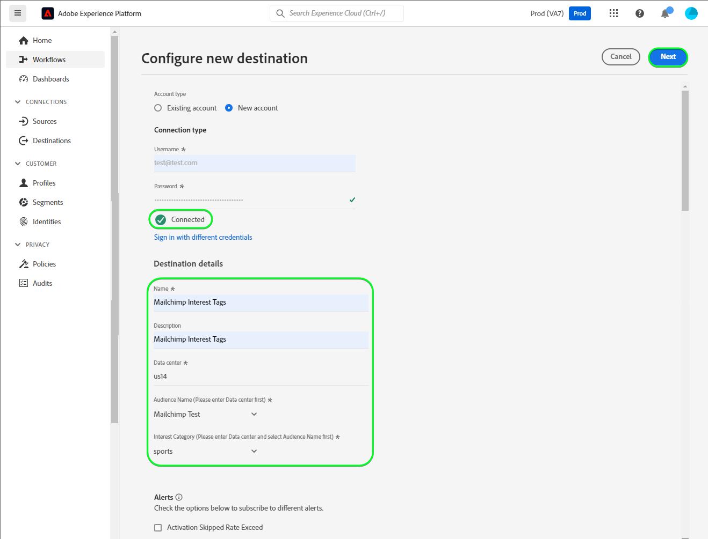
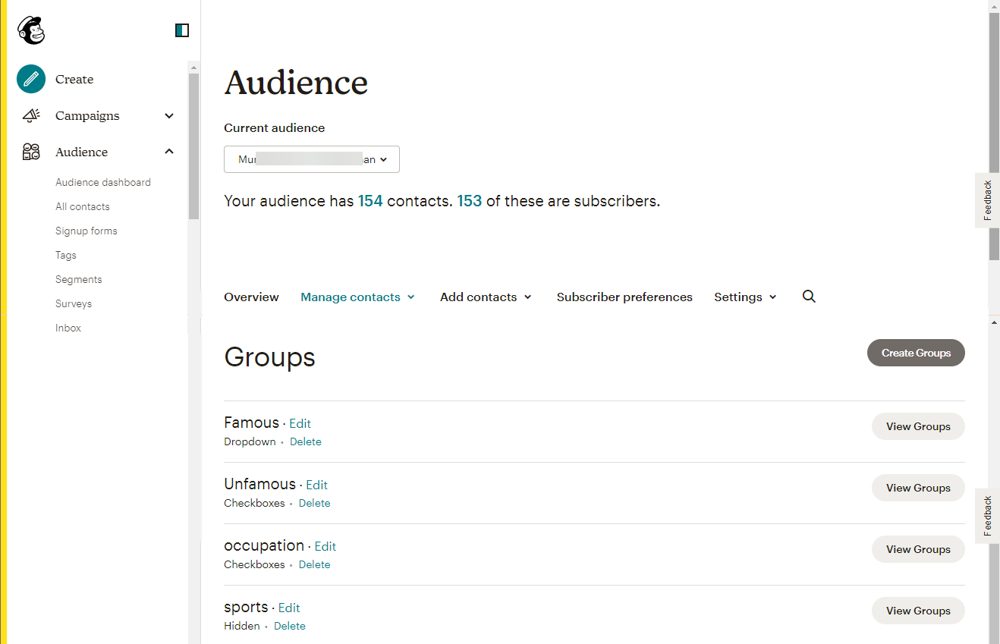

# [!DNL Mailchimp Interest Categories] conexão

[[!DNL Mailchimp]](https://mailchimp.com) é uma plataforma de automação de marketing popular e um serviço de marketing por email usado pelas empresas para gerenciar e conversar com os contatos *(clientes, clientes ou outros interessados)* usando listas de endereçamento e campanhas de marketing por email. Use esse conector para classificar seus contatos com base em seus interesses e preferências.

[!DNL Mailchimp Interest Categories] usa [públicos-alvo](https://mailchimp.com/help/getting-started-audience/), [grupos](https://mailchimp.com/help/getting-started-with-groups/) e categorias de interesse *(também conhecidos como nomes de grupos ou títulos de grupos)*. Cada grupo [!DNL Mailchimp] é uma lista de categorias de interesse. Os contatos são associados a uma categoria de interesse quando assinam uma ou mais categorias de interesse por meio de um formulário de inscrição em seu site. Em um público-alvo, você também pode organizar os contatos em grupos e associá-los a categorias de interesse, que podem ser usadas para criar segmentos. Você pode usar esses públicos para transmitir emails de campanha direcionados aos contatos inscritos.

<!--
Compared to [!DNL Mailchimp Tags] which you would use for internal classification, [!DNL Mailchimp Interest Categories] is meant to manage subscriptions to topics of interest that your contacts might be interested in. *Note, Experience Platform also has a connection for [!DNL Mailchimp Tags], you can check it out on the [[!DNL Mailchimp Tags]](/help/destinations/catalog/email-marketing/mailchimp-tags.md) page.*
-->

Este [!DNL Adobe Experience Platform] [destino](/help/destinations/home.md) usa a API [[!DNL Mailchimp batch subscribe or unsubscribe API]](https://mailchimp.com/developer/marketing/api/lists/batch-subscribe-or-unsubscribe/) para criar [categorias de interesse](https://mailchimp.com/developer/marketing/api/interest-categories/) e, em seguida, adicionar contatos de cada um dos públicos-alvo selecionados da Experience Platform a uma categoria de interesse correspondente. Você pode **adicionar novos contatos** ou **atualizar as informações de [!DNL Mailchimp] contatos** existentes e **adicioná-los ou removê-los de seus grupos desejados** em um público-alvo existente do [!DNL Mailchimp] depois de ativá-los em um novo segmento. [!DNL Mailchimp Interest Groups] usa os nomes de público-alvo selecionados do Experience Platform como categorias de interesse dentro de [!DNL Mailchimp].

## Casos de uso {#use-cases}

Para ajudá-lo a entender melhor como e quando você deve usar o destino [!DNL Mailchimp Interest Categories], veja um exemplo de caso de uso que os clientes da Adobe Experience Platform podem resolver usando esse destino.

### Enviar emails para contatos de campanhas de marketing {#use-case-send-emails}

O departamento de vendas de um site de artigos esportivos quer transmitir uma campanha de marketing por email para uma lista de contatos que se identificaram como interessados em futebol. As listas de contatos são segregadas como lotes na exportação de dados recebida da equipe de desenvolvimento do site e, portanto, precisam ser rastreadas. A equipe identifica um público-alvo [!DNL Mailchimp] existente e começa a criar os públicos-alvo da Experience Platform aos quais os contatos de cada lista são adicionados. Depois de enviar esses públicos-alvo para [!DNL Mailchimp Interest Categories], se algum contato não existir no público-alvo [!DNL Mailchimp] selecionado, ele será adicionado a um grupo com o nome de público ao qual o contato pertence. Se já existirem contatos no público ou grupo [!DNL Mailchimp], suas informações serão atualizadas. Depois que os dados forem enviados para [!DNL Mailchimp Interest Categories], a equipe de Vendas poderá selecionar e enviar o email da campanha de marketing para o grupo de interesse de futebol dentro do público [!DNL Mailchimp].

## Pré-requisitos {#prerequisites}

Consulte as seções abaixo para quaisquer pré-requisitos que você precise configurar no Experience Platform e [!DNL Mailchimp] e para obter informações que você deve coletar antes de trabalhar com o destino [!DNL Mailchimp Interest Categories].

### Pré-requisitos no Experience Platform {#prerequisites-in-experience-platform}

Antes de ativar dados para o destino [!DNL Mailchimp Interest Categories], você deve ter um [esquema](/help/xdm/schema/composition.md), um [conjunto de dados](https://experienceleague.adobe.com/docs/platform-learn/tutorials/data-ingestion/create-datasets-and-ingest-data.html) e [segmentos](https://experienceleague.adobe.com/docs/platform-learn/tutorials/segments/create-segments.html) criados em [!DNL Experience Platform].

### Pré-requisitos para o destino [!DNL Mailchimp Interest Categories] {#prerequisites-destination}

Observe os seguintes pré-requisitos para exportar dados do Experience Platform para sua conta do [!DNL Mailchimp]:

#### Você deve ter uma conta [!DNL Mailchimp] {#prerequisites-account}

Antes de criar um destino [!DNL Mailchimp Interest Categories], primeiro verifique se você tem uma conta [!DNL Mailchimp]. Se você ainda não tiver uma, visite a [[!DNL Mailchimp] página de inscrição](https://login.mailchimp.com/signup/) para se registrar e criar sua conta.

#### Coletar a chave de API [!DNL Mailchimp] {#gather-credentials}

Você precisa da sua [!DNL Mailchimp] **chave de API** para autenticar o destino [!DNL Mailchimp Interest Categories] em relação à sua conta [!DNL Mailchimp]. A **chave de API** serve como **senha** quando você [autentica o destino](#authenticate).

Se você não tiver a **Chave de API**, entre na sua conta e consulte a documentação [[!DNL Mailchimp] Gerar sua Chave de API](https://mailchimp.com/developer/marketing/guides/quick-start/#generate-your-api-key) para criar uma.

Um exemplo de uma chave de API é `0123456789abcdef0123456789abcde-us14`.

>[!IMPORTANT]
>
>Se você gerar a **chave de API**, anote-a, pois não será possível acessá-la após a geração.

#### Identificar o data center do [!DNL Mailchimp] {#identify-data-center}

Em seguida, você deve identificar seu data center do [!DNL Mailchimp]. Para fazer isso, faça logon na sua conta do [!DNL Mailchimp] e navegue até a **seção de chaves de API** da sua conta.

O valor é a primeira parte do URL que você vê no navegador. Se a URL for *https://`us14`.mailchimp.com/account/api/*, o data center será `us14`.

Ele também está anexado à sua chave de API no formato *key-dc*; se a sua chave de API for `0123456789abcdef0123456789abcde-us14`, o data center será `us14`.

Anote o valor do data center *(`us14` neste exemplo)*. Esse valor é necessário ao [preencher os detalhes de destino](#destination-details).

Se você precisar de mais orientação, consulte a [[!DNL Mailchimp] documentação sobre fundamentos](https://mailchimp.com/developer/marketing/docs/fundamentals/#api-structure).

### Medidas de proteção {#guardrails}

Cada público-alvo do [!DNL Mailchimp] pode conter até 60 nomes de grupo (ou categorias de interesse) em um único grupo ou em vários grupos do mesmo público-alvo. Consulte [!DNL Mailchimp] [grupos](https://mailchimp.com/help/getting-started-with-groups/) para obter os esclarecimentos necessários. Ao atingir esse limite, você recebe uma mensagem `400 BAD_REQUEST Cannot have more than 60 interests per list (Across all categories)` como resposta de erro da API [!DNL Mailchimp].

Além disso, consulte os [!DNL Mailchimp] [limites de taxa](https://mailchimp.com/developer/marketing/docs/fundamentals/#api-limits) para obter informações detalhadas sobre os limites impostos pela API [!DNL Mailchimp].

## Identidades suportadas {#supported-identities}

[!DNL Mailchimp] dá suporte à ativação das identidades descritas na tabela abaixo. Saiba mais sobre [identidades](/help/identity-service/features/namespaces.md).

| Identidade de destino | Descrição | Considerações |
|---|---|---|
| Email | Endereço de email do contato | Obrigatório |

{style="table-layout:auto"}

## Tipo e frequência de exportação {#export-type-frequency}

Consulte a tabela abaixo para obter informações sobre o tipo e a frequência da exportação de destino.

| Item | Tipo | Notas |
|---------|----------|---------|
| Tipo de exportação | **[!UICONTROL Profile-based]** | <ul><li>Você está exportando todos os membros de um segmento, juntamente com os campos de esquema desejados *(por exemplo: endereço de email, número de telefone, sobrenome)*, de acordo com o mapeamento de campos.</li><li> Para cada público selecionado no Experience Platform, o status do segmento [!DNL Mailchimp Interest Categories] correspondente é atualizado com seu status de público do Experience Platform.</li></ul> |
| Frequência de exportação | **[!UICONTROL Streaming]** | Os destinos de transmissão são conexões baseadas em API &quot;sempre ativas&quot;. Quando um perfil é atualizado no Experience Platform com base na avaliação do público-alvo, o conector envia a atualização downstream para a plataforma de destino. Leia mais sobre [destinos de streaming](/help/destinations/destination-types.md#streaming-destinations). |

{style="table-layout:auto"}

## Conectar ao destino {#connect}

>[!IMPORTANT]
>
>Para se conectar ao destino, você precisa das **[!UICONTROL View Destinations]** e **[!UICONTROL Manage Destinations]** [permissões de controle de acesso](/help/access-control/home.md#permissions). Leia a [visão geral do controle de acesso](/help/access-control/ui/overview.md) ou contate o administrador do produto para obter as permissões necessárias.

Para se conectar a este destino, siga as etapas descritas no [tutorial de configuração de destino](../../ui/connect-destination.md). No workflow de configuração de destino, preencha os campos listados nas duas seções abaixo.

Em **[!UICONTROL Destinations]** > **[!UICONTROL Catalog]**, procure por [!DNL Mailchimp Interest Categories]. Como alternativa, você pode localizá-lo na categoria **[!UICONTROL Email marketing]**.

### Autenticar para o destino {#authenticate}

Para autenticar no destino, preencha os campos obrigatórios abaixo e selecione **[!UICONTROL Connect to destination]**.

| Campo | Descrição |
| --- | --- |
| **[!UICONTROL Username]** | Seu nome de usuário [!DNL Mailchimp Interest Categories]. |
| **[!UICONTROL Password]** | Sua [!DNL Mailchimp] **chave de API**, que você anotou na seção [Coletar [!DNL Mailchimp] credenciais](#gather-credentials).  Sua chave de API assume a forma de `{KEY}-{DC}`, em que a parte `{KEY}` se refere ao valor anotado na seção [[!DNL Mailchimp] chave de API](#gather-credentials) e a parte `{DC}` se refere ao [[!DNL Mailchimp] data center](#identify-data-center).  Você pode fornecer a parte `{KEY}` ou todo o formulário.  Por exemplo, se a sua chave de API for  *`0123456789abcdef0123456789abcde-us14`*,  você pode fornecer *`0123456789abcdef0123456789abcde`*ou *`0123456789abcdef0123456789abcde-us14`*como o valor. |

{style="table-layout:auto"}

Se os detalhes fornecidos forem válidos, a interface exibirá um status **[!UICONTROL Connected]** com uma marca de seleção verde. Você pode prosseguir para a próxima etapa.

### Preencher detalhes do destino {#destination-details}

Para configurar detalhes para o destino, preencha os campos obrigatórios e opcionais abaixo. Um asterisco ao lado de um campo na interface do usuário indica que o campo é obrigatório.

| Campo | Descrição |
| --- | --- |
| **[!UICONTROL Name]** | Um nome pelo qual você reconhecerá este destino no futuro. |
| **[!UICONTROL Description]** | Uma descrição que ajudará você a identificar esse destino no futuro. |
| **[!UICONTROL Data center]** | Sua conta [!DNL Mailchimp] do `data center`. Consulte a seção [Identificar [!DNL Mailchimp] data center](#identify-data-center) para obter qualquer orientação. |
| **[!UICONTROL Audience Name (Please select Data center first)]** | Após selecionar o **[!UICONTROL Data center]**, essa lista suspensa é preenchida automaticamente com os nomes de público-alvo da sua conta do [!DNL Mailchimp]. Selecione o público que deseja atualizar com os dados do Experience Platform. |
| **[!UICONTROL Interest Category (Please select Data center and Audience Name first)]** | Após selecionar sua **[!UICONTROL Audience Name]**, essa lista suspensa é preenchida automaticamente com os nomes de categoria de grupo de interesse da sua conta [!DNL Mailchimp]. Selecione o nome da categoria que você deseja atualizar com dados do Experience Platform. |

{style="table-layout:auto"}

>[!TIP]
>
> Se a chave de API fornecida no campo **[!UICONTROL Password]** ou o valor **[!UICONTROL Data center]** estiverem incorretos, a interface exibirá uma resposta de erro de API [!DNL Mailchimp]: *`No options are available. Please verify the values selected for the following dependent fields: dataCenter`* conforme mostrado abaixo. Nesse caso, você não poderá selecionar um valor no campo **[!UICONTROL Audience Name (Please select Data center first)]**. Para corrigir esse erro, forneça os valores corretos.

### Ativar alertas {#enable-alerts}

Você pode ativar os alertas para receber notificações sobre o status do fluxo de dados para o seu destino. Selecione um alerta na lista para assinar e receber notificações sobre o status do seu fluxo de dados. Para obter mais informações sobre alertas, consulte o manual sobre [assinatura de alertas de destinos usando a interface](../../ui/alerts.md).

Quando terminar de fornecer detalhes da conexão de destino, selecione **[!UICONTROL Next]**.

## Ativar públicos-alvo para esse destino {#activate}

>[!IMPORTANT]
> 
>* Para ativar dados, você precisa das **[!UICONTROL View Destinations]**, **[!UICONTROL Activate Destinations]**, **[!UICONTROL View Profiles]** e **[!UICONTROL View Segments]** [permissões de controle de acesso](/help/access-control/home.md#permissions). Leia a [visão geral do controle de acesso](/help/access-control/ui/overview.md) ou contate o administrador do produto para obter as permissões necessárias.
>* Para exportar *identidades*, você precisa da **[!UICONTROL View Identity Graph]** [permissão de controle de acesso](/help/access-control/home.md#permissions).   {width="100" zoomable="yes"}

Leia [Ativar perfis e públicos-alvo para destinos de exportação de público-alvo de streaming](/help/destinations/ui/activate-segment-streaming-destinations.md) para obter instruções sobre como ativar públicos-alvo para este destino.

### Considerações e exemplo de mapeamento {#mapping-considerations-example}

Para enviar corretamente seus dados de público-alvo do Adobe Experience Platform para o destino [!DNL Mailchimp Interest Categories], passe pela etapa de mapeamento de campos. O mapeamento consiste na criação de um link entre os campos do esquema do Experience Data Model (XDM) na sua conta do Experience Platform e seus equivalentes correspondentes no destino.

Para mapear corretamente os campos XDM para os campos de destino [!DNL Mailchimp Interest Categories], siga as etapas abaixo:

1. Na etapa **[!UICONTROL Mapping]**, selecione **[!UICONTROL Add new mapping]**. Agora você pode ver uma nova linha de mapeamento na tela.
1. Na janela **[!UICONTROL Select source field]**, escolha a categoria **[!UICONTROL Select attributes]** e selecione o atributo XDM ou escolha a **[!UICONTROL Select identity namespace]** e selecione uma identidade.
1. Na janela **[!UICONTROL Select target field]**, escolha a **[!UICONTROL Select identity namespace]** e selecione uma identidade ou escolha a categoria **[!UICONTROL Select attributes]** e selecione na lista de atributos preenchidos a partir da API [!DNL Mailchimp]. *Quaisquer atributos personalizados adicionados ao Público-alvo [!DNL Mailchimp] selecionado também estarão disponíveis para seleção como campos de destino.*

   Os mapeamentos disponíveis entre seu esquema de perfil XDM e [!DNL Mailchimp Interest Categories] são os seguintes:

   | Campo de origem | Campo de público alvo | Notas |
   | --- | --- | --- |
   | `IdentityMap: Email` | `Identity: email` | Obrigatório: Sim |
   | `xdm: person.name.firstName` | `Attribute: FNAME` | |
   | `xdm: person.name.lastName` | `Attribute: LNAME` | |
   | `xdm: person.birthDayAndMonth` | `Attribute: BIRTHDAY` | |

   Além disso, `ADDRESS` é um campo de destino especial conhecido como `merge field` no público-alvo de [!DNL Mailchimp]. A [[!DNL Mailchimp] documentação](https://mailchimp.com/developer/marketing/docs/merge-fields/) define as chaves necessárias como `addr1`, `city`, `state` e `zip`, e as chaves opcionais `addr2` e `country`. Os valores desses campos devem ser cadeias de caracteres. Se qualquer um dos mapeamentos de campo `ADDRESS` estiver presente, o destino transmitirá o objeto `ADDRESS` para a API [!DNL Mailchimp] para atualização. Qualquer campo `ADDRESS` que não esteja mapeado tem seu valor padrão de `NULL`, exceto para o país que tem o valor padrão de `US`.

   Os mapeamentos disponíveis para o campo `ADDRESS` são os seguintes:

   | Campo de origem | Campo de público alvo |
   | --- | --- |
   | `xdm: workAddress.street1` | `Attribute: ADDRESS.addr1` |
   | `xdm: workAddress.street2` | `Attribute: ADDRESS.addr2` |
   | `xdm: workAddress.city` | `Attribute: ADDRESS.city` |
   | `xdm: workAddress.state` | `Attribute: ADDRESS.state` |
   | `xdm: workAddress.postalCode` | `Attribute: ADDRESS.zip` |
   | `xdm: workAddress.country` | `Attribute: ADDRESS.country` |

   Por exemplo, você deseja atualizar o valor de `country` com os valores do campo de endereço existente do contato `addr1`, `city`, `state` e `zip` como `132, My Street, Kingston`, `New York`, `New York` e `12401`. Para atualizar o `country` você deve passar os valores existentes com alterações *(se houver)* e o novo valor para o país. Portanto, os valores no seu conjunto de dados devem ser `132, My Street, Kingston`, `New York`, `New York`, `12401` e `US`. Em outras palavras, se você passar apenas `country` e não fornecer valores para `addr1`, `city`, `state` e `zip` eles serão substituídos por `NULL`.

   Um exemplo com os mapeamentos concluídos é mostrado abaixo:
   

Quando terminar de fornecer os mapeamentos para sua conexão de destino, selecione **[!UICONTROL Next]**.

## Validar exportação de dados {#exported-data}

Para validar se você configurou o destino corretamente, siga as etapas abaixo:

* Faça logon em sua conta do [[!DNL Mailchimp]](https://login.mailchimp.com/). Navegue até a página **[!DNL Audience]**. Em seguida, expanda o menu **[!DNL Manage Contacts]** e selecione **[!DNL Groups]**.

* Selecione o Grupo e verifique se os públicos-alvo selecionados são criados como categorias com o nome do público-alvo do Experience Platform, que pode ser seguido por um sufixo gerado automaticamente.
   * Este destino usa os nomes dos segmentos selecionados para criar a categoria de interesse usando a [[!DNL Mailchimp] API Adicionar categoria de interesse](https://mailchimp.com/developer/marketing/api/interest-categories/add-interest-category/). Se você criar um novo destino e ativar os mesmos públicos novamente, o [!DNL Mailchimp] adicionará um sufixo para distinguir entre os segmentos existentes e os novos.
* Contatos cujos emails não existiam no grupo são adicionados à categoria recém-criada.
* Para contatos que já existem no grupo, os dados do campo de atributo são atualizados e o contato é adicionado à categoria recém-criada.

## Uso e governança de dados {#data-usage-governance}

Todos os destinos do [!DNL Adobe Experience Platform] são compatíveis com as políticas de uso de dados ao manipular seus dados. Para obter informações detalhadas sobre como o [!DNL Adobe Experience Platform] impõe a governança de dados, consulte a [visão geral da Governança de Dados](/help/data-governance/home.md).

## Erros e solução de problemas {#errors-and-troubleshooting}

### Erro encontrado se os valores de [!DNL Mailchimp] da chave de API ou do data center estiverem incorretos {#incorrect-credentials-error}

Se a chave de API fornecida no campo **[!UICONTROL Password]** ou o valor **[!UICONTROL Data center]** estiverem incorretos, a interface exibirá uma resposta de erro de API [!DNL Mailchimp]: *`No options are available. Please verify the values selected for the following dependent fields: dataCenter`* conforme mostrado abaixo. Nesse caso, você não pode selecionar um valor do campo **[!UICONTROL Audience Name (Please select Data center first)]**.

Para corrigir esse erro e prosseguir para a próxima etapa, você deve fornecer os valores corretos. Consulte o [Identify [!DNL Mailchimp] data center](#identify-data-center) e
[Colete [!DNL Mailchimp] a chave de API](#gather-credentials) seções se precisar de orientação.

### Erro encontrado se o limite de nome de grupo [!DNL Mailchimp] for excedido {#group-name-limits-error}

Ao criar o destino, você poderá receber as seguintes mensagens de erro: *`Cannot have more than 60 interests per list (Across all categories)`* ou *`400 BAD_REQUEST`*. Isso acontece quando você excede os 60 nomes de grupo (ou categorias de interesse) em um único grupo ou em vários grupos dentro do mesmo limite de público, conforme descrito na seção [medidas de proteção](#guardrails). Para corrigir esse erro, verifique se você não está excedendo o limite de nomes de grupo em [!DNL Mailchimp].

### [!DNL Mailchimp] Códigos de status e erro

Consulte a [[!DNL Mailchimp] página de erros](https://mailchimp.com/developer/marketing/docs/errors/) para obter uma lista abrangente do status e dos códigos de erro com explicações.

## Recursos adicionais {#additional-resources}

Informações adicionais úteis da documentação do [!DNL Mailchimp] estão abaixo:

* [Introdução ao [!DNL Mailchimp]](https://mailchimp.com/help/getting-started-with-mailchimp/)
* [Introdução aos públicos-alvo](https://mailchimp.com/help/getting-started-audience/)
* [Criar um público-alvo](https://mailchimp.com/help/create-audience/)
* [Introdução aos grupos](https://mailchimp.com/help/getting-started-with-groups/)
* [Criar um novo Grupo de Audiência](https://mailchimp.com/help/create-new-audience-group/)
* [Categorias de interesses](https://mailchimp.com/developer/marketing/api/interest-categories/)
* [API de marketing](https://mailchimp.com/developer/marketing/api/)
