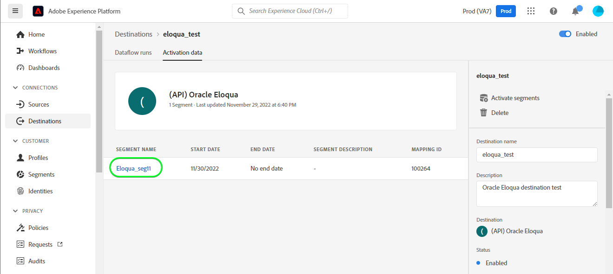
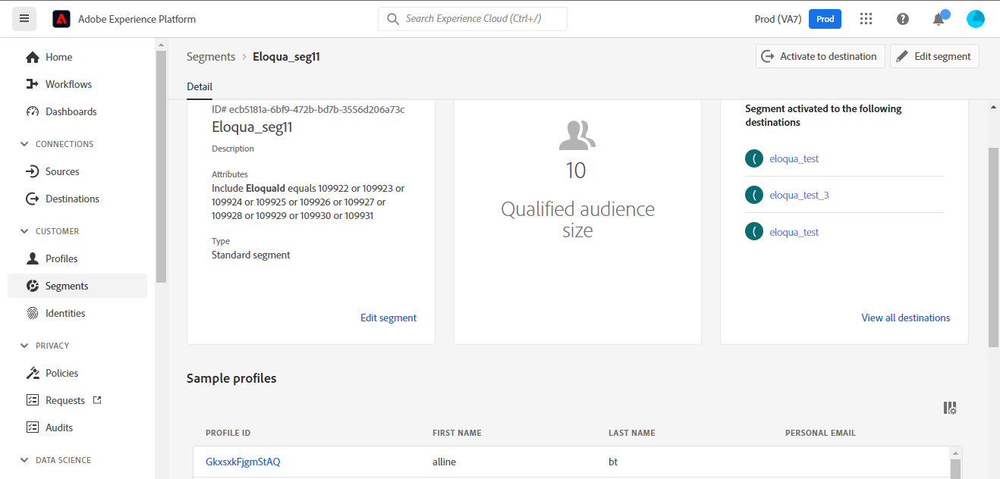

# [!DNL (API) Oracle Eloqua] conexão

[[!DNL Oracle Eloqua]](https://www.oracle.com/cx/marketing/automation/) O permite que os profissionais de marketing planejem e executem campanhas enquanto fornecem uma experiência personalizada para seus clientes potenciais. Com o gerenciamento integrado de leads e a fácil criação de campanhas, o modelo ajuda os profissionais de marketing a engajarem o público-alvo certo na hora certa da jornada do comprador e é dimensionado elegantemente para alcançar os públicos-alvo em todos os canais, incluindo email, pesquisa de exibição, vídeo e dispositivos móveis. As equipes de vendas podem fechar mais negócios a uma taxa mais rápida, aumentando o ROI do marketing por meio de insights em tempo real.

Este [!DNL Adobe Experience Platform] [destino](/help/destinations/home.md) utiliza o [Atualizar um contato](https://docs.oracle.com/en/cloud/saas/marketing/eloqua-rest-api/op-api-rest-1.0-data-contact-id-put.html) operação a partir do [!DNL Oracle Eloqua] REST API, que permite **atualizar identidades** em um público-alvo para [!DNL Oracle Eloqua].

[!DNL Oracle Eloqua] usos [Autenticação básica](https://docs.oracle.com/en/cloud/saas/marketing/eloqua-rest-api/Authentication_Basic.html) para se comunicar com a [!DNL Oracle Eloqua] API REST. Instruções para autenticar em seu [!DNL Oracle Eloqua] exemplo, são apresentados mais abaixo, no [Autenticar para destino](#authenticate) seção.

## Casos de uso {#use-cases}

O departamento de marketing de uma plataforma online deseja transmitir uma campanha de marketing por email para um público-alvo com curadoria de clientes potenciais. A equipe de marketing da plataforma pode atualizar as informações de clientes potenciais existentes por meio do Adobe Experience Platform, criar públicos a partir de seus próprios dados offline e enviar esses públicos para o [!DNL Oracle Eloqua], que pode ser usado para enviar o email da campanha de marketing.

## Pré-requisitos {#prerequisites}

### Pré-requisitos do Experience Platform {#prerequisites-in-experience-platform}

Antes de ativar os dados para o [!DNL Oracle Eloqua] destino, você deve ter um [schema](/help/xdm/schema/composition.md), um [conjunto de dados](https://experienceleague.adobe.com/docs/platform-learn/tutorials/data-ingestion/create-datasets-and-ingest-data.html), e [segmentos](https://experienceleague.adobe.com/docs/platform-learn/tutorials/segments/create-segments.html) criado em [!DNL Experience Platform].

Consulte a documentação do Experience Platform para [Grupo de campos de esquema Detalhes da associação do público](/help/xdm/field-groups/profile/segmentation.md) se precisar de orientação sobre os status do público-alvo.

### [!DNL Oracle Eloqua] pré-requisitos {#prerequisites-destination}

Para exportar dados da Platform para o seu [!DNL Oracle Eloqua] conta que você precisa ter [!DNL Oracle Eloqua] conta.

Além disso, você precisa, no mínimo, da *&quot;Usuários avançados - Permissões de marketing&quot;* para seu [!DNL Oracle Eloqua] instância. Consulte a *&quot;Grupos de segurança&quot;* seção no [Acesso seguro do usuário](https://docs.oracle.com/en/cloud/saas/marketing/eloqua-user/Help/SecurityOverview/SecuredUserAccess.htm) página de orientação. O acesso é exigido pelo destino para [determine o URL de base](https://docs.oracle.com/en/cloud/saas/marketing/eloqua-rest-api/DeterminingBaseURL.html) ao invocar o [!DNL Oracle Eloqua] API.

#### Coletar [!DNL Oracle Eloqua] credenciais {#gather-credentials}

Anote os itens abaixo antes de autenticar na [!DNL Oracle Eloqua] destino:

| Credencial | Descrição |
| --- | --- |
| `Company Name` | O nome da empresa associado à [!DNL Oracle Eloqua] conta. <br>Posteriormente, você usará o `Company Name` e [!DNL Oracle Eloqua] `Username` como uma sequência de caracteres concatenada a ser usada como **[!UICONTROL Nome de usuário]** quando [autenticando no destino](#authenticate). |
| `Username` | O nome de usuário do seu [!DNL Oracle Eloqua] conta. |
| `Password` | A senha do seu [!DNL Oracle Eloqua] conta. |
| `Pod` | [!DNL Oracle Eloqua] O suporta vários data centers, cada um com um nome de domínio exclusivo. [!DNL Oracle Eloqua] refere-se a eles como &quot;pods&quot;, existem atualmente sete no total - p01, p02, p03, p04, p06, p07 e p08. Para obter em qual POD você está, faça logon no [!DNL Oracle Eloqua] e observe o URL no navegador depois de fazer logon com êxito. Por exemplo, se o URL do navegador for `secure.p01.eloqua.com` seu `pod` é `p01`. Consulte a [determinação do POD](https://community.oracle.com/topliners/discussion/4470225/determining-your-pod-number-for-oracle-eloqua) para obter orientação adicional. |

Consulte a [Fazendo login no [!DNL Oracle Eloqua]](https://docs.oracle.com/en/cloud/saas/marketing/eloqua-user/Help/Administration/Tasks/SigningInToEloqua.htm#Signing) para obter orientação.

## Medidas de proteção {#guardrails}

>[!NOTE]
>
>* [!DNL Oracle Eloqua] os campos de contato personalizados são criados automaticamente usando os nomes dos públicos selecionados durante a **[!UICONTROL Selecionar segmentos]** etapa.

* [!DNL Oracle Eloqua] tem um limite máximo de 250 campos de contato personalizados.
* Antes de exportar novos públicos, verifique se o número de públicos da Platform e o número de públicos existentes no [!DNL Oracle Eloqua] não excedam esse limite.
* Se esse limite for excedido, você encontrará um erro no Experience Platform. Isso ocorre porque a variável [!DNL Oracle Eloqua] A API não valida a solicitação e responde com um - *400: Erro de validação* - mensagem de erro descrevendo o problema.
* Se tiver atingido o limite especificado acima, será necessário remover os mapeamentos existentes do destino e excluir os campos de contato personalizados correspondentes no [!DNL Oracle Eloqua] antes de poder exportar mais segmentos.

* Consulte a [[!DNL Oracle Eloqua] Criando campos de contato](https://docs.oracle.com/en/cloud/saas/marketing/eloqua-user/Help/ContactFields/Tasks/CreatingContactFields.htm) para obter informações sobre limites adicionais.

## Identidades suportadas {#supported-identities}

[!DNL Oracle Eloqua] O oferece suporte à atualização de identidades descritas na tabela abaixo. Saiba mais sobre [identidades](/help/identity-service/features/namespaces.md).

| Identidade de destino | Descrição | Obrigatório |
|---|---|---|
| `EloquaId` | Identificador exclusivo do contato. | Sim |

## Tipo e frequência de exportação {#export-type-frequency}

Consulte a tabela abaixo para obter informações sobre o tipo e a frequência da exportação de destino.

| Item | Tipo | Notas |
---------|----------|---------|
| Tipo de exportação | **[!UICONTROL Baseado em perfil]** | <ul><li>Você está exportando todos os membros de um segmento, juntamente com os campos de esquema desejados *(por exemplo: endereço de email, número de telefone, sobrenome)*, de acordo com o mapeamento de campo.</li><li> Para cada público selecionado na Platform, a variável correspondente [!DNL Oracle Eloqua] O status do segmento é atualizado com o status de público-alvo da Platform.</li></ul> |
| Frequência de exportação | **[!UICONTROL Streaming]** | <ul><li>Os destinos de transmissão são conexões baseadas em API &quot;sempre ativas&quot;. Assim que um perfil é atualizado em Experience Platform com base na avaliação do público-alvo, o conector envia a atualização downstream para a plataforma de destino. Leia mais sobre [destinos de transmissão](/help/destinations/destination-types.md#streaming-destinations).</li></ul> |

{style="table-layout:auto"}

## Conectar ao destino {#connect}

>[!IMPORTANT]
>
>Para se conectar ao destino, você precisa da variável **[!UICONTROL Exibir destinos]** e **[!UICONTROL Gerenciar destinos]** [permissões de controle de acesso](/help/access-control/home.md#permissions). Leia o [visão geral do controle de acesso](/help/access-control/ui/overview.md) ou entre em contato com o administrador do produto para obter as permissões necessárias.

Para se conectar a esse destino, siga as etapas descritas no [tutorial de configuração de destino](../../ui/connect-destination.md). No workflow de configuração de destino, preencha os campos listados nas duas seções abaixo.

Dentro de **[!UICONTROL Destinos]** > **[!UICONTROL Catálogo]** pesquisar [!DNL (API) Oracle Eloqua]. Como alternativa, você pode localizá-lo na **[!UICONTROL Marketing por email]** categoria.

### Autenticar para destino {#authenticate}

>[!CONTEXTUALHELP]
>id="platform_destinations_apioracleeloqua_companyname_username"
>title="Nome da empresa\Nome de usuário"
>abstract="Preencha este campo com o nome da sua empresa e nome de usuário do Oracle Eloqua no formulário `{COMPANY_NAME}\{USERNAME}`"

Preencha os campos obrigatórios abaixo. Consulte a [Coletar [!DNL Oracle Eloqua] credenciais](#gather-credentials) para obter orientação.
* **[!UICONTROL Senha]**: A senha do [!DNL Oracle Eloqua] conta.
* **[!UICONTROL Nome de usuário]**: uma string concatenada composta por [!DNL Oracle Eloqua] Nome da empresa e o [!DNL Oracle Eloqua] Nome de usuário.<br>O valor concatenado assume a forma de `{COMPANY_NAME}\{USERNAME}`.<br> Observe que não use chaves ou espaços e preserve as `\`. <br>Por exemplo, se seu [!DNL Oracle Eloqua] O nome da empresa é `MyCompany` e [!DNL Oracle Eloqua] O nome de usuário é `Username`, o valor concatenado que será usado no **[!UICONTROL Nome de usuário]** o campo é `MyCompany\Username`.

Para autenticar no destino, selecione **[!UICONTROL Conectar ao destino]**.


Se os detalhes fornecidos forem válidos, a interface exibirá uma **[!UICONTROL Conectado]** com uma marca de seleção verde. Você pode prosseguir para a próxima etapa.

### Preencher detalhes do destino {#destination-details}

>[!CONTEXTUALHELP]
>id="platform_destinations_apioracleeloqua_pod"
>title="Pod"
>abstract="Para encontrar o número do seu pod, faça login no Oracle Eloqua. Anote o URL no navegador depois de fazer logon com êxito. "

<!-- >additional-url="https://support.oracle.com/knowledge/Oracle%20Cloud/2307176_1.html" text="Oracle Knowledge base - find out your Pod number" -->

Para configurar detalhes para o destino, preencha os campos obrigatórios e opcionais abaixo. Um asterisco ao lado de um campo na interface do usuário indica que o campo é obrigatório.


* **[!UICONTROL Nome]**: um nome pelo qual você reconhecerá esse destino no futuro.
* **[!UICONTROL Descrição]**: uma descrição que ajudará você a identificar esse destino no futuro.
* **[!UICONTROL Pod]**: Para obter quais `pod` você está em, faça logon em [!DNL Oracle Eloqua] e observe o URL no navegador depois de fazer logon com êxito. Por exemplo, se o URL do navegador for `secure.p01.eloqua.com` o `pod` o valor que você precisa selecionar é `p01`. Consulte a [Coletar [!DNL Oracle Eloqua] credenciais](#gather-credentials) para obter orientação adicional.

### Ativar alertas {#enable-alerts}

Você pode ativar os alertas para receber notificações sobre o status do fluxo de dados para o seu destino. Selecione um alerta na lista para assinar e receber notificações sobre o status do seu fluxo de dados. Para obter mais informações sobre alertas, consulte o manual sobre [assinatura de alertas de destinos usando a interface do](../../ui/alerts.md).

Quando terminar de fornecer detalhes da conexão de destino, selecione **[!UICONTROL Próxima]**.

## Ativar públicos para este destino {#activate}

>[!IMPORTANT]
> 
>* Para ativar os dados, é necessário **[!UICONTROL Exibir destinos]**, **[!UICONTROL Ativar destinos]**, **[!UICONTROL Exibir perfis]**, e **[!UICONTROL Exibir segmentos]** [permissões de controle de acesso](/help/access-control/home.md#permissions). Leia o [visão geral do controle de acesso](/help/access-control/ui/overview.md) ou entre em contato com o administrador do produto para obter as permissões necessárias.
>* Para exportar *identidades*, você precisará do **[!UICONTROL Exibir gráfico de identidade]** [permissão de controle de acesso](/help/access-control/home.md#permissions). <br> {width="100" zoomable="yes"}

Ler [Ativar perfis e públicos para destinos de exportação de público de transmissão](/help/destinations/ui/activate-segment-streaming-destinations.md) para obter instruções sobre como ativar públicos-alvo para esse destino.

### Considerações e exemplo de mapeamento {#mapping-considerations-example}

Para enviar corretamente os dados do público-alvo do Adobe Experience Platform para a [!DNL Oracle Eloqua] destino, é necessário passar pela etapa de mapeamento de campos. O mapeamento consiste em criar um link entre os campos do esquema do Experience Data Model (XDM) na sua conta da Platform e seus equivalentes correspondentes no destino.

Para mapear os campos XDM para a variável [!DNL Oracle Eloqua] campos de destino, siga estas etapas:

1. No **[!UICONTROL Mapeamento]** etapa, selecione **[!UICONTROL Adicionar novo mapeamento]**. Você verá uma nova linha de mapeamento na tela.
1. No **[!UICONTROL Selecionar campo de origem]** escolha a **[!UICONTROL Selecionar atributos]** e selecione o atributo XDM ou escolha o atributo **[!UICONTROL Selecionar namespace de identidade]** e selecione uma identidade.
1. No **[!UICONTROL Selecionar campo de destino]** escolha **[!UICONTROL Selecionar namespace de identidade]** e selecione uma identidade ou escolha **[!UICONTROL Selecionar atributos personalizados]** e digite o nome do atributo desejado no campo **[!UICONTROL Nome do atributo]** campo. O nome do atributo fornecido deve corresponder a um atributo de contato existente no [!DNL Oracle Eloqua]. Consulte [[!DNL create a contact]](https://docs.oracle.com/en/cloud/saas/marketing/eloqua-rest-api/op-api-rest-1.0-data-contact-post.html) para obter os nomes exatos dos atributos que você pode usar no [!DNL Oracle Eloqua].
   * Repita essas etapas para adicionar os mapeamentos de atributos necessários e desejados entre seu esquema de perfil XDM e [!DNL Oracle Eloqua]: | Campo de origem | Campo de destino | Obrigatório | |—|—|—| |`IdentityMap: Eid`|`Identity: EloquaId`| Sim | |`xdm: personalEmail.address`|`Attribute: emailAddress`| Sim | |`xdm: personName.firstName`|`Attribute: firstName`| | |`xdm: personName.lastName`|`Attribute: lastName`| | |`xdm: workAddress.street1`|`Attribute: address1`| | |`xdm: workAddress.street2`|`Attribute: address2`| | |`xdm: workAddress.street3`|`Attribute: address3`| | |`xdm: workAddress.postalCode`|`Attribute: postalCode`| | |`xdm: workAddress.country`|`Attribute: country`| | |`xdm: workAddress.city`|`Attribute: city`| |

   * Um exemplo com os mapeamentos acima é mostrado abaixo:
     

>[!IMPORTANT]
>
>* Atributos especificados na variável **[!UICONTROL Campo de destino]** deve ser nomeado exatamente conforme especificado na [[!DNL Create a contact]](https://docs.oracle.com/en/cloud/saas/marketing/eloqua-rest-api/op-api-rest-1.0-data-contact-post.html) já que esses atributos formarão o corpo da solicitação.
>* Atributos especificados na variável **[!UICONTROL Campo de origem]** não seguem nenhuma restrição desse tipo. Você pode mapeá-lo com base na sua necessidade, no entanto, se o formato dos dados não estiver correto quando enviado para o [!DNL Oracle Eloqua] isso resultará em um erro. Por exemplo, é possível mapear a variável **[!UICONTROL Campo de origem]** namespace de identidade `contact key`, `ABC ID` etc. para **[!UICONTROL Campo de destino]** : `EloquaId` após garantir que os valores de ID correspondam ao formato aceito pelo [!DNL Oracle Eloqua].
>* A variável `EloquaID` o mapeamento é obrigatório para atualizar atributos correspondentes à identidade.
>* A variável `emailAddress` o mapeamento é obrigatório. Sem ela, a API lança um erro, como mostrado abaixo:
>
>```json
>{
>     "type":"ObjectValidationError",
>     "container":{
>           "type":"ObjectKey",
>           "objectType":"Contact"
>     },
>     "property":"emailAddress",
>     "requirement":{
>           "type":"EmailAddressRequirement"
>     },
>     "value":"<null>"
>}
>```

Quando terminar de fornecer os mapeamentos para sua conexão de destino, selecione **[!UICONTROL Próxima]**.

>[!NOTE]
>
>O destino coloca automaticamente um identificador exclusivo entre os nomes de público selecionados em cada execução ao enviar as informações do campo de contato para o [!DNL Oracle Eloqua]. Isso garante que os nomes de campo de contato correspondentes aos nomes de público-alvo não se sobreponham. Consulte a [Validar exportação de dados](#exported-data) seção captura de tela exemplo de um [!DNL Oracle Eloqua] Página de detalhes do contato com campo de contato personalizado criado usando os nomes do público-alvo.

## Validar exportação de dados {#exported-data}

Para validar se você configurou o destino corretamente, siga as etapas abaixo:

1. Selecionar **[!UICONTROL Destinos]** > **[!UICONTROL Procurar]** e navegue até a lista de destinos.
1. Em seguida, selecione o destino e alterne para a guia **[!UICONTROL Dados de ativação]** e selecione um nome de público-alvo.
   

1. Monitore o resumo do público-alvo e verifique se a contagem de perfis corresponde à contagem no segmento.
   

1. Faça logon no [!DNL Oracle Eloqua] site e, em seguida, navegue até o **[!UICONTROL Visão geral dos contatos]** página para verificar se os perfis do público-alvo foram adicionados. Para ver o status do público-alvo, analise detalhadamente um **[!UICONTROL Detalhes de contato]** e verifique se o campo de contato com o nome de público selecionado como prefixo foi criado.


## Uso e governança de dados {#data-usage-governance}

Todos [!DNL Adobe Experience Platform] os destinos estão em conformidade com as políticas de uso de dados ao manipular seus dados. Para obter informações detalhadas sobre como [!DNL Adobe Experience Platform] fiscaliza a governança de dados, consulte o [Visão geral da governança de dados](/help/data-governance/home.md).

## Erros e solução de problemas {#errors-and-troubleshooting}

Ao criar o destino, você pode receber uma das seguintes mensagens de erro: `400: There was a validation error` ou `400 BAD_REQUEST`. Isso acontece quando você excede o limite de 250 campos de contato personalizados, conforme descrito na [grades de proteção](#guardrails) seção. Para corrigir esse erro, verifique se você não está excedendo o limite do campo de contato personalizado em [!DNL Oracle Eloqua].


Consulte a [[!DNL Oracle Eloqua] Códigos de status HTTP](https://docs.oracle.com/en/cloud/saas/marketing/eloqua-rest-api/APIRequests_HTTPStatusCodes.html) e [[!DNL Oracle Eloqua] Erros de validação](https://docs.oracle.com/en/cloud/saas/marketing/eloqua-rest-api/APIRequests_HTTPValidationErrors.html) para obter uma lista abrangente de códigos de erro e status com explicações.

## Recursos adicionais {#additional-resources}

Para obter detalhes adicionais, consulte a seção [!DNL Oracle Eloqua] documentação:

* [Automação de marketing do Oracle Eloqua](https://docs.oracle.com/en/cloud/saas/marketing/eloqua.html)
* [API REST para o serviço de Marketing Cloud Oracle Eloqua](https://docs.oracle.com/en/cloud/saas/marketing/eloqua-rest-api/rest-endpoints.html)

### Changelog

Esta seção captura a funcionalidade e as atualizações de documentação significativas feitas neste conector de destino.

+++ Exibir changelog

| Mês de lançamento | Tipo de atualização | Descrição |
|---|---|---|
| Abril de 2023 | Atualização da documentação | <ul><li>Atualizamos o [casos de uso](#use-cases) com um exemplo mais claro de quando os clientes se beneficiariam de usar esse destino.</li> <li>Atualizamos o [mapeamento](#mapping-considerations-example) com exemplos claros de mapeamentos obrigatórios e opcionais.</li> <li>Atualizamos o [Conectar ao destino](#connect) com um exemplo sobre como construir o valor concatenado para a variável **[!UICONTROL Nome de usuário]** campo usando o [!DNL Oracle Eloqua] Nome da empresa e o [!DNL Oracle Eloqua] Nome de usuário. (PLATIR-28343)</li><li>Atualizamos o [Coletar [!DNL Oracle Eloqua] credenciais](#gather-credentials) e a variável [Preencher detalhes do destino](#destination-details) seções com orientações sobre [!DNL Oracle Eloqua] **[!UICONTROL Pod]** seleção. A variável *&quot;Pod&quot;* O valor de é usado pelo destino para construir o URL base para as chamadas de API. A variável [[!DNL Oracle Eloqua] pré-requisitos](#prerequisites-destination) A seção também foi atualizada com orientações sobre atribuição *&quot;Usuários avançados - Permissões de marketing&quot;* como obrigatório *&quot;Grupos de segurança&quot;* para seu [!DNL Oracle Eloqua] instância.</li></ul> |
| Março de 2023 | Versão inicial | Versão inicial de destino e publicação da documentação. |

{style="table-layout:auto"}

+++