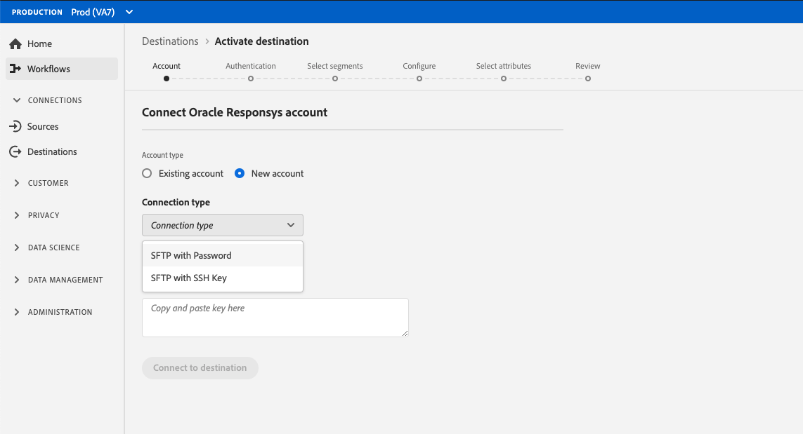

# [!DNL Oracle Responsys] conexão

## Visão geral {#overview}

 O Responsyis é uma ferramenta de marketing por email corporativo para campanhas de marketing entre canais oferecidas pelo  [!DNL Oracle] para personalizar interações entre email, celular, exibição e redes sociais.

Para enviar dados de segmento para [!DNL Oracle Responsys], primeiro você deve [se conectar ao destino](#connect-destination) no Adobe Experience Platform e [configurar uma importação de dados](#import-data-into-responsys) do local de armazenamento para [!DNL Oracle Responsys].

## Tipo de exportação {#export-type}

**Baseado em perfil**  - você está exportando todos os membros de um segmento, junto com os campos de esquema desejados (por exemplo: endereço de email, número de telefone, sobrenome), conforme escolhido na tela selecionar atributos do fluxo de trabalho de ativação de  [destino](../../ui/activate-destinations.md#select-attributes).

## LISTA DE PERMISSÕES do endereço IP {#allow-list}

Ao configurar destinos de marketing por email com o armazenamento SFTP, o Adobe recomenda adicionar determinados intervalos IP à lista de permissões.

Consulte [lista de permissões de endereço IP para destinos de armazenamento em nuvem](../cloud-storage/ip-address-allow-list.md) se precisar adicionar IPs Adobe à lista de permissões.

## Conectar destino {#connect-destination}

Em **[!UICONTROL Conexões]** > **[!UICONTROL Destinos]**, selecione [!DNL Oracle Responsys] e selecione **[!UICONTROL Conectar destino]**.

Na etapa **[!UICONTROL Account]**, se você tiver configurado anteriormente uma conexão com o destino de armazenamento na nuvem, selecione **[!UICONTROL Existing Account]** e selecione uma de suas conexões existentes. Ou você pode selecionar **[!UICONTROL New Account]** para configurar uma nova conexão. Preencha as credenciais de autenticação da conta e selecione **[!UICONTROL Conectar ao destino]**. Para [!DNL Oracle Responsys], você pode selecionar entre **[!UICONTROL SFTP com Senha]** e **[!UICONTROL SFTP com Chave SSH]**.

Preencha as informações abaixo, dependendo do tipo de conexão, e selecione **[!UICONTROL Configurar]**.

- Para **[!UICONTROL SFTP com conexões de senha]**, você deve fornecer [!UICONTROL Domínio], [!UICONTROL Porta], [!UICONTROL Nome de usuário] e [!UICONTROL Senha].
- Para **[!UICONTROL SFTP com conexões de chave SSH]**, você deve fornecer [!UICONTROL Domínio], [!UICONTROL Porta], [!UICONTROL Nome de usuário] e [!UICONTROL Chave SSH].

Como opção, você pode anexar sua chave pública formatada em RSA para adicionar criptografia com PGP/GPG aos arquivos exportados na seção **[!UICONTROL Key]**. Sua chave pública deve ser gravada como uma sequência de caracteres [!DNL Base64] codificada.

Na etapa **[!UICONTROL Authentication]**, preencha as informações relevantes para seu destino, conforme mostrado abaixo:
- **[!UICONTROL Nome]**: Escolha um nome relevante para o seu destino.
- **[!UICONTROL Descrição]**: Insira uma descrição para o seu destino.
- **[!UICONTROL Caminho]** da pasta: Forneça o caminho no local de armazenamento onde a Platform depositará seus dados de exportação como CSV ou arquivos delimitados por tabulação.
- **[!UICONTROL Formato]** de arquivo:  **** CSVou  **TAB_DELIMITED**. Selecione o formato de arquivo a ser exportado para o local de armazenamento.
- **[!UICONTROL Ações]** de marketing: As ações de marketing indicam a intenção para a qual os dados serão exportados para o destino. Você pode selecionar ações de marketing definidas pelo Adobe ou criar sua própria ação de marketing. Para obter mais informações sobre ações de marketing, consulte a [Visão geral das políticas de uso de dados](../../../data-governance/policies/overview.md).

<!--

Commenting out Amazon S3 bucket part for now until support is clarified

- **[!UICONTROL Bucket name]**: Your Amazon S3 bucket, where Platform will deposit the data export. Your input must be between 3 and 63 characters long. Must begin and end with a letter or number. Must contain only lowercase letters, numbers, or hyphens ( - ). Must not be formatted as an IP address (for example, 192.100.1.1).

-->

Clique em **[!UICONTROL Criar destino]** após preencher os campos acima. Seu destino agora está conectado e você pode [ativar segmentos](../../ui/activate-destinations.md) no destino.

## Ativar segmentos {#activate-segments}

Consulte [Ativar perfis e segmentos para um destino](../../ui/activate-destinations.md) para obter informações sobre o fluxo de trabalho de ativação de segmentos.

## Atributos de destino {#destination-attributes}

Quando [ativar segmentos](../../ui/activate-destinations.md) para o destino [!DNL Oracle Responsys], o Adobe recomenda selecionar um identificador exclusivo no [esquema de união](../../../profile/home.md#profile-fragments-and-union-schemas). Selecione o identificador exclusivo e quaisquer outros campos XDM que deseja exportar para o destino. Para obter mais informações, consulte [Selecionar quais campos de esquema usar como atributos de destino em seus arquivos exportados](./overview.md#destination-attributes).

## Dados exportados {#exported-data}

Para destinos [!DNL Oracle Responsys], a Platform cria um arquivo `.csv` delimitado por tabulação no local de armazenamento fornecido. Para obter mais informações sobre os arquivos, consulte [Destinos de marketing por email e destinos de armazenamento na nuvem](../../ui/activate-destinations.md#esp-and-cloud-storage) no tutorial de ativação de segmento.

## Configurar importação de dados em [!DNL Oracle Responsys] {#import-data-into-responsys}

Depois de conectar [!DNL Platform] ao armazenamento [!DNL SFTP], você deve configurar a importação de dados do local de armazenamento para [!DNL Oracle Responsys]. Para saber como fazer isso, consulte [Importando contatos ou contas](https://docs.oracle.com/cloud/latest/marketingcs_gs/OMCEA/Connect_WizardUpload.htm) no [!DNL Oracle Responsys Help Center].
