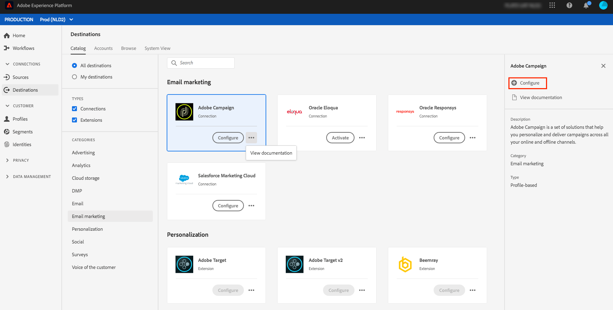

# Destinos de marketing de email {#email-marketing-destinations}

Provedores de serviço de email (ESPs) permitem gerenciar suas atividades de marketing de email, como o envio de campanhas de email promocionais. A Plataforma de dados do cliente em tempo real integra-se aos ESPs, permitindo que você ative segmentos para destinos de marketing por email.

Para enviar segmentos para destinos de marketing de email para suas campanhas, a CDP em tempo real deve primeiro se conectar ao destino.

A conexão com destinos de marketing de email é um processo de três etapas. Cada uma das etapas é descrita mais abaixo nesta página.

No fluxo de destino de conexão, descrito na seção abaixo, conecte-se ao Amazon S3 ou SFTP. A CDP em tempo real exporta seus segmentos como `.csv` ou `.txt` arquivos e os entrega para o local desejado. Agende sua importação de dados na plataforma de marketing por email a partir do local do armazenamento ativado no CDP em tempo real. O processo de importação de dados varia para cada parceiro. Consulte os artigos de destinos individuais para obter mais informações.

## Configurar destino {#connect-destination}

Em **[!UICONTROL Conexões]** > **[!UICONTROL Destinos]**, selecione o destino de marketing de email ao qual você deseja se conectar e selecione **[!UICONTROL Configurar]**.

Na etapa **[!UICONTROL Autenticação]** , se você já tiver configurado uma conexão com o destino de marketing por email, selecione Conta **** existente e selecione a conexão existente. Ou você pode selecionar **[!UICONTROL Nova conta]** para configurar uma nova conexão com seu destino de marketing de email. No seletor de tipo **[!UICONTROL de]** conexão, você pode selecionar entre Amazon S3, SFTP com senha ou SFTP com chave SSH. Preencha as informações abaixo, dependendo do tipo de conexão, e selecione **[!UICONTROL Connect (Conectar]**).

- Para conexões **** S3, você deve fornecer a ID da chave de acesso Amazon e a chave de acesso secreta.
- Para **SFTP com conexões de senha** , você deve fornecer Domínio, Porta, Nome de usuário e Senha para seu servidor SFTP.
- Para **SFTP com conexões de chave** SSH, você deve fornecer Domínio, Porta, Nome de usuário e Chave SSH para seu servidor SFTP.

Opcionalmente, você pode anexar sua chave pública formatada pelo RSA para adicionar criptografia aos arquivos exportados na seção **[!UICONTROL Chave]** . Observe que essa chave pública **deve** ser gravada como uma string codificada em Base64.

Na etapa **[!UICONTROL de configuração]** , digite um nome e uma descrição para o seu novo destino, bem como o formato de arquivo para os arquivos exportados.

Se você selecionou Amazon S3 como opção de armazenamento na etapa anterior, insira o nome do bucket e o caminho da pasta no destino do armazenamento na nuvem onde os arquivos serão entregues. Para a opção armazenamento SFTP, insira o caminho da pasta onde os arquivos serão entregues.

Também nesta etapa, você pode selecionar qualquer caso de uso de marketing que deve se aplicar a esse destino. Os casos de uso de marketing indicam a intenção para a qual os dados serão exportados para o destino. Você pode selecionar de casos de uso de marketing definidos pelo Adobe ou criar seu próprio caso de uso de marketing. Para obter mais informações sobre casos de uso de marketing, consulte a página [Data Governance em CDP](../../../rtcdp/privacy/data-governance-overview.md#destinations) em tempo real. Para obter informações sobre casos individuais de uso de marketing definidos pelo Adobe, consulte a visão geral [das políticas de uso de](../../../data-governance/policies/overview.md#core-actions)dados.

## Selecione quais membros de segmento devem ser incluídos nas exportações de destino {#select-segments}

Na página **[!UICONTROL Selecionar segmentos]** , selecione quais segmentos serão enviados para o destino. Encontre mais informações sobre os campos nas seções abaixo.

## Configurar nomes de arquivos

Para obter informações sobre as opções de programação de segmentos e edição de nomes de arquivos, consulte a etapa [Configurar](../../ui/activate-destinations.md#configure) no tutorial de ativação de destinos.

## Selecionar atributos - Selecione quais campos de schema usar como atributos de destino nos arquivos exportados {#destination-attributes}

Nesta etapa, você está selecionando quais campos exportar para destinos de marketing de email, bem como marcando quais campos são obrigatórios.

Para obter mais informações sobre essa etapa, consulte a etapa [Selecionar atributos](../../ui/activate-destinations.md#select-attributes) no tutorial Ativar destinos.

### Identidade {#identity}

Recomendamos que você selecione um identificador exclusivo do seu schema [de](../../../profile/home.md#profile-fragments-and-union-schemas)união. Este é o campo do qual as identidades de seus usuários são destacadas. Normalmente, esse campo é o endereço de email, mas também pode ser uma ID de programa de fidelidade ou um número de telefone. Consulte a tabela abaixo para obter os identificadores exclusivos mais comuns e seus campos XDM no schema.

| Identificador exclusivo | Campo XDM no Schema Unificado |
----------------- | ---------------------------
| Endereço de email | `personalEmail.address` |
| Telefone | `mobilePhone.number` |
| ID do programa de fidelidade | `Customer-defined XDM field` |

### Outros atributos de destino

No seletor de campo Schema, escolha os outros campos que deseja exportar para o destino do email. Algumas opções recomendadas são:

| Esquema | Campo XDM |
------ | ---------
| Nome | `person.name.firstName` |
| Sobrenome | `person.name.lastName` |
| Telefone | `mobilePhone.number` |
| Cidade do Endereço | `homeAddress.city` |
| Estado do endereço | `homeAddress.stateProvince` |
| Código postal do endereço | `homeAddress.postalCode` |
| Aniversário | `person.birthDayAndMonth` |
| Associação ao segmento | `segmentMembership.status` |

## Importar dados do local do armazenamento para o destino

Consulte os artigos de destino de marketing de email individuais para saber como importar dados da localização do armazenamento para destinos:

- [Adobe Campaign](./adobe-campaign.md#import-data-into-campaign)
- [Oracle Eloqua](./oracle-eloqua.md#import-data-into-eloqua)
- [Oracle Responsys](./oracle-responsys.md#import-data-into-responsys)
- [Marketing Cloud do Salesforce](./salesforce-marketing-cloud.md#import-data-into-salesforce)

## Ativar segmentos para destinos de marketing de email

Para obter instruções sobre como ativar segmentos para destinos de marketing por email, consulte [Ativar dados para destinos](../../ui/activate-destinations.md).

## Recursos adicionais

- [Ativar dados para destinos](../../ui/activate-destinations.md)
- [Criar destinos de marketing de email e ativar dados usando a API de Serviço de Fluxo](../../api/email-marketing.md)