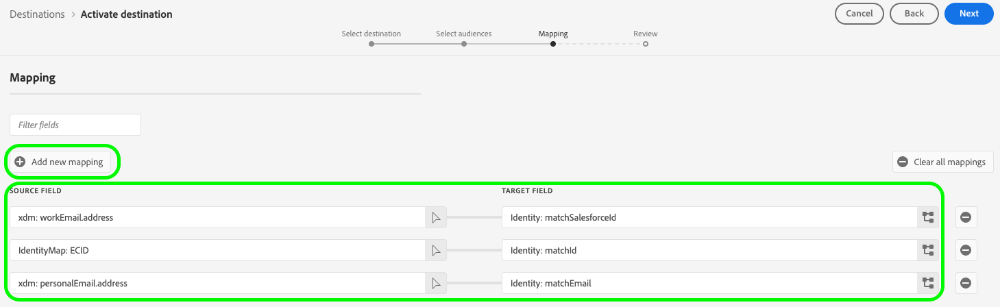

# [!DNL (V2) Salesforce Marketing Cloud Account Engagement] conexão

O destino [[!DNL Salesforce Marketing Cloud Account Engagement]](https://www.salesforce.com/products/marketing-cloud/marketing-automation/) (anteriormente conhecido como [!DNL Pardot]) permite exportar os dados do perfil do Adobe Experience Platform para a plataforma de automação de marketing B2B da Salesforce.

Essa integração permite a sincronização perfeita de dados entre os perfis de clientes no Adobe Experience Platform e suas campanhas de marketing no [!DNL Salesforce Marketing Cloud Account Engagement].

Este destino usa o [[!DNL Salesforce Import API v5]](https://developer.salesforce.com/docs/marketing/pardot/guide/import-v5.html) para processar com eficiência exportações de dados em lote.

>[!IMPORTANT]
> 
> Esta é a versão V2 do [Envolvimento da conta do Salesforce Marketing Cloud](help/destinations/catalog/email-marketing/salesforce-marketing-cloud-account-engagement.md) de destino. Esta versão substitui o destino anterior e está atualmente na versão do Alpha.
> &#x200B;>  
> &#x200B;> Se você estiver usando a versão anterior do destino [Envolvimento da conta do Salesforce Marketing Cloud](help/destinations/catalog/email-marketing/salesforce-marketing-cloud-account-engagement.md), migre para essa versão V2 antes de **janeiro de 2026**. Após janeiro de 2026, a Adobe desativará a versão anterior e ela não estará mais disponível.

## Casos de uso {#use-cases}

Para ajudá-lo a entender melhor como e quando você deve usar o destino [!DNL (V2) Marketing Cloud Account Engagement], veja a seguir exemplos de casos de uso que os clientes da Adobe Experience Platform podem resolver usando esse destino.

### Gerenciamento de clientes em potencial B2B {#use-case-lead-management}

Sincronizar dados de cliente potencial do Adobe Experience Platform com o [!DNL Salesforce Marketing Cloud Account Engagement] para obter integração e pontuação abrangentes de clientes potenciais. Sua equipe de marketing pode criar perfis avançados de público-alvo no Experience Platform e exportá-los para o [!DNL Salesforce Marketing Cloud Account Engagement] para campanhas de marketing B2B automatizadas.

### Automação de Campaign {#use-case-campaign-automation}

Você pode acionar campanhas de marketing em [!DNL Salesforce Marketing Cloud Account Engagement] usando públicos definidos no Adobe Experience Platform. Após exportar seus públicos-alvo direcionados para [!DNL Salesforce], você pode usá-los para executar campanhas de email e gerenciar seus clientes potenciais por meio de promoção, pontuação e segmentação de campanha.

### Enriquecimento de perfil {#use-case-profile-enrichment}

Aprimore seus perfis de cliente potencial do [!DNL Salesforce Marketing Cloud Account Engagement] com dados avançados do cliente do Adobe Experience Platform. Exporte atributos de perfil abrangentes para criar registros de cliente potencial mais detalhados em [!DNL Salesforce Marketing Cloud Account Engagement] para melhor direcionamento e personalização.

## Pré-requisitos {#prerequisites}

Consulte as seções abaixo para quaisquer pré-requisitos que você precise configurar no Experience Platform e [!DNL Salesforce] e para obter as informações que você precisa coletar antes de trabalhar com o destino [!DNL (V2) Marketing Cloud Account Engagement].

### Pré-requisitos do Experience Platform {#prerequisites-in-experience-platform}

Antes de ativar dados para o destino [!DNL (V2) Marketing Cloud Account Engagement], você deve ter um [esquema](/help/xdm/schema/composition.md), um [conjunto de dados](../../../catalog/datasets/overview.md) e [públicos-alvo](../../../segmentation/types/overview.md) criados em [!DNL Experience Platform].

### [!DNL Salesforce Marketing Cloud Account Engagement] pré-requisitos {#prerequisites-destination}

Observe os seguintes pré-requisitos para exportar dados do Experience Platform para sua conta do [!DNL Marketing Cloud Account Engagement]:

#### Você precisa ter uma conta [!DNL Marketing Cloud Account Engagement] {#prerequisites-account}

Uma conta do [!DNL Marketing Cloud Account Engagement] com uma assinatura do produto [Envolvimento da conta da Marketing Cloud](https://www.salesforce.com/products/marketing-cloud/marketing-automation/) é obrigatória para continuar.

#### Obter credenciais de [!DNL Marketing Cloud Account Engagement] {#gather-credentials}

Anote os itens abaixo antes de autenticar no destino [!DNL (V2) Marketing Cloud Account Engagement].

| Credencial | Descrição |
| --- | --- |
| **[!UICONTROL ID da Unidade de Negócios de Envolvimento da Conta]** | ID da unidade de negócios do Engajamento da conta do [!DNL Salesforce]. Consulte a [documentação](https://help.salesforce.com/s/articleView?id=000381973&type=1) do Salesforce para saber como encontrar a ID. |

{style="table-layout:auto"}

## Identidades suportadas {#supported-identities}

[!DNL (V2) Marketing Cloud Account Engagement] dá suporte à ativação das identidades descritas na tabela abaixo. Saiba mais sobre [identidades](/help/identity-service/features/namespaces.md).

Se uma correspondência for encontrada usando um desses identificadores, o registro de cliente potencial existente do Engajamento na conta será atualizado com os dados do Adobe Experience Platform. Se nenhuma correspondência for encontrada, um novo registro de cliente potencial será criado em Envolvimento da conta.

| Identidade do público alvo | Descrição | Considerações |
|---|---|---|
| `matchId` | ID de cliente potencial no envolvimento com a conta | É necessária pelo menos uma destas três identidades |
| `matchSalesforceId` | ID de cliente potencial/contato da Salesforce | É necessária pelo menos uma destas três identidades |
| `matchEmail` | Endereço de email do cliente potencial | É necessária pelo menos uma destas três identidades |

{style="table-layout:auto"}

## Tipo e frequência de exportação {#export-type-frequency}

Consulte a tabela abaixo para obter informações sobre o tipo e a frequência da exportação de destino.

| Item | Tipo | Notas |
---------|----------|---------|
| Tipo de exportação | **[!UICONTROL Baseado em perfil]** | <ul><li>Você está exportando todos os membros de um público-alvo, juntamente com os campos de esquema desejados *(por exemplo: endereço de email, número de telefone, sobrenome)*, de acordo com o mapeamento de campos.</li><li>Esse destino oferece suporte à exportação em lote de dados de perfil usando a API de importação do Salesforce v5.</li></ul> |
| Frequência de exportação | **[!UICONTROL Lote]** | <ul><li>**Exportação Inicial**: Exportação completa imediatamente após o mapeamento</li><li>**Exportações subsequentes**: exportações incrementais a cada 3 horas</li><li>Esta programação foi corrigida e não pode ser personalizada no Alpha</li></ul> |

{style="table-layout:auto"}

## Conectar ao destino {#connect}

>[!IMPORTANT]
>
>Para se conectar ao destino, você precisa de **[!UICONTROL Exibir Destinos]** e **[!UICONTROL Gerenciar Destinos]** [permissões de controle de acesso](/help/access-control/home.md#permissions). Leia a [visão geral do controle de acesso](/help/access-control/ui/overview.md) ou contate o administrador do produto para obter as permissões necessárias.

Para se conectar a este destino, siga as etapas descritas no [tutorial de configuração de destino](../../ui/connect-destination.md). No workflow de configuração de destino, preencha os campos listados nas duas seções abaixo.

### Autenticar para o destino {#authenticate}

Para autenticar no destino, selecione **[!UICONTROL Conectar ao destino]**.

Você será redirecionado para a página de logon [!DNL Salesforce]. Insira suas credenciais de conta do [!DNL Marketing Cloud Account Engagement] e selecione **[!UICONTROL Fazer logon]**.

Em seguida, selecione **[!UICONTROL Permitir]** para conceder permissões ao aplicativo **Adobe Experience Platform** para acessar sua conta [!DNL Salesforce Marketing Cloud Account Engagement]. *É necessário fazer isso apenas uma vez*.

Se os detalhes fornecidos forem válidos, a interface exibirá uma mensagem: *Você se conectou com êxito à (V2) conta de Envolvimento da Conta do Salesforce Marketing Cloud* e um status **[!UICONTROL Conectado]** com uma marca de seleção verde.

### Preencher detalhes do destino {#destination-details}

Para configurar detalhes para o destino, preencha os campos obrigatórios e opcionais abaixo. Um asterisco ao lado de um campo na interface do usuário indica que o campo é obrigatório.

* **[!UICONTROL Nome]**: um nome pelo qual você reconhecerá este destino no futuro.
* **[!UICONTROL Descrição]**: uma descrição que ajudará você a identificar este destino no futuro.
* **[!UICONTROL ID da Unidade de Negócios de Envolvimento da Conta]**: Seu [!DNL Salesforce] `Account Engagement Business Unit ID`.
* **[!UICONTROL API de Envolvimento da Conta]**: selecione se deseja usar os pontos de extremidade de produção (`https://pi.pardot.com`) ou de demonstração (`https://pi.demo.pardot.com`) da API de Envolvimento da Conta.
* **[!UICONTROL ID da Campanha de Envolvimento da Conta]**: cada cliente potencial [!DNL Account Engagement] deve ser associado a uma campanha. Se você não definir uma ID de campanha, o Engajamento da conta tentará atribuir uma automaticamente, se um padrão existir em sua conta da Salesforce.

### Ativar alertas {#enable-alerts}

Você pode ativar os alertas para receber notificações sobre o status do fluxo de dados para o seu destino. Selecione um alerta na lista para assinar e receber notificações sobre o status do seu fluxo de dados. Para obter mais informações sobre alertas, consulte o manual sobre [assinatura de alertas de destinos usando a interface](../../ui/alerts.md).

Quando terminar de fornecer detalhes da conexão de destino, selecione **[!UICONTROL Avançar]**.

## Ativar públicos-alvo para esse destino {#activate}

>[!IMPORTANT]
> 
>* Para ativar dados, você precisa de **[!UICONTROL Exibir Destinos]**, **[!UICONTROL Ativar Destinos]**, **[!UICONTROL Exibir Perfis]** e **[!UICONTROL Exibir Segmentos]** [permissões de controle de acesso](/help/access-control/home.md#permissions). Leia a [visão geral do controle de acesso](/help/access-control/ui/overview.md) ou contate o administrador do produto para obter as permissões necessárias.
>* Para exportar *identidades*, você precisa da **[!UICONTROL permissão Exibir Gráfico de Identidade]** [controle de acesso](/help/access-control/home.md#permissions).   {width="100" zoomable="yes"}

Leia [Ativar dados de público-alvo para destinos de exportação de perfil em lote](/help/destinations/ui/activate-batch-profile-destinations.md) para obter instruções sobre como ativar públicos-alvo para esse destino.

### Considerações e exemplo de mapeamento {#mapping-considerations-example}

Para enviar dados de público-alvo do Adobe Experience Platform para o destino [!DNL (V2) Marketing Cloud Account Engagement], mapeie os campos do esquema do Experience Data Model (XDM) para os campos correspondentes no destino.

Consulte a [documentação da API v5 do Salesforce Prospect](https://developer.salesforce.com/docs/marketing/pardot/guide/prospect-v5.html) para obter uma lista completa dos campos com suporte. Observe que não há suporte para [campos personalizados](https://developer.salesforce.com/docs/marketing/pardot/guide/custom-field-v5.html) na versão do Alpha.

#### Atributos compatíveis {#supported-attributes}

O destino de Envolvimento da conta da Salesforce Marketing Cloud é compatível com os atributos do público-alvo descritos na tabela abaixo.

| Atributo | Tipo | Descrição |
|---------|----------|----------|
| `salesforceId` | String | A Salesforce ID do cliente potencial |
| `salesforceOwnerId` | Número inteiro | A ID de usuário da Salesforce do proprietário potencial |
| `salutation` | String | A saudação do cliente potencial (por exemplo, Sr., Sra., Dr.) |
| `score` | Número inteiro | A pontuação do cliente potencial em Compromisso com a Conta |
| `source` | String | A origem do registro de cliente potencial |
| `state` | String | O estado/província do cliente potencial |
| `territory` | String | O território atribuído ao cliente potencial |
| `userId` | Número inteiro | A ID de usuário associada ao cliente potencial |
| `website` | String | O URL do site do cliente potencial |
| `yearsInBusiness` | String | O número de anos em que o cliente potencial esteve em operação |
| `zip` | String | O CEP do cliente potencial |

#### Mapeamentos necessários {#required-mappings}

Antes de começar a mapear os dados, revise os mapeamentos de campo obrigatórios abaixo.

| Campo de destino | Tipo | Obrigatório | Quando usar |
|---|---|---|---|
| `email` | Atributo | Sempre obrigatório | O endereço de email do cliente potencial. Este é o identificador principal para localizar e corresponder registros de cliente potencial no Engajamento da Conta quando você não tem um `matchId` ou `matchSalesforceId`.   **Observação:** com o recurso &quot;Permitir vários clientes em potencial com o mesmo endereço de email&quot; do Engajamento na Conta, confiar apenas no email pode gerar ambiguidade se houver vários clientes em potencial com o mesmo email. Em geral, o Engajamento com a conta assumirá como padrão a atualização do cliente potencial com a atividade mais recente nesses casos. |
| `matchId` | Identidade | É necessária pelo menos uma destas três identidades | Um identificador exclusivo gerado pelo Account Engagement para cada registro de cliente potencial individual. Use-a quando já tiver a ID de cliente potencial do Engajamento da conta e quiser garantir que as atualizações sejam aplicadas ao cliente potencial correto, especialmente quando vários clientes potenciais compartilharem o mesmo endereço de email. |
| `matchSalesforceId` | Identidade | É necessária pelo menos uma destas três identidades | A Salesforce ID de um cliente potencial ou contato no Salesforce. Use esta opção quando um cliente potencial já estiver sincronizado com o Salesforce para manter a consistência dos dados entre o Envolvimento da conta e a Salesforce. |
| `matchEmail` | Identidade | É necessária pelo menos uma destas três identidades | O endereço de email do cliente potencial usado para correspondência. Use-o como um identificador alternativo quando não tiver a ID de cliente potencial do Engajamento com a conta ou a ID da Salesforce específica. Observação: se vários clientes potenciais compartilharem o mesmo endereço de email, o Engajamento da conta normalmente assumirá como padrão a atualização do cliente potencial com a atividade mais recente. |

Siga as etapas abaixo para mapear os campos corretos.

1. Na etapa **[!UICONTROL Mapeamento]**, selecione **[!UICONTROL Adicionar novo mapeamento]**. Você verá uma nova linha de mapeamento na tela.
1. Na janela **[!UICONTROL Selecionar campo de origem]**, escolha a categoria **[!UICONTROL Selecionar atributos]** e selecione o atributo XDM ou escolha o **[!UICONTROL Selecionar namespace de identidade]** e selecione uma identidade.
1. Na janela **[!UICONTROL Selecionar campo de destino]**, escolha o **[!UICONTROL Selecionar namespace de identidade]** e selecione uma identidade ou escolha a categoria **[!UICONTROL Selecionar atributos personalizados]** e especifique na lista de campos de cliente potencial padrão de Envolvimento da Conta.

## Validar exportação de dados {#exported-data}

Para validar se você configurou o destino corretamente, siga as etapas abaixo:

1. Navegue até um dos públicos-alvo selecionados. Selecione a guia **[!DNL Activation data]**. A coluna **[!UICONTROL ID de Mapeamento]** exibe o nome do campo personalizado gerado na página [!DNL Marketing Cloud Account Engagement Prospects].
   

1. Faça logon no site [[!DNL Salesforce]](https://login.salesforce.com/). Em seguida, navegue até a página **[!DNL Account Engagement]** > **[!DNL Prospects]** > **[!DNL Pardot Prospects]** e verifique se os prospetos do público-alvo foram adicionados/atualizados. Como alternativa, você também pode acessar [[!DNL Account Engagement]](https://pi.pardot.com/) e acessar a página **[!DNL Prospects]**.
   

1. Para verificar se os clientes potenciais foram atualizados, selecione um cliente potencial e verifique se o campo personalizado de cliente potencial foi atualizado com o status do público-alvo do Experience Platform.
   

## Uso e governança de dados {#data-usage-governance}

Todos os destinos do [!DNL Adobe Experience Platform] são compatíveis com as políticas de uso de dados ao manipular seus dados. Para obter informações detalhadas sobre como o [!DNL Adobe Experience Platform] impõe a governança de dados, consulte a [visão geral da Governança de Dados](/help/data-governance/home.md).

## Recursos adicionais {#additional-resources}

* [!DNL Marketing Cloud Account Engagement] [Documentação da API](https://developer.salesforce.com/docs/marketing/pardot/guide/overview.html)
* [Documentação da API de Importação v5 do Salesforce](https://developer.salesforce.com/docs/marketing/pardot/guide/import-v5.html)
* [Documentação da API v5 do Salesforce Prospect](https://developer.salesforce.com/docs/marketing/pardot/guide/prospect-v5.html)