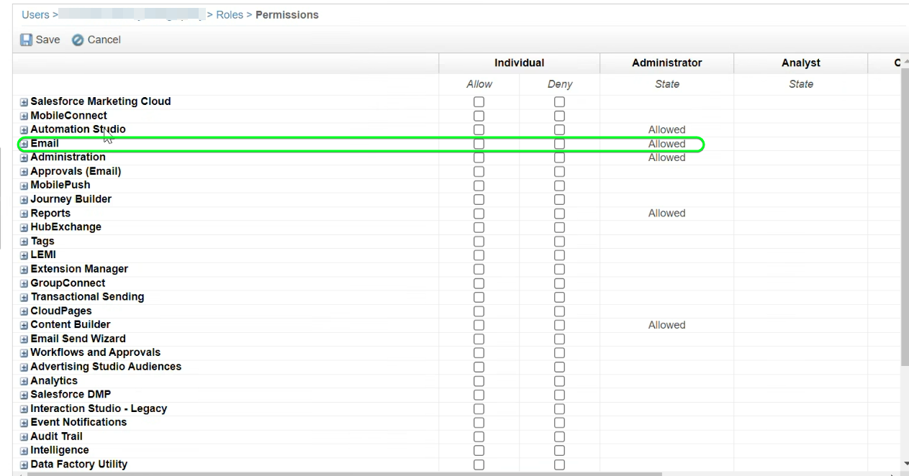
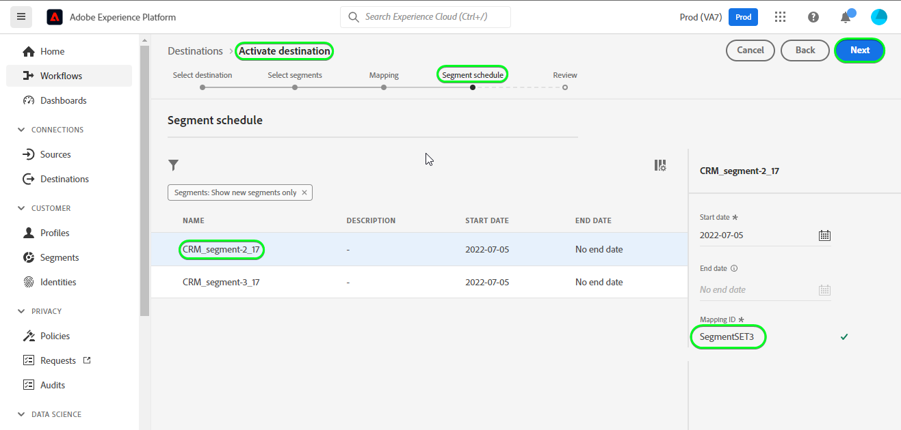

# [!DNL (API) Salesforce Marketing Cloud] conexão

## Visão geral {#overview}

[[!DNL (API) Salesforce Marketing Cloud]](https://www.salesforce.com/products/marketing-cloud/engagement/) (antigo [!DNL ExactTarget]) é um conjunto de marketing digital que permite a você criar e personalizar jornadas para visitantes e clientes para personalizar sua experiência.

>[!IMPORTANT]
>
> Observe a diferença entre essa conexão e a outra [[!DNL Salesforce Marketing Cloud] conexão](/help/destinations/catalog/email-marketing/salesforce-marketing-cloud.md) que existe na seção Catálogo de marketing por email. A outra conexão do Salesforce Marketing Cloud permite exportar arquivos para um local de armazenamento especificado, enquanto essa é uma conexão de transmissão baseada em API.

Comparado ao [!DNL Salesforce Marketing Cloud Account Engagement], que é mais orientado para marketing **B2B**, o destino [!DNL (API) Salesforce Marketing Cloud] é ideal para casos de uso do **B2C** com ciclos de tomada de decisão transacionais mais curtos. Você pode consolidar conjuntos de dados maiores, representando o comportamento do seu público-alvo, para ajustar e melhorar as campanhas de marketing, priorizando e segmentando contatos, especialmente de conjuntos de dados fora do [!DNL Salesforce]. *Observação: a Experience Platform também tem uma conexão para [[!DNL Salesforce Marketing Cloud Account Engagement]](/help/destinations/catalog/email-marketing/salesforce-marketing-cloud-account-engagement.md).*

Este [!DNL Adobe Experience Platform] [destino](/help/destinations/home.md) usa a API de [!DNL Salesforce Marketing Cloud] [atualização de contatos](https://developer.salesforce.com/docs/marketing/marketing-cloud/guide/updateContacts.html), que permite **adicionar contatos e atualizar dados de contato** para as suas necessidades comerciais depois de ativá-los em um novo segmento [!DNL Salesforce Marketing Cloud].

[!DNL Salesforce Marketing Cloud] usa OAuth 2 com Credenciais de Cliente como o mecanismo de autenticação para se comunicar com a API [!DNL Salesforce Marketing Cloud]. As instruções para autenticar na sua instância do [!DNL Salesforce Marketing Cloud] estão mais abaixo, na seção [Autenticar no destino](#authenticate).

## Casos de uso {#use-cases}

Para ajudá-lo a entender melhor como e quando você deve usar o destino [!DNL (API) Salesforce Marketing Cloud], veja um exemplo de caso de uso que os clientes da Adobe Experience Platform podem resolver usando esse destino.

### Enviar emails para contatos de campanhas de marketing {#use-case-send-emails}

O departamento de vendas de uma plataforma de aluguel de residências quer transmitir um email de marketing para um público-alvo de clientes direcionado. A equipe de marketing da plataforma pode adicionar novos contatos / atualizar os contatos existentes *(e seus endereços de email)* por meio do Adobe Experience Platform, criar públicos a partir de seus próprios dados offline e enviar esses públicos para [!DNL Salesforce Marketing Cloud], que pode ser usado para enviar o email da campanha de marketing.

## Pré-requisitos {#prerequisites}

### Pré-requisitos no Experience Platform {#prerequisites-in-experience-platform}

Antes de ativar dados para o destino [!DNL (API) Salesforce Marketing Cloud], você deve ter um [esquema](/help/xdm/schema/composition.md), um [conjunto de dados](https://experienceleague.adobe.com/docs/platform-learn/tutorials/data-ingestion/create-datasets-and-ingest-data.html) e [segmentos](https://experienceleague.adobe.com/docs/platform-learn/tutorials/segments/create-segments.html) criados em [!DNL Experience Platform].

### Pré-requisitos em [!DNL (API) Salesforce Marketing Cloud] {#prerequisites-destination}

Observe os seguintes pré-requisitos para exportar dados do Experience Platform para sua conta do [!DNL Salesforce Marketing Cloud]:

#### Você precisa ter uma conta [!DNL Salesforce Marketing Cloud] {#prerequisites-account}

Uma conta do [!DNL Salesforce Marketing Cloud] com uma assinatura do produto [[!DNL Marketing Cloud Engagement]](https://www.salesforce.com/products/marketing-cloud/engagement/) é obrigatória para continuar.

Entre em contato com o [[!DNL Salesforce] Suporte](https://www.salesforce.com/company/contact-us/?d=cta-glob-footer-10) se você não tiver uma conta do [!DNL Salesforce Marketing Cloud] ou se sua conta não tiver a assinatura do produto [!DNL Marketing Cloud Engagement].

#### Criar atributos em [!DNL Salesforce Marketing Cloud] {#prerequisites-attribute}

Ao ativar públicos para o destino [!DNL (API) Salesforce Marketing Cloud], você deve inserir um valor no campo **[!UICONTROL Mapping ID]** para cada público ativado, na etapa **[Agenda de público](#schedule-segment-export-example)**.

[!DNL Salesforce] exige esse valor para ler e interpretar corretamente os públicos-alvo provenientes da Experience Platform e atualizar o status dos públicos-alvo em [!DNL Salesforce Marketing Cloud]. Consulte a documentação do Experience Platform para [Grupo de campos do esquema de Detalhes da associação do público-alvo](/help/xdm/field-groups/profile/segmentation.md) se precisar de orientação sobre os status do público-alvo.

Para cada público-alvo ativado do Experience Platform para [!DNL Salesforce], você deve ter um atributo do tipo `Text` vinculado à extensão de dados [!DNL Email Demographics] no [!DNL Salesforce Marketing Cloud]. Use o [!DNL Salesforce Marketing Cloud] [!DNL Contact Builder] para criar atributos. Consulte a documentação do [!DNL Salesforce Marketing Cloud] para [criar atributos](https://help.salesforce.com/s/articleView?id=mc_cab_create_an_attribute.htm&type=5&language=en_US) se precisar de orientação sobre como criar atributos.

Os nomes de campo de atributo são usados para o campo de destino [!DNL (API) Salesforce Marketing Cloud] durante a etapa **[!UICONTROL Mapping]**. Você pode definir o caractere de campo com no máximo 4.000 caracteres, de acordo com sua necessidade comercial. Consulte a página de documentação de [!DNL Salesforce Marketing Cloud] [Tipos de dados das extensões de dados](https://help.salesforce.com/s/articleView?id=sf.mc_es_data_extension_data_types.htm&type=5) para obter informações adicionais sobre tipos de atributos.

Um exemplo da tela do designer de dados em [!DNL Salesforce Marketing Cloud], na qual você adicionará o atributo, é mostrado abaixo:

Uma exibição de um grupo de atributos [!DNL Salesforce Marketing Cloud] [!DNL Email Data] com atributos correspondentes ao status do público-alvo na extensão de dados [!DNL Email Demographics] é mostrada abaixo:

O destino [!DNL (API) Salesforce Marketing Cloud] usa a [!DNL Salesforce Marketing Cloud] [!DNL Search Attribute-Set Definitions REST] [API](https://developer.salesforce.com/docs/marketing/marketing-cloud/guide/retrieveAttributeSetDefinitions.html) para recuperar dinamicamente as extensões de dados e seus atributos vinculados&#39; definidos em [!DNL Salesforce Marketing Cloud].

Eles são exibidos na janela de seleção **[!UICONTROL Target field]** quando você configura o [mapeamento](#mapping-considerations-example) no fluxo de trabalho para [ativar públicos para o destino](#activate).

>[!IMPORTANT]
>
> Em [!DNL Salesforce Marketing Cloud], você deve criar atributos com um **[!UICONTROL FIELD NAME]** que corresponda exatamente ao valor especificado em **[!UICONTROL Mapping ID]** para cada segmento ativado do Experience Platform. Por exemplo, a captura de tela abaixo mostra um atributo chamado `salesforce_mc_segment_1`. Ao ativar um público-alvo para esse destino, adicione `salesforce_mc_segment_1` como **[!UICONTROL Mapping ID]** para preencher públicos-alvo do Experience Platform nesse atributo.

Um exemplo de criação de atributo em [!DNL Salesforce Marketing Cloud], é mostrado abaixo:

>[!TIP]
>
> * Ao criar o atributo, não inclua caracteres de espaço em branco no nome do campo. Em vez disso, use o caractere de sublinhado `(_)` como separador.
> * Para distinguir entre atributos usados para públicos-alvo da Experience Platform e outros atributos no [!DNL Salesforce Marketing Cloud], você pode incluir um prefixo ou sufixo reconhecível para os atributos usados para segmentos do Adobe. Por exemplo, em vez de `test_segment`, use `Adobe_test_segment` ou `test_segment_Adobe`.
> * Se você já tiver outros atributos criados em [!DNL Salesforce Marketing Cloud], poderá usar o mesmo nome do segmento do Experience Platform para identificar facilmente o público em [!DNL Salesforce Marketing Cloud].

#### Atribuir funções e permissões de usuário em [!DNL Salesforce Marketing Cloud] {#prerequisites-roles-permissions}

Como o [!DNL Salesforce Marketing Cloud] oferece suporte a funções personalizadas, dependendo do seu caso de uso, o usuário deve receber as funções relevantes para atualizar seus atributos no [!DNL Salesforce Marketing Cloud]. Um exemplo de funções atribuídas a um usuário é mostrado abaixo:

Dependendo das funções atribuídas ao usuário [!DNL Salesforce Marketing Cloud], também será necessário atribuir permissões para a extensão de dados [!DNL Salesforce Marketing Cloud], que estão vinculadas aos campos que você deseja atualizar.

Como esse destino requer acesso ao `[!DNL data extension]`, é necessário permitir. Por exemplo, para o `Email` [!DNL data extension], você precisa permitir, conforme mostrado abaixo:

Para restringir o nível de acesso, você também pode substituir o acesso individual usando privilégios granulares.

Consulte as páginas [[!DNL Marketing Cloud Roles]](https://help.salesforce.com/s/articleView?language=en_US&id=sf.mc_overview_marketing_cloud_roles.htm&type=5) e [[!DNL Marketing Cloud Roles and Permissions]](https://help.salesforce.com/s/articleView?language=en_US&id=sf.mc_overview_roles.htm&type=5) para obter orientação detalhada.

#### Obter credenciais de [!DNL Salesforce Marketing Cloud] {#gather-credentials}

Anote os itens abaixo antes de autenticar no destino [!DNL (API) Salesforce Marketing Cloud].

| Credencial | Descrição | Exemplo |
| --- | --- | --- |
| Subdomínio | Consulte [[!DNL Salesforce Marketing Cloud domain prefix]](https://developer.salesforce.com/docs/marketing/marketing-cloud/guide/your-subdomain-tenant-specific-endpoints.html) para saber como obter esse valor na interface [!DNL Salesforce Marketing Cloud]. | Se o domínio [!DNL Salesforce Marketing Cloud] for   *`mcq4jrssqdlyc4lph19nnqgzzs84`.login.exacttarget.com*,  você precisa fornecer `mcq4jrssqdlyc4lph19nnqgzzs84` como o valor. |
| ID de cliente | Consulte a [!DNL Salesforce Marketing Cloud] [documentação](https://developer.salesforce.com/docs/marketing/marketing-cloud/guide/access-token-s2s.html) para saber como obter este valor da interface [!DNL Salesforce Marketing Cloud]. | r23kxxxxxxxx0z05xxxxxx |
| Segredo do cliente | Consulte a [!DNL Salesforce Marketing Cloud] [documentação](https://developer.salesforce.com/docs/marketing/marketing-cloud/guide/access-token-s2s.html) para saber como obter este valor da interface [!DNL Salesforce Marketing Cloud]. | ipxxxxxxxxxxT4xxxxxxxxx |

{style="table-layout:auto"}

### Medidas de proteção {#guardrails}

* A Salesforce impõe determinados [limites de taxa](https://developer.salesforce.com/docs/marketing/marketing-cloud/guide/rate-limiting.html).
   * Consulte a [!DNL Salesforce Marketing Cloud] [documentação](https://developer.salesforce.com/docs/marketing/marketing-cloud/guide/rate-limiting-errors.html) para resolver quaisquer limites prováveis que você possa encontrar e reduzir erros durante a execução.
   * Consulte a página [[!DNL Salesforce Marketing Cloud] Preços do Envolvimento](https://www.salesforce.com/editions-pricing/marketing-cloud/email/) para *Baixar o Gráfico de Comparação da Edição Completa* como um pdf que detalha os limites impostos pelo seu plano.
   * A página [Visão geral da API](https://developer.salesforce.com/docs/marketing/marketing-cloud/guide/apis-overview.html) detalha limites adicionais.
   * Consulte [aqui](https://salesforce.stackexchange.com/questions/205898/marketing-cloud-api-limits) para obter uma página que reúna esses detalhes.
* A contagem de *campos personalizados permitidos por objeto* varia de acordo com sua edição do Salesforce.
   * Consulte a [!DNL Salesforce] [documentação](https://help.salesforce.com/s/articleView?id=sf.custom_field_allocations.htm&type=5) para obter orientação adicional.
   * Se você atingiu o limite definido para *campos personalizados permitidos por objeto* em [!DNL Salesforce Marketing Cloud], será necessário
      * Remova os atributos mais antigos antes de adicionar novos atributos em [!DNL Salesforce Marketing Cloud].
      * Atualize ou remova qualquer público ativado nos destinos do Experience Platform que usam esses nomes de atributos mais antigos como o valor fornecido para **[!UICONTROL Mapping ID]** durante a etapa [agendamento de público-alvo](#schedule-segment-export-example).

## Identidades suportadas {#supported-identities}

[!DNL (API) Salesforce Marketing Cloud] dá suporte à ativação das identidades descritas na tabela abaixo. Saiba mais sobre [identidades](/help/identity-service/features/namespaces.md).

| Identidade de destino | Descrição | Considerações |
|---|---|---|
| contactKey | [!DNL Salesforce Marketing Cloud] Chave do Contato. Consulte a [!DNL Salesforce Marketing Cloud] [documentação](https://help.salesforce.com/s/articleView?id=sf.mc_cab_contact_builder_best_practices.htm&type=5) se precisar de orientação adicional. | Obrigatório |

## Públicos-alvo compatíveis {#supported-audiences}

Esta seção descreve quais tipos de públicos-alvo você pode exportar para esse destino.

| Origem do público | Suportado | Descrição |
|---------|----------|----------|
| [!DNL Segmentation Service] | ✓ | Públicos-alvo gerados pelo [Serviço de Segmentação](../../../segmentation/home.md) da Experience Platform. |
| Uploads personalizados | X | Públicos [importados](../../../segmentation/ui/audience-portal.md#import-audience) para o Experience Platform de arquivos CSV. |

{style="table-layout:auto"}

## Tipo e frequência de exportação {#export-type-frequency}

Consulte a tabela abaixo para obter informações sobre o tipo e a frequência da exportação de destino.

| Item | Tipo | Notas |
|---------|----------|---------|
| Tipo de exportação | **[!UICONTROL Profile-based]** | <ul><li>Você está exportando todos os membros de um segmento, juntamente com os campos de esquema desejados *(por exemplo: endereço de email, número de telefone, sobrenome)*, de acordo com o mapeamento de campos.</li><li> Cada status de segmento em [!DNL Salesforce Marketing Cloud] é atualizado com o status de público correspondente do Experience Platform, com base no valor **[!UICONTROL Mapping ID]** fornecido durante a etapa [agendamento de público-alvo](#schedule-segment-export-example).</li></ul> |
| Frequência de exportação | **[!UICONTROL Streaming]** | Os destinos de transmissão são conexões baseadas em API &quot;sempre ativas&quot;. Assim que um perfil for atualizado no Experience Platform com base na avaliação do público-alvo, o conector enviará a atualização downstream para a plataforma de destino. Leia mais sobre [destinos de streaming](/help/destinations/destination-types.md#streaming-destinations). |

{style="table-layout:auto"}

## Conectar ao destino {#connect}

>[!IMPORTANT]
>
> Para se conectar ao destino, você precisa da **[!UICONTROL Manage Destinations]** [permissão de controle de acesso](/help/access-control/home.md#permissions). Leia a [visão geral do controle de acesso](/help/access-control/ui/overview.md) ou contate o administrador do produto para obter as permissões necessárias.

Para se conectar a este destino, siga as etapas descritas no [tutorial de configuração de destino](../../ui/connect-destination.md). No workflow de configuração de destino, preencha os campos listados nas duas seções abaixo.

Em **[!UICONTROL Destinations]** > **[!UICONTROL Catalog]**, procure por [!DNL (API) Salesforce Marketing Cloud]. Como alternativa, você pode localizá-lo na categoria **[!UICONTROL Email marketing]**.

### Autenticar para o destino {#authenticate}

Para autenticar no destino, preencha os campos obrigatórios abaixo e selecione **[!UICONTROL Connect to destination]**. Consulte a seção [Coletar [!DNL Salesforce Marketing Cloud] credenciais](#gather-credentials) para obter qualquer orientação.

| [!DNL (API) Salesforce Marketing Cloud] destino | [!DNL Salesforce Marketing Cloud] |
| --- | --- |
| **[!UICONTROL Subdomain]** | O prefixo de domínio [!DNL Salesforce Marketing Cloud].  Por exemplo, se seu domínio for   *`mcq4jrssqdlyc4lph19nnqgzzs84`.login.exacttarget.com*,   é necessário fornecer `mcq4jrssqdlyc4lph19nnqgzzs84` como valor. |
| **[!UICONTROL Client ID]** | Seu [!DNL Salesforce Marketing Cloud] `Client ID`. |
| **[!UICONTROL Client Secret]** | Seu [!DNL Salesforce Marketing Cloud] `Client Secret`. |

Se os detalhes fornecidos forem válidos, a interface exibirá um status **[!UICONTROL Connected]** com uma marca de seleção verde e você poderá prosseguir para a próxima etapa.

### Preencher detalhes do destino {#destination-details}

Para configurar detalhes para o destino, preencha os campos obrigatórios e opcionais abaixo. Um asterisco ao lado de um campo na interface do usuário indica que o campo é obrigatório.

* **[!UICONTROL Name]**: Um nome pelo qual você reconhecerá este destino no futuro.
* **[!UICONTROL Description]**: uma descrição que ajudará você a identificar este destino no futuro.

### Ativar alertas {#enable-alerts}

Você pode ativar os alertas para receber notificações sobre o status do fluxo de dados para o seu destino. Selecione um alerta na lista para assinar e receber notificações sobre o status do seu fluxo de dados. Para obter mais informações sobre alertas, consulte o manual sobre [assinatura de alertas de destinos usando a interface](../../ui/alerts.md).

Quando terminar de fornecer detalhes da conexão de destino, selecione **[!UICONTROL Next]**.

## Ativar públicos-alvo para esse destino {#activate}

>[!IMPORTANT]
> 
> * Para ativar dados, você precisa das **[!UICONTROL View Destinations]**, **[!UICONTROL Activate Destinations]**, **[!UICONTROL View Profiles]** e **[!UICONTROL View Segments]** [permissões de controle de acesso](/help/access-control/home.md#permissions). Leia a [visão geral do controle de acesso](/help/access-control/ui/overview.md) ou contate o administrador do produto para obter as permissões necessárias.
> * Para exportar *identidades*, você precisa da **[!UICONTROL View Identity Graph]** [permissão de controle de acesso](/help/access-control/home.md#permissions).   {width="100" zoomable="yes"}

Leia [Ativar perfis e públicos-alvo para destinos de exportação de público-alvo de streaming](/help/destinations/ui/activate-segment-streaming-destinations.md) para obter instruções sobre como ativar públicos-alvo para este destino.

### Considerações e exemplo de mapeamento {#mapping-considerations-example}

Para enviar corretamente seus dados de público-alvo do Adobe Experience Platform para o destino [!DNL (API) Salesforce Marketing Cloud], é necessário passar pela etapa de mapeamento de campos. O mapeamento consiste na criação de um link entre os campos do esquema do Experience Data Model (XDM) na sua conta do Experience Platform e seus equivalentes correspondentes no destino.

Para mapear corretamente os campos XDM para os campos de destino [!DNL (API) Salesforce Marketing Cloud], siga as etapas abaixo.

>[!IMPORTANT]
>
> * Embora seus nomes de atributos sejam iguais aos da conta do [!DNL Salesforce Marketing Cloud], os mapeamentos para `contactKey` e `personalEmail.address` são obrigatórios.
>
> * A integração com a API [!DNL Salesforce Marketing Cloud] está sujeita a um limite de paginação de quantos atributos o Experience Platform pode recuperar do Salesforce. Isso significa que, durante a etapa **[!UICONTROL Mapping]**, o esquema de campo de destino pode exibir no máximo 2000 atributos da sua conta do Salesforce.

1. Na etapa **[!UICONTROL Mapping]**, selecione **[!UICONTROL Add new mapping]**. Você verá uma nova linha de mapeamento na tela.
   
1. Na janela **[!UICONTROL Select source field]**, escolha a categoria **[!UICONTROL Select attributes]** e selecione o atributo XDM ou escolha a **[!UICONTROL Select identity namespace]** e selecione uma identidade.
1. Na janela **[!UICONTROL Select target field]**, escolha a **[!UICONTROL Select identity namespace]** e selecione uma identidade ou escolha a categoria **[!UICONTROL Select attributes]** e selecione um atributo nas extensões de dados exibidas conforme necessário. O destino [!DNL (API) Salesforce Marketing Cloud] usa a [!DNL Salesforce Marketing Cloud] [!DNL Search Attribute-Set Definitions REST] [API](https://developer.salesforce.com/docs/marketing/marketing-cloud/guide/retrieveAttributeSetDefinitions.html) para recuperar dinamicamente as extensões de dados e seus atributos vinculados&#39; definidos em [!DNL Salesforce Marketing Cloud]. Eles são exibidos no pop-up **[!UICONTROL Target field]** quando você configura o [mapeamento](#mapping-considerations-example) no [fluxo de trabalho para ativar públicos](#activate).

   * Repita essas etapas para adicionar os seguintes mapeamentos entre o esquema de perfil XDM e o [!DNL (API) Salesforce Marketing Cloud]:

     | Campo de origem | Campo de público alvo | Obrigatório |
     |---|---|---|
     | `IdentityMap: contactKey` | `Identity: salesforceContactKey` | `Mandatory` |
     | `xdm: personalEmail.address` | `Attribute: Email Address` da extensão de dados [!DNL Salesforce Marketing Cloud] [!DNL Email Addresses]. | `Mandatory`, ao adicionar novos contatos. |
     | `xdm: person.name.firstName` | `Attribute: First Name` da extensão de dados [!DNL Salesforce Marketing Cloud] desejada. | - |

   * Um exemplo usando esses mapeamentos é mostrado abaixo:
     

Quando terminar de fornecer os mapeamentos para sua conexão de destino, selecione **[!UICONTROL Next]**.

### Agendar exportação de público e exemplo {#schedule-segment-export-example}

Ao executar a etapa [Agendar exportação de público-alvo](/help/destinations/ui/activate-segment-streaming-destinations.md#scheduling), mapeie manualmente os públicos-alvo do Experience Platform para os [atributos](#prerequisites-attribute) em [!DNL Salesforce Marketing Cloud].

Para fazer isso, selecione cada segmento e digite o nome do atributo de [!DNL Salesforce Marketing Cloud] no campo [!DNL (API) Salesforce Marketing Cloud] **[!UICONTROL Mapping ID]**. Consulte a seção [Criar atributo em [!DNL Salesforce Marketing Cloud]](#prerequisites-custom-field) para obter orientação e práticas recomendadas sobre como criar atributos em [!DNL Salesforce Marketing Cloud].

Por exemplo, se o atributo [!DNL Salesforce Marketing Cloud] for `salesforce_mc_segment_1`, especifique esse valor no [!DNL (API) Salesforce Marketing Cloud] **[!UICONTROL Mapping ID]** para preencher os públicos-alvo do Experience Platform para esse atributo.

Um exemplo de atributo de [!DNL Salesforce Marketing Cloud] é mostrado abaixo:

Um exemplo indicando o local de [!DNL (API) Salesforce Marketing Cloud] **[!UICONTROL Mapping ID]** é mostrado abaixo:

Como mostrado, [!DNL (API) Salesforce Marketing Cloud] **[!UICONTROL Mapping ID]** deve corresponder exatamente ao valor especificado em [!DNL Salesforce Marketing Cloud] **[!UICONTROL FIELD NAME]**.

Repita esta seção para cada segmento do Experience Platform ativado.

Um exemplo típico com base na imagem mostrada acima pode ser.

| Nome do segmento [!DNL (API) Salesforce Marketing Cloud] | [!DNL Salesforce Marketing Cloud] **[!UICONTROL FIELD NAME]** | [!DNL (API) Salesforce Marketing Cloud] **[!UICONTROL Mapping ID]** |
| --- | --- | --- |
| público-alvo do salesforce mc 1 | `salesforce_mc_segment_1` | `salesforce_mc_segment_1` |
| salesforce mc audience 2 | `salesforce_mc_segment_2` | `salesforce_mc_segment_2` |

## Validar exportação de dados {#exported-data}

Para validar se você configurou o destino corretamente, siga as etapas abaixo:

1. Selecione **[!UICONTROL Destinations]** > **[!UICONTROL Browse]** para navegar até a lista de destinos.
   

1. Selecione o destino e valide se o status é **[!UICONTROL enabled]**.
   

1. Alterne para a guia **[!DNL Activation data]** e selecione um nome de público-alvo.
   

1. Monitore o resumo do público-alvo e verifique se a contagem de perfis corresponde à contagem criada no segmento.
   

1. Faça logon no site [[!DNL Salesforce Marketing Cloud]](https://mc.exacttarget.com/). Navegue até a página **[!DNL Audience Builder]** > **[!DNL Contact Builder]** > **[!DNL All contacts]** > **[!DNL Email]** e verifique se os perfis do público-alvo foram adicionados.
   

1. Para verificar se algum perfil foi atualizado, navegue até a página **[!UICONTROL Email]** e verifique se os valores de atributo do perfil do público-alvo foram atualizados. Se for bem-sucedido, você poderá ver que cada status de público-alvo em [!DNL Salesforce Marketing Cloud] foi atualizado com o status de público-alvo correspondente do Experience Platform, com base no valor **[!UICONTROL Mapping ID]** fornecido na etapa [agendamento de público-alvo](#schedule-segment-export-example).
   

## Uso e governança de dados {#data-usage-governance}

Todos os destinos do [!DNL Adobe Experience Platform] são compatíveis com as políticas de uso de dados ao manipular seus dados. Para obter informações detalhadas sobre como o [!DNL Adobe Experience Platform] impõe a governança de dados, consulte a [visão geral da Governança de Dados](/help/data-governance/home.md).

## Erros e solução de problemas {#errors-and-troubleshooting}

### Erros desconhecidos encontrados ao enviar eventos para o Salesforce Marketing Cloud {#unknown-errors}

* Ao verificar uma execução de fluxo de dados, você pode encontrar a seguinte mensagem de erro: `Unknown errors encountered while pushing events to the destination. Please contact the administrator and try again.`
  

   * Para corrigir esse erro, verifique se o **[!UICONTROL Mapping ID]** fornecido no fluxo de trabalho de ativação para o destino [!DNL (API) Salesforce Marketing Cloud] corresponde exatamente ao nome do atributo criado em [!DNL Salesforce Marketing Cloud]. Consulte a seção [Criar atributo em [!DNL Salesforce Marketing Cloud]](#prerequisites-custom-field) para obter orientação.

* Ao ativar um segmento, você pode obter uma mensagem de erro: `The client's IP address is unauthorized for this account. Allowlist the client's IP address...`
   * Para corrigir esse erro, contate o administrador da conta [!DNL Salesforce Marketing Cloud] para adicionar [endereços IP Experience Platform](/help/destinations/catalog/streaming/ip-address-allow-list.md) aos intervalos IP confiáveis das contas do [!DNL Salesforce Marketing Cloud]. Consulte os [!DNL Salesforce Marketing Cloud] [Endereços IP para Inclusão em Incluis na lista de permissões na documentação do Marketing Cloud](https://help.salesforce.com/s/articleView?id=sf.mc_es_ip_addresses_for_inclusion.htm&type=5), se precisar de orientação adicional.

## Recursos adicionais {#additional-resources}

* [!DNL Salesforce Marketing Cloud] [API](https://developer.salesforce.com/docs/marketing/marketing-cloud/guide/apis-overview.html)
* [!DNL Salesforce Marketing Cloud] [documentação](https://developer.salesforce.com/docs/marketing/marketing-cloud/guide/updateContacts.html) explicando como os contatos são atualizados com as informações especificadas.

### Changelog {#changelog}

Esta seção captura a funcionalidade e as atualizações de documentação significativas feitas neste conector de destino.

+++ Exibir changelog

| Mês de lançamento | Tipo de atualização | Descrição |
|---|---|---|
| Outubro de 2023 | Atualização da documentação | <ul><li>Atualizamos os [Pré-requisitos na seção (API) Salesforce Marketing Cloud](#prerequisites-destination) e, em geral, removemos referências desnecessárias a grupos de atributos no documento.</li> <li>Atualização da documentação para indicar que os atributos para os status de públicos-alvo devem ser criados em [!DNL Salesforce Marketing Cloud] somente dentro da extensão de dados [!DNL Email Demographics].</li> <li>Atualizamos a tabela de mapeamento na seção [Considerações de mapeamento e exemplo](#mapping-considerations-example). O mapeamento do atributo `Email Address` na extensão de dados `Email Addresses` está marcado como obrigatório. Esse requisito foi mencionado no texto explicativo marcado como IMPORTANTE, mas foi omitido da tabela.</li></ul> |
| Abril de 2023 | Atualização da documentação | <ul><li>Corrigimos uma instrução e um link de referência na seção [Pré-requisitos na (API) Salesforce Marketing Cloud](#prerequisites-destination) para informar que [!DNL Salesforce Marketing Cloud Engagement] é uma assinatura obrigatória para usar esse destino. A seção anteriormente informava incorretamente que os usuários precisam de uma assinatura do Compromisso **Conta** do Marketing Cloud para continuar.</li> <li>Adicionamos uma seção em [pré-requisitos](#prerequisites) para que [funções e permissões](#prerequisites-roles-permissions) sejam atribuídas ao usuário [!DNL Salesforce] para que este destino funcione. (PLATIR-26299)</li></ul> |
| Fevereiro de 2023 | Atualização da documentação | Atualizamos a seção [Pré-requisitos na (API) Salesforce Marketing Cloud](#prerequisites-destination) para incluir um link de referência que informa que [!DNL Salesforce Marketing Cloud Engagement] é uma assinatura obrigatória para usar este destino. |
| Fevereiro de 2023 | Atualização de funcionalidade | Corrigimos um problema em que uma configuração incorreta no destino estava causando o envio de um JSON malformado para o Salesforce. Isso resultou em alguns usuários vendo altos números de identidades que falharam na ativação. (PLATIR-26299) |
| Janeiro de 2023 | Atualização da documentação | <ul><li>Atualizamos a seção [Pré-requisitos em [!DNL Salesforce]](#prerequisites-destination) para informar que os atributos precisam ser criados no lado [!DNL Salesforce]. Esta seção agora inclui instruções detalhadas sobre como fazer isso e práticas recomendadas para nomear os atributos em [!DNL Salesforce]. (PLATIR-25602)</li><li>Adicionamos instruções claras sobre como usar a ID de mapeamento para cada público ativado na etapa [agendamento de público-alvo](#schedule-segment-export-example). (PLATIR-25602)</li></ul> |
| Outubro de 2022 | Versão inicial | Versão inicial de destino e publicação da documentação. |

{style="table-layout:auto"}

+++
