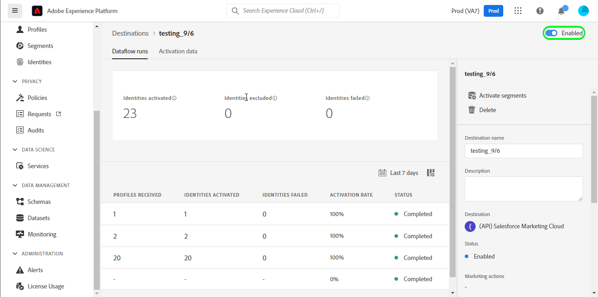
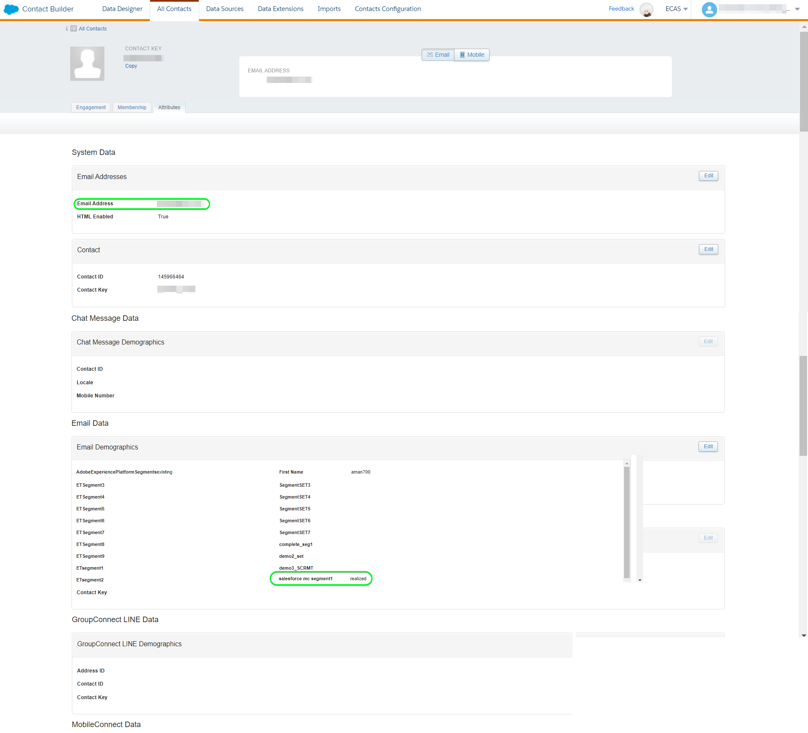

# [!DNL (API) Salesforce Marketing Cloud] conexão

## Visão geral {#overview}

[[!DNL Salesforce Marketing Cloud]](https://www.salesforce.com/products/marketing-cloud/overview/) (anteriormente conhecido como ExactTarget) é um conjunto de marketing digital que permite criar e personalizar jornadas para visitantes e clientes para personalizar sua experiência.

>[!IMPORTANT]
> 
> Observe a diferença entre essa conexão e a outra [Conexão do Marketing Cloud Salesforce](https://experienceleague.adobe.com/docs/experience-platform/destinations/catalog/email-marketing/salesforce-marketing-cloud.html?lang=en) que existe na seção Catálogo de marketing de email . A outra conexão do Salesforce Marketing Cloud permite exportar arquivos para um local de armazenamento especificado, enquanto essa é uma conexão de transmissão baseada em API.

Essa [!DNL Adobe Experience Platform] [destino](/help/destinations/home.md) utiliza o [API REST de Contatos de Atualização do Salesforce](https://developer.salesforce.com/docs/marketing/marketing-cloud/guide/updateContacts.html), que permite adicionar contatos/atualizar dados de contato para as necessidades de sua empresa depois de ativá-los em um novo segmento do Salesforce.

O Salesforce Marketing Cloud usa o OAuth 2 com credenciais do cliente como o mecanismo de autenticação para se comunicar com a API REST do Salesforce. As instruções para autenticar na instância do Salesforce estão mais abaixo, na [Autenticar para destino](#authenticate) seção.

## Casos de uso {#use-cases}

Para ajudá-lo a entender melhor como e quando usar o destino do Marketing Cloud Salesforce, veja um exemplo de caso de uso que os clientes do Adobe Experience Platform podem resolver usando esse destino.

### Enviar emails para contatos para campanhas de marketing {#use-case-send-emails}

O departamento de vendas de uma plataforma de aluguel da casa deseja transmitir um email de marketing para um público-alvo de cliente. A equipe de marketing da plataforma pode adicionar novos contatos/atualizar contatos existentes *(e seus endereços de email)* por meio do Adobe Experience Platform, crie segmentos a partir de seus próprios dados offline e envie esses segmentos para o Salesforce Marketing Cloud, que pode ser usado para enviar o email da campanha de marketing.

## Pré-requisitos {#prerequisites}

### Pré-requisitos no Experience Platform {#prerequisites-in-experience-platform}

Antes de ativar os dados no destino do Marketing Cloud do Salesforce, você deve ter uma [schema](/help/xdm/schema/composition.md), a [conjunto de dados](https://experienceleague.adobe.com/docs/platform-learn/tutorials/data-ingestion/create-datasets-and-ingest-data.html?lang=en)e [segmentos](https://experienceleague.adobe.com/docs/platform-learn/tutorials/segments/create-segments.html?lang=en) criado em [!DNL Experience Platform].

### Pré-requisitos no Salesforce CRM {#prerequisites-destination}

Observe os seguintes pré-requisitos no Salesforce para exportar dados do Platform para sua conta do Marketing Cloud do Salesforce:

#### Você precisa ter uma conta do Salesforce {#prerequisites-account}

Ir para o Salesforce [avaliação](https://www.salesforce.com/in/form/signup/freetrial-sales/) para registrar e criar uma conta do Salesforce, se você ainda não tiver uma.

#### Criar campo personalizado no Salesforce {#prerequisites-custom-field}

Criar o atributo personalizado do tipo `Text Area Long` qual Experience Platform será usada para atualizar o status do segmento no Marketing Cloud do Salesforce.

Consulte a documentação do Marketing Cloud do Salesforce para [criar campos personalizados](https://help.salesforce.com/s/articleView?id=mc_cab_create_an_attribute.htm&amp;type=5&amp;language=en_US) se precisar de orientação adicional.

>[!IMPORTANT]
>
> Crie o atributo personalizado sob o conjunto de atributos &quot;Email Demográfico&quot; na conta do Marketing Cloud do Salesforce.

>[!NOTE]
>
> * O número de atributos personalizados permitidos por objeto varia de acordo com seu Salesforce Edition. Consulte a documentação do Salesforce para [campos personalizados permitidos por objeto](https://help.salesforce.com/s/articleView?id=sf.custom_field_allocations.htm&amp;type=5) se precisar de orientação adicional.
> * Se você atingiu esse limite no Salesforce, será necessário remover o atributo personalizado do Salesforce que foi usado para armazenar o status do segmento em relação aos segmentos mais antigos no Experience Platform, antes que um novo mappingId possa ser usado.

Consulte a documentação da Adobe Experience Platform para [Grupo de campos Detalhes da associação ao segmento](/help/xdm/field-groups/profile/segmentation.md) se você precisar de orientação sobre os status do segmento.

#### Obter credenciais do Salesforce {#gather-credentials}

Anote os itens abaixo antes de autenticar para o destino do Marketing Cloud do Salesforce.

| Credencial | Descrição | Exemplo |
| --- | --- | --- |
| <ul><li>Prefixo do Marketing Cloud Salesforce</li></ul> | Consulte [Prefixo de domínio do Marketing Cloud do Salesforce](https://help.salesforce.com/s/articleView?id=sf.domain_name_setting_login_policy.htm&amp;type=5) para obter orientações adicionais. | <ul><li>Se o seu domínio for como abaixo, você precisará do valor destacado.  <i>`mcq4jrssqdlyc4lph19nnqgzzs84`.login.exacttarget.com</i></li></ul> |
| <ul><li>ID do cliente</li><li>Segredo do cliente</li></ul> | Consulte a [Documentação do Salesforce](https://developer.salesforce.com/docs/marketing/marketing-cloud/guide/access-token-s2s.html) se precisar de orientação adicional. | <ul><li>r23kxxxxxxxx0z05xxxxxx</li><li>ipxxxxxxxxxxxT4xxxxxxxxxxx</li></ul> |

## Identidades suportadas {#supported-identities}

O Marketing Cloud Salesforce oferece suporte à ativação de identidades descritas na tabela abaixo. Saiba mais sobre [identidades](/help/identity-service/namespaces.md).

| Identidade do Target | Descrição | Considerações |
|---|---|---|
| contactKey | Chave de contato do Salesforce. Consulte a [Documentação do Salesforce](https://help.salesforce.com/s/articleView?id=sf.mc_cab_contact_builder_best_practices.htm&amp;type=5) se precisar de orientação adicional. | Obrigatório |

## Tipo e frequência de exportação {#export-type-frequency}

Consulte a tabela abaixo para obter informações sobre o tipo e a frequência da exportação de destino.

| Item | Tipo | Notas |
---------|----------|---------|
| Tipo de exportação | **[!UICONTROL Baseado em perfil]** | Você está exportando todos os membros de um segmento, junto com os campos de esquema desejados (por exemplo: endereço de email, número de telefone, sobrenome), conforme escolhido na tela selecionar atributos de perfil do [fluxo de trabalho de ativação de destino](/help/destinations/ui/activate-batch-profile-destinations.md#select-attributes). |
| Frequência de exportação | **[!UICONTROL Streaming]** | Os destinos de transmissão são conexões &quot;sempre ativas&quot; baseadas em API. Assim que um perfil é atualizado no Experience Platform com base na avaliação do segmento, o conector envia a atualização downstream para a plataforma de destino. Leia mais sobre [destinos de transmissão](/help/destinations/destination-types.md#streaming-destinations). |

{style=&quot;table-layout:auto&quot;}

## Conecte-se ao destino {#connect}

>[!IMPORTANT]
> 
>Para se conectar ao destino, é necessário **[!UICONTROL Gerenciar destinos]** [permissão de controle de acesso](/help/access-control/home.md#permissions). Leia o [visão geral do controle de acesso](/help/access-control/ui/overview.md) ou entre em contato com o administrador do produto para obter as permissões necessárias.

Para se conectar a esse destino, siga as etapas descritas na [tutorial de configuração de destino](../../ui/connect-destination.md). No workflow para configurar destino , preencha os campos listados nas duas seções abaixo.

### Autenticar para destino {#authenticate}

Para autenticar para o destino, preencha os campos obrigatórios e selecione **[!UICONTROL Ligar ao destino]**.

* **[!UICONTROL Subdomínio]**: Seu prefixo de domínio do Marketing Cloud do Salesforce. Por exemplo, se o domínio for *`mcq4jrssqdlyc4lph19nnqgzzs84`.login.exacttarget.com*, você precisa do valor destacado.
* **[!UICONTROL ID do cliente]**: Sua ID de cliente do Salesforce.
* **[!UICONTROL Segredo do cliente]**: Seu Segredo Do Cliente Salesforce.

Se os detalhes fornecidos forem válidos, a interface do usuário exibirá uma **Conectado** com uma marca de seleção verde, você pode prosseguir para a próxima etapa.

### Preencha os detalhes do destino {#destination-details}

Para configurar detalhes para o destino, preencha os campos obrigatórios e opcionais abaixo. Um asterisco ao lado de um campo na interface do usuário indica que o campo é obrigatório.

* **[!UICONTROL Nome]**: Um nome pelo qual você reconhecerá esse destino no futuro.
* **[!UICONTROL Descrição]**: Uma descrição que ajudará a identificar esse destino no futuro.
* **[!UICONTROL Nome do cliente]**: Pode ser qualquer valor, no entanto, um valor é obrigatório. Caso contrário, a ativação de destino falhará.

### Ativar alertas {#enable-alerts}

Você pode habilitar alertas para receber notificações sobre o status do fluxo de dados para seu destino. Selecione um alerta na lista para assinar e receber notificações sobre o status do seu fluxo de dados. Para obter mais informações sobre alertas, consulte o guia sobre [inscrever-se em alertas de destinos usando a interface do usuário](../../ui/alerts.md).

Quando terminar de fornecer detalhes para a conexão de destino, selecione **[!UICONTROL Próximo]**.

## Ativar segmentos para este destino {#activate}

>[!IMPORTANT]
> 
>Para ativar os dados, é necessário **[!UICONTROL Gerenciar destinos]**, **[!UICONTROL Ativar destinos]**, **[!UICONTROL Exibir perfis]** e **[!UICONTROL Exibir segmentos]** [permissões de controle de acesso](/help/access-control/home.md#permissions). Leia o [visão geral do controle de acesso](/help/access-control/ui/overview.md) ou entre em contato com o administrador do produto para obter as permissões necessárias.

Ler [Ativar perfis e segmentos para destinos de exportação de segmentos de fluxo](/help/destinations/ui/activate-segment-streaming-destinations.md) para obter instruções sobre como ativar segmentos de público-alvo para este destino.

### Considerações e exemplo de mapeamento {#mapping-considerations-example}

Para enviar corretamente os dados do público-alvo do Adobe Experience Platform para o destino do Marketing Cloud do Salesforce, você precisa passar pela etapa de mapeamento de campo . O mapeamento consiste em criar um link entre os campos do esquema do Modelo de dados de experiência (XDM) na conta da plataforma e os equivalentes correspondentes do destino. Para mapear corretamente os campos XDM para os campos de destino do Marketing Cloud do Salesforce, siga estas etapas:

A lista de mapeamentos de atributos que podem ser configurados para a variável [API REST do Salesforce](https://developer.salesforce.com/docs/atlas.en-us.api_rest.meta/api_rest/dome_composite_upsert_example.htm?q=contacts) é fornecida abaixo. O destino usa o [API REST de Definições do Conjunto de Atributos de Pesquisa do Salesforce](https://developer.salesforce.com/docs/marketing/marketing-cloud/guide/retrieveAttributeSetDefinitions.html) para recuperar atributos definidos no Salesforce para seus contatos e específicos de sua conta.

>[!IMPORTANT]
> 
> Embora seus nomes de atributos sejam de acordo com sua conta Salesforce, os mapeamentos de `contactKey` e `personalEmail.address` são obrigatórias.

1. Na etapa Mapeamento , clique em **[!UICONTROL Adicionar novo mapeamento]**, você verá uma nova linha de mapeamento na tela.
   

1. Na janela selecionar campo de origem, ao selecionar o campo de origem, escolha a variável **[!UICONTROL Selecionar atributos]** e adicione os mapeamentos desejados.
   

1. Na janela selecionar campo de destino, selecione o campo de destino e escolha o **[!UICONTROL Selecionar namespace de identidade]** e adicione os mapeamentos desejados.
   

1. Para mapear qualquer atributo personalizado, selecione a janela de campo de destino, selecione o campo de destino e escolha o **[!UICONTROL Selecionar atributos]** > **Demografia de email** categoria . Em seguida, forneça o nome do atributo de meta desejado e adicione os mapeamentos desejados.
   

1. Por exemplo, você pode adicionar o seguinte mapeamento entre o esquema de perfil XDM e o [!DNL Salesforce Marketing Cloud] instância:

   |  | Esquema de perfil do XDM | [!DNL Salesforce Marketing Cloud] Instância | Obrigatório |
   |---|---|---|---|
   | Atributos | <ul><li>person.name.firstName</code></li><li>personalEmail.address</code></li></ul> | <ul><li>Email DemograpGraphics.First Name</code></li><li>Endereço de email.Endereço de email</code></li></ul> | <ul><li>-</li><li>Sim</code></li></ul> |
   | Identidades | <ul><li>contactKey</code></li></ul> | <ul><li>salesforceContactKey</code></li></ul> | Sim |

1. Um exemplo de uso desses mapeamentos é mostrado abaixo:
   

### Programar exportação de segmento e exemplo {#schedule-segment-export-example}

Ao executar o [Agendar exportação de segmentos](/help/destinations/ui/activate-segment-streaming-destinations.md#scheduling) etapa você deve mapear manualmente os segmentos da Platform para o atributo personalizado no Salesforce.

Para fazer isso, selecione cada segmento e insira o atributo personalizado correspondente no Salesforce na **[!UICONTROL ID de mapeamento]** campo.

>[!IMPORTANT]
>
> O valor usado para a ID de mapeamento deve corresponder exatamente ao nome do atributo personalizado criado no Salesforce no conjunto de atributos &quot;Email DemograpGraphics&quot;.

Um exemplo é mostrado abaixo:

## Validar exportação de dados {#exported-data}

Para validar se você configurou o destino corretamente, siga as etapas abaixo:

1. Selecionar **[!UICONTROL Destinos]** > **[!UICONTROL Procurar]** para navegar até a lista de destinos.

   

1. Selecione o destino e valide se o status é **[!UICONTROL ativado]**.

   

1. Alterne para **[!DNL Activation data]** e selecione um nome de segmento.

   

1. Monitore o resumo do segmento e garanta que a contagem de perfis corresponda à contagem criada no segmento.

   

1. Faça logon no site do Marketing Cloud do Salesforce. Em seguida, navegue até o **[!DNL Audience Builder]** > **[!DNL Contact Builder]** > **[!DNL All contacts]** > **[!DNL Email]** e verificar se os perfis do segmento foram adicionados.

   

1. Para verificar se algum perfil foi atualizado, navegue até o **[!DNL Email]** verifique se os valores do atributo do perfil do segmento foram atualizados.

   

## Uso e governança de dados {#data-usage-governance}

Todos [!DNL Adobe Experience Platform] Os destinos são compatíveis com as políticas de uso de dados ao manipular os dados. Para obter informações detalhadas sobre como [!DNL Adobe Experience Platform] aplica o controle de dados, consulte [Visão geral da governança de dados](/help/data-governance/home.md).

## Erros e solução de problemas {#errors-and-troubleshooting}

### Erros desconhecidos encontrados ao enviar eventos para o Marketing Cloud Salesforce {#unknown-errors}

Ao verificar uma execução de fluxo de dados, se você vir a mensagem de erro abaixo, verifique se a ID de mapeamento fornecida em [!DNL Salesforce CRM] para seu segmento da Platform é válido e existe em [!DNL Salesforce CRM].

## Recursos adicionais {#additional-resources}

* [Portal do desenvolvedor do Salesforce](https://developer.salesforce.com/)

### Limites {#limits}

* Salesforce impõe certas [limites de taxa](https://developer.salesforce.com/docs/marketing/marketing-cloud/guide/rate-limiting.html).
* Consulte a [erros de limites de taxa](https://developer.salesforce.com/docs/marketing/marketing-cloud/guide/rate-limiting-errors.html) para verificar os erros que você pode encontrar.
* Consulte a [Preços de Envolvimento do Marketing Cloud Salesforce](https://www.salesforce.com/editions-pricing/marketing-cloud/email/) página para *Baixe o Gráfico de Comparação da Edição Completa* como um pdf que detalha os limites impostos pelo seu plano.
* O [Visão geral da API](https://developer.salesforce.com/docs/marketing/marketing-cloud/guide/apis-overview.html) a página detalha os limites adicionais.
* Está disponível um item da Base de dados de conhecimento que recolhe estes detalhes [here](https://salesforce.stackexchange.com/questions/205898/marketing-cloud-api-limits#:~:text=Day%2FHour%2FMinute%20Limit&amp;text=We%20recommend%20a%20limit%20of,per%20minute%20for%20SOAP%20calls.&amp;text=As%20has%20been%20added%20in, interagindo%20com%20the%20REST%2DAPI).

