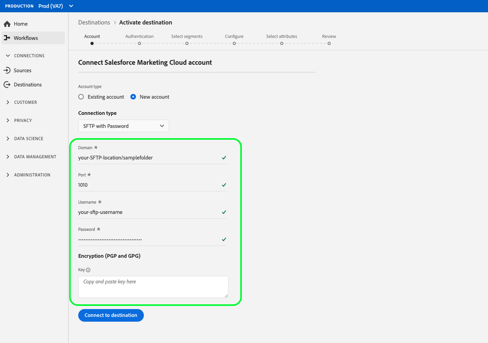
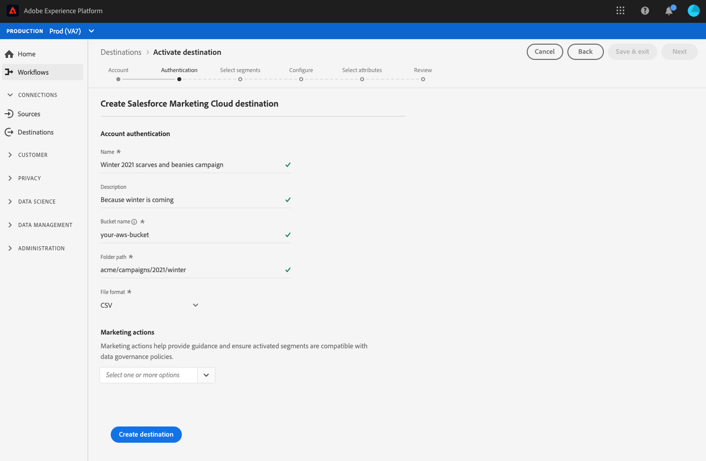

# [!DNL Salesforce Marketing Cloud] conexão

[[!DNL Salesforce Marketing Cloud]](https://www.salesforce.com/products/marketing-cloud/email-marketing/) é um conjunto de marketing digital conhecido anteriormente como ExactTarget que permite criar e personalizar jornadas para visitantes e clientes para personalizar sua experiência.

Para enviar dados de segmento para [!DNL Salesforce Marketing Cloud], primeiro [conecte o destino](#connect-destination) na Plataforma e, em seguida, [configure uma importação de dados](#import-data-into-salesforce) do local do seu armazenamento para [!DNL Salesforce Marketing Cloud].

## Tipo de exportação {#export-type}

**Baseado**  em perfis - você está exportando todos os membros de um segmento, juntamente com os campos de schema desejados (por exemplo: endereço de email, número de telefone, sobrenome), conforme escolhido na tela de atributos selecionados do fluxo de trabalho [ da ativação de ](../../ui/activate-destinations.md#select-attributes)destino.

## Destino do Connect {#connect-destination}

Em **[!UICONTROL Conexões]** > **[!UICONTROL Destinos]**, selecione [!DNL Salesforce Marketing Cloud] e **[!UICONTROL Ligar destino]**.

Na etapa **[!UICONTROL Autenticação]**, se você tiver configurado anteriormente uma conexão com o destino do armazenamento na nuvem, selecione **[!UICONTROL Conta existente]** e selecione uma de suas conexões existentes. Ou você pode selecionar **[!UICONTROL Nova conta]** para configurar uma nova conexão. Preencha as credenciais de autenticação da sua conta e selecione **[!UICONTROL Ligar ao destino]**. Para [!DNL Salesforce Marketing Cloud], você pode selecionar entre **[!UICONTROL SFTP com Password]** e **[!UICONTROL SFTP com chave SSH]**. Preencha as informações abaixo, dependendo do tipo de conexão, e selecione **[!UICONTROL Conecte-se ao destino]**.

Para conexões **[!UICONTROL SFTP com Password]**, você deve fornecer Domínio, Porta, Nome de usuário e Senha.

Para conexões **[!UICONTROL SFTP com chave SSH]**, você deve fornecer Domínio, Porta, Nome de usuário e Chave SSH.

Na etapa **[!UICONTROL Setup]**, preencha as informações relevantes para seu destino, conforme mostrado abaixo:
- **[!UICONTROL Nome]**: Escolha um nome relevante para o seu destino.
- **[!UICONTROL Descrição]**: Insira uma descrição para o seu destino.
- **[!UICONTROL Caminho]** da pasta: Forneça o caminho no local do armazenamento onde a Plataforma depositará seus dados de exportação como CSV ou arquivos delimitados por tabulação.
- **[!UICONTROL Formato]** de arquivo:  **** CSV ou  **[!UICONTROL TAB_DELIMITED]**. Selecione o formato de arquivo a ser exportado para o local do armazenamento.

Clique em **[!UICONTROL Criar destino]** depois de preencher os campos acima. Seu destino agora está conectado e você pode [ativar segmentos](../../ui/activate-destinations.md) no destino.

## Ativar segmentos {#activate-segments}

Consulte [Ativar perfis e segmentos em um destino](../../ui/activate-destinations.md) para obter informações sobre o fluxo de trabalho da ativação de segmentos.

## Atributos de destino {#destination-attributes}

Quando [ativar segmentos](../../ui/activate-destinations.md) no destino [!DNL Salesforce Marketing Cloud], recomendamos que você selecione um identificador exclusivo do seu [schema de união](../../../profile/home.md#profile-fragments-and-union-schemas). Selecione o identificador exclusivo e quaisquer outros campos XDM que você deseja exportar para o destino. Para obter mais informações, consulte [Selecione quais campos de schema usar como atributos de destino em seus arquivos exportados](./overview.md#destination-attributes) em Destinos de marketing de email.

## Dados exportados {#exported-data}

Para destinos [!DNL Salesforce Marketing Cloud], a plataforma cria um arquivo `.txt` ou `.csv` delimitado por tabulação no local do armazenamento fornecido. Para obter mais informações sobre os arquivos, consulte [Destinos de e-mail Marketing e destinos do armazenamento Cloud](../../ui/activate-destinations.md#esp-and-cloud-storage) no tutorial de ativação de segmentos.

## Configurar importação de dados para [!DNL Salesforce Marketing Cloud] {#import-data-into-salesforce}

Depois de conectar a Plataforma ao seu [!DNL Amazon S3] ou armazenamento SFTP, você deve configurar a importação de dados do local do armazenamento para [!DNL Salesforce Marketing Cloud]. Para saber como fazer isso, consulte [Importando assinantes para o Marketing Cloud a partir de um Arquivo](https://help.salesforce.com/articleView?id=mc_es_import_subscribers_from_file.htm&amp;type=5) no [!DNL Salesforce Help Center].