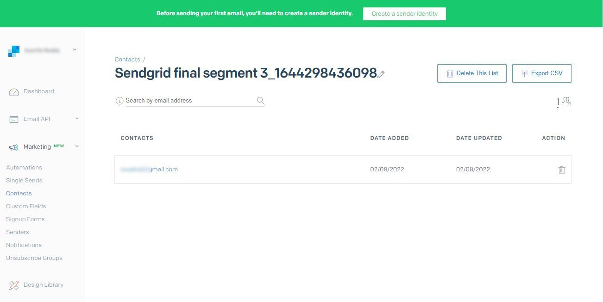

# [!DNL SendGrid] conexão

## Visão geral {#overview}

[SendGrid](https://www.sendgrid.com) O é uma plataforma de comunicação do cliente popular para emails transacionais e de marketing.

Essa [!DNL Adobe Experience Platform] [destino](/help/destinations/home.md) utiliza o [[!DNL SendGrid Marketing Contacts API]](https://api.sendgrid.com/v3/marketing/contacts), que permite exportar seus perfis de email primários e ativá-los em um novo segmento SendGrid para suas necessidades comerciais.

SendGrid usa tokens do portador da API como um mecanismo de autenticação para se comunicar com a API SendGrid .

## Pré-requisitos {#prerequisites}

Os itens a seguir são necessários antes de começar a configurar o destino.

1. Você precisa ter uma conta SendGrid .
   * Ir para o SendGrid [assinatura](https://signup.sendgrid.com/) para registrar e criar uma conta SendGrid, se você ainda não tiver uma.
1. Depois de fazer logon no portal SendGrid, você também precisa gerar um token de API.
1. Navegue até o site SendGrid e acesse o **[!DNL Settings]** > **[!DNL API Keys]** página. Como alternativa, consulte o [Documentação do SendGrid](https://app.sendgrid.com/settings/api_keys) para acessar a seção apropriada no aplicativo SendGrid.
1. Finalmente, selecione o **[!DNL Create API Key]** botão.
   * Consulte a [Documentação do SendGrid](https://docs.sendgrid.com/ui/account-and-settings/api-keys#creating-an-api-key), se precisar de orientação sobre quais ações executar.
   * Se você deseja gerar programaticamente sua chave de API, consulte o [Documentação do SendGrid](https://docs.sendgrid.com/api-reference/api-keys/create-api-keys).

Antes de ativar os dados no destino SendGrid, você deve ter uma [schema](https://experienceleague.adobe.com/docs/experience-platform/xdm/schema/composition.html?lang=pt-BR), a [conjunto de dados](https://experienceleague.adobe.com/docs/platform-learn/tutorials/data-ingestion/create-datasets-and-ingest-data.html?lang=en)e [segmentos](https://experienceleague.adobe.com/docs/platform-learn/tutorials/segments/create-segments.html?lang=en) criado em [!DNL Experience Platform]. Consulte também a [limites](#limits) mais abaixo nesta página.

>[!IMPORTANT]
>
>* A API SendGrid usada para criar a lista de endereçamento a partir de perfis de email requer que endereços de email exclusivos sejam fornecidos em cada perfil. Isso é independentemente de ser usado como um valor para *email* ou *email alternativo*. Como a conexão SendGrid suporta mapeamentos para e-mails e valores de e-mail alternativos, certifique-se de que todos os endereços de e-mail usados sejam exclusivos em cada perfil do *Conjunto de dados*. Caso contrário, quando os perfis de email são enviados para SendGrid, isso resultará em um erro e o perfil de email não estará presente na exportação de dados.
>
>* No momento, não há nenhuma funcionalidade em vigor para remover perfis do SendGrid quando eles são removidos dos segmentos no Experience Platform.

## Identidades suportadas {#supported-identities}

O SendGrid suporta a ativação de identidades descritas na tabela abaixo. Saiba mais sobre [identidades](/help/identity-service/namespaces.md).

| Identidade do Target | Descrição | Considerações |
|---|---|---|
| email | Endereço de email | Observe que tanto o texto simples quanto os endereços de email com hash SHA256 são suportados pela [!DNL Adobe Experience Platform]. Se o campo de origem da Experience Platform contiver atributos sem hash, verifique o **[!UICONTROL Aplicar transformação]** , para ter [!DNL Platform] fazer o hash automático dos dados na ativação.   Observe que **SendGrid** não suporta endereços de email com hash, portanto, somente dados de texto sem transformação são enviados para o destino. |

{style=&quot;table-layout:auto&quot;}

## Tipo e frequência de exportação {#export-type-frequency}

Consulte a tabela abaixo para obter informações sobre o tipo e a frequência da exportação de destino.

| Item | Tipo | Notas |
---------|----------|---------|
| Tipo de exportação | **[!UICONTROL Baseado em perfil]** | Você está exportando todos os membros de um segmento, junto com os campos de esquema desejados (por exemplo: endereço de email, número de telefone, sobrenome), conforme escolhido na tela selecionar atributos de perfil do [fluxo de trabalho de ativação de destino](/help/destinations/ui/activate-batch-profile-destinations.md#select-attributes). |
| Frequência de exportação | **[!UICONTROL Streaming]** | Os destinos de transmissão são conexões &quot;sempre ativas&quot; baseadas em API. Assim que um perfil é atualizado no Experience Platform com base na avaliação do segmento, o conector envia a atualização downstream para a plataforma de destino. Leia mais sobre [destinos de transmissão](/help/destinations/destination-types.md#streaming-destinations). |

{style=&quot;table-layout:auto&quot;}

## Casos de uso {#use-cases}

Para ajudá-lo a entender melhor como e quando você deve usar o destino SendGrid , veja a seguir exemplos de casos de uso que [!DNL Experience Platform] Os clientes do podem resolver usando esse destino.

### Criar uma lista de marketing para várias atividades de marketing

As equipes de marketing que usam SendGrid podem criar uma lista de endereçamento dentro do SendGrid e preenchê-la com endereços de email. A lista de endereçamento agora criada no SendGrid pode ser usada subsequentemente para várias atividades de marketing.

## Ligar ao destino {#connect}

>[!IMPORTANT]
> 
>Para se conectar ao destino, é necessário **[!UICONTROL Gerenciar destinos]** [permissão de controle de acesso](/help/access-control/home.md#permissions). Leia o [visão geral do controle de acesso](/help/access-control/ui/overview.md) ou entre em contato com o administrador do produto para obter as permissões necessárias.

Para se conectar a esse destino, siga as etapas descritas na [tutorial de configuração de destino](../../ui/connect-destination.md). No workflow para configurar destino , preencha os campos listados nas duas seções abaixo.

### Autenticar para destino {#authenticate}

1. No [!DNL Adobe Experience Platform] , navegue até **Destinos**.

1. Selecione o **Catálogo** e pesquisar por *SendGrid*. Em seguida, selecione **Configurar**. Depois de estabelecer uma conexão com o destino, o rótulo da interface do usuário muda para **Ativar segmentos**.
   

1. É mostrado um assistente para ajudá-lo a configurar o destino SendGrid. Crie o novo destino selecionando **Configurar novo destino**.
   

1. Selecione o **Nova conta** e preencha o **Token do portador** valor. Este valor é o SendGrid *Chave da API* mencionados anteriormente no [seção pré-requisitos](#prerequisites).
   

1. Selecionar **Ligar ao destino**. Se o SendGrid *Chave da API* se tiver fornecido que é válida, a interface do usuário exibirá uma **Conectado** com uma marca de seleção verde, você pode prosseguir para a próxima etapa para preencher campos de informações adicionais.

### Preencha os detalhes do destino {#destination-details}

Ao [configuração](https://experienceleague.adobe.com/docs/experience-platform/destinations/ui/connect-destination.html?lang=en) nesse destino, você deve fornecer as seguintes informações:

* **[!UICONTROL Nome]**: O nome pelo qual você reconhecerá este destino no futuro.
* **[!UICONTROL Descrição]**: Uma descrição opcional que ajudará a identificar esse destino no futuro.

### Ativar alertas {#enable-alerts}

Você pode habilitar alertas para receber notificações sobre o status do fluxo de dados para seu destino. Selecione um alerta na lista para assinar e receber notificações sobre o status do seu fluxo de dados. Para obter mais informações sobre alertas, consulte o guia sobre [inscrever-se em alertas de destinos usando a interface do usuário](../../ui/alerts.md).

Quando terminar de fornecer detalhes para a conexão de destino, selecione **[!UICONTROL Próximo]**.

## Ativar segmentos para este destino {#activate}

>[!IMPORTANT]
> 
>Para ativar os dados, é necessário **[!UICONTROL Gerenciar destinos]**, **[!UICONTROL Ativar destinos]**, **[!UICONTROL Exibir perfis]** e **[!UICONTROL Exibir segmentos]** [permissões de controle de acesso](/help/access-control/home.md#permissions). Leia o [visão geral do controle de acesso](/help/access-control/ui/overview.md) ou entre em contato com o administrador do produto para obter as permissões necessárias.

Ler [Ativar perfis e segmentos para destinos de exportação de segmentos de fluxo](/help/destinations/ui/activate-segment-streaming-destinations.md) para obter instruções sobre como ativar segmentos de público-alvo para este destino.

Consulte as imagens abaixo para obter detalhes específicos deste destino.

1. Selecione um ou mais segmentos para exportar para SendGrid.
   

1. No **[!UICONTROL Mapeamento]** após selecionar **[!UICONTROL Adicionar novo mapeamento]**, é exibida a página de mapeamento para mapear os campos XDM de origem para os campos de destino da API SendGrid. As imagens abaixo demonstram como mapear namespaces de identidade entre o Experience Platform e o SendGrid. Certifique-se de que **[!UICONTROL Campo de origem]** *Email* deve ser mapeado para a variável **[!UICONTROL Campo de destino]** *external_id* conforme mostrado abaixo.
   

   
   
   

1. Da mesma forma, mapeie a [!DNL Adobe Experience Platform] atributos que você deseja exportar para o destino SendGrid.
   

   

1. Após concluir os mapeamentos, selecione **[!UICONTROL Próximo]** para avançar para a tela de revisão.
   

1. Selecionar **[!UICONTROL Concluir]** para concluir a configuração.
   

A lista abrangente de mapeamentos de atributos suportados que podem ser configurados para o [Contatos de Marketing SendGrid > Adicionar ou Atualizar API de Contato](https://docs.sendgrid.com/api-reference/contacts/add-or-update-a-contact) está abaixo.

| Campo de origem | Campo de destino | Tipo | Descrição | Limites |
|---|---|---|---|---|
| xdm:  homeAddress.street1 | xdm:  address_line_1 | String | A primeira linha do endereço. | Extensão Máx.:  100 caracteres |
| xdm:  homeAddress.street2 | xdm:  address_line_2 | String | Uma segunda linha opcional para o endereço . | Extensão Máx.:  100 caracteres |
| xdm:  _extconndev.alternative_emails | xdm:  alternative_emails | Matriz de string | Emails adicionais associados ao contato. | <ul><li>Máx.: 5 itens</li><li>Mín: 0 itens</li></ul> |
| xdm:  homeAddress.city | xdm:  cidade | String | A cidade do contato. | Extensão Máx.:  60 caracteres |
| xdm:  homeAddress.country | xdm:  country | String | O país do contato. Pode ser um nome completo ou uma abreviação. | Extensão Máx.:  50 caracteres |
| identityMap:  Email | Identidade:  external_id | String | O email principal do contato. Isso deve ser um email válido. | Extensão Máx.:  254 caracteres |
| xdm:  person.name.firstName | xdm:  first_name | String | O nome do contato | Extensão Máx.:  50 caracteres |
| xdm:  person.name.lastName | xdm:  last_name | String | Nome familiar do contato | Extensão Máx.:  50 caracteres |
| xdm:  homeAddress.postalCode | xdm:  CEP | String | O CEP do contato ou outro código postal. |  |
| xdm:  homeAddress.stateProvintion | xdm:  state_província_region | String | O estado, província ou região do contato. | Extensão Máx.:  50 caracteres |

## Validar a exportação de dados no SendGrid {#validate}

Para validar se você configurou o destino corretamente, siga as etapas abaixo:

1. Selecionar **[!UICONTROL Destinos]** > **[!UICONTROL Procurar]** para navegar até a lista de destinos.
   

1. Selecione o destino e valide se o status é **[!UICONTROL ativado]**.
   

1. Alterne para **[!DNL Activation data]** e selecione um nome de segmento.
   

1. Monitore o resumo do segmento e verifique se a contagem de perfis corresponde à contagem criada no conjunto de dados.
   

1. O [Listas de marketing SendGrid > Criar API de Lista](https://docs.sendgrid.com/api-reference/lists/create-list) é usada para criar listas de contatos exclusivas dentro do SendGrid ao unir o valor da variável *list_name* e o carimbo de data e hora da exportação de dados. Navegue até o site SendGrid e verifique se a nova lista de contatos que está em conformidade com o padrão de nome foi criada.
   

   

1. Selecione a lista de contatos recém-criada e verifique se o novo registro de email do conjunto de dados criado está sendo preenchido na nova lista de contatos.

1. Além disso, verifique também alguns emails para validar se o mapeamento de campo está correto.
   

   

## Uso e governança de dados {#data-usage-governance}

Todos [!DNL Adobe Experience Platform] Os destinos são compatíveis com as políticas de uso de dados ao manipular os dados. Para obter informações detalhadas sobre como [!DNL Adobe Experience Platform] aplica o controle de dados, consulte [Visão geral da governança de dados](/help/data-governance/home.md).

## Recursos adicionais {#additional-resources}

Esse destino SendGrid aproveita as APIs abaixo:
* [Listas de marketing SendGrid > Criar API de Lista](https://docs.sendgrid.com/api-reference/lists/create-list)
* [Contatos de Marketing SendGrid > Adicionar ou Atualizar API de Contato](https://docs.sendgrid.com/api-reference/contacts/add-or-update-a-contact)

### Limites {#limits}

* O [Contatos de Marketing SendGrid > Adicionar ou Atualizar API de Contato](https://api.sendgrid.com/v3/marketing/contacts) pode aceitar 30.000 contatos ou 6 MB de dados, o que for menor.
