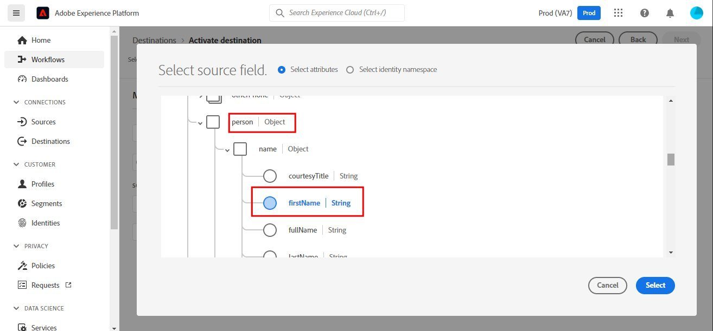

# [!DNL SendGrid] conexão

## Visão geral {#overview}

O [SendGrid](https://www.sendgrid.com) é uma plataforma de comunicação com o cliente popular para emails transacionais e de marketing.

Este [!DNL Adobe Experience Platform] [destino](/help/destinations/home.md) aproveita o [[!DNL SendGrid Marketing Contacts API]](https://api.sendgrid.com/v3/marketing/contacts), que permite exportar seus perfis de email primários e ativá-los em um novo público do SendGrid para as suas necessidades comerciais.

O SendGrid usa tokens de portador de API como um mecanismo de autenticação para se comunicar com a API SendGrid.

## Pré-requisitos {#prerequisites}

Os itens a seguir são necessários antes de você começar a configurar o destino.

1. Você precisa ter uma conta SendGrid.
   * Vá para a página [inscrição](https://signup.sendgrid.com/) do SendGrid para se registrar e criar uma conta do SendGrid, caso ainda não tenha uma.
1. Depois de fazer logon no portal SendGrid, também é necessário gerar um token de API.
1. Navegue até o site SendGrid e acesse a página **[!DNL Settings]** > **[!DNL API Keys]**. Como alternativa, consulte a [documentação do SendGrid](https://app.sendgrid.com/settings/api_keys) para acessar a seção apropriada no aplicativo SendGrid.
1. Finalmente, selecione o botão **[!DNL Create API Key]**.
   * Consulte a [documentação do SendGrid](https://docs.sendgrid.com/ui/account-and-settings/api-keys#creating-an-api-key), se precisar de orientação sobre quais ações executar.
   * Se você quiser gerar programaticamente sua Chave de API, consulte a [documentação do SendGrid](https://docs.sendgrid.com/api-reference/api-keys/create-api-keys).

Antes de ativar dados para o destino SendGrid, você deve ter um [esquema](https://experienceleague.adobe.com/docs/experience-platform/xdm/schema/composition.html?lang=pt-BR), um [conjunto de dados](https://experienceleague.adobe.com/docs/platform-learn/tutorials/data-ingestion/create-datasets-and-ingest-data.html?lang=pt-BR) e [segmentos](https://experienceleague.adobe.com/docs/platform-learn/tutorials/segments/create-segments.html?lang=pt-BR) criados em [!DNL Experience Platform]. Consulte também a seção [limites](#limits) mais abaixo nesta página.

>[!IMPORTANT]
>
>* A API SendGrid usada para criar a lista de endereçamento a partir de perfis de email requer que endereços de email exclusivos sejam fornecidos em cada perfil. Isso é diferente se for usado como um valor para *email* ou *email alternativo*. Como a conexão SendGrid dá suporte a mapeamentos para valores de email e de email alternativo, verifique se todos os endereços de email usados devem ser exclusivos em cada perfil do *Conjunto de Dados*. Caso contrário, quando os perfis de email forem enviados para o SendGrid, isso resultará em um erro e esse perfil de email não estará presente na exportação de dados.
>
>* Atualmente, não há nenhuma funcionalidade em vigor para remover perfis do SendGrid quando eles são removidos dos públicos-alvo no Experience Platform.

## Identidades suportadas {#supported-identities}

O SendGrid é compatível com a ativação das identidades descritas na tabela abaixo. Saiba mais sobre [identidades](/help/identity-service/features/namespaces.md).

| Identidade de destino | Descrição | Considerações |
|---|---|---|
| email | Endereço de email | Observe que [!DNL Adobe Experience Platform] oferece suporte para endereços de email com hash SHA256 e texto sem formatação. Se o campo de origem da Experience Platform contiver atributos com hash, marque a opção **[!UICONTROL Apply transformation]** para que [!DNL Experience Platform] coloque os dados em hash automaticamente durante a ativação.   Observe que **SendGrid** não oferece suporte a endereços de email com hash; portanto, somente dados de texto sem formatação são enviados para o destino. |

{style="table-layout:auto"}

## Tipo e frequência de exportação {#export-type-frequency}

Consulte a tabela abaixo para obter informações sobre o tipo e a frequência da exportação de destino.

| Item | Tipo | Notas |
|---------|----------|---------|
| Tipo de exportação | **[!UICONTROL Profile-based]** | Você está exportando todos os membros de um segmento, juntamente com os campos de esquema desejados (por exemplo: endereço de email, número de telefone, sobrenome), conforme escolhido na tela selecionar atributos de perfil do [fluxo de trabalho de ativação de destino](/help/destinations/ui/activate-batch-profile-destinations.md#select-attributes). |
| Frequência de exportação | **[!UICONTROL Streaming]** | Os destinos de transmissão são conexões baseadas em API &quot;sempre ativas&quot;. Assim que um perfil for atualizado no Experience Platform com base na avaliação do público-alvo, o conector enviará a atualização downstream para a plataforma de destino. Leia mais sobre [destinos de streaming](/help/destinations/destination-types.md#streaming-destinations). |

{style="table-layout:auto"}

## Casos de uso {#use-cases}

Para ajudá-lo a entender melhor como e quando você deve usar o destino SendGrid, veja a seguir exemplos de casos de uso que [!DNL Experience Platform] clientes podem resolver usando esse destino.

### Criar uma lista de marketing para várias atividades de marketing

As equipes de marketing que usam o SendGrid podem criar uma lista de endereçamento dentro do SendGrid e preenchê-la com endereços de email. A lista de endereçamento agora criada no SendGrid pode ser usada posteriormente para várias atividades de marketing.

## Conectar ao destino {#connect}

>[!IMPORTANT]
> 
>Para se conectar ao destino, você precisa das **[!UICONTROL View Destinations]** e **[!UICONTROL Manage Destinations]** [permissões de controle de acesso](/help/access-control/home.md#permissions). Leia a [visão geral do controle de acesso](/help/access-control/ui/overview.md) ou contate o administrador do produto para obter as permissões necessárias.

Para se conectar a este destino, siga as etapas descritas no [tutorial de configuração de destino](../../ui/connect-destination.md). No workflow de configuração de destino, preencha os campos listados nas duas seções abaixo.

### Autenticar para o destino {#authenticate}

1. No console [!DNL Adobe Experience Platform], navegue até **Destinos**.

1. Selecione a guia **Catálogo** e procure por *SendGrid*. Em seguida, selecione **Configurar**. Depois de estabelecer uma conexão com o destino, o rótulo da interface é alterado para **Ativar segmentos**.
   

1. Você verá um assistente que o auxiliará na configuração do destino do SendGrid. Crie o novo destino selecionando **Configurar novo destino**.
   

1. Selecione a opção **Nova conta** e preencha o valor **Token do portador**. Este valor é a *Chave de API* do SendGrid mencionada anteriormente na [seção de pré-requisitos](#prerequisites).
   

1. Selecione **Conectar ao destino**. Se a *Chave de API* do SendGrid fornecida for válida, a interface do usuário exibirá um status **Conectado** com uma marca de seleção verde, você poderá prosseguir para a próxima etapa para preencher campos de informações adicionais.

### Preencher detalhes do destino {#destination-details}

Ao [configurar](https://experienceleague.adobe.com/docs/experience-platform/destinations/ui/connect-destination.html?lang=pt-BR) este destino, você deve fornecer as seguintes informações:

* **[!UICONTROL Name]**: O nome pelo qual você reconhecerá este destino no futuro.
* **[!UICONTROL Description]**: uma descrição opcional que ajudará você a identificar este destino no futuro.

### Ativar alertas {#enable-alerts}

Você pode ativar os alertas para receber notificações sobre o status do fluxo de dados para o seu destino. Selecione um alerta na lista para assinar e receber notificações sobre o status do seu fluxo de dados. Para obter mais informações sobre alertas, consulte o manual sobre [assinatura de alertas de destinos usando a interface](../../ui/alerts.md).

Quando terminar de fornecer detalhes da conexão de destino, selecione **[!UICONTROL Next]**.

## Ativar públicos-alvo para esse destino {#activate}

>[!IMPORTANT]
> 
>* Para ativar dados, você precisa das **[!UICONTROL View Destinations]**, **[!UICONTROL Activate Destinations]**, **[!UICONTROL View Profiles]** e **[!UICONTROL View Segments]** [permissões de controle de acesso](/help/access-control/home.md#permissions). Leia a [visão geral do controle de acesso](/help/access-control/ui/overview.md) ou contate o administrador do produto para obter as permissões necessárias.
>* Para exportar *identidades*, você precisa da **[!UICONTROL View Identity Graph]** [permissão de controle de acesso](/help/access-control/home.md#permissions).   {width="100" zoomable="yes"}

Leia [Ativar perfis e públicos-alvo para destinos de exportação de público-alvo de streaming](/help/destinations/ui/activate-segment-streaming-destinations.md) para obter instruções sobre como ativar públicos-alvo para este destino.

Consulte as imagens abaixo para obter detalhes específicos desse destino.

1. Selecione um ou mais públicos-alvo para exportar para SendGrid.
   

1. Na etapa **[!UICONTROL Mapping]**, após selecionar **[!UICONTROL Add new mapping]**, você verá a página de mapeamento para mapear os campos XDM de origem para os campos de destino da API SendGrid. As imagens abaixo demonstram como mapear namespaces de identidade entre o Experience Platform e o SendGrid. Certifique-se de que o **[!UICONTROL Source field]** *Email* deve ser mapeado para a **[!UICONTROL Target field]** *external_id* conforme mostrado abaixo.
   
   
   
   

1. Da mesma forma, mapeie os [!DNL Adobe Experience Platform] atributos desejados que você deseja exportar para o destino do SendGrid.
   
   

1. Após concluir os mapeamentos, selecione **[!UICONTROL Next]** para avançar para a tela de revisão.
   

1. Selecione **[!UICONTROL Finish]** para concluir a instalação.
   

A lista abrangente de mapeamentos de atributos suportados que podem ser configurados para a [API de Contatos de Marketing do SendGrid > Adicionar ou Atualizar Contato](https://docs.sendgrid.com/api-reference/contacts/add-or-update-a-contact) está abaixo.

| Campo de origem | Campo de público alvo | Tipo | Descrição | Limites |
|---|---|---|---|---|
| xdm:  homeAddress.street1 | xdm:  address_line_1 | String | A primeira linha do endereço. | Comprimento Máximo:  100 caracteres |
| xdm:  homeAddress.street2 | xdm:  address_line_2 | String | Uma segunda linha opcional para o endereço. | Comprimento Máximo:  100 caracteres |
| xdm:  _extconndev.alternate_emails | xdm:  alternate_emails | Matriz de string | Emails adicionais associados ao contato. | <ul><li>Máximo: 5 itens</li><li>Mín: 0 itens</li></ul> |
| xdm:  homeAddress.city | xdm:  city | String | A cidade do contato. | Comprimento Máximo:   60 caracteres |
| xdm:  homeAddress.country | xdm:   país | String | O país do contato. Pode ser um nome completo ou uma abreviação. | Comprimento Máximo:   50 caracteres |
| identityMap:  Email | Identidade:  external_id | String | O email principal do contato. Este email precisa ser válido. | Comprimento Máximo:  254 caracteres |
| xdm:  person.name.firstName | xdm:  first_name | String | O nome do contato | Comprimento Máximo:   50 caracteres |
| xdm:  person.name.lastName | xdm:  last_name | String | O nome da família do contato | Comprimento Máximo:   50 caracteres |
| xdm:  homeAddress.postalCode | xdm:  postal_code | String | O CEP ou outro código postal do contato. | |
| xdm:  homeAddress.stateProvince | xdm:  state_Province_region | String | O estado, província ou região do contato. | Comprimento Máximo:   50 caracteres |

## Validar a exportação de dados no SendGrid {#validate}

Para validar se você configurou o destino corretamente, siga as etapas abaixo:

1. Selecione **[!UICONTROL Destinations]** > **[!UICONTROL Browse]** para navegar até a lista de destinos.
   

1. Selecione o destino e valide se o status é **[!UICONTROL enabled]**.
   

1. Alterne para a guia **[!DNL Activation data]** e selecione um nome de público-alvo.
   

1. Monitore o resumo do público-alvo e verifique se a contagem de perfis corresponde à contagem criada no conjunto de dados.
   

1. A [Lista de Marketing do SendGrid > Criar API de Lista](https://docs.sendgrid.com/api-reference/lists/create-list) é usada para criar listas de contatos exclusivas dentro do SendGrid unindo o valor do atributo *list_name* e o carimbo de data/hora da exportação de dados. Navegue até o site SendGrid e verifique se a nova lista de contatos em conformidade com o padrão de nome foi criada.
   
   

1. Selecione a lista de contatos recém-criada e verifique se o novo registro de email do conjunto de dados criado está sendo preenchido na nova lista de contatos.

1. Além disso, verifique alguns emails para validar se o mapeamento de campo está correto.
   
   

## Uso e governança de dados {#data-usage-governance}

Todos os destinos do [!DNL Adobe Experience Platform] são compatíveis com as políticas de uso de dados ao manipular seus dados. Para obter informações detalhadas sobre como o [!DNL Adobe Experience Platform] impõe a governança de dados, consulte a [visão geral da Governança de Dados](/help/data-governance/home.md).

## Recursos adicionais {#additional-resources}

Esse destino do SendGrid aproveita as APIs abaixo:

* [Listas de marketing SendGrid > Criar API de lista](https://docs.sendgrid.com/api-reference/lists/create-list)
* [Contatos de Marketing do SendGrid > Adicionar ou Atualizar API de Contato](https://docs.sendgrid.com/api-reference/contacts/add-or-update-a-contact)

### Limites {#limits}

* Os [Contatos de Marketing do SendGrid > Adicionar ou Atualizar API de Contato](https://api.sendgrid.com/v3/marketing/contacts) podem aceitar 30.000 contatos ou 6 MB de dados, o que for menor.
