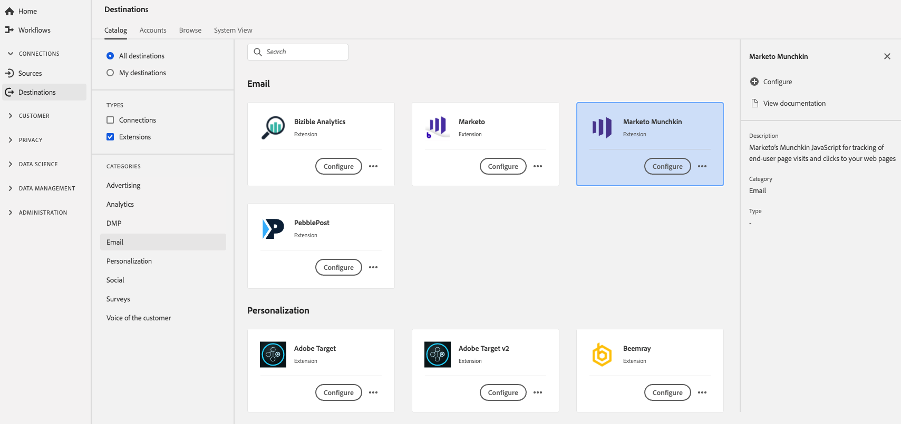

# [!DNL Marketo Munchkin] extensão {#marketo-munchkin-extension}

## Visão geral {#overview}

Do gerenciamento de clientes potenciais ao marketing baseado em contas, [!DNL Marketo Engagement Platform] simplifica a maneira como você planeja, organiza e mede o envolvimento com o cliente e os clientes potenciais em cada estágio de sua experiência.

O JavaScript [!DNL Marketo’s Munchkin][!DNL Marketo] permite rastrear as visitas da página do usuário final e os cliques nas páginas de aterrissagem do e páginas da Web externas.

[!DNL Marketo Munchkin] é uma extensão de email no Adobe Experience Platform. Para obter mais informações sobre o Marketo Munchkin, leia [Rastreamento de lead](https://developers.marketo.com/javascript-api/lead-tracking/) na documentação do Marketo.

Esse destino é uma extensão de tag. Para obter mais informações sobre como as extensões de tag funcionam na Platform, consulte a [visão geral das extensões de tag](../launch-extensions/overview.md).

## Pré-requisitos {#prerequisites}

Essa extensão está disponível no catálogo [!DNL Destinations] para todos os clientes que compraram a Platform.

Para usar essa extensão, você precisa acessar tags no Adobe Experience Platform. Tags são oferecidas aos clientes da Adobe Experience Cloud como um recurso incluso com valor agregado. Entre em contato com o administrador da organização para obter acesso às tags e solicitar que ele conceda a permissão **[!UICONTROL manage_properties]** para que você possa instalar extensões. e solicite que conceda a permissão **[!UICONTROL manage_properties]** para que você possa instalar extensões.

## Instalar extensão {#install-extension}

Para instalar a extensão [!DNL Marketo Munchkin]:

Na [Interface da plataforma](http://platform.adobe.com/), vá para **[!UICONTROL Destinos]** > **[!UICONTROL Catálogo]**.

Selecione a extensão do catálogo ou use a barra de pesquisa.

Clique no destino para realçá-lo e selecione **[!UICONTROL Configurar]** no painel direito. Se o controle **[!UICONTROL Configurar]** estiver esmaecido, você não terá a permissão **[!UICONTROL manage_properties]**. Consulte [Pré-requisitos](#prerequisites).

Selecione a propriedade na qual deseja instalar a extensão. Você também tem a opção de criar uma nova propriedade. Uma propriedade é uma coleção de regras, elementos de dados, extensões configuradas, ambientes e bibliotecas. Saiba mais sobre as propriedades na seção [Propriedades da página](../../../tags/ui/administration/companies-and-properties.md#properties-page) de na documentação de tags.

O fluxo de trabalho o orienta pelas etapas para concluir a instalação.

Você também pode instalar a extensão diretamente na [Interface do usuário da coleta de dados](https://experience.adobe.com/#/data-collection/). Para obter mais informações, consulte a seção sobre [adicionar uma nova extensão](../../../tags/ui/managing-resources/extensions/overview.md#add-a-new-extension) na documentação das tags.

## Como usar a extensão {#how-to-use}

Depois de instalar a extensão, você pode iniciar a configuração das regras.

Você pode configurar regras para suas extensões instaladas para enviar dados de evento para o destino da extensão somente em determinadas situações. Para obter mais informações sobre como configurar regras para suas extensões, consulte a [documentação de tags](../../../tags/ui/managing-resources/rules.md).

## Configurar, atualizar e excluir extensão {#configure-upgrade-delete}

É possível configurar, atualizar e excluir extensões na interface do usuário da Coleta de dados.

>[!TIP]
>
>Se a extensão já estiver instalada em uma de suas propriedades, a interface do usuário da plataforma ainda exibirá **[!UICONTROL Instalar]** para a extensão. Desative o fluxo de trabalho de instalação conforme descrito em [Instalar extensão](#install-extension) para configurar ou excluir sua extensão.

Para atualizar sua extensão, consulte o guia no [processo de atualização da extensão](../../../tags/ui/managing-resources/extensions/extension-upgrade.md) na documentação das tags.
