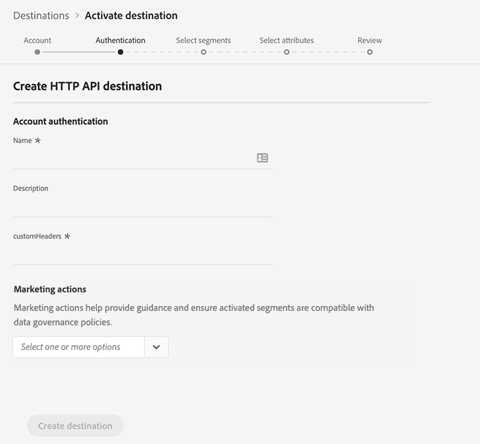

# (Alfa) [!DNL HTTP] conexão

>[!IMPORTANT]
>
>O destino [!DNL HTTP] na Plataforma está atualmente em alfa. A documentação e a funcionalidade estão sujeitas a alterações.

## Visão geral {#overview}

O destino [!DNL HTTP] é um [!DNL Adobe Experience Platform] destino de transmissão que ajuda a enviar dados de perfil para pontos de extremidade [!DNL HTTP] de terceiros.

Para enviar dados de perfil para [!DNL HTTP] endpoints, primeiro você deve se conectar ao destino em [[!DNL Adobe Experience Platform]](#connect-destination).

## Casos de uso {#use-cases}

O destino [!DNL HTTP] é direcionado para clientes que precisam exportar dados de perfil XDM e segmentos de público-alvo para endpoints genéricos [!DNL HTTP].

[!DNL HTTP] os endpoints podem ser sistemas próprios do cliente ou soluções de terceiros.

## Conecte-se ao Destino {#connect-destination}

Em **[!UICONTROL Connections]** > **[!UICONTROL Destinations]**, selecione [!DNL HTTP API] e selecione **[!UICONTROL Configure]**.


Se uma conexão com esse destino já existir, você poderá ver um botão **[!UICONTROL Activate]** no cartão de destino. Para obter mais informações sobre a diferença entre **[!UICONTROL Activate]** e **[!UICONTROL Configure]**, consulte a seção [Catálogo](../ui/destinations-workspace.md#catalog) da documentação do espaço de trabalho de destino.


Na etapa [!UICONTROL Account], é necessário definir os detalhes da conexão do ponto de extremidade HTTP. Selecione **[!UICONTROL New account]** e insira os detalhes da conexão do ponto de extremidade HTTP ao qual você deseja se conectar.
- **[!UICONTROL httpEndpoint]**: a conclusão  [!DNL URL] do ponto de extremidade HTTP para o qual você deseja enviar os dados do perfil.
   - Opcionalmente, é possível adicionar parâmetros de consulta ao [!UICONTROL httpEndpoint] [!DNL URL].
- **[!UICONTROL authEndpoint]**: a conclusão  [!DNL URL] do endpoint HTTP usado para  [!DNL OAuth2] autenticação.
- **[!UICONTROL Client ID]**: o  [!DNL clientID] parâmetro usado nas credenciais do  [!DNL OAuth2] cliente.
- **[!UICONTROL Client Secret]**: o  [!DNL clientSecret] parâmetro usado nas credenciais do  [!DNL OAuth2] cliente.

>[!NOTE]
>
>No momento, há suporte somente para [!DNL OAuth2] credenciais de cliente.


Clique em **[!UICONTROL Connect to destination]**. Depois que a conexão for bem-sucedida, clique em **[!UICONTROL Next]**.

Na etapa [!UICONTROL Authentication], insira as credenciais de autenticação da conta:
- **[!UICONTROL Name]**: insira um nome pelo qual você reconhecerá esse destino no futuro.
- **[!UICONTROL Description]**: insira uma descrição que ajudará a identificar esse destino no futuro.
- **[!UICONTROL Custom Headers]**: insira quaisquer cabeçalhos personalizados que você deseja incluir nas chamadas de destino, seguindo este formato:  `header1:value1,header2:value2,...headerN:valueN`.
- **[!UICONTROL Marketing actions]**: As ações de marketing indicam a intenção para a qual os dados serão exportados para o destino. Você pode selecionar ações de marketing definidas pelo Adobe ou criar sua própria ação de marketing. Para obter mais informações sobre ações de marketing, consulte a página [Governança de dados no Adobe Experience Platform](/help/data-governance/policies/overview.md) . Para obter informações sobre as ações de marketing individuais definidas pelo Adobe, consulte a [Visão geral das políticas de uso de dados](/help/data-governance/policies/overview.md).

>[!IMPORTANT]
>
>A implementação atual requer pelo menos um cabeçalho personalizado. Essa limitação será resolvida em uma atualização futura.



**[!UICONTROL Marketing action]**: As ações de marketing indicam a intenção para a qual os dados serão exportados para o destino. Você pode selecionar ações de marketing definidas pelo Adobe ou criar sua própria ação de marketing. Para obter mais informações sobre ações de marketing, consulte a [Visão geral das políticas de uso de dados](../../data-governance/policies/overview.md).

Clique em **[!UICONTROL Create destination]**.

## Ativar segmentos

Consulte [Ativar perfis e segmentos para um destino](../ui/activate-destinations.md#select-attributes) para obter informações sobre o fluxo de trabalho de ativação de segmentos.

## Atributos de destino

Durante a etapa [[!UICONTROL Select attributes]](../ui/activate-destinations.md#select-attributes), ao ativar segmentos](../ui/activate-destinations.md) em um destino [!DNL HTTP], recomendamos que você selecione um identificador exclusivo no [schema de união](../../profile/home.md#profile-fragments-and-union-schemas). [ Selecione o identificador exclusivo e quaisquer outros campos XDM que deseja exportar para o destino.

## Dados exportados {#exported-data}

Seus dados [!DNL Experience Platform] exportados chegam ao seu destino [!DNL HTTP] no formato JSON. Por exemplo, o evento abaixo contém o atributo de perfil de endereço de email de um público que se qualificou para um determinado segmento e saiu de outro. As identidades desse prospecto são [!DNL ECID] e email.

```json
{
  "person": {
    "email": "yourstruly@adobe.con"
  },
  "segmentMembership": {
    "ups": {
      "7841ba61-23c1-4bb3-a495-00d3g5fe1e93": {
        "lastQualificationTime": "2020-05-25T21:24:39Z",
        "status": "exited"
      },
      "59bd2fkd-3c48-4b18-bf56-4f5c5e6967ae": {
        "lastQualificationTime": "2020-05-25T23:37:33Z",
        "status": "existing"
      }
    }
  },
  "identityMap": {
    "ecid": [
      {
        "id": "14575006536349286404619648085736425115"
      },
      {
        "id": "66478888669296734530114754794777368480"
      }
    ],
    "email_lc_sha256": [
      {
        "id": "655332b5fa2aea4498bf7a290cff017cb4"
      },
      {
        "id": "66baf76ef9de8b42df8903f00e0e3dc0b7"
      }
    ]
  }
}
```
