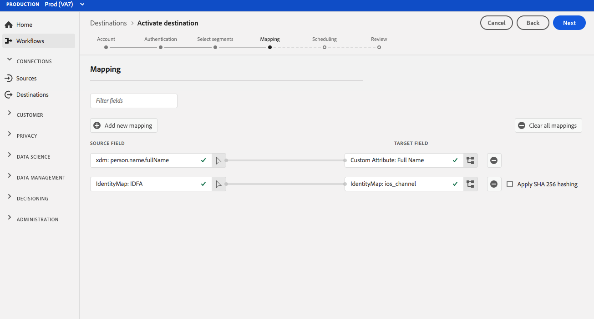

# [!DNL Airship Attributes] conexão {#airship-attributes-destination}

## Visão geral {#overview}

[!DNL Airship] O é a principal plataforma de engajamento do cliente, ajudando você a fornecer mensagens omnicanais significativas e personalizadas para seus usuários em cada estágio do ciclo de vida do cliente.

Essa integração passa os dados de perfil do Adobe para [!DNL Airship] as [Atributos](https://docs.airship.com/guides/audience/attributes/) para direcionamento ou acionamento.

Para saber mais sobre [!DNL Airship], consulte o [Documentos de aeróstato](https://docs.airship.com).

>[!TIP]
>
>Esta página de documentação foi criada pela [!DNL Airship] equipe. Para quaisquer consultas ou pedidos de atualização, contacte-os diretamente em [support.airship.com](https://support.airship.com/).

## Pré-requisitos {#prerequisites}

Antes de enviar segmentos de público-alvo para o [!DNL Airship], você deve:

* Ativar atributos no [!DNL Airship] projeto.
* Gere um token portador para autenticação.

>[!TIP]
>
>Crie um [!DNL Airship] conta via [este link de inscrição](https://go.airship.eu/accounts/register/plan/starter/) se você ainda não tiver.

## Tipo e frequência de exportação {#export-type-frequency}

Consulte a tabela abaixo para obter informações sobre o tipo e a frequência da exportação de destino.

| Item | Tipo | Notas |
---------|----------|---------|
| Tipo de exportação | **[!UICONTROL Baseado em perfil]** | Você está exportando todos os membros de um segmento, junto com os campos de esquema desejados (por exemplo: endereço de email, número de telefone, sobrenome) e/ou identidades, de acordo com o mapeamento de campo. |
| Frequência de exportação | **[!UICONTROL Streaming]** | Os destinos de transmissão são conexões &quot;sempre ativas&quot; baseadas em API. Assim que um perfil é atualizado no Experience Platform com base na avaliação do segmento, o conector envia a atualização downstream para a plataforma de destino. Leia mais sobre [destinos de transmissão](/help/destinations/destination-types.md#streaming-destinations). |

{style=&quot;table-layout:auto&quot;}

## Ativar atributos {#enable-attributes}

Os atributos de perfil do Adobe Experience Platform são semelhantes a [!DNL Airship] e podem ser facilmente mapeados entre si no Platform usando a ferramenta de mapeamento demonstrada mais abaixo nesta página.

[!DNL Airship] Os projetos têm vários atributos predefinidos e padrão. Se você tiver um atributo personalizado, deverá defini-lo em [!DNL Airship] primeiro. Consulte [Configurar e gerenciar atributos](https://docs.airship.com/tutorials/audience/attributes/) para obter detalhes.

## Gerar token portador {#bearer-token}

Ir para **[!UICONTROL Configurações]** &quot; **[!UICONTROL APIs e integrações]** no [Painel de bordo](https://go.airship.com) e selecione **[!UICONTROL Tokens]** no menu à esquerda.

Clique em **[!UICONTROL Criar token]**.

Forneça um nome amigável para o token, por exemplo, &quot;Destino de atributos do Adobe&quot; e selecione &quot;Todo acesso&quot; para a função.

Clique em **[!UICONTROL Criar token]** e guarde os detalhes como confidenciais.

## Casos de uso {#use-cases}

Para ajudá-lo a entender melhor como e quando você deve usar a variável [!DNL Airship Attributes] destino, aqui estão casos de uso de exemplo que os clientes do Adobe Experience Platform podem resolver usando esse destino.

### Caso de uso nº 1

Aproveite os dados de perfil coletados no Adobe Experience Platform para personalizar a mensagem e o conteúdo avançado em qualquer uma das [!DNL Airship]Canais do . Por exemplo, aproveite [!DNL Experience Platform] dados de perfil para definir os atributos de localização no [!DNL Airship]. Isso permitirá que uma marca de hotel exiba uma imagem para o local de hotel mais próximo para cada usuário.

### Caso de uso nº 2

Aproveite os atributos do Adobe Experience Platform para enriquecer ainda mais [!DNL Airship] e combine-a com SDK ou [!DNL Airship] dados preditivos. Por exemplo, um varejista pode criar um segmento com status de fidelidade e dados de localização (atributos da plataforma) e [!DNL Airship] Previu gerar dados para enviar mensagens altamente direcionadas aos usuários no status de fidelidade gold que viviam em Las Vegas, NV, e tem uma alta probabilidade de rotatividade.

## Conecte-se ao destino {#connect}

Consulte [Ativar os dados do público-alvo para os destinos de exportação do segmento de fluxo](../../ui/activate-segment-streaming-destinations.md) para obter instruções sobre como ativar segmentos de público-alvo para este destino.

### Parâmetros de conexão {#parameters}

Ao [configuração](../../ui/connect-destination.md) nesse destino, você deve fornecer as seguintes informações:

* **[!UICONTROL Token de portador]**: o token portador gerado pelo [!DNL Airship] painel.
* **[!UICONTROL Nome]**: insira um nome que ajudará a identificar esse destino.
* **[!UICONTROL Descrição]**: insira uma descrição para este destino.
* **[!UICONTROL Domínio]**: selecione um data center dos EUA ou da UE, dependendo de qual [!DNL Airship] o data center se aplica a esse destino.

## Ativar segmentos para este destino {#activate}

Consulte [Ativar os dados do público-alvo para os destinos de exportação do segmento de fluxo](../../ui/activate-segment-streaming-destinations.md) para obter instruções sobre como ativar segmentos de público-alvo para este destino.

## Considerações de mapeamento {#mapping-considerations}

[!DNL Airship] os atributos podem ser definidos em um canal, que representa a instância do dispositivo, por exemplo, o iPhone ou um usuário nomeado, que mapeia todos os dispositivos de um usuário para um identificador comum, como uma ID do cliente. Se você tiver endereços de email de texto simples (sem hash) como identidade primária no esquema, selecione o campo de email em seu **[!UICONTROL Atributos de origem]** e mapear para [!DNL Airship] usuário nomeado na coluna direita em **[!UICONTROL Identidades do Target]**, conforme mostrado abaixo.

Para identificadores que devem ser mapeados para um canal, ou seja, um dispositivo, mapeie para o canal apropriado com base na fonte. As imagens a seguir mostram como dois mapeamentos são criados:

* ID de publicidade da iOS do IDFA para um [!DNL Airship] Canal iOS
* Adobe `fullName` para [!DNL Airship] Atributo &quot;Nome completo&quot;

>[!NOTE]
>
>Use o nome amigável que aparece na variável [!DNL Airship] painel ao selecionar o campo de destino para o mapeamento do atributo.

**Mapear identidade**

Selecionar campo de origem:

Selecione o campo de destino:

**Atributo do mapa**

Selecione o atributo de origem:

Selecione o atributo de meta:

Verificar mapeamento:

## Uso e governança de dados {#data-usage-governance}

Todos [!DNL Adobe Experience Platform] Os destinos são compatíveis com as políticas de uso de dados ao manipular os dados. Para obter informações detalhadas sobre como [!DNL Adobe Experience Platform] aplica o controle de dados, consulte [Visão geral da governança de dados](../../../data-governance/home.md).
