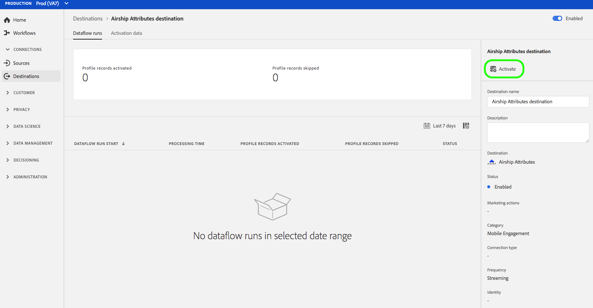

# (Beta) [!DNL Airship Attributes] destino {#airship-attributes-destination}

>[!IMPORTANT]
>
>O [!DNL Airship Attributes] destino no Adobe Experience Platform está atualmente em beta. A documentação e a funcionalidade estão sujeitas a alterações.

## Visão geral {#overview}

[!DNL Airship] é a plataforma líder de envolvimento do cliente, ajudando você a fornecer mensagens de canal significativas e personalizadas para seus usuários em cada estágio do ciclo de vida do cliente.

Essa integração transmite os dados do perfil de Adobe [!DNL Airship] como [Atributos](https://docs.airship.com/guides/audience/attributes/) para definição de metas ou acionamento.

Para saber mais sobre [!DNL Airship], consulte os [Documentos](https://docs.airship.com)do Airship.

>[!TIP]
>
>Esta página de documentação foi criada pela [!DNL Airship] equipe. Para obter informações ou solicitações de atualização, entre em contato diretamente com [support.airship.com](https://support.airship.com/).

## Pré-requisitos {#prerequisites}

Antes de enviar seus segmentos de audiência para [!DNL Airship], você deve:

* Ative atributos no seu [!DNL Airship] projeto.
* Gere um token do portador para autenticação.

>[!TIP]
>
>Crie uma [!DNL Airship] conta por meio [deste link](https://go.airship.eu/accounts/register/plan/starter/) de inscrição, caso ainda não o tenha feito.

### Ativar atributos {#enable-attributes}

Os atributos do perfil Adobe Experience Platform são semelhantes aos [!DNL Airship] atributos e podem ser facilmente mapeados uns para os outros na Plataforma usando a ferramenta de mapeamento mostrada abaixo nesta página.

[!DNL Airship] projetos têm vários atributos predefinidos e padrão. Se você tiver um atributo personalizado, deverá defini-lo [!DNL Airship] primeiro. Consulte [Configurar e gerenciar atributos](https://docs.airship.com/tutorials/audience/attributes/) para obter detalhes.

### Token do portador {#bearer-token}

Vá para **[!UICONTROL Configurações]** &quot; **[!UICONTROL APIs e integrações]** no painel  Airship e selecione **[!UICONTROL Tokens]** no menu esquerdo.

Clique em **[!UICONTROL Criar token]**.

Forneça um nome amigável para o seu token, por exemplo, &quot;Destino de atributos de Adobe&quot; e selecione &quot;Todo acesso&quot; para a função.

Clique em **[!UICONTROL Criar token]** e salve os detalhes como confidenciais.

## Casos de uso {#use-cases}

Para ajudá-lo a entender melhor como e quando você deve usar o [!DNL Airship Attributes] destino, veja a seguir exemplos de casos de uso que os clientes da Adobe Experience Platform podem resolver usando esse destino.

### Caso de uso nº 1

Aproveite os dados do perfil coletados no Adobe Experience Platform para personalização da mensagem e conteúdo avançado em qualquer um dos [!DNL Airship]canais. Por exemplo, aproveite os dados do [!DNL Experience Platform] perfil para definir os atributos de localização dentro [!DNL Airship]. Isso permitirá que uma marca de hotel exiba uma imagem para o local de hotel mais próximo para cada usuário.

### Caso de uso nº 2

Aproveite os atributos da Adobe Experience Platform para enriquecer ainda mais [!DNL Airship] os perfis e combiná-los com SDK ou dados [!DNL Airship] preditivos. Por exemplo, um varejista pode criar um segmento com status de fidelidade e dados de localização (atributos da Plataforma) e [!DNL Airship] prevê gerar dados para enviar mensagens altamente direcionadas aos usuários no status de fidelidade dourada que vivem em Las Vegas, NV, e têm uma alta probabilidade de se movimentar.

## Conectar-se a [!DNL Airship Attributes] {#connect-airship-attributes}

Em **[!UICONTROL Destinos]** > **[!UICONTROL Catálogo]**, navegue até a categoria de envolvimento **[!UICONTROL do]** Mobile. Selecione **[!DNL Airship Attributes]**, em seguida, **[!UICONTROL Configurar]**.

>[!NOTE]
>
>Se já existir uma conexão com esse destino, você poderá ver um botão **[!UICONTROL Ativar]** no cartão de destino. Para obter mais informações sobre a diferença entre **[!UICONTROL Ativar]** e **[!UICONTROL Configurar]**, consulte a seção [Catálogo](../../ui/destinations-workspace.md#catalog) da documentação da área de trabalho de destino.

Na etapa **Conta** , se você já tiver configurado uma conexão com seu [!DNL Airship Attributes] destino, selecione Conta **** existente e selecione sua conexão existente. Ou você pode selecionar **[!UICONTROL Nova conta]** para configurar uma nova conexão com [!DNL Airship Attributes]. Selecione **[!UICONTROL Conectar-se ao destino]** para conectar o Adobe Experience Platform ao seu [!DNL Airship] projeto usando o token do portador que você gerou a partir do [!DNL Airship] painel.

>[!NOTE]
>
>A Adobe Experience Platform oferece suporte à validação de credenciais no processo de autenticação e exibe uma mensagem de erro se você inserir credenciais incorretas em sua [!DNL Airship] conta. Isso garante que você não conclua o fluxo de trabalho com credenciais incorretas.

Depois que suas credenciais forem confirmadas e a Adobe Experience Platform estiver conectada ao seu [!DNL Airship] projeto, você poderá selecionar **[!UICONTROL Avançar]** para prosseguir para a etapa **[!UICONTROL de configuração]** .

Na etapa **[!UICONTROL Autenticação]** , digite um **[!UICONTROL Nome]** e uma **[!UICONTROL Descrição]** para o fluxo de ativação.

Também nesta etapa, você pode selecionar data center dos EUA ou da UE, dependendo de qual data center se aplica a esse destino. [!DNL Airship] Por fim, selecione um ou mais casos de uso de marketing para os quais os dados serão exportados para o destino. Você pode selecionar entre casos de uso de marketing definidos pelo Adobe ou criar os seus próprios. Para obter mais informações sobre casos de uso de marketing, consulte a página [Data Governance em CDP](../../../rtcdp/privacy/data-governance-overview.md#destinations) em tempo real. Para obter informações sobre casos individuais de uso de marketing definidos pelo Adobe, consulte a visão geral [das políticas de uso de](../../../data-governance/policies/overview.md#core-actions)dados.

Selecione **[!UICONTROL Criar destino]** depois de preencher os campos acima.

Seu destino agora é criado. Você pode selecionar **[!UICONTROL Salvar e sair]** se quiser ativar segmentos posteriormente ou selecionar **[!UICONTROL Próximo]** para continuar o fluxo de trabalho e selecionar segmentos para ativar. Em ambos os casos, consulte a próxima seção, [Ativar segmentos](#activate-segments), para o restante do fluxo de trabalho.

## Ativar segmentos {#activate-segments}

Para ativar segmentos para [!DNL Airship Attributes], siga as etapas abaixo:

Em **[!UICONTROL Destinos > Procurar]**, selecione o [!DNL Airship Attributes] destino onde deseja ativar seus segmentos.

Clique no nome do destino. Isso leva você ao fluxo Ativar.

Observe que se já existir um fluxo de ativação para um destino, você poderá ver os segmentos que estão sendo enviados para o destino. Selecione **[!UICONTROL Editar ativação]** no painel direito e siga as etapas abaixo para modificar os detalhes da ativação.

Selecione **[!UICONTROL Ativar]**. No fluxo de trabalho **[!UICONTROL Ativar destino]** , na página **[!UICONTROL Selecionar segmentos]** , selecione para quais segmentos enviar [!DNL Airship Attributes].

Na etapa **[!UICONTROL Mapeamento]** , selecione quais atributos e identidades do schema [XDM](../../../xdm/home.md) serão mapeados para o schema de destino. Selecione **[!UICONTROL Adicionar novo mapeamento]** para navegar pelo schema e mapeá-lo para a identidade do público alvo correspondente.

[!DNL Airship] os atributos podem ser definidos em um canal, que representa a instância do dispositivo, por exemplo, iPhone, ou um usuário nomeado, que mapeia todos os dispositivos de um usuário para um identificador comum, como uma ID do cliente. Se você tiver endereços de email de texto simples (sem hash) como identidade primária em seu schema, selecione o campo de email em seus Atributos **[!UICONTROL de]** origem e mapeie para o usuário [!DNL Airship] nomeado na coluna direita em Identidades **[!UICONTROL de]** Público alvo, como mostrado abaixo.

Para identificadores que devem ser mapeados para um canal, ou seja, um dispositivo, mapeie para o canal apropriado com base na fonte. As imagens a seguir mostram como dois mapeamentos são criados:

* ID de anúncio do iOS IDFA para um canal [!DNL Airship] iOS
* Atributo Adobe `fullName` ao atributo [!DNL Airship] &quot;Nome completo&quot;

>[!NOTE]
>
>Use o nome amigável que aparece no [!DNL Airship] painel ao selecionar o campo público alvo para o mapeamento do atributo.

**Identidade do mapa**

Selecionar campo de origem:

Selecione o campo público alvo:

**Atributo do mapa**

Selecionar atributo de origem:

Selecione o atributo do público alvo:

Verificar mapeamento:

Na página Agendamento **[!UICONTROL do]** segmento, o agendamento está desativado no momento. Clique em **[!UICONTROL Avançar]** para continuar com a etapa de revisão.

Na página **[!UICONTROL Revisar]** , você pode ver um resumo de sua seleção. Selecione **[!UICONTROL Cancelar]** para quebrar o fluxo, **[!UICONTROL Voltar]** para modificar suas configurações ou **[!UICONTROL Concluir]** para confirmar sua seleção e start enviando dados para o destino.

>[!IMPORTANT]
>
>Nesta etapa, a Adobe Experience Platform verifica violações da política de uso de dados. Abaixo está um exemplo de violação de uma política. Não é possível concluir o fluxo de trabalho da ativação de segmentos até que você tenha resolvido a violação. Para obter informações sobre como resolver violações de política, consulte Aplicação de [política](../../../rtcdp/privacy/data-governance-overview.md#enforcement) na seção de documentação de controle de dados.

Se nenhuma violação de política tiver sido detectada, selecione **[!UICONTROL Concluir]** para confirmar sua seleção e start enviando dados para o destino.

## Uso e governança de dados {#data-usage-governance}

Todos os [!DNL Adobe Experience Platform] destinos são compatíveis com as políticas de uso de dados ao manipular seus dados. Para obter informações detalhadas sobre como [!DNL Adobe Experience Platform] aplicar o controle de dados, consulte [Controle de dados em CDP](../../../rtcdp/privacy/data-governance-overview.md)em tempo real.
