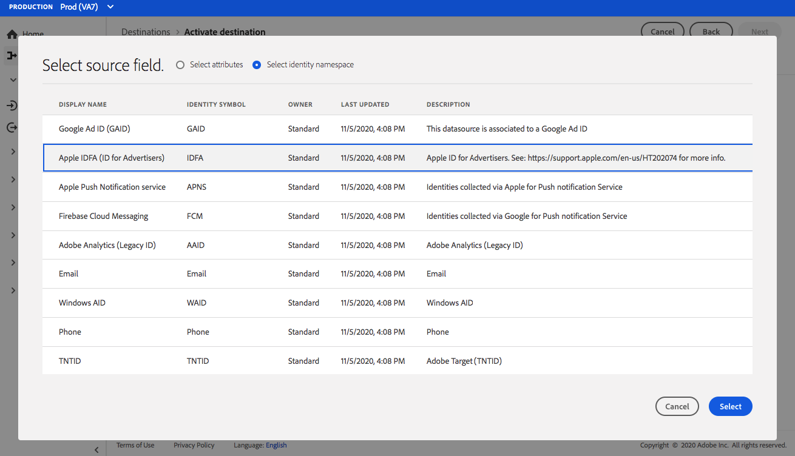

# (Beta) [!DNL Airship Attributes] conexão {#airship-attributes-destination}

>[!IMPORTANT]
>
>O destino [!DNL Airship Attributes] no Adobe Experience Platform está atualmente na versão beta. A documentação e a funcionalidade estão sujeitas a alterações.

## Visão geral {#overview}

[!DNL Airship] O é a principal plataforma de engajamento do cliente, ajudando você a fornecer mensagens omnicanais significativas e personalizadas para seus usuários em cada estágio do ciclo de vida do cliente.

Essa integração transmite os dados do perfil do Adobe para [!DNL Airship] como [Atributos](https://docs.airship.com/guides/audience/attributes/) para direcionamento ou acionamento.

Para saber mais sobre [!DNL Airship], consulte os [Documentos do Airship](https://docs.airship.com).

>[!TIP]
>
>Esta página de documentação foi criada pela equipe [!DNL Airship]. Para quaisquer consultas ou solicitações de atualização, entre em contato diretamente com o [support.airship.com](https://support.airship.com/).

## Pré-requisitos {#prerequisites}

Antes de enviar seus segmentos de público-alvo para [!DNL Airship], você deve:

* Ative os atributos no seu projeto [!DNL Airship].
* Gere um token portador para autenticação.

>[!TIP]
>
>Crie uma conta [!DNL Airship] por meio de [este link de assinatura](https://go.airship.eu/accounts/register/plan/starter/), se ainda não tiver.

## Ativar atributos {#enable-attributes}

Os atributos de perfil do Adobe Experience Platform são semelhantes a [!DNL Airship] atributos e podem ser facilmente mapeados uns para os outros na Plataforma usando a ferramenta de mapeamento demonstrada mais abaixo nesta página.

[!DNL Airship] Os projetos têm vários atributos predefinidos e padrão. Se você tiver um atributo personalizado, deverá defini-lo em [!DNL Airship] primeiro. Consulte [Configurar e gerenciar atributos](https://docs.airship.com/tutorials/audience/attributes/) para obter detalhes.

## Gerar token portador {#bearer-token}

Vá para **[!UICONTROL Settings]**&quot; **[!UICONTROL APIs & Integrations]** no [Painel de bordo](https://go.airship.com) e selecione **[!UICONTROL Tokens]** no menu à esquerda.

Clique em **[!UICONTROL Create Token]**.

Forneça um nome amigável para o token, por exemplo, &quot;Destino de atributos do Adobe&quot; e selecione &quot;Todo acesso&quot; para a função.

Clique em **[!UICONTROL Create Token]** e salve os detalhes como confidenciais.

## Casos de uso {#use-cases}

Para ajudá-lo a entender melhor como e quando você deve usar o destino [!DNL Airship Attributes], aqui estão exemplos de casos de uso que os clientes do Adobe Experience Platform podem resolver usando esse destino.

### Caso de uso nº 1

Aproveite os dados de perfil coletados no Adobe Experience Platform para personalização da mensagem e conteúdo avançado em qualquer canal de [!DNL Airship]. Por exemplo, aproveite os dados do perfil [!DNL Experience Platform] para definir atributos de localização em [!DNL Airship]. Isso permitirá que uma marca de hotel exiba uma imagem para o local de hotel mais próximo para cada usuário.

### Caso de uso nº 2

Aproveite os atributos do Adobe Experience Platform para enriquecer ainda mais os perfis [!DNL Airship] e combiná-los com o SDK ou [!DNL Airship] dados preditivos. Por exemplo, um varejista pode criar um segmento com status de fidelidade e dados de localização (atributos da plataforma) e [!DNL Airship] com previsão de rotatividade de dados para enviar mensagens altamente direcionadas aos usuários no status de fidelidade gold que vivem em Las Vegas, NV, e têm uma alta probabilidade de rotatividade.

## Conectar-se a [!DNL Airship Attributes] {#connect-airship-attributes}

Em **[!UICONTROL Destinations]** > **[!UICONTROL Catalog]**, role até a categoria **[!UICONTROL Mobile Engagement]**. Selecione **[!DNL Airship Attributes]** e selecione **[!UICONTROL Configure]**.

>[!NOTE]
>
>Se uma conexão com esse destino já existir, você poderá ver um botão **[!UICONTROL Activate]** no cartão de destino. Para obter mais informações sobre a diferença entre **[!UICONTROL Activate]** e **[!UICONTROL Configure]**, consulte a seção [Catálogo](../../ui/destinations-workspace.md#catalog) da documentação do espaço de trabalho de destino.

Na etapa **Account**, se você tiver configurado anteriormente uma conexão com seu destino [!DNL Airship Attributes], selecione **[!UICONTROL Existing Account]** e selecione sua conexão existente. Ou você pode selecionar **[!UICONTROL New Account]** para configurar uma nova conexão para [!DNL Airship Attributes]. Selecione **[!UICONTROL Connect to destination]** para conectar o Adobe Experience Platform ao seu projeto [!DNL Airship] usando o token portador gerado pelo painel [!DNL Airship].

>[!NOTE]
>
>A Adobe Experience Platform oferece suporte à validação de credenciais no processo de autenticação e exibe uma mensagem de erro se você inserir credenciais incorretas em sua conta [!DNL Airship]. Isso garante que você não conclua o fluxo de trabalho com credenciais incorretas.

Depois que suas credenciais forem confirmadas e o Adobe Experience Platform estiver conectado ao projeto [!DNL Airship], você poderá selecionar **[!UICONTROL Next]** para prosseguir para a etapa **[!UICONTROL Setup]**.

Na etapa **[!UICONTROL Authentication]** , digite um **[!UICONTROL Name]** e um **[!UICONTROL Description]** para o fluxo de ativação.

Além disso, nesta etapa, é possível selecionar data center dos EUA ou da UE, dependendo de qual data center se aplica a esse destino. [!DNL Airship] Finalmente, selecione um ou mais **[!UICONTROL Marketing Actions]** para os quais os dados serão exportados para o destino. Você pode selecionar ações de marketing definidas pelo Adobe ou criar as suas próprias ações. Para obter mais informações sobre ações de marketing, consulte a [Visão geral das políticas de uso de dados](../../../data-governance/policies/overview.md).

Selecione **[!UICONTROL Create Destination]** depois de preencher os campos acima.

Seu destino foi criado. Você pode selecionar **[!UICONTROL Save & Exit]** se desejar ativar segmentos posteriormente ou selecionar **[!UICONTROL Next]** para continuar o fluxo de trabalho e selecionar segmentos para ativar. Em ambos os casos, consulte a próxima seção, [Ativar segmentos](#activate-segments), para o restante do fluxo de trabalho.

## Ativar segmentos {#activate-segments}

Para ativar segmentos para [!DNL Airship Attributes], siga as etapas abaixo:

Em **[!UICONTROL Destinations > Browse]**, selecione o destino [!DNL Airship Attributes] onde deseja ativar seus segmentos.

Clique no nome do destino. Isso leva você ao fluxo Ativar .

Observe que, se já existir um fluxo de ativação para um destino, você poderá ver os segmentos que estão sendo enviados para o destino no momento. Selecione **[!UICONTROL Edit activation]** no painel direito e siga as etapas abaixo para modificar os detalhes de ativação.

Selecione **[!UICONTROL Activate]**. No workflow **[!UICONTROL Activate destination]**, na página **[!UICONTROL Select Segments]**, selecione quais segmentos enviar para [!DNL Airship Attributes].

Na etapa **[!UICONTROL Mapping]** , selecione quais atributos e identidades do esquema [XDM](../../../xdm/home.md) serão mapeadas para o esquema de destino. Selecione **[!UICONTROL Add new mapping]** para navegar pelo esquema e mapeá-lo para a identidade de destino correspondente.

[!DNL Airship] os atributos podem ser definidos em um canal, que representa a instância do dispositivo, por exemplo, iPhone ou um usuário nomeado, que mapeia todos os dispositivos de um usuário para um identificador comum, como uma ID do cliente. Se você tiver endereços de email de texto simples (sem hash) como identidade primária em seu esquema, selecione o campo de email em seu **[!UICONTROL Source Attributes]** e mapeie para o [!DNL Airship] usuário nomeado na coluna direita em **[!UICONTROL Target Identities]**, conforme mostrado abaixo.

Para identificadores que devem ser mapeados para um canal, ou seja, um dispositivo, mapeie para o canal apropriado com base na fonte. As imagens a seguir mostram como dois mapeamentos são criados:

* ID de publicidade do iOS IDFA para um canal [!DNL Airship] iOS
* Atributo Adobe `fullName` para [!DNL Airship] &quot;Nome Completo&quot;

>[!NOTE]
>
>Use o nome amigável que aparece no painel [!DNL Airship] ao selecionar o campo de destino para o mapeamento de atributo.

**Mapear identidade**

Selecionar campo de origem:

Selecione o campo de destino:

**Atributo do mapa**

Selecione o atributo de origem:

Selecione o atributo de meta:

Verificar mapeamento:

Na página **[!UICONTROL Segment schedule]**, o agendamento está atualmente desativado. Clique em **[!UICONTROL Next]** para continuar com a etapa de revisão.

Na página **[!UICONTROL Review]**, você pode ver um resumo da sua seleção. Selecione **[!UICONTROL Cancel]** para quebrar o fluxo, **[!UICONTROL Back]** para modificar suas configurações ou **[!UICONTROL Finish]** para confirmar sua seleção e começar a enviar dados para o destino.

>[!IMPORTANT]
>
>Nesta etapa, o Adobe Experience Platform verifica violações da política de uso de dados. Veja abaixo um exemplo de violação de uma política. Não é possível concluir o fluxo de trabalho de ativação de segmento até que você tenha resolvido a violação. Para obter informações sobre como resolver violações de política, consulte [Aplicação de política](../../../data-governance/enforcement/auto-enforcement.md) na seção Documentação de governança de dados.

Se nenhuma violação de política tiver sido detectada, selecione **[!UICONTROL Finish]** para confirmar a seleção e iniciar o envio de dados para o destino.

## Uso e governança de dados {#data-usage-governance}

Todos os destinos [!DNL Adobe Experience Platform] são compatíveis com as políticas de uso de dados ao manipular seus dados. Para obter informações detalhadas sobre como [!DNL Adobe Experience Platform] aplica o controle de dados, consulte a [Visão geral da governança de dados](../../../data-governance/home.md).
