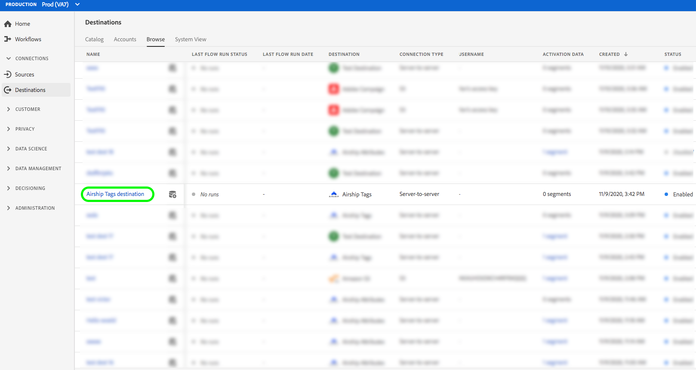

# (Beta) [!DNL Airship Tags] conexão {#airship-tags-destination}

>[!IMPORTANT]
>
>O destino [!DNL Airship Tags] no Adobe Experience Platform está atualmente na versão beta. A documentação e a funcionalidade estão sujeitas a alterações.

## Visão geral

[!DNL Airship] O é a principal plataforma de engajamento do cliente, ajudando você a fornecer mensagens omnicanais significativas e personalizadas para seus usuários em cada estágio do ciclo de vida do cliente.

Essa integração transmite os dados do segmento do Adobe Experience Platform para [!DNL Airship] como [Tags](https://docs.airship.com/guides/audience/tags/) para direcionamento ou acionamento.

Para saber mais sobre [!DNL Airship], consulte os [Documentos do Airship](https://docs.airship.com).

>[!TIP]
>
>Esta página de documentação foi criada pela equipe [!DNL Airship]. Para quaisquer consultas ou solicitações de atualização, entre em contato diretamente com o [support.airship.com](https://support.airship.com/).

## Pré-requisitos

Antes de enviar seus segmentos do Adobe Experience Platform para [!DNL Airship], você deve:

* Crie um grupo de tags no seu projeto [!DNL Airship].
* Gere um token portador para autenticação.

>[!TIP]
> 
>Crie uma conta [!DNL Airship] por meio de [este link de assinatura](https://go.airship.eu/accounts/register/plan/starter/), se ainda não tiver.

## Grupos de tags

O conceito de segmentos na Adobe Experience Platform é semelhante a [Tags](https://docs.airship.com/guides/audience/tags/) no Airship, com pequenas diferenças na implementação. Essa integração mapeia o status da associação de um usuário [em um Experience Platform segment](../../../xdm/field-groups/profile/segmentation.md) para a presença ou não presença de uma tag [!DNL Airship]. Por exemplo, em um segmento da Platform em que `xdm:status` muda para `realized`, a tag é adicionada ao canal [!DNL Airship] ou ao usuário nomeado para o qual esse perfil é mapeado. Se `xdm:status` for alterado para `exited`, a tag será removida.

Para habilitar essa integração, crie um *grupo de tags* em [!DNL Airship] chamado `adobe-segments`.

>[!IMPORTANT]
>
>Ao criar seu novo grupo de tags **Não marque** o botão de opção que diz &quot;[!DNL Allow these tags to be set only from your server]&quot;. Isso fará com que a integração de tags Adobe falhe.

Consulte [Gerenciar grupos de tags](https://docs.airship.com/tutorials/manage-project/messaging/tag-groups) para obter instruções sobre como criar o grupo de tags.

## Gerar token portador

Vá para **[!UICONTROL Settings]**&quot; **[!UICONTROL APIs & Integrations]** no [Painel de bordo](https://go.airship.com) e selecione **[!UICONTROL Tokens]** no menu à esquerda.

Clique em **[!UICONTROL Create Token]**.

Forneça um nome amigável para o token, por exemplo, &quot;Destino de tags de Adobe&quot; e selecione &quot;Todo acesso&quot; para a função.

Clique em **[!UICONTROL Create Token]** e salve os detalhes como confidenciais.

## Casos de uso

Para ajudá-lo a entender melhor como e quando você deve usar o destino [!DNL Airship Tags], aqui estão exemplos de casos de uso que os clientes do Adobe Experience Platform podem resolver usando esse destino.

### Caso de uso nº 1

Varejistas ou plataformas de entretenimento podem criar perfis de usuário em seus clientes de fidelidade e transmitir esses segmentos para [!DNL Airship] para direcionamento de mensagens em campanhas móveis.

### Caso de uso nº 2

Acione mensagens um para um em tempo real quando os usuários caírem em ou saírem de segmentos específicos no Adobe Experience Platform.

Por exemplo, um varejista configura um segmento específico de marca jeans na Platform. Esse varejista agora pode acionar uma mensagem móvel assim que alguém definir sua preferência de jeans para uma marca específica.

## Conectar-se a [!DNL Airship Tags] {#connect-airship-tags}

Em **[!UICONTROL Destinations]** > **[!UICONTROL Catalog]**, role até a categoria **[!UICONTROL Mobile Engagement]**. Selecione **[!DNL Airship Tags]** e selecione **[!UICONTROL Configure]**.

>[!NOTE]
>
>Se uma conexão com esse destino já existir, você poderá ver um botão **[!UICONTROL Activate]** no cartão de destino. Para obter mais informações sobre a diferença entre **[!UICONTROL Activate]** e **[!UICONTROL Configure]**, consulte a seção [Catálogo](../../ui/destinations-workspace.md#catalog) da documentação do espaço de trabalho de destino.

Na etapa **Account**, se você tiver configurado anteriormente uma conexão com seu destino [!DNL Airship Tags], selecione **[!UICONTROL Existing Account]** e selecione sua conexão existente. Ou você pode selecionar **[!UICONTROL New Account]** para configurar uma nova conexão para [!DNL Airship Tags]. Selecione **[!UICONTROL Connect to destination]** para conectar o Adobe Experience Platform ao seu projeto [!DNL Airship] usando o token portador gerado pelo painel [!DNL Airship].

>[!NOTE]
>
>A Adobe Experience Platform oferece suporte à validação de credenciais no processo de autenticação e exibe uma mensagem de erro se você inserir credenciais incorretas em sua conta [!DNL Airship]. Isso garante que você não conclua o fluxo de trabalho com credenciais incorretas.

Depois que suas credenciais forem confirmadas e o Adobe Experience Platform estiver conectado ao projeto [!DNL Airship], você poderá selecionar **[!UICONTROL Next]** para prosseguir para a etapa **[!UICONTROL Setup]**.

Na etapa **[!UICONTROL Authentication]** , digite um **[!UICONTROL Name]** e um **[!UICONTROL Description]** para o fluxo de ativação.

Além disso, nesta etapa, é possível selecionar data center dos EUA ou da UE, dependendo de qual data center se aplica a esse destino. [!DNL Airship] Finalmente, selecione um ou mais **[!UICONTROL Marketing Actions]** para os quais os dados serão exportados para o destino. Você pode selecionar ações de marketing definidas pelo Adobe ou criar as suas próprias ações. Para obter mais informações sobre ações de marketing, consulte a [Visão geral das políticas de uso de dados](../../../data-governance/policies/overview.md).

Selecione **[!UICONTROL Create Destination]** depois de preencher os campos acima.

Seu destino foi criado. Você pode selecionar **[!UICONTROL Save & Exit]** se desejar ativar segmentos posteriormente ou selecionar **[!UICONTROL Next]** para continuar o fluxo de trabalho e selecionar segmentos para ativar. Em ambos os casos, consulte a próxima seção, [Ativar segmentos](#activate-segments), para o restante do fluxo de trabalho.

## Ativar segmentos {#activate-segments}

Para ativar segmentos para [!DNL Airship Tags], siga as etapas abaixo:

Em **[!UICONTROL Destinations > Browse]**, selecione o destino [!DNL Airship Tags] onde deseja ativar seus segmentos.

Clique no nome do destino. Isso leva você ao fluxo Ativar .

Observe que, se já existir um fluxo de ativação para um destino, você poderá ver os segmentos que estão sendo enviados para o destino no momento. Selecione **[!UICONTROL Edit activation]** no painel direito e siga as etapas abaixo para modificar os detalhes de ativação.

Selecione **[!UICONTROL Activate]**. No workflow **[!UICONTROL Activate destination]**, na página **[!UICONTROL Select Segments]**, selecione quais segmentos enviar para [!DNL Airship Tags].

Na etapa **[!UICONTROL Mapping]** , selecione quais atributos e identidades do esquema [XDM](../../../xdm/home.md) serão mapeadas para o esquema de destino. Selecione **[!UICONTROL Add new mapping]** para navegar pelo esquema e mapeá-lo para a identidade de destino correspondente.

[!DNL Airship] As tags podem ser definidas em um canal, que representa a instância do dispositivo, por exemplo, iPhone ou um usuário nomeado, que mapeia todos os dispositivos de um usuário para um identificador comum, como uma ID do cliente. Se você tiver endereços de email de texto simples (sem hash) como identidade primária em seu esquema, selecione o campo de email em seu **[!UICONTROL Source Attributes]** e mapeie para o [!DNL Airship] usuário nomeado na coluna direita em **[!UICONTROL Target Identities]**, conforme mostrado abaixo.

Para identificadores que devem ser mapeados para um canal, ou seja, um dispositivo, mapeie para o canal apropriado com base na fonte. As imagens a seguir mostram como mapear uma ID de anúncio do Google para um canal [!DNL Airship] Android.

Na página **[!UICONTROL Segment schedule]**, o agendamento está atualmente desativado. Clique em **[!UICONTROL Next]** para continuar com a etapa de revisão.

Na página **[!UICONTROL Review]**, você pode ver um resumo da sua seleção. Selecione **[!UICONTROL Cancel]** para quebrar o fluxo, **[!UICONTROL Back]** para modificar suas configurações ou **[!UICONTROL Finish]** para confirmar sua seleção e começar a enviar dados para o destino.

>[!IMPORTANT]
>
>Nesta etapa, o Adobe Experience Platform verifica violações da política de uso de dados. Veja abaixo um exemplo de violação de uma política. Não é possível concluir o fluxo de trabalho de ativação de segmento até que você tenha resolvido a violação. Para obter informações sobre como resolver violações de política, consulte [Aplicação de política](../../../data-governance/enforcement/auto-enforcement.md) na seção Documentação de governança de dados.

Se nenhuma violação de política tiver sido detectada, selecione **[!UICONTROL Finish]** para confirmar a seleção e iniciar o envio de dados para o destino.

## Uso e governança de dados {#data-usage-governance}

Todos os destinos [!DNL Adobe Experience Platform] são compatíveis com as políticas de uso de dados ao manipular seus dados. Para obter informações detalhadas sobre como [!DNL Adobe Experience Platform] aplica o controle de dados, consulte [Visão geral da governança de dados](../../../data-governance/home.md).
